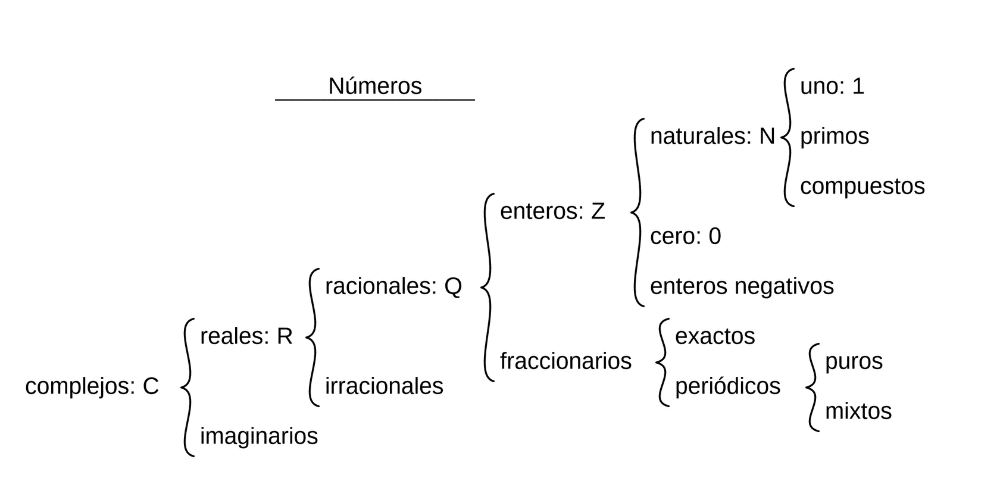
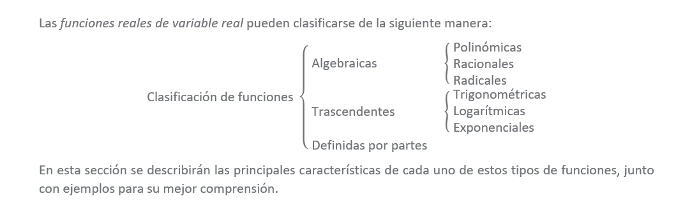
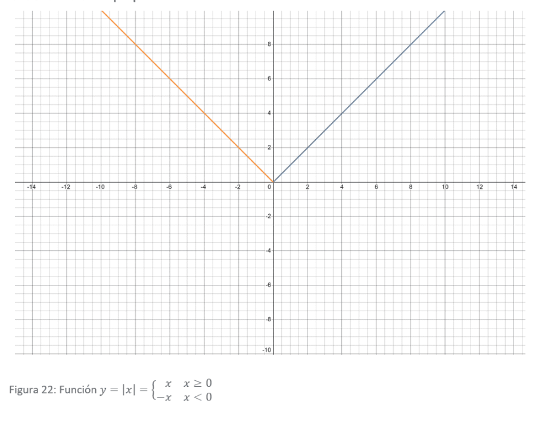

# Unit 1: Real Numbers and Real Functions

The concept of real numbers and real functions is fundamental in calculus. In this unit, we will explore the properties of real numbers, the concept of limits, and the definition of continuity. We will also discuss the importance of these concepts in calculus and their applications in various fields.

## Numbers Classification

Real numbers can be classified into different sets based on their properties. The main classifications are:

1. **Natural Numbers (\(\mathbb{N}\))**: The set of positive integers starting from 1 (e.g., 1, 2, 3, ...).
2. **Integers (\(\mathbb{Z}\))**: The set of all whole numbers, including negative integers (e.g., ..., -3, -2, -1, 0, 1, 2, 3, ...).
3. **Rational Numbers (\(\mathbb{Q}\))**: The set of numbers that can be expressed as the quotient of two integers (e.g., \(\frac{1}{2}, -\frac{3}{4}, 0.75\)).
4. **Irrational Numbers**: The set of numbers that cannot be expressed as the quotient of two integers (e.g., \(\sqrt{2}, \pi, e\)).
5. **Real Numbers (\(\mathbb{R}\))**: The set of all rational and irrational numbers.
6. **Complex Numbers (\(\mathbb{C}\))**: The set of numbers that can be expressed in the form \(a + bi\), where \(a\) and \(b\) are real numbers and \(i\) is the imaginary unit.
7. **Imaginary Numbers**: The set of numbers that can be expressed in the form \(bi\), where \(b\) is a real number and \(i\) is the imaginary unit.



## Operations with Real Numbers

1.**Power of a Number**: The power of a number is the result of multiplying that number by itself a certain number of times. For example, \(a^n\) means \(a\) multiplied by itself \(n\) times.
2. **Square Root**: The square root of a number \(a\) is a number \(b\) such that \(b^2 = a\). The square root is denoted as \(\sqrt{a}\).
3. **Absolute Value**: The absolute value of a number \(a\) is the distance of \(a\) from zero on the number line. It is denoted as \(|a|\). For example, \(|-3| = 3\) and \(|3| = 3\).
4. **Exponentiation**: Exponentiation is the operation of raising a number to a power. For example, \(a^b\) means \(a\) raised to the power of \(b\).
5. **Logarithm**: The logarithm of a number \(a\) with base \(b\) is the exponent \(x\) such that \(b^x = a\). It is denoted as \(\log_b(a)\).
6. **Factorial**: The factorial of a non-negative integer \(n\) is the product of all positive integers from 1 to \(n\). It is denoted as \(n!\). For example, \(5! = 5 \times 4 \times 3 \times 2 \times 1 = 120\).
7. **Binomial Coefficient**: The binomial coefficient \(\binom{n}{k}\) is the number of ways to choose \(k\) elements from a set of \(n\) elements without regard to the order of selection. It is calculated as \(\frac{n!}{k!(n-k)!}\).
8. **Arithmetic Operations**: The basic arithmetic operations include addition, subtraction, multiplication, and division. These operations can be performed on real numbers to obtain new real numbers.

## Inequalities
Inequalities are mathematical expressions that compare two values or expressions. The main types of inequalities are:

**1. First Degree Inequalities**: These inequalities involve linear expressions and can be solved using algebraic methods. For example, `\(2x + 3 < 7\)` is a first-degree inequality.

**2. Second Degree Inequalities**: These inequalities involve quadratic expressions and can be solved using methods such as factoring or the quadratic formula. For example, `\(x^2 - 4x + 3 > 0\)` is a second-degree inequality.

**3. Higher Degree Inequalities**: These inequalities involve polynomial expressions of degree greater than two and can be solved using methods such as synthetic division or the Rational Root Theorem. For example, `\(x^3 - 2x^2 + x - 1 < 0\)` is a higher-degree inequality.

**4. Absolute Value Inequalities**: These inequalities involve absolute value expressions and can be solved by considering the cases where the expression inside the absolute value is positive or negative. For example, `\(|x - 3| < 5\)` is an absolute value inequality.

**5. Rational Inequalities**: These inequalities involve rational expressions and can be solved by finding the critical points and testing intervals. For example, `\(\frac{x^2 - 1}{x + 2} > 0\)` is a rational inequality.

**6. Second Degree with 2 Unknowns**: These inequalities involve two variables and can be solved using methods such as substitution or elimination. For example, `\(x^2 + y^2 < 1\)` is a second-degree inequality with two unknowns.

### Example of Solving a First Degree Inequality

```math
2x + 3 < 7
```
```math
x < 2
```
```math
x > -2
```

## Functions

Functions are mathematical relationships that assign a unique output value to each input value. The main types of functions are:

1. **Ordered Pairs**: An ordered pair is a pair of numbers (x, y) that represents a point in a two-dimensional coordinate system. The first number (x) is the x-coordinate, and the second number (y) is the y-coordinate.

2. **Cartesian Product**: The Cartesian product of two sets A and B is the set of all ordered pairs (a, b) where a is an element of A and b is an element of B. It is denoted as \(A \times B\). For example, if \(A = \{1, 2\}\) and \(B = \{3, 4\}\), then \(A \times B = \{(1, 3), (1, 4), (2, 3), (2, 4)\}\).

3. **Correspondence**: A correspondence is a relationship between two sets where each element of one set is associated with one or more elements of the other set. For example, if \(A = \{1, 2\}\) and \(B = \{3, 4\}\), then the correspondence can be represented as \(f: A \to B\) where \(f(1) = 3\) and \(f(2) = 4\).

### Definition of Function

A function is a special type of correspondence where each element of the domain (input set) is associated with exactly one element of the codomain (output set). A function can be represented as \(f: A \to B\), where \(A\) is the domain and \(B\) is the codomain.

### Example of a Function

```math

f: \mathbb{R} \to \mathbb{R}

f(x) = 2x + 3
```
```math

f(1) = 5
```
```math
f(2) = 7
```

#### Real Function of a Real Variable
A real function of a real variable is a function that takes real numbers as input and produces real numbers as output. It can be represented as \(f: \mathbb{R} \to \mathbb{R}\). The domain and codomain of the function are both the set of real numbers.

```math
f: \mathbb{R} \to \mathbb{R}
```
```math
f(x) = x^2 + 2x + 1
```
```math
f(1) = 4
```

### Bounded Functions

A function \(f: A \to B\) is said to be bounded if its range is contained within a finite interval. In other words, there exist real numbers \(m\) and \(M\) such that \(m \leq f(x) \leq M\) for all \(x \in A\). If such bounds exist, the function is bounded; otherwise, it is unbounded.

### Injective, Surjective, and Bijective Functions

1. **Injective Functions (One-to-One)**: A function \(f: A \to B\) is injective if different elements in the domain \(A\) map to different elements in the codomain \(B\). Formally, \(f(x_1) = f(x_2) \implies x_1 = x_2\).

2. **Surjective Functions (Onto)**: A function \(f: A \to B\) is surjective if every element in the codomain \(B\) has at least one preimage in the domain \(A\). Formally, for every \(y \in B\), there exists \(x \in A\) such that \(f(x) = y\).

3. **Bijective Functions (One-to-One and Onto)**: A function \(f: A \to B\) is bijective if it is both injective and surjective. Bijective functions have an inverse function \(f^{-1}: B \to A\).

### Increasing and Decreasing Functions

A function \(f: A \to \mathbb{R}\) is increasing if \(f(x_1) \leq f(x_2)\) whenever \(x_1 < x_2\) for all \(x_1, x_2 \in A\). If \(f(x_1) < f(x_2)\), the function is strictly increasing.


## Types of Functions



### Algebraic Functions
Algebraic functions are functions that can be expressed using algebraic operations (addition, subtraction, multiplication, division, and exponentiation). They can be classified into different types based on their degree:

1. **Polynomial Functions**: Functions of the form \(f(x) = a_nx^n + a_{n-1}x^{n-1} + \ldots + a_1x + a_0\), where \(a_i\) are constants and \(n\) is a non-negative integer. For example, \(f(x) = 2x^3 - 4x^2 + 3\).
2. **Rational Functions**: Functions that can be expressed as the ratio of two polynomial functions. For example, \(f(x) = \frac{2x^2 + 3}{x - 1}\).
3. **Root Functions**: Functions that involve roots of variables. For example, \(f(x) = \sqrt{x}\) or \(f(x) = \sqrt[3]{x^2 + 1}\).

### Transcendental Functions

Transcendental functions are functions that cannot be expressed as algebraic operations. They include:
1. **Exponential Functions**: Functions of the form \(f(x) = a^x\), where \(a\) is a positive constant. For example, \(f(x) = 2^x\).
2. **Logarithmic Functions**: Functions of the form \(f(x) = \log_a(x)\), where \(a\) is a positive constant. For example, \(f(x) = \log_2(x)\).

### Partial defined functions

Partial defined functions are functions that are not defined for all possible input values. They may have restrictions on their domain, meaning that there are certain values for which the function does not produce a valid output. For example, the function \(f(x) = \frac{1}{x}\) is partially defined because it is not defined for \(x = 0\).


### Transformation of Functions

Transformation of functions refers to the process of modifying the graph of a function by applying various operations. The main types of transformations include:
1. **Translation**: Shifting the graph of a function horizontally or vertically. For example, \(f(x) + k\) translates the graph vertically by \(k\) units, while \(f(x - h)\) translates it horizontally by \(h\) units.
2. **Reflection**: Flipping the graph of a function across a specific axis. For example, \(f(-x)\) reflects the graph across the y-axis, while \(-f(x)\) reflects it across the x-axis.
3. **Stretching and Compression**: Changing the shape of the graph by stretching or compressing it vertically or horizontally. For example, \(af(x)\) stretches the graph vertically by a factor of \(a\), while \(f(bx)\) compresses it horizontally by a factor of \(\frac{1}{b}\).
4. **Combination of Transformations**: Multiple transformations can be applied simultaneously to obtain a new function. For example, \(f(x - h) + k\) represents a combination of horizontal translation by \(h\) units and vertical translation by \(k\) units.

