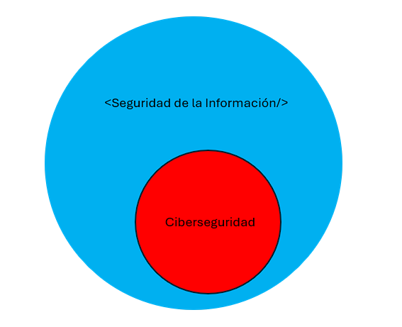

# AEC4: Relationships and Differences

We live in an era where information security and cybersecurity are more relevant than ever. With technological advancements, the amount of data we generate and store is enormous, forcing us to seriously think about how to protect it. But here arises an interesting debate:

Is cybersecurity a subset of information security? Or is it the other way around? Or are they simply distinct concepts with some intersections?

This topic may seem confusing at first because the terms are often used as if they were synonyms, but they are not. There are key differences between the two, although it is also true that they share several common points.

To begin with, I think it is important to clarify what each one means:

**Information Security:** This is the broader concept and encompasses all strategies, policies, and measures to protect information in any form. This includes both digital and physical information (e.g., paper documents, files on servers not connected to networks, and even private conversations). Information security is based on three fundamental pillars:

- Confidentiality (preventing unauthorized access to data).
- Integrity (ensuring that information is not modified without authorization).
- Availability (ensuring that information is accessible when needed).

**Cybersecurity:** This is a branch within information security that focuses on protecting systems, networks, devices, and data in the digital world. In other words, it focuses on preventing cyberattacks, fraud, unauthorized access, and any threat that could compromise information in digital environments.

Put another way, if we imagine information security as a large sphere encompassing all types of data, cybersecurity would be a section within that sphere that deals exclusively with cyberspace.

**Three Ways to View Their Relationship**

Now, there are several ways to analyze how these two concepts relate. I see it as follows:

### Cybersecurity is a subset of information security

- This is the most common view and the one I agree with the most.
- It means that information security is a larger concept, including both security in digital environments and in physical formats.
- Cybersecurity, in this case, would be just the part of information security focused on protecting digital and cyber data.

### Information security is a subset of cybersecurity

- According to this idea, cybersecurity would be the larger concept, and information security would only cover a part of it.
- In my opinion, this approach does not make much sense because information security also covers areas outside the digital world (such as physical documents), so it could hardly be a smaller part within cybersecurity.

### They are partially overlapping sets

- Here it is suggested that there are elements of information security that have nothing to do with cybersecurity (such as the protection of physical files) and elements of cybersecurity that do not necessarily fall within information security (such as defense against attacks on critical infrastructures or IoT security).
- In this case, the two areas intersect but not entirely.
- This view also makes sense, although I still lean more towards the first option.

**A Practical Example**

To see it in action, let's think of a company that handles sensitive data:

- If the company stores documents with confidential information in a safe and has rules to control who can access them, that is part of information security but not cybersecurity.
- If the company protects its database with firewalls, encryption, and monitoring against hackers, that is cybersecurity, but it also falls under information security because it is protecting important data.
- If someone steals an employee's laptop, but the information is encrypted and secured with two-factor authentication, that falls under both categories because there is protection in both information security and cybersecurity.

**What Is My Stance?**

After analyzing it, my opinion is that cybersecurity is a subset of information security. Information security is a larger umbrella that covers all forms of data protection, while cybersecurity focuses exclusively on the digital world.

If I had to represent it in a Venn diagram, cybersecurity would be inside the circle of information security, although with certain areas that may overlap with other fields such as computer security or network security.

That said, this is just my point of view. I know there are many ways to see this relationship, and I would love to hear other opinions.

**Expanding the Discussion**

While the relationship between information security and cybersecurity is often debated, it is also important to consider how these concepts evolve with emerging technologies. For instance:

- **Cloud Security:** As organizations increasingly migrate to cloud platforms, the boundaries between cybersecurity and information security blur further. Protecting data in the cloud requires a mix of both disciplines.
- **IoT Security:** The Internet of Things introduces unique challenges, as devices often lack robust security measures. Securing IoT systems involves both physical safeguards (information security) and digital protections (cybersecurity).
- **AI and Machine Learning:** These technologies are being used to enhance security measures, but they also introduce new vulnerabilities. Understanding their implications requires a holistic approach that combines both fields.

Ultimately, the dynamic nature of technology means that the definitions and relationships between these concepts may continue to shift. Staying informed and adaptable is key to addressing the challenges of modern security.

**Future Trends and Considerations**

As we look to the future, the relationship between information security and cybersecurity will likely continue to evolve. Here are some trends and considerations that may shape this dynamic:

- **Quantum Computing:** The advent of quantum computing poses a significant challenge to current encryption methods. Both information security and cybersecurity will need to adapt to ensure data remains protected in a post-quantum world.
- **Zero Trust Architecture:** This security model assumes that threats can exist both inside and outside the network. Implementing zero trust principles requires a comprehensive approach that integrates both information security and cybersecurity strategies.
- **Regulatory Compliance:** With increasing regulations like GDPR, HIPAA, and CCPA, organizations must ensure compliance across all forms of data protection. This reinforces the need for a unified approach to managing both physical and digital security.
- **Human Factor:** Despite technological advancements, human error remains one of the biggest vulnerabilities. Training and awareness programs are essential to bridge the gap between information security and cybersecurity practices.

**Conclusion**

Understanding the relationship between information security and cybersecurity is crucial for developing effective strategies to protect data in an increasingly complex world. While the debate over their boundaries may continue, what remains clear is the importance of addressing both physical and digital threats in a cohesive manner.

By staying informed about emerging trends and fostering collaboration between these disciplines, we can build a more secure future for individuals, organizations, and society as a whole.
