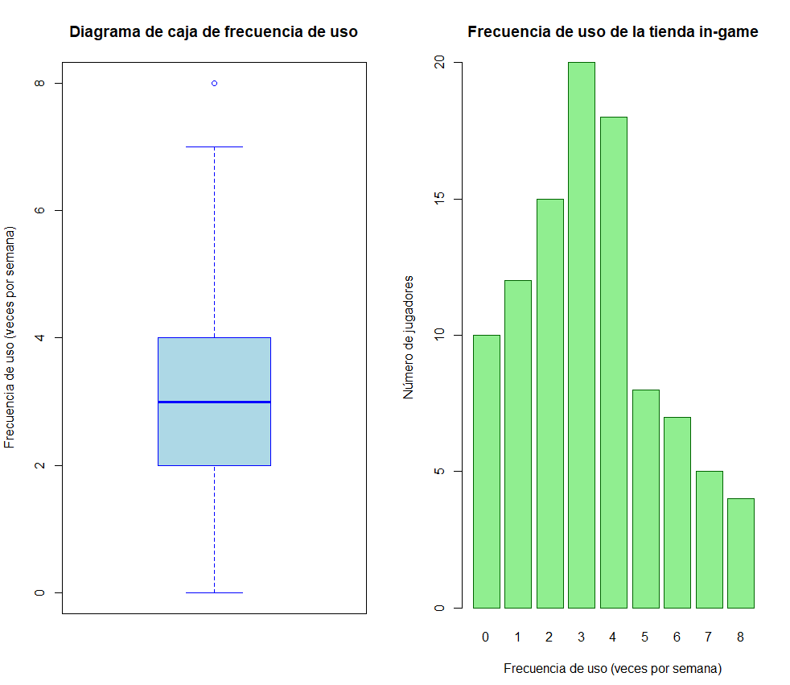

**Selection of a Variable**

I have chosen the frequency of in-game store usage (times per week). This variable is quantitative and discrete, as it represents the number of times a player accesses the game store within a specific time period (one week). The count of times is a non-negative integer, which reinforces its discrete nature.

**Statistical Analysis**

For analyzing the frequency of store usage, I believe the most appropriate statistical measure could be the mean, as it provides the average number of times players use the store weekly. The mean is useful in this context to understand the general consumption trend among players. A high mean may indicate strong store usage, suggesting that players are interested in the offered content, while a low mean could indicate disinterest or a lack of appealing content.

For graphical representation, a box plot would be ideal, as it allows us to visualize the distribution of frequencies and identify potential outliers, such as players who use the store with unusually high or low frequency. In my case, part of the choice is because I have previously used this graphical representation method in earlier studies (high school).

Additionally, I think a bar chart could complement this well to show the number of players in each weekly usage interval, providing a clear representation of how store usage is distributed.

**Example Data:**

Suppose we collected data from 100 players on the frequency of in-game store usage in a week. The usage frequency data is distributed in the following frequency table:

| Frequency of Use (times per week) | Frequency (number of players) |
| --- | --- |
| 0 | 10 |
| 1 | 12 |
| 2 | 15 |
| 3 | 20 |
| 4 | 18 |
| 5 | 8 |
| 6 | 7 |
| 7 | 5 |
| 8 | 4 |

To perform this analysis, I decided to use our beloved R, as it allows me to apply the knowledge acquired in this unit and experiment with new functions that are useful for statistical analysis and data visualization. I will use several R functions to analyze the frequency of in-game store usage (times per week) and visually represent the data.

This includes:

- Calculation of the arithmetic mean: To obtain the average weekly store usage frequency, I will use functions like `sum()` and `mean()`, which allow me to calculate the average efficiently.
- Bar charts and box plots: To visualize how the data is distributed, I will use functions like `barplot()` for the bar chart and `boxplot()` for the box plot. These graphs will help me better understand the trends and distributions of usage frequencies.



Code in R:

```
# Frequency of use data (times per week) and number of players
frecuencia_uso <- c(0, 1, 2, 3, 4, 5, 6, 7, 8)
frecuencia_jugadores <- c(10, 12, 15, 20, 18, 8, 7, 5, 4)

# Create a vector of data distributed according to the frequencies
datos <- rep(frecuencia_uso, frecuencia_jugadores)

# Calculate the mean
media <- mean(datos)
cat("The mean frequency of use is:", media, "\n")

# Create the box plot
par(mfrow=c(1,2)) # Place the graphs side by side
boxplot(datos, main="Box Plot of Usage Frequency",
    ylab="Frequency of Use (times per week)",
    col="lightblue", border="blue")

# Create the bar chart
barplot(frecuencia_jugadores, names.arg=frecuencia_uso,
    main="In-Game Store Usage Frequency",
    xlab="Frequency of Use (times per week)",
    ylab="Number of Players",
    col="lightgreen", border="darkgreen")
# Restore the graph layout to a single plot
par(mfrow=c(1,1))

```

**Critical Analysis**

From a more critical perspective, I consider the frequency of in-game store usage to be a fundamental variable for evaluating player experience and engagement. High store usage can be a positive indicator of satisfaction and the value players see in the additional content offered. If players enjoy the game and find the available items useful or entertaining, they are more likely to make purchases.

The mean of usage frequencies provides an overview of player behavior and helps detect trends in store usage. However, it can be affected by outliers, such as players who use the store exceptionally frequently or infrequently. Therefore, the box plot is particularly useful, as it allows us to observe data dispersion and any extreme values, giving us a more complete view of the situation.