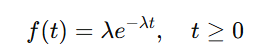
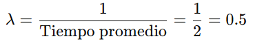

# AEC3

For this research project, the phenomenon I have chosen to model is battery charging time. This process occurs in electronic devices we use daily, such as phones, laptops, or electric vehicles. Charging time is a key metric because it affects user experience and device performance.

Charging time is a continuous variable that depends on several factors:

- The initial charge level of the battery.
- The total capacity of the battery.
- The current supplied by the charger.
- The technology used (fast charging, standard, etc.).

I chose this phenomenon because it has an interesting behavior: it starts relatively fast and slows down as the battery fills, making it ideal for modeling with a continuous distribution.

# Choice of Distribution

To model battery charging time, I opted for the exponential distribution.

### Why the Exponential Distribution?

The exponential distribution is suitable because:

On one hand, it models processes well where events (in this case, charging time at different levels) are independent. On the other hand, it has the "memoryless" property, which implies that the additional time required to complete an event does not depend on the time already elapsed. This is useful, albeit idealized, for batteries where the charging rate can be considered approximately constant during much of the process.

It is commonly used in phenomena related to waiting times and event durations.

### Model Parameters

The exponential distribution is defined by the parameter λ, which is the average charging rate per unit of time. This parameter is inversely related to the average time required to complete the charge:



For example, if it is estimated that a battery takes an average of 2 hours to fully charge, then:



This means that the probability of observing shorter charging times is higher, while longer times are less likely, as expected in this phenomenon.

## Generating Samples in R

To model this phenomenon, I used the following R code to generate random samples and visualize the distribution.

```R
# Model parameters
lambda <- 0.5  # Average charging rate (1 charge every 2 hours)

# Generating samples
set.seed(123)  # Seed for reproducibility
charging_times <- rexp(1000, rate = lambda)

# Visualization
hist(charging_times, probability = TRUE, 
    breaks = 30, col = "lightgreen", 
    main = "Exponential Distribution of Charging Time",
    xlab = "Charging Time (hours)", 
    ylab = "Density")
lines(density(charging_times), col = "blue", lwd = 2)
```

## Result

The graph shows how most charging times are concentrated in the range of 0 to 2 hours, with a tail extending to the right. This reflects the expected behavior: shorter times are more frequent, and extremely long times are unlikely.


## Critical Analysis

### Alignment with the Phenomenon

The model based on the exponential distribution aligns reasonably well with the general understanding of the battery charging process:

- In its initial stages, charging is usually faster, and the model reflects that shorter times are more likely.
- The decreasing distribution captures the fact that longer times are less frequent.

### Model Limitations

**Non-linear behavior towards the end of charging:**

In practice, the final phase of charging (around 80-100%) is significantly slower due to the increased internal resistance of the battery. This is not well represented by the exponential distribution.

**Variability in charging methods:**

Technologies like fast charging introduce more complex patterns that may not fit a single λ parameter. For example, charging times could follow a bimodal distribution (fast phase and slow phase).

**External factors:**

Elements such as fluctuations in charger current or simultaneous use of the device during charging can generate outlier times that are not reflected in the model.
