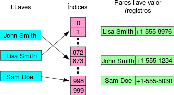
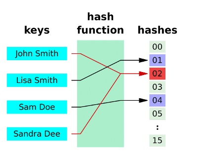

# Definition and Concept of Hash Tables

When working with databases, the most frequent and important operation is searching, which is much more common than inserting or deleting. A clear example is the Internet, where search engines allow efficient access to vast amounts of information.

Databases are primarily designed to facilitate fast searches. Although many insertions or deletions are performed initially, once stabilized, searches outnumber these operations by a ratio of 100 to 1 or more.

To achieve efficient searches, hash tables are used—data structures that allow access to information in constant time, O(1). For this reason, many modern databases employ them. However, this speed comes at a cost: hash tables can waste a significant amount of memory.

### Hash Table

A hash table is defined as a list with specific characteristics that distinguish it in the realm of data structures. First, it is stored contiguously, which facilitates efficient access and manipulation of elements.

It is important to note that it does not follow a particular order, meaning the elements are not arranged sequentially. Each element in the hash table consists of a pair of values: a key and an associated value. The key acts as a unique identifier for the element, and no other element can share the same key.



A simple example in C would be a hash table that stores personal information, using the **ID as the key** and a **record of personal data as the value**:

```c
typedef struct s_person {
    char *name;
    char *surname;
    char *birth_date;
} t_person;

typedef struct s_hash_entry {
    char *id;             // key
    t_person *data;       // value
    struct s_hash_entry *next;
} t_hash_entry;

#define TABLE_SIZE 100

t_hash_entry *table[TABLE_SIZE];

// Simplified hash function
unsigned int hash(char *id) {
    unsigned int hash = 0;
    while (*id)
        hash += *id++;
    return hash % TABLE_SIZE;
}

// Insert a person
void insert(char *id, t_person *p) {
    unsigned int idx = hash(id);
    t_hash_entry *new_entry = malloc(sizeof(t_hash_entry));
    new_entry->id = id;
    new_entry->data = p;
    new_entry->next = table[idx];
    table[idx] = new_entry;
}
```

### Hash vs Vectors and Arrays

| Feature | **Hash Table** | **Vector/Array** |
| --- | --- | --- |
| **Access by key** | Yes, using a **key** (like an ID, string, etc.) | No, only by **numeric index** |
| **Access time** | Average: **O(1)** (very fast) | Direct access: **O(1)** |
| **Key type** | Can be any type: string, int, etc. | Only integer index (position) |
| **Insertion/Update** | O(1), but can be higher if there are collisions | O(1) if the index is known, O(n) if searching is required |
| **Order of elements** | Does not guarantee order | Preserves insertion order |
| **Memory usage** | May **waste memory** due to size and collisions | Efficient, fixed or dynamic size |
| **Common use** | Dictionaries, databases, key management | Lists, matrices, sequential data |

---

### When to Use Each?

- **Hash Table**:
    
    Useful when you need to search quickly using a non-numeric key (like names, IDs, etc.).
    
    Example: user management, databases, caches.
    
- **Vector/Array**:
    
    Ideal for ordered lists or when positions are known in advance.
    
    Example: score lists, image processing, numerical matrices.

# Operations of a Hash Table

From the user's perspective, the two key operations in a hash table are:

1. **Check existence:** The user provides a key, and the table internally searches for an associated element. This operation is very fast, with a complexity close to O(1).
2. **Retrieve an element:** Assuming the key is already in the table, the associated value is searched and returned. Elements cannot be accessed by position (like first or last) since the table does not maintain a sequential order.

## Insertion and Retrieval

### **Insertion in a Hash Table**

When inserting an element into a hash table:

1. **The user provides a key** (e.g., an ID).
2. The table applies a **hash function** to that key. This function transforms the key into an index within the internal array.
3. At that index, the **associated value** is stored (e.g., a struct with name, age, etc.).
4. If something already exists at that index (collision), it is handled using a technique such as *chaining* (linked lists), *open addressing*, etc.

**Average time:** O(1)

It can increase if there are many collisions.

Steps to insert a new element into a hash table:

### **Deletion in a Hash Table**

Deleting an element from a hash table involves these steps:

1. **Provide the key** of the element to be deleted.
2. The table **applies the hash function** to the key to calculate the index.
3. At that index:
    - **Check for the existence** of the element (there may be more than one if there are collisions).
    - If the element with the exact key is found, it is **removed** from the structure.
    - **Free the associated resources** (memory, pointers, etc.).
4. If the key is not found, no operation is performed.

**Average time**: O(1), though it can increase if there are many collisions.

Important: in methods like *chaining* (linked lists), care must be taken when deleting intermediate nodes.

---

### **Modification in a Hash Table**

Modifying an element is very similar to retrieving it, with the addition of updating its content:

1. The user **provides the key** of the element and the **new value**.
2. The table **uses the hash function** on the key to find the corresponding index.
3. At that index:
    - **Check if an element with that key exists** (same as retrieval).
    - If found, **replace the old value with the new one**.
4. If the key does not exist, some implementations allow inserting the new value as if it were an insertion, while others simply do nothing.

**Average time**: O(1), same as retrieval.

Very useful when data changes over time (e.g., updating a user's email).

## Other Operations

In addition to insertion, deletion, and modification, many hash table implementations allow additional operations to **manage, analyze, or traverse** the table more efficiently.

---

### 1. Check if the table is empty or full

- **Purpose:**
    
    Determine if the table has elements or not, and if there is still space for more insertions.
    
- **How it works:**
    
    A counter of elements can be maintained.
    
    - If it is **0**, the table is empty.
    - If it reaches the **maximum allowed size**, it is considered full.
- **Common uses**: avoid unnecessary operations or trigger resizing if full (in dynamic implementations).

---

### 2. Get the number of elements

- **Purpose:**
    
    To know how many elements are currently in the table.
    
- **How it works:**
    
    A counter is maintained that increments or decrements each time an element is inserted or deleted.
    
- **Important for monitoring the "load"** of the table (load factor) and making decisions like resizing or rehashing.

---

### 3. Additional searches (beyond the key)

- **Purpose:**
    
    Search for elements based on criteria other than the key (e.g., "all people born in 1990").
    
- **How it works:**
    
    Requires traversing the entire table and applying the criteria manually (no longer O(1)).
    
- These operations **do not leverage the efficiency of hashing**, but may be necessary for more complex analyses.

---

### 4. Iterate over all elements

- **Purpose:**
    
    Traverse all key-value pairs in the table to process, print, export, etc.
    
- **How it works:**
    
    All positions in the array are traversed, and within each position, the stored elements are processed (if there are collisions, this could be a list or sequence).
    
- Very useful for:
    - Displaying all elements.
    - Applying an operation to each one.
    - Searching for extreme values (minimum, maximum, etc.).

### Summary of Operations

| Operation Type | Operation | Main Function | Brief Description |
| --- | --- | --- | --- |
| **Basic** | Insert | Add a new key-value pair | Uses the key to calculate the position and inserts the value. |
|  | Retrieve | Get the value associated with a key | Returns the value if the key exists; otherwise, indicates an error. |
|  | Check existence | Confirm if a key is in the table | Returns `true` if the key exists, `false` if not. |
| **Management** | Delete | Remove an element from the table | Searches by key and deletes, freeing associated memory. |
|  | Modify | Change the value associated with an existing key | Searches for the key and updates its value. |
| **Secondary** | Check if empty/full | Query the occupancy state | Indicates if there is available space or no elements. |
|  | Count elements | Know how many elements are in the table | Returns the current number of key-value pairs. |
|  | Additional searches | Search by criteria beyond the key | Requires traversing the table (more costly than key-based search). |
|  | Iterate | Process all elements | Allows traversing each key-value pair to apply actions or extract information. |

# Implementation

To implement a hash table, we first need to define the data structure that will store the elements, such as an array or linked list, where each element will be a key-value pair. Then, we must create a hash function that maps keys to positions in this structure, ensuring a uniform distribution of elements to minimize collisions.

Finally, we implement the basic operations (insertion, deletion, and search), considering how to handle collisions when two keys generate the same hash value and need to share the same position.

### Example of a hash table implementation with collision handling using chaining (linked list for collisions):

```cpp
#include <iostream>
#include <list>
#include <vector>
#include <string>

using namespace std;
```cpp
// Define the structure for a key-value pair
struct KeyValuePair {
    string key;
    int value;

    KeyValuePair(string k, int v) : key(k), value(v) {}
};

// Class that implements the hash table
class HashTable {
private:
    // Define the size of the hash table
    static const int TABLE_SIZE = 10;
    // Vector of linked lists (collision handling using chaining)
    vector<list<KeyValuePair>> table;

    // Hash function to map the key to an index in the table
    int hashFunction(const string& key) {
        int hashValue = 0;
        for (char ch : key) {
            hashValue += ch;
        }
        return hashValue % TABLE_SIZE; // Return the index within the table size
    }

public:
    HashTable() {
        table.resize(TABLE_SIZE); // Initialize the lists in the vector
    }

    // Function to insert an element into the hash table
    void insert(const string& key, int value) {
        int index = hashFunction(key); // Calculate the index
        KeyValuePair pair(key, value);
        table[index].push_back(pair); // Insert the pair into the corresponding list
    }

    // Function to search for a value by its key
    int search(const string& key) {
        int index = hashFunction(key);
        for (const KeyValuePair& pair : table[index]) {
            if (pair.key == key) {
                return pair.value; // Return the value associated with the key
            }
        }
        return -1; // Return -1 if the key is not found
    }

    // Function to remove an element by its key
    void remove(const string& key) {
        int index = hashFunction(key);
        table[index].remove_if([&](const KeyValuePair& pair) { return pair.key == key; });
    }

    // Print the contents of the hash table
    void display() {
        for (int i = 0; i < TABLE_SIZE; ++i) {
            cout << "Index " << i << ": ";
            for (const KeyValuePair& pair : table[i]) {
                cout << "[" << pair.key << ": " << pair.value << "] ";
            }
            cout << endl;
        }
    }
};

int main() {
    HashTable hashTable;

    // Insert some elements
    hashTable.insert("apple", 100);
    hashTable.insert("banana", 200);
    hashTable.insert("orange", 300);
    hashTable.insert("grape", 400);

    // Display the hash table
    hashTable.display();

    // Search for an element
    cout << "Value for 'apple': " << hashTable.search("apple") << endl;

    // Remove an element
    hashTable.remove("banana");

    // Display the table after removal
    cout << "After removing 'banana':" << endl;
    hashTable.display();

    return 0;
}
```

### Explanation:

1. **`KeyValuePair`**: Structure to store the key and value.
2. **`HashTable`**:
    - **`hashFunction`**: The hash function takes the key (a string) and calculates a hash value by summing the ASCII values of each character and then taking the modulo of the table size to get the index.
    - **`insert`**: Inserts a new key-value pair into the table, handling collisions using a linked list at each index.
    - **`search`**: Searches for a value based on the key, returning the value if found or `-1` if not.
    - **`remove`**: Removes a key-value pair from the table.
    - **`display`**: Displays all key-value pairs in the hash table.

### Output:

```
Index 0: [grape: 400]
Index 1:
Index 2:
Index 3:
Index 4:
Index 5:
Index 6: [apple: 100]
Index 7: [orange: 300]
Index 8:
Index 9: [banana: 200]
Value for 'apple': 100
After removing 'banana':
Index 0: [grape: 400]
Index 1:
Index 2:
Index 3:
Index 4:
Index 5:
Index 6: [apple: 100]
Index 7: [orange: 300]
Index 8:
Index 9:
```

## Hashing Technique

The **hashing technique** is used to map keys to positions within a data structure (such as an array or list), enabling quick access to elements. In a hash table, the key is transformed into an index using a **hash function**, and this index is used to store or retrieve the value associated with that key. Here's how it works and some common variations.

### Key Elements of Hashing:

1. **Key**: The value used to identify an element. It can be of any data type (numbers, strings, etc.).
2. **Value**: The data associated with the key. In a hash table, each key has a corresponding value.
3. **Hash Function**: A function that takes the key and converts it into an index in the hash table. Ideally, this function should be efficient and generate uniformly distributed indices to minimize collisions.
4. **Collision**: Occurs when two different keys generate the same hash value, meaning they must be stored at the same index in the hash table. To handle this, techniques such as the following are used:
    - **Chaining**: Each index in the table contains a list of key-value pairs. If a collision occurs, both elements are added to the list.
    - **Open Addressing**: If a collision occurs, another location in the table is sought using a collision resolution method like **linear probing**, **quadratic probing**, or **double hashing**.

### Example of Hashing Technique:

The **hash function** is responsible for mapping keys to indices within the table. A simple example would be summing the ASCII values of the characters in a key (e.g., a string) and then taking the modulo of the table size to obtain the index.

### Example of a Hash Function:

Imagine we want to store words in a hash table, where the key is the word itself. We use a simple hash function that sums the ASCII values of the characters in the word and takes the modulo with the table size to determine the index.
```cpp
#include <iostream>
#include <string>

using namespace std;

// Simple hash function
int hashFunction(const string& key, int tableSize) {
    int hashValue = 0;
    for (char ch : key) {
        hashValue += static_cast<int>(ch); // Add the ASCII value of each character
    }
    return hashValue % tableSize; // Return the index within the table size
}

int main() {
    string key = "apple";
    int tableSize = 10; // Size of the hash table

    int index = hashFunction(key, tableSize);
    cout << "The index for the key '" << key << "' is: " << index << endl;

    return 0;
}
```
### Collision Handling:

When two different keys generate the same index, this is known as a **collision**. There are several ways to handle collisions:

### 1. **Chaining**:

Instead of storing a single value at each index of the table, each index contains a list of elements. If two keys generate the same hash value, they are stored in that list.

### 2. **Open Addressing**:

Instead of using linked lists, another location in the table is sought to store the value. There are several methods to achieve this:

- **Linear Probing**: If the calculated position is occupied, the next available position is searched sequentially.
- **Quadratic Probing**: Similar to linear probing, but the search follows a quadratic pattern (i.e., skipping positions in squares).
- **Double Hashing**: A second hash function is used to calculate the offset in case of a collision.

### Example with Linear Probing:

```cpp
#include <iostream>
#include <vector>

using namespace std;

class HashTable {
private:
    ```cpp
        vector<int> table; // Vector to store the hash table
        int tableSize; // Size of the hash table

        // Hash function to calculate the index for a given key
        int hashFunction(int key) {
            return key % tableSize; // Modulo operation to ensure the index is within bounds
        }

    public:
        // Constructor to initialize the hash table with a given size
        HashTable(int size) : tableSize(size) {
            table.resize(size, -1); // Initialize the table with -1 to indicate empty slots
        }

        // Insert an element into the hash table using linear probing
        void insert(int key) {
            int index = hashFunction(key); // Calculate the initial index using the hash function
            while (table[index] != -1) { // If the position is occupied, try the next one
                index = (index + 1) % tableSize; // Move to the next index (circular probing)
            }
            table[index] = key; // Insert the key into the first available position
        }

        // Search for an element in the hash table
        bool search(int key) {
            int index = hashFunction(key); // Calculate the initial index using the hash function
            while (table[index] != -1) { // Continue searching until an empty slot is found
                if (table[index] == key) { // If the key is found, return true
                    return true;
                }
                index = (index + 1) % tableSize; // Move to the next index (circular probing)
            }
            return false; // If the key is not found, return false
        }

        // Display the contents of the hash table
        void display() {
            for (int i = 0; i < tableSize; ++i) {
                if (table[i] != -1) { // Only display non-empty slots
                    cout << "Index " << i << ": " << table[i] << endl;
                }
            }
        }
    ```
```
# Collisions
Collisions occur due to the nature of hash functions. A hash function takes a key and converts it into a numerical value representing an index in the table. However, since the number of possible keys is generally much larger than the number of indices in the table, it is inevitable that some keys will map to the same index. This is a typical case of the **"pigeonhole principle"**, which states that if you have more objects than available spaces, at least two objects must occupy the same space.



## Probability of Collision

The probability of a collision in a hash table is directly related to the table's capacity and the distribution of keys through the hash function. Here are some important considerations on this topic:

- **Collision Probability**:
    - The greater the difference between the **table capacity** and the **number of keys**, the **higher the probability of collision**.
    - **Poor hash function**: If it does not distribute keys evenly, collisions increase.

- **Ideal Case**:
    - If the table has **enough capacity** for all keys, **no collisions occur**.

In an "ideal implementation" of a hash table, where the table's capacity equals the number of possible keys, collisions never occur. This is because each key is assigned a unique position in the table, ensuring efficient and collision-free access.

As the table's capacity decreases relative to the number of possible keys, the probability of collisions increases. This is because more distinct keys will need to be assigned to the same position in the table, increasing the likelihood of collisions.

- **Importance of a Good Hash Function**:
    - A **uniform distribution** of keys reduces the probability of collisions.

A poor hash function that does not distribute keys evenly across the table can also increase the probability of collisions. For example, a hash function that uses only the first digits of a Social Security Number (SSN) instead of the last ones could increase the probability of collisions, especially if many keys share the same initial digits (e.g., in the case of people residing in the same region).

- **Handling Collisions**:
    - Despite a good hash function, **collisions are inevitable** in tables with limited capacity.
    - **Collision handling strategies** (such as chaining or open addressing) must be implemented to deal with them.

It is crucial to note that a good hash function is one that distributes keys evenly across the table, thereby minimizing the probability of collisions. However, even with an efficient hash function, collisions are inevitable in a hash table with limited capacity relative to the number of possible keys. Therefore, it is essential to implement effective strategies to handle collisions and ensure the optimal performance of the hash table.

# Collision Handler

When a collision occurs in a hash table, it is necessary to implement a mechanism to resolve it. This mechanism is known as the collision handler, and there are two main approaches to handling collisions in a hash table:

### Open Addressing

When a collision occurs, instead of using an additional structure (such as linked lists in chaining), **a new position within the table is sought** to store the element that caused the collision. This technique uses an **additional function** to calculate new positions in the table until an empty one is found.

### Example:

Imagine a hash table with a size of 5, and a hash function that returns the index as the value of the key modulo the size of the table.

1. **Initial Table** (empty):
    
    ```
    [ ] [ ] [ ] [ ] [ ]
    ```
    
2. **Insert the key 7**:
    - Hash function: `7 % 5 = 2`
    - The key 7 is placed at index 2.
    
    ```
    [ ] [ ] [7] [ ] [ ]
    ```
    
3. **Insert the key 12**:
    - Hash function: `12 % 5 = 2`
    - There is a collision, as index 2 is occupied.
    - **Closed addressing**: We search for a new index. Suppose we apply **linear probing** (searching for the next empty index). We try index 3.
    - The key 12 is placed at index 3.
    
    ```
    [ ] [ ] [7] [12] [ ]
    ```
    
4. **Insert the key 17**:
    - Hash function: `17 % 5 = 2`
    - Collision at index 2.
    - We search for a new position. Using **linear probing**:
        - Index 3: occupied.
        - Index 4: empty.
    - The key 17 is placed at index 4.
    
    ```
    [ ] [ ] [7] [12] [17]
    ```

### Types of Probing in Closed Addressing:

- **Linear Probing**: Sequentially checks the next available position.
    - Example: If the calculated index is occupied, try the next index, and so on.
- **Quadratic Probing**: Uses a quadratic formula to determine the next position.
    - Example: `n^2` steps to find a new position where `n` is the number of attempts.
- **Double Hashing**: Uses a second hash function to calculate the offset in case of a collision.

### Advantages:

- **No additional structures** like linked lists are needed.
- Simpler to implement compared to other techniques.

### Disadvantages:

- If the table is nearly full, finding an empty spot can become slow.
- Poor key distribution can lead to many collisions, degrading efficiency.

This **closed addressing** approach is efficient when appropriate probing techniques are used, but it can become costly if the table is poorly sized or the keys are not evenly distributed.

### Open Addressing (Separate Chaining)

**Open addressing**, or **separate chaining**, is a technique for handling collisions in a hash table. When a collision occurs, instead of searching for a new position in the table, a **linked list** is created at that position, and the elements causing the collision are inserted into that list.

Each **table position** acts as the **head of a linked list** containing all elements that generated collisions at the same position. This way, multiple elements can be associated with the same table position, and the list must be traversed to find a specific element.

### Example:

Imagine a hash table with 5 positions and a hash function that maps a key to a position using `key % 5`.

1. **Initial Table** (empty):
    
    ```
    [ ] [ ] [ ] [ ] [ ]
    ```
    
2. **Insert the key 7**:
    - Hash function: `7 % 5 = 2`
    - The key 7 is placed at position 2.
    
    ```
    [ ] [ ] [7] [ ] [ ]
    ```
    
3. **Insert the key 12**:
    - Hash function: `12 % 5 = 2`
    - There is a collision at index 2, so the key 12 is **added** to the list at that position.
    
    ```
    [ ] [ ] [7 → 12] [ ] [ ]
    ```
    
4. **Insert the key 17**:
    - Hash function: `17 % 5 = 2`
    - Another collision occurs at index 2, so the key 17 is **added** to the list at that position.
    
    ```
    [ ] [ ] [7 → 12 → 17] [ ] [ ]
    ```
    ### Advantages of Chaining:

    - **Flexibility**: There is no need to worry about the table's capacity, as the list can dynamically grow if there are many collisions.
    - **Time Efficiency**: Searches, insertions, and deletions are fast when the linked lists are short.
    - **Easy Collision Handling**: There is no need to resize the table or move elements around.

    ### Disadvantages of Chaining:

    - **Requires More Memory**: Additional pointers are needed for the linked lists, which can make this approach more memory-intensive.
    - **Performance Depends on List Length**: If many keys collide at the same position, the lists can become long, and operations may slow down.

    ### Comparison with Closed Addressing:

    - **Closed Addressing**: Handles collisions by searching for empty positions in the table (requires reallocation within the same table).
    - **Open Addressing (Chaining)**: Handles collisions by storing elements in linked lists at the same position.

## Temporal complexity of Hash Tables


| Operation      | Technique | Best Case | Average Case | Worst Case |
| -------------- | --------- | --------- | ------------ | ---------- |
| **Search**     | Closed    | O(1)      | O(1 + α)     | O(n) (if α → n) |
|                | Open      | O(1)      | O(1 + α)     | O(n) |
| **Insertion**  | Closed    | O(1)      | O(1 + α)     | O(n) |
|                | Open      | O(1)      | O(1)         | O(n) (very long list) |
| **Deletion**   | Closed    | O(1)      | O(1 + α)     | O(n) |
|                | Open      | O(1)      | O(1 + α)     | O(n) |
