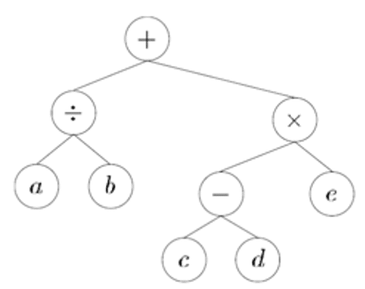
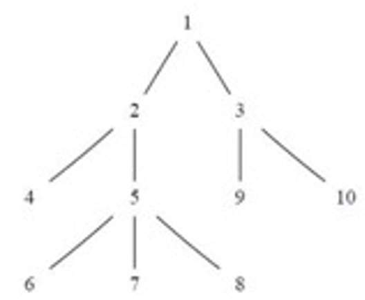

# Unit 6: Trees and Genetic Algorithms

Trees are hierarchical data structures widely used to organize and store data efficiently. Their organizational structure resembles that of a real tree, with a root node branching into other nodes, called children, which in turn can have their own children, forming a branching structure.

In contrast to other linear data structures, such as linked lists, trees offer greater flexibility and efficiency in searching, inserting, and deleting elements. This versatility makes them a valuable tool for a wide range of computing applications, from database management to the implementation of search and sorting algorithms.

## Recursive Definition of a Tree

The recursive definition of a tree establishes the rules governing its formation from individual nodes.

- No node IS a tree: This is the base case that establishes that a tree can be null, meaning it has no nodes. This case is known as the null tree or the first trivial case.
- A single node IS also a tree: If there is only one node in the structure, that node becomes the root of the tree. This is another trivial case that establishes the foundation of the tree hierarchy.
- Recursive construction of a tree: To construct a more complex tree, a root node is taken and assigned one or more subtrees. Each of these subtrees, in turn, can contain root nodes and additional subtrees. This is achieved by making the root node the parent of the root nodes of the subtrees. Thus, the original root node becomes the root of the new tree, and the subtrees become direct children of this root node.



This recursive definition allows for the construction of trees of varying sizes and complexities. Each node can have zero or more child nodes, and the relationships between nodes can be defined recursively, leading to a rich and flexible data structure.

## Practical Examples of Trees

To better understand the recursive definition of trees and their applications, let us consider several practical examples:

### Family Trees
Family trees represent genealogical relationships, where each node corresponds to a family member, and edges represent parent-child relationships.

### Directory Structures
File systems use tree structures to organize directories and files hierarchically, with the root directory as the starting point.

### Mathematical Expressions
Mathematical expressions can be represented as trees, where operators are internal nodes, and operands are leaf nodes.

### Chapters and Sections of a Book
Books are often structured hierarchically, with chapters containing sections, subsections, and so on, forming a tree-like organization.

In each of these examples, trees are constructed according to the recursive definition, where each node can have zero, one, or multiple child nodes. These trees enable hierarchical and efficient organization of information, facilitating data search, navigation, and manipulation.

### Key Concepts in Trees

To analyze and work with trees effectively, it is essential to understand the following key concepts:

- **Path**: A sequence of nodes connecting a parent to a descendant.
- **Ancestor and Descendant**: Nodes related through parent-child relationships.
- **Leaf**: A node with no children.
- **Subtree**: A tree formed by a node and its descendants.
- **Height and Depth**: Height is the longest path from a node to a leaf, while depth is the distance from the root to a node.
- **Order of Children**: The sequence in which child nodes are arranged.
- **Siblings and Relative Position**: Nodes sharing the same parent and their relative order.

These concepts provide a foundation for understanding and working with tree structures in various applications.

## Tree Implementations

The efficiency and ease of manipulating trees largely depend on how they are implemented in a computational environment. There are several ways to implement trees, with two of the most efficient being:

- **Child-to-Parent Representation**: Each node stores a reference to its parent. This is useful for traversing upwards in the tree.
- **Parent-to-Children Representation**: Each node stores references to its children. This is ideal for traversing downwards in the tree.

Additionally, there is a hybrid approach that combines elements of both:

- **Mixed Implementation**: Combines parent-to-children and child-to-parent representations to optimize for specific use cases.

The choice of implementation depends on the specific requirements of the application and the operations that will be performed most frequently on the tree. It is important to consider both efficiency in terms of access and manipulation, as well as memory usage, when selecting the most suitable implementation for a particular tree.

### Example: Child-to-Parent Implementation

In a child-to-parent implementation, each node has at most one parent. This can be represented using an array or vector where the index corresponds to the node, and the value at that index indicates the parent node. For instance, if nodes are numbered from 1 to MAX, a vector can be used to store this relationship.

This approach is particularly useful for scenarios where upward traversal (from a node to its ancestors) is frequently required.



## Temporal Analysis of Tree Implementations

The efficiency of a tree data structure implementation is a crucial factor in determining its suitability for various applications. Beyond the structural organization of the tree itself, the time complexity associated with frequently performed operations significantly impacts overall performance. This analysis delves into the temporal efficiency of specific tree implementation strategies, focusing on common operations.

### Temporal Analysis of Child-to-Parent Tree Implementation with a Vector

In this particular implementation approach, a vector or array is utilized to represent the tree nodes. Crucially, each node within this representation maintains a direct reference, often in the form of an index or a pointer, to its immediate parent node. This direct linkage optimizes certain fundamental tree operations.

**1. Obtaining the Parent of a Node:**

The operation of retrieving the parent of a given node stands out for its efficiency in this child-to-parent implementation. Since each node explicitly stores a reference to its parent, accessing this information is a direct memory lookup. This operation requires a fixed amount of time, irrespective of the total number of nodes present in the tree or the tree's depth. Consequently, the time complexity of obtaining the parent of a node in this implementation is **O(1)**, signifying constant time complexity. This means the execution time remains constant regardless of the input size (the size of the tree).

**2. Obtaining All Children of a Node:**

It is important to note that the provided description of the child-to-parent implementation focuses primarily on the efficiency of accessing the parent. The text does not explicitly detail how to efficiently retrieve all the children of a node within this specific structure. In a standard child-to-parent implementation using a vector, finding all children of a particular node would typically require iterating through the entire vector of nodes and checking for those whose parent reference points to the target node. This would involve examining potentially all $n$ nodes in the tree (where $n$ is the total number of nodes), leading to a time complexity of **O(n)** in the worst case. Therefore, while accessing the parent is highly efficient, obtaining all children in a basic child-to-parent vector implementation is generally less so. More sophisticated data structures or auxiliary information might be needed to optimize the retrieval of children in such a scenario.

### Temporal Analysis of Parent-to-Children Tree Implementation

In contrast to the child-to-parent approach, a parent-to-children implementation focuses on equipping each node with the means to directly access its offspring. Two common strategies for managing these child references are outlined:

**1. For each node, we will have a list with pointers to all its children.**

**2. For each node, we will have a pointer to its first child and its right sibling.** (This is a common technique for representing general trees as binary trees, often referred to as the "first-child next-sibling" representation.)

**Obtaining All Children of a Node:**

The provided text specifically addresses the scenario where each node maintains a **list of pointers to all its children**. In this design, when we need to find all the direct descendants of a particular node, we simply access the pre-existing list associated with that node. Retrieving this list is a direct operation, taking a constant amount of time, regardless of the number of children the node has or the overall size of the tree. Therefore, the time complexity of obtaining all children of a node in this specific parent-to-children implementation (using a direct list of children) is **O(1)**. This constant-time access makes it highly efficient for operations that frequently require iterating over a node's immediate children.

It's worth noting that the "first-child next-sibling" representation, while also a parent-to-children approach, would have a different time complexity for finding *all* children. To find all children in that structure, you would start at the first child and then traverse the linked list of siblings until you reach the end. If a node has $k$ children, this traversal would take O(k) time. While still efficient for many tree operations, it's not constant time like accessing a direct list of children.

In summary, the choice of tree implementation significantly impacts the temporal efficiency of different operations. A child-to-parent implementation excels at quickly finding a node's ancestor, while a parent-to-children implementation with direct child lists allows for rapid retrieval of a node's immediate descendants. Understanding these trade-offs is crucial for selecting the most appropriate data structure for a given task.

## Exercises on Trees

### Exercise 1: Basic Tree Construction

#### Tree Structure:
- The root node has three children: A, B, and C.
- Node A has two children: D and E.
- Node B has one child: F.
- Node C has no children.

#### Recursive Definition:
1. The root node is a tree.
2. The root node has three subtrees:
    - Subtree 1: Rooted at A, with children D and E.
    - Subtree 2: Rooted at B, with child F.
    - Subtree 3: Rooted at C, with no children.

#### Visual Representation:
```
          Root
         / |  \
        A  B   C
      / \  \
     D   E   F
```
### Exercise 2: Tree Traversals
Given the tree from Exercise 1, perform the following traversals:
1. **Pre-order traversal**: Visit the root, then recursively visit each subtree in order.
    - Sequence: Root, A, D, E, B, F, C.
2. **In-order traversal**: For each node, recursively visit the left subtree, then the node, then the right subtree.
    - Sequence: D, A, E, Root, F, B, C.
3. **Post-order traversal**: Recursively visit each subtree, then visit the root.
    - Sequence: D, E, A, F, B, C, Root.

---

### Exercise 3: Height and Depth
Using the tree from Exercise 1:
1. **Height of the tree**: The height is the longest path from the root to a leaf. In this case, the height is 2.
2. **Depth of node F**: The depth is the distance from the root to the node. For node F, the depth is 2.

---

### Exercise 4: Binary Tree Conversion
Convert the tree from Exercise 1 into a binary tree using the "first-child next-sibling" representation. The resulting binary tree is:

```
             Root
            /    
          A  ->  B  ->  C
         /      
        D  ->  E
              \
                F
```

---

### Exercise 5: Parent-to-Children Implementation
Implement the tree from Exercise 1 using a parent-to-children representation in your preferred programming language. Example in Python:

```python
class TreeNode:
     def __init__(self, value):
          self.value = value
          self.children = []

     def add_child(self, child):
          self.children.append(child)

     def get_children(self):
          return self.children
```

---

### Exercise 6: Child-to-Parent Implementation
Implement the tree from Exercise 1 using a child-to-parent representation in your preferred programming language. Example in Python:

```python
class TreeNode:
     def __init__(self, value, parent=None):
          self.value = value
          self.parent = parent

def find_parent(node):
     return node.parent

def nodes_at_depth(root, depth):
     result = []
     def dfs(node, current_depth):
          if current_depth == depth:
                result.append(node.value)
          for child in node.children:
                dfs(child, current_depth + 1)
     dfs(root, 0)
     return result
```

---

### Exercise 7: Application of Trees
1. **Family Tree**: Design a tree with nodes representing family members and edges representing parent-child relationships.
2. **Directory Structure**: Represent a project directory with folders and files, such as:
    ```
    Project/
    ├── src/
    │   ├── main.py
    │   └── utils.py
    ├── docs/
    │   └── README.md
    └── tests/
         └── test_main.py
    ```

---

### Exercise 8: Mathematical Expression Tree
Construct a tree for the expression `(3 + 5) * (2 - 4)`:

```
          *
         / \
        +   -
      / \ / \
     3  5 2  4
```

**Post-order traversal**: 3, 5, +, 2, 4, -, *.

---

### Exercise 9: Tree Properties
For the tree from Exercise 1:
1. **Leaf nodes**: D, E, F, C.
2. **Total nodes**: 7.
3. **Degree of each node**:
    - Root: 3
    - A: 2
    - B: 1
    - C: 0
    - D, E, F: 0

---

### Exercise 10: Tree Search
Implement a search algorithm to find a specific node in the tree. Example pseudocode for depth-first search (DFS):

```
function DFS(node, target):
     if node.value == target:
          return node
     for child in node.children:
          result = DFS(child, target)
          if result is not None:
                return result
     return None
```

Example implementation in Python:

```python
def dfs(node, target):
     if node.value == target:
          return node
     for child in node.children:
          result = dfs(child, target)
          if result:
                return result
     return None
```

## Tree Traversal

Traversing a tree is a fundamental operation that enables us to visit all the nodes within the tree structure in a specific order. This process effectively transforms the hierarchical tree into a linear list of nodes, where each node is positioned sequentially based on a defined traversal criterion. The most common types of tree traversals are preorder, inorder, and postorder.

To define these traversals recursively, we can follow these steps:

* **Base Case 1: Null Tree**
    For a null (empty) tree, the list of nodes for all three traversal types (preorder, inorder, and postorder) is an empty list.

* **Base Case 2: Single-Node Tree**
    For a tree consisting of only a single node, the list containing that single node is the resulting list for all three traversal types.

* **Recursive Case: Tree with Root and Subtrees**
    Consider a tree with a root node *n* and a set of subtrees $A_1, A_2, ..., A_k$. The traversal order is defined as follows for each type:

    **Preorder Traversal:**

    * First, we place the root node *n*.
    * Then, we recursively traverse each subtree $A_1, A_2, ..., A_k$ in preorder, processing them in that specific sequence.

    **Postorder Traversal:**

    * First, we recursively traverse each subtree $A_1, A_2, ..., A_k$ in postorder, processing them in the order $A_1, A_2, ..., A_k$.
    * Finally, after processing all the subtrees, we place the root node *n*.

    **Inorder Traversal:**

    * First, we recursively traverse the first subtree $A_1$ in inorder.
    * Then, we place the root node *n*.
    * Next, we recursively traverse the subsequent subtrees $A_2, A_3, ..., A_k$ in inorder, processing them in that sequence.

These traversal methods offer distinct ways to systematically access and process the nodes of a tree, proving invaluable for various operations such as searching for specific nodes, inserting new nodes, deleting existing ones, or simply printing the node values in a particular sequence. The selection of the most suitable traversal type depends entirely on the specific requirements of the application and the desired outcome.

**An Alternative Perspective (Boundary Traversal):**

Another way to conceptualize tree traversals, although often more complex to implement programmatically, involves tracing the boundary of the tree. Imagine drawing a continuous line around the entire tree, visiting each edge. The order in which we encounter the nodes during this "walk" defines the traversal.

Given this conceptual boundary line around the tree:

* **Preorder:** A node is visited and processed the *first* time the boundary line passes by it (typically on the way down and to the left).
* **Postorder:** A node is visited and processed the *last* time the boundary line passes by it (typically on the way up and to the right).
* **Inorder:** For binary trees, leaf nodes are visited and processed the *first* time the boundary line passes by them. Internal nodes are visited and processed the *second* time the boundary line passes by them (typically after visiting the left subtree and before visiting the right subtree). This definition becomes more nuanced for general (n-ary) trees when considering the "second" visit.

This boundary traversal analogy provides an intuitive, albeit potentially more challenging to code, way to understand the different ordering principles behind preorder, postorder, and inorder traversals. Each method offers a unique linear representation of the tree's hierarchical structure, making them essential tools in various tree-based algorithms and applications.

## Binary Trees

A binary tree is a hierarchical data structure in which each node can have at most two children: a left child and a right child. It can be defined recursively as either:

* An empty tree (null).
* A root node that has two disjoint binary subtrees, known as the left subtree and the right subtree.

In simpler terms, within a binary tree, each node can have zero, one, or two children.

Binary trees can be classified into several distinct types based on their structural properties, including strict binary trees, perfectly balanced binary trees, and complete binary trees.

**Strict Binary Tree:**

In a **Strict Binary Tree**, every node has either exactly 0 or exactly 2 children. This means that no node in a strict binary tree can have only one child. All internal nodes (non-leaf nodes) must have two children.

**Perfectly Balanced Binary Tree:**

In a **Perfectly Balanced Binary Tree**, the left and right subtrees of every node have the same height. Additionally, all internal nodes in a perfectly balanced binary tree have exactly two children. This type of tree exhibits maximum symmetry and balance.

**Complete Binary Tree:**

In a **Complete Binary Tree**, all levels are completely filled except possibly the last level. If the last level is not completely filled, the nodes on that level are filled from left to right. Another way to define it is that all nodes have two children, except possibly the leaves in the last level.

Understanding these different types of binary trees is crucial because their specific properties can influence the efficiency of various tree operations and the suitability of a particular type for different applications. For instance, balanced trees often provide better performance for search and insertion operations compared to unbalanced trees.

## Binary Tree Traversal

Binary trees can be traversed in several ways, each with its own specific order of visiting nodes. The most common traversal methods for binary trees are:
* **Preorder Traversal**: Visit the root node first, then recursively visit the left subtree, followed by the right subtree.
* **Inorder Traversal**: Recursively visit the left subtree first, then visit the root node, and finally visit the right subtree.
* **Postorder Traversal**: Recursively visit the left subtree first, then visit the right subtree, and finally visit the root node.
* **Level-order Traversal**: Visit all nodes at the present depth level before moving on to nodes at the next depth level. This is typically implemented using a queue data structure.
* **Reverse Level-order Traversal**: Visit all nodes at the present depth level in reverse order, starting from the bottommost level and moving up to the root. This is also typically implemented using a queue data structure.
* **Boundary Traversal**: Visit the nodes along the boundary of the tree, starting from the root and moving down to the leaves, then back up to the root. This traversal can be more complex to implement but provides a unique way to access the tree's structure.
* **Zigzag Level-order Traversal**: Visit nodes in a zigzag pattern, alternating between left-to-right and right-to-left at each level. This traversal can be implemented using two stacks or a deque data structure.
* **Spiral Level-order Traversal**: Similar to zigzag traversal, but the order of traversal alternates between left-to-right and right-to-left at each level, creating a spiral effect. This can also be implemented using two stacks or a deque data structure.
* **Morris Traversal**: A space-efficient traversal method that uses the tree's structure to avoid using additional space for recursion or a stack. It modifies the tree temporarily to create links between nodes, allowing for in-order traversal without extra space.

### Example of Binary Tree Traversal
```C++
#include <iostream>
#include <vector>
#include <queue>
using namespace std;

class Node {
public:
    int data;
    Node* left;
    Node* right;

    Node(int value) {
        data = value;
        left = nullptr;
        right = nullptr;
    }
};

void preorder(Node* root) {
    if (root == nullptr) return;
    cout << root->data << " ";
    preorder(root->left);
    preorder(root->right);
}

void inorder(Node* root) {
    if (root == nullptr) return;
    inorder(root->left);
    cout << root->data << " ";
    inorder(root->right);
}

void postorder(Node* root) {
    if (root == nullptr) return;
    postorder(root->left);
    postorder(root->right);
    cout << root->data << " ";
}

void levelOrder(Node* root) {
    if (root == nullptr) return;
    queue<Node*> q;
    q.push(root);
    while (!q.empty()) {
        Node* current = q.front();
        q.pop();
        cout << current->data << " ";
        if (current->left) q.push(current->left);
        if (current->right) q.push(current->right);
    }
}

int main() {
    Node* root = new Node(1);
    root->left = new Node(2);
    root->right = new Node(3);
    root->left->left = new Node(4);
    root->left->right = new Node(5);
    root->right->left = new Node(6);
    root->right->right = new Node(7);

    cout << "Preorder Traversal: ";
    preorder(root);
    cout << endl;

    cout << "Inorder Traversal: ";
    inorder(root);
    cout << endl;

    cout << "Postorder Traversal: ";
    postorder(root);
    cout << endl;

    cout << "Level Order Traversal: ";
    levelOrder(root);
    cout << endl;

    return 0;
}
```

### Output:
```
Preorder Traversal: 1 2 4 5 3 6 7
Inorder Traversal: 4 2 5 1 6 3 7
Postorder Traversal: 4 5 2 6 7 3 1
Level Order Traversal: 1 2 3 4 5 6 7
```

### Representation in ascii
```
          1
         / \
        2   3
       / \ / \
      4  5 6  7
```

## Heaps

A heap is a specialized tree-based data structure that satisfies the heap property. It is commonly used to implement priority queues and is characterized by its unique structure and properties.
A heap can be defined as a complete binary tree, meaning that all levels of the tree are fully filled except possibly for the last level, which is filled from left to right. The heap property can be classified into two types:
1. **Max Heap**: In a max heap, the value of each node is greater than or equal to the values of its children. This means that the maximum element is always at the root of the tree.
2. **Min Heap**: In a min heap, the value of each node is less than or equal to the values of its children. This means that the minimum element is always at the root of the tree.
### Example of a Max Heap
```
          10
         /  \
        9    8
       / \  / \
      7   6 5   4
```
### Example of a Min Heap
```
          1
         / \
        2   3
       / \ / \
      4  5 6  7
```
### Properties of Heaps
1. **Complete Binary Tree**: A heap is always a complete binary tree, meaning all levels are fully filled except possibly for the last level, which is filled from left to right.
2. **Heap Property**: In a max heap, the value of each node is greater than or equal to the values of its children. In a min heap, the value of each node is less than or equal to the values of its children.
3. **Height**: The height of a heap is logarithmic with respect to the number of nodes, making it efficient for insertion and deletion operations.
4. **Array Representation**: Heaps can be efficiently represented using arrays. For a node at index `i`, its left child is at index `2*i + 1`, its right child is at index `2*i + 2`, and its parent is at index `(i - 1) / 2`.

### Insertion in a Heap
To insert a new element into a heap, the following steps are typically followed:
1. Add the new element at the end of the heap (the next available position in the array).
2. Compare the new element with its parent. If the new element violates the heap property (i.e., it is greater than its parent in a max heap or less than its parent in a min heap), swap it with its parent.
3. Repeat this process until the heap property is restored or the new element becomes the root of the heap.
### Deletion in a Heap
To delete the root element from a heap, the following steps are typically followed:
1. Replace the root element with the last element in the heap (the last element in the array).
2. Remove the last element from the heap.
3. Compare the new root with its children. If it violates the heap property, swap it with the larger child (in a max heap) or the smaller child (in a min heap).
4. Repeat this process until the heap property is restored or the new root becomes a leaf node.


## Heap Sort

Heap sort is a comparison-based sorting algorithm that uses the properties of heaps to sort an array or list of elements. It is an efficient and in-place sorting algorithm with a time complexity of O(n log n) for all cases (best, average, and worst). The algorithm consists of two main phases: building a heap and performing the sorting.

### Steps of Heap Sort
1. **Build a Max Heap**: Convert the input array into a max heap. This ensures that the largest element is at the root of the heap.
2. **Extract Elements**: Repeatedly extract the maximum element (the root of the heap) and place it at the end of the array. After each extraction, restore the heap property by heapifying the remaining elements.
3. **Repeat**: Continue extracting elements until the heap is empty, resulting in a sorted array.

## Search Binary Trees 
A binary search tree (BST) is a specialized type of binary tree that maintains a specific ordering property. In a BST, for each node:
1. The value of the left child is less than the value of the parent node.
2. The value of the right child is greater than the value of the parent node.
This property allows for efficient searching, insertion, and deletion operations, making binary search trees a popular choice for implementing dynamic sets and associative arrays.
### Searching in a Binary Search Tree
To search for a specific value in a binary search tree, the following steps are typically followed:
1. Start at the root node.
2. Compare the target value with the value of the current node.
3. If the target value is equal to the current node's value, the search is successful.
4. If the target value is less than the current node's value, move to the left child and repeat the process.
5. If the target value is greater than the current node's value, move to the right child and repeat the process.
6. If a null node is reached, the target value is not present in the tree.
### Example of Searching in a Binary Search Tree
```C++
#include <iostream>
using namespace std;
class Node {
public:
    int data;
    Node* left;
    Node* right;

    Node(int value) {
        data = value;
        left = nullptr;
        right = nullptr;
    }
};
Node* search(Node* root, int target) {
    if (root == nullptr || root->data == target) {
        return root;
    }
    if (target < root->data) {
        return search(root->left, target);
    } else {
        return search(root->right, target);
    }
}

int main() {
    Node* root = new Node(10);
    root->left = new Node(5);
    root->right = new Node(15);
    root->left->left = new Node(3);
    root->left->right = new Node(7);
    root->right->left = new Node(12);
    root->right->right = new Node(18);

    int target = 7;
    Node* result = search(root, target);
    if (result) {
        cout << "Found: " << result->data << endl;
    } else {
        cout << "Not Found" << endl;
    }

    return 0;
}
```
### Output:
```
Found: 7
```
### Example of Searching in a Binary Search Tree
```
          10
         /  \
        5    15
       / \   / \
      3   7 12  18
```

## AVL Trees

An AVL tree is a self-balancing binary search tree (BST) that maintains its balance through rotations during insertion and deletion operations. The name "AVL" comes from the initials of its inventors, Georgy Adelson-Velsky and Evgenii Landis, who introduced this data structure in 1962.
### Properties of AVL Trees
1. **Balance Factor**: For each node in the AVL tree, the balance factor is defined as the difference between the heights of its left and right subtrees. The balance factor can be -1, 0, or 1 for a balanced AVL tree.
2. **Height-Balanced**: An AVL tree is height-balanced, meaning that the heights of the left and right subtrees of any node differ by at most 1. This property ensures that the tree remains balanced, leading to efficient search, insertion, and deletion operations.
3. **Rotations**: To maintain balance, AVL trees perform rotations (single or double) during insertion and deletion operations. These rotations help restore the balance factor of the affected nodes.
### Rotations in AVL Trees
1. **Single Rotation (LL Rotation)**: This rotation is performed when a node is inserted into the left subtree of the left child, causing an imbalance. The tree is rotated to the right to restore balance.
2. **Single Rotation (RR Rotation)**: This rotation is performed when a node is inserted into the right subtree of the right child, causing an imbalance. The tree is rotated to the left to restore balance.
3. **Double Rotation (LR Rotation)**: This rotation is performed when a node is inserted into the right subtree of the left child, causing an imbalance. The tree is first rotated to the left and then to the right to restore balance.
4. **Double Rotation (RL Rotation)**: This rotation is performed when a node is inserted into the left subtree of the right child, causing an imbalance. The tree is first rotated to the right and then to the left to restore balance.

### Example of AVL Tree Insertion
```C++
#include <iostream>
using namespace std;

class Node {
public:
    int data;
    Node* left;
    Node* right;
    int height;

    Node(int value) {
        data = value;
        left = nullptr;
        right = nullptr;
        height = 1; // Height of a new node is 1
    }
};

int getHeight(Node* node) {
    if (node == nullptr) return 0;
    return node->height;
}

int getBalanceFactor(Node* node) {
    if (node == nullptr) return 0;
    return getHeight(node->left) - getHeight(node->right);
}

Node* rightRotate(Node* y) {
    Node* x = y->left;
    Node* T2 = x->right;

    // Perform rotation
    x->right = y;
    y->left = T2;

    // Update heights
    y->height = max(getHeight(y->left), getHeight(y->right)) + 1;
    x->height = max(getHeight(x->left), getHeight(x->right)) + 1;

    // Return new root
    return x;
}
Node* leftRotate(Node* x) {
    Node* y = x->right;
    Node* T2 = y->left;

    // Perform rotation
    y->left = x;
    x->right = T2;

    // Update heights
    x->height = max(getHeight(x->left), getHeight(x->right)) + 1;
    y->height = max(getHeight(y->left), getHeight(y->right)) + 1;

    // Return new root
    return y;
}

Node* insert(Node* node, int key) {
    // Perform normal BST insertion
    if (node == nullptr) return new Node(key);

    if (key < node->data) {
        node->left = insert(node->left, key);
    } else if (key > node->data) {
        node->right = insert(node->right, key);
    } else {
        return node; // Duplicate keys are not allowed
    }

    // Update height of this ancestor node
    node->height = 1 + max(getHeight(node->left), getHeight(node->right)));

    // Get the balance factor
    int balance = getBalanceFactor(node);

    // Left Left Case
    if (balance > 1 && key < node->left->data) {
        return rightRotate(node);
    }

    // Right Right Case
    if (balance < -1 && key > node->right->data) {
        return leftRotate(node);
    }

    // Left Right Case
    if (balance > 1 && key > node->left->data) {
        node->left = leftRotate(node->left);
        return rightRotate(node);
    }

    // Right Left Case
    if (balance < -1 && key < node->right->data) {
        node->right = rightRotate(node->right);
        return leftRotate(node);
    }
    return node;
}
void inorder(Node* root) {
    if (root == nullptr) return;
    inorder(root->left);
    cout << root->data << " ";
    inorder(root->right);
}

int main() {
    Node* root = nullptr;
    root = insert(root, 10);
    root = insert(root, 20);
    root = insert(root, 30);
    root = insert(root, 40);
    root = insert(root, 50);
    root = insert(root, 25);

    cout << "Inorder traversal of the constructed AVL tree is: ";
    inorder(root);
    cout << endl;

    return 0;
}
```
### Output:
```
Inorder traversal of the constructed AVL tree is: 10 20 25 30 40 50
```
### Example of AVL Tree
```
          30
         /  \
        20   40
       / \   / \
      10 25 35 50
```
### AVL Tree Rotations
```
            30
           /  \
         20   40
         / \   / \
        10 25 35 50
```

# Genetic Algorithms
Genetic algorithms (GAs) are a class of optimization algorithms inspired by the principles of natural selection and genetics. They are used to solve complex problems by mimicking the process of evolution, where the fittest individuals are selected for reproduction in order to produce the offspring of the next generation. GAs are particularly useful for optimization problems where traditional methods may struggle to find optimal solutions.

## Key Concepts of Genetic Algorithms
1. **Population**: A set of potential solutions to the problem being solved. Each individual in the population represents a candidate solution.
2. **Chromosome**: A representation of a solution, often encoded as a string of bits, numbers, or characters. Each chromosome consists of genes, which are the individual components of the solution.
3. **Fitness Function**: A function that evaluates how well a particular solution (chromosome) solves the problem. The fitness score determines how likely an individual is to be selected for reproduction.
4. **Selection**: The process of choosing individuals from the current population to create offspring for the next generation. Common selection methods include roulette wheel selection, tournament selection, and rank selection.
5. **Crossover**: A genetic operator used to combine two parent chromosomes to produce offspring. Crossover mimics the process of genetic recombination in biological reproduction.
6. **Mutation**: A genetic operator that introduces random changes to a chromosome. Mutation helps maintain genetic diversity in the population and prevents premature convergence to suboptimal solutions.
7. **Replacement**: The process of replacing individuals in the population with new offspring. This can be done through various strategies, such as generational replacement or steady-state replacement.
8. **Termination Criteria**: The conditions under which the genetic algorithm stops running. Common criteria include reaching a maximum number of generations, achieving a satisfactory fitness level, or observing no significant improvement over a certain number of generations.

## Steps of a Genetic Algorithm
1. **Initialization**: Generate an initial population of chromosomes randomly or using heuristics.
2. **Evaluation**: Calculate the fitness of each individual in the population using the fitness function.
3. **Selection**: Select individuals based on their fitness scores to create a mating pool for reproduction.
4. **Crossover**: Apply crossover to pairs of selected individuals to create offspring.
5. **Mutation**: Apply mutation to the offspring to introduce genetic diversity.
6. **Replacement**: Replace individuals in the population with the new offspring.
7. **Termination**: Check if the termination criteria are met. If not, go back to step 2.
8. **Output**: Return the best solution found during the algorithm's execution.

### Optimitation of Genetic Algorithms
Genetic algorithms can be optimized in several ways to improve their performance and convergence speed. Here are some common optimization techniques:
1. **Adaptive Mutation and Crossover Rates**: Instead of using fixed mutation and crossover rates, adapt these rates based on the current state of the population. For example, increase mutation rates when the population converges too quickly to avoid premature convergence.
2. **Elitism**: Preserve a certain number of the best individuals from the current generation to ensure that the best solutions are not lost during reproduction.
3. **Diversity Maintenance**: Introduce mechanisms to maintain genetic diversity in the population, such as fitness sharing or crowding. This helps prevent premature convergence to local optima.
4. **Hybrid Approaches**: Combine genetic algorithms with other optimization techniques, such as local search or simulated annealing, to enhance exploration and exploitation capabilities.
5. **Parallelization**: Implement parallel genetic algorithms to speed up the evaluation of fitness functions and the selection process. This can be done by distributing the population across multiple processors or using distributed computing frameworks.
6. **Dynamic Population Size**: Adjust the population size dynamically based on the convergence behavior of the algorithm. For example, increase the population size when diversity decreases and decrease it when diversity is high.
7. **Adaptive Fitness Functions**: Modify the fitness function during the algorithm's execution to encourage exploration of different regions of the solution space.
