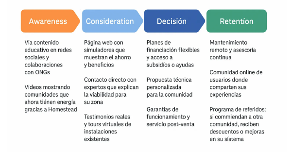

# **Startup: Homestead Energies**

I have envisioned Homestead Energies as a fictional startup dedicated to the development and distribution of floating wind turbines inspired by technologies like BAT (Buoyant Airborne Turbine). Its main goal is to offer sustainable energy solutions to rural and hard-to-reach communities where conventional power grids are unavailable or unreliable. The company has an online presence through a website that provides information about its products, accepts orders, and shares real-life stories of customers who have transformed their quality of life thanks to this technology.

**Name:** Homestead Energies  
**Industry:** Renewable Energy / Sustainable Technology / Ecommerce (B2B and B2C)  
**Product:** Floating wind turbines (BAT - Buoyant Airborne Turbines) for rural and hard-to-reach areas.  
**Online Presence:** Informative and commercial website, digital catalog, online store for direct purchases or commercial inquiries, maintenance and monitoring app.

---

## **Segmentation and Target Audience**

To design an effective strategy, we segmented the market based on the following criteria:

- **Geographic:** We focus on rural areas in Latin America and southern Europe, where access to energy remains a challenge. Islands and isolated communities are also considered.  
- **Demographic:** People aged 30 to 60, community leaders, farmers, rural cooperatives, or small business owners who need energy for their operations.  
- **Psychographic:** Environmentally conscious individuals interested in self-sustainable solutions and eager to improve their quality of life and that of their community.  
- **Behavioral:** Users who have shown interest in renewable energy, sustainable technology, and who often seek practical solutions to structural problems.

### **Buyer Example 1**

**Name:** Ana Rivas  
**Age:** 38 years  
**Location:** Rural community in Oaxaca, Mexico  
**Occupation:** Coordinator of an agricultural cooperative  
**Goals:** Ensure stable and clean energy for irrigation and refrigeration systems.  
**Challenges:** High fuel costs for generators, frequent power outages, environmental damage.  
**Digital Behavior:** Uses social media to learn about green technologies, communicates via WhatsApp and email, browses websites on her phone.  
**Purchase Decision:** Gathers information on social media, asks other users, reviews terms and warranties, seeks nearby technical support.

**Targeting:**  
The most attractive segment for Homestead Energies is **rural cooperatives and NGOs** working on sustainable electrification. A B2B2C approach will be prioritized to achieve greater short-term impact and establish strategic alliances.

### **Buyer Example 2**

**Name:** Don Javier  
**Age:** 48 years  
**Location:** Rural community in Salamanca  
**Occupation:** Farmer and member of the community council  
**Needs:** Requires constant energy to operate a small irrigation system, light his home, and charge devices.  
**Challenges:** Limited access to energy, reliance on gasoline generators, which are expensive and polluting.  
**Behavior:** Reads blogs about rural technology, listens to sustainability podcasts, participates in online community forums.

**Targeting:**  
Our primary segment will be organized rural communities or associations seeking self-sufficient energy solutions. They are prioritized because they urgently need to solve a structural problem and often have government or NGO support to implement these solutions.

---

## **Positioning Strategy and Value Proposition**

**How does Homestead Energies stand out?**  
Homestead Energies positions itself as a simple, eco-friendly, and easy-to-install solution designed specifically for hard-to-reach areas. Unlike other energy companies, we do not rely on large infrastructures or traditional distribution networks.

**Differentiation from competitors:**

- Easier installation (no complex infrastructure required).  
- Floating design operates at higher altitudes, harnessing wind more effectively.  
- Remote monitoring via app.

**Value Proposition**  
"Clean and constant energy, where it’s needed most."

**Key Message**  
"Bring sustainable energy to places others can’t reach."

**Positioning Canvas**  
For rural communities that need a constant and accessible energy source, Homestead Energies offers innovative floating turbines that ensure energy independence. Unlike combustion generators or inefficient solar panels in variable climates, our turbines harness high-altitude winds, adapt to the terrain, and are clean, easy to install, and tailored to the realities of rural communities.

## Canvas (Table)

| Customers | Need |
| --- | --- |
| Who is our customer: demographic/firmographic, psychographic characteristics, behavior...? | What problem/need/job does the customer have to solve? |
| **Rural communities** | **Need for a constant and accessible energy source.** |
| Name | Description and reference framework |
| What is our product called? | What does it consist of? What product category does it belong to? |
| **Homestead Energies** | **Innovative floating turbines for wind energy generation.** |
| Main benefits | Reasons to believe |
| What value does it provide, what results of all kinds does it deliver to the customer? | What features/attributes, etc., justify those benefits? |
| **Energy independence, clean and constant energy, ease of installation, terrain adaptability.** | **Floating design that operates at higher altitudes, does not require complex infrastructure, remote monitoring via app, harnesses high-altitude winds.** |
| Rivals | Differentiators |
| Who are the competitors/substitutes/alternatives that the customer considers? | Why is it better than them, addressing dimensions that are relevant to the customer? |
| **Combustion generators, solar panels.** | **Easier installation, better wind utilization (altitudes), terrain adaptability, clean solution designed for rural communities.** |

## **Diseño del Viaje del Cliente (Customer Journey Map)**

## **1. Awareness**

The awareness stage is crucial to attract potential customers to Homestead Energies, especially in rural areas where knowledge about renewable energy might be limited. Our goal here is to capture attention and generate interest in floating turbines and how they can improve quality of life.

- **Educational Content on Social Media and Collaborations with NGOs**: Through posts, infographics, and educational videos, we explain how floating turbines are a viable and sustainable energy solution. Collaborations with local NGOs will help us reach the most in-need communities, establishing trust and legitimacy. NGOs can also provide direct recommendations to these communities.
- **Videos Showcasing Communities Now Powered by Homestead**: Short documentaries or testimonial videos will be produced, where community members share their experiences with our turbines. These videos will be shared on platforms like YouTube, Facebook, and the company’s social media channels.
- **Posts on Specialized Blogs and Free Webinars**: We will leverage blogs that focus on sustainability, renewable energy, and rural technologies, publishing articles about the benefits of floating wind energy. Webinars, in addition to being educational, will allow attendees to interact directly with our experts, asking questions about how the technology works, its installation, and its benefits. These webinars will be promoted on social media and presented as a way to empower communities.

---

## **2. Consideration**

At this stage, the customer has been informed about the product and begins to consider how they can benefit from Homestead’s floating turbines. Here, we aim to provide evidence of the effectiveness of our solutions.

- **Website with Simulators Showing Savings and Benefits**: The website will feature an interactive section where users can calculate cost savings and environmental benefits from installing a turbine. This simulator will include savings scenarios based on location, usage type, and energy requirements.
- **Direct Contact with Experts Explaining Feasibility for Their Area**: We offer virtual or phone consultations with our experts, who can provide personalized advice on how floating turbines can adapt to the specific conditions of each community, including available wind and potential economic benefits.
- **Real Testimonials and Virtual Tours of Existing Installations**: We will provide detailed testimonials from other communities already using our turbines. Additionally, we will offer virtual tours of installations where users can see how the technology works in practice and understand its positive impact.

---

## **3. Decision**

Once customers are convinced of the benefits, they reach the decision stage, where they must make the purchase. At this point, it is crucial to offer incentives that make the purchase easier.

- **Flexible Financing Plans and Access to Subsidies or Grants**: Homestead Energies will offer financing plans tailored to the economic needs of communities, such as installment payments or preferential conditions for associations. We will also provide information on government subsidies or NGO grants that can reduce the initial cost.
- **Customized Technical Proposal for the Community**: We will create a technical proposal that includes a detailed analysis of the appropriate turbine size, estimated savings, and installation. This report will be tailored to each specific community, ensuring all local needs are addressed.
- **Performance Guarantees and After-Sales Service**: We will offer guarantees to ensure the turbines function over a long period. Additionally, we will include after-sales services where customers can receive technical support, remote maintenance, and software or hardware updates if necessary.

---

## **4. Retention**

The work doesn’t end with the sale. Retention is key to ensuring customers continue recommending our products and trusting Homestead Energies for future energy needs.

- **Remote Maintenance and Ongoing Support**: We will offer remote maintenance services to address any issues without requiring the customer to travel. Additionally, we will provide continuous guidance on how to maximize turbine usage for optimal performance.
- **Online User Community for Experience Sharing**: We will create an online platform where users can exchange tips, share experiences, and resolve doubts. This space will serve as a hub to strengthen the community, fostering cooperation among users and building trust.
- **Referral Program: Discounts and System Upgrades**: Through a referral program, current customers can recommend our products to other communities in exchange for benefits, such as discounts on future purchases or upgrades to their turbine systems.

---

## **Digital Marketing Tactics**

### **1. Content Marketing**

Content marketing has the potential to educate, engage, and attract key audiences:

- **Educational Blog**: We will publish articles covering topics ranging from the basics of renewable energy to specific success stories. The content will focus on solving common problems, such as lack of energy access and the high costs associated with traditional energy sources.
- **YouTube Videos**: These will include tutorials on turbine installation, interviews with satisfied customers, and demonstrations of their benefits. Videos are an excellent way to emotionally connect with the audience and showcase the real impact of our solutions.

### **2. Social Media**

Social media will be used to create awareness and maintain connections with users:

- **Instagram and Facebook**: We will share success stories with images and videos showing the before-and-after impact of floating turbines on communities. On these platforms, we will also create polls and interactive posts to encourage engagement.
- **TikTok Campaigns**: Targeted at a younger audience, these campaigns will include challenges or fun videos showcasing how floating turbines can be part of a greener, self-sustaining future. The goal is to generate interest and curiosity among younger audiences who may influence their families’ purchasing decisions.

### **3. Email Marketing**

Email marketing will be used to maintain contact with potential and existing customers:

- **Regular Newsletters**: We will keep our contacts informed about new updates, turbine maintenance tips, and news in the renewable energy sector.
- **Automated Follow-Up Emails**: For users who left their email on the website or interacted with us without completing a purchase, we will implement automated emails to remind them of the benefits of our turbines and provide additional information.

---

## **6. Key Metrics Evaluation**

### **For Content Marketing**:

- **Average Time on Page**: Measure how long users spend on each article, indicating their level of interest.
- **Number of Articles Read per Visitor**: An indicator of how engaged users are with the content we provide.
- **Conversion Rate from Blog to Commercial Contact**: Track how many blog visitors turn into potential customers or inquiries.

### **For Social Media**:

- **Engagement Rate**: The interaction rate on our posts is crucial for measuring campaign effectiveness.
- **Number of New Followers per Week**: This data will help measure the growth of our social media community.
- **Clicks on Links to the Website**: Evaluate the traffic generated by social media to the website, especially those resulting in inquiries.

### **For Email Marketing**:

- **Open Rate**: This metric indicates how effective our emails are at capturing the recipient's attention.
- **CTR (Click Through Rate)**: Helps determine how effective the email content is in directing users to the website.
- **Number of Qualified Leads Generated**: Measure how many leads meet the criteria to become potential customers.

---
| **Tactic** | **Metric** | **Justification** |
| --- | --- | --- |
| **Content Marketing** | **Average Time on Page** | Reflects the level of interest and depth of reading by visitors on blog articles. |
|  | **Conversion Rate (blog → lead)** | Measures the effectiveness of the content in generating commercial interest (inquiries or contact requests). |
|  | **CAC (Customer Acquisition Cost)** | Evaluates the average cost of converting a reader into a customer through this tactic. |
| **Social Media** | **Engagement Rate** | Assesses the quality of the content and its ability to generate interaction (likes, comments, shares). |
|  | **Clicks on Links to the Website** | Measures whether posts successfully drive users to the website, a key step toward conversion. |
|  | **Conversion from Social Media (%)** | Indicates how many people coming from social media take a desired action (contact, registration, etc.). |
| **Email Marketing** | **Open Rate** | Shows how attractive and relevant the email subject lines are to recipients. |
|  | **CTR (Click Through Rate)** | Evaluates real interest in the email content by measuring how many click on the links. |
|  | **Qualified Leads Generated** | Indicates the quality of the contacts obtained: individuals or entities with real potential to become customers. |

**Personal Closing:**

With Homestead Energies, my goal is to show how innovative technology can be both accessible and useful for the communities that need it most. This approach is not just about selling a product, but about driving real, lasting change in rural and remote areas. Energy is a basic right, and I’m passionate about seeing how our turbines could improve the quality of life for people who, for various reasons, lack access to reliable and sustainable energy sources.