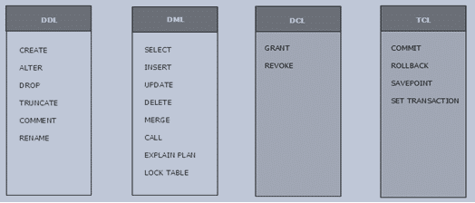

# Additional SQL Commands


In this section, we will cover commands from the DCL, DML, and TCL categories, as reflected in the image above, which have not been addressed so far. Similarly, those not covered in this unit will be addressed in the next unit to avoid content repetition.

## **Advanced DML Commands**

DML (Data Manipulation Language) commands are used to manipulate the data stored in database tables. In addition to the classic `SELECT`, `INSERT`, `UPDATE`, and `DELETE`, there are other lesser-known but very useful commands. Below, we explain and provide examples for the commands: `CALL`, `MERGE`, `EXPLAIN PLAN`, and `LOCK TABLE`.

---

### 🔁 `CALL` – Execute Stored Procedures

**Description:**

Allows invoking a stored procedure previously defined in the database.

**Example (MySQL):**

```sql
CALL update_stock(1001, 5);
```

→ Calls the `update_stock` procedure, passing the product ID `1001` and increasing the stock by `5` units.

---

### 🔀 `MERGE` – Combine `INSERT` and `UPDATE`

**Description:**

Used to synchronize two tables. If the record already exists, it updates it; if not, it inserts it.

**Example (Oracle):**

```sql
MERGE INTO employees e
USING new_employees n
ON (e.employee_id = n.employee_id)
WHEN MATCHED THEN
    UPDATE SET e.salary = n.salary
WHEN NOT MATCHED THEN
    INSERT (employee_id, name, salary)
    VALUES (n.employee_id, n.name, n.salary);
```

→ Updates the salary of existing employees or inserts them if they are not in the `employees` table.

---

### 🔎 `EXPLAIN PLAN` – Analyze Query Performance

**Description:**

Displays how the database plans to execute an SQL query. Useful for optimization.

**Example (Oracle):**

```sql
EXPLAIN PLAN FOR
SELECT * FROM employees WHERE department = 'Sales';
```

→ Generates an execution plan that can be reviewed to analyze the performance of the query.

---

### 🔒 `LOCK TABLE` – Lock a Table

**Description:**

Restricts access to a table to ensure data integrity during critical operations.

**Example (Oracle):**

```sql
LOCK TABLE employees IN EXCLUSIVE MODE;
```

→ Locks the `employees` table so that no other user can modify it until the current transaction is completed.

## **TCL (Transaction Control Language) Commands**

TCL commands are used to manage **transactions** in a database.

A **transaction** is a logical unit of work that groups one or more DML statements (`INSERT`, `UPDATE`, `DELETE`) that must execute **atomically** (all or none).

---

### ✅ `COMMIT` – Confirm Changes

**Description:**

Permanently saves all changes made during the current transaction.

**Example:**

```sql
UPDATE accounts SET balance = balance - 100 WHERE id = 1;
UPDATE accounts SET balance = balance + 100 WHERE id = 2;
COMMIT;
```

→ Transfers funds between accounts, and the `COMMIT` makes the changes permanent.

---

### 📍 `SAVEPOINT` – Mark a Point Within the Transaction

**Description:**

Allows defining an intermediate point in the transaction that can be returned to using `ROLLBACK`.

**Example:**

```sql
BEGIN;
UPDATE employees SET salary = salary * 1.10 WHERE department = 'Sales';
SAVEPOINT sales_increase;
UPDATE employees SET salary = salary * 1.10 WHERE department = 'HR';
```

→ Creates a savepoint after modifying `Sales`, in case you want to undo only subsequent changes.

---

### 🔄 `ROLLBACK` – Undo Changes

**Description:**

Reverts all changes made since the last `COMMIT`, or to a `SAVEPOINT`.

**Example (full rollback):**

```sql
ROLLBACK;
```

**Example (to a savepoint):**

```sql
ROLLBACK TO sales_increase;
```

→ Reverts only the changes made after the `SAVEPOINT` named `sales_increase`.

---

### ⚙️ `SET TRANSACTION` – Configure a Transaction

**Description:**

Allows setting options such as isolation level and access type before starting a transaction.

**Example (Oracle / PostgreSQL):**

```sql
SET TRANSACTION ISOLATION LEVEL SERIALIZABLE;
BEGIN;
UPDATE products SET stock = stock - 1 WHERE product_id = 123;
```

→ Ensures the transaction has the strictest isolation level.

---

### ℹ️ **Additional Note: MySQL and AUTOCOMMIT**

By default, **MySQL** executes all statements with `AUTOCOMMIT` enabled.

This means that each DML statement is saved immediately, without requiring `COMMIT`.

To disable this and work with manual transactions:

```sql
SET AUTOCOMMIT = 0;
```

Then:

```sql
START TRANSACTION;
-- DML operations
COMMIT; -- or ROLLBACK
```

## **DCL: User Management Commands in SQL**

In database administration, it is essential to control **who can do what**.

For this purpose, there are specific commands that allow **granting or revoking permissions** to users or roles.

Below, we explain two fundamental commands for managing privileges: `GRANT` and `REVOKE`.

---

### 🟢 `GRANT` – Grant Permissions

**Description:**

Allows assigning permissions to one or more users or roles to perform specific actions on the database or its objects.

**Example (MySQL):**

```sql
GRANT SELECT, INSERT ON store.products TO 'user1'@'localhost';
```

→ The user `user1` can query (`SELECT`) and insert (`INSERT`) data into the `products` table of the `store` database.

**Example (PostgreSQL):**

```sql
GRANT ALL PRIVILEGES ON TABLE customers TO analyst;
```

→ The role `analyst` receives all permissions on the `customers` table.

---

### 🔴 `REVOKE` – Revoke Permissions

**Description:**

Revokes (removes) permissions previously granted with `GRANT`.

**Example (MySQL):**

```sql
REVOKE INSERT ON store.products FROM 'user1'@'localhost';
```

→ The user `user1` can no longer insert records into the `products` table but retains other permissions (like `SELECT` if not revoked).

**Example (PostgreSQL):**

```sql
REVOKE ALL PRIVILEGES ON TABLE customers FROM analyst;
```

→ The role `analyst` loses all permissions on the `customers` table.

# User and Privilege Management

Each person or user accessing MySQL must have a specific account. MySQL is a permission-based system. Like most databases, MySQL allows precise control over what information each user can access and the actions they can perform.

## **User Management in MySQL**

In MySQL, user management is fundamental to controlling database access and security. This includes creating, modifying, and deleting users, as well as assigning or revoking permissions.

---

### 🆕 1. **Create a User**

```sql
CREATE USER 'username'@'host' IDENTIFIED BY 'password';
```

- `'host'` specifies where the user can connect from (e.g., `'localhost'`, `'%'` for access from anywhere, etc.).
- `'password'` is the user's password.

**Example:**

```sql
CREATE USER 'maria'@'localhost' IDENTIFIED BY 'SecurePassword123';
```

---

### ✅ 2. **Grant Permissions (GRANT)**

```sql
GRANT privileges ON database.table TO 'user'@'host';
```

- You can grant permissions like `SELECT`, `INSERT`, `UPDATE`, `DELETE`, or `ALL PRIVILEGES` (all).
- The permission can be for a specific table or the entire database.

**Example:**

```sql
GRANT SELECT, INSERT ON store.products TO 'maria'@'localhost';
```

🔐 To allow the user to grant these permissions to others:

```sql
GRANT SELECT ON store.products TO 'maria'@'localhost' WITH GRANT OPTION;
```

---

### ⛔ 3. **Revoke Permissions (REVOKE)**

```sql
REVOKE privileges ON database.table FROM 'user'@'host';
```

**Example:**

```sql
REVOKE INSERT ON store.products FROM 'maria'@'localhost';
```

---

### ✏️ 4. **Change Password**

```sql
ALTER USER 'user'@'host' IDENTIFIED BY 'new_password';
```

**Example:**

```sql
ALTER USER 'maria'@'localhost' IDENTIFIED BY 'NewPassword456';
```

---

### 🔍 5. **View Existing Users**

```sql
SELECT user, host FROM mysql.user;
```

→ Lists all users and the hosts they can connect from.

---

### 🗑️ 6. **Delete a User**

```sql
DROP USER 'user'@'host';
```

**Example:**

```sql
DROP USER 'maria'@'localhost';
```


## **Privilege Management in MySQL**

An essential part of database administration is **controlling what each user can do**. MySQL allows you to assign permissions to users to perform specific actions using the `GRANT` and `REVOKE` commands.

---

### ✅ **Granting Permissions with `GRANT`**

**General Syntax:**

```sql
GRANT [privileges] ON [database].[table] TO 'user'@'host';
```

- You can specify a specific database and table, or use `.*` to apply to everything.
- `'user'@'host'` must be a previously created, valid user.

---

### 🔐 **Most common privileges**

---

### 📌 **Practical examples**

1. **Grant read and insert permissions on a table:**

```sql
GRANT SELECT, INSERT ON tienda.productos TO 'ana'@'localhost';
```

1. **Grant all permissions on all databases and tables:**

```sql
GRANT ALL PRIVILEGES ON *.* TO 'admin'@'localhost';
```

1. **Grant permissions with the option to grant to other users:**

```sql
GRANT SELECT ON tienda.productos TO 'ana'@'localhost' WITH GRANT OPTION;
```

---

### 🔄 **Refresh privileges: `FLUSH PRIVILEGES`**

After using `GRANT` or `REVOKE`, the changes are applied **immediately** if the commands have been executed correctly.

However, if system tables (`mysql.user`, etc.) have been directly modified, the privileges must be refreshed with:

```sql
FLUSH PRIVILEGES;
```

In modern versions of MySQL, **this is not necessary** if you use `GRANT`/`REVOKE`, but it is good practice to know how to do it.

---

### ✏️ **Revoke permissions: `REVOKE` (reminder)**

```sql
REVOKE [privileges] ON [database].[table] FROM 'user'@'host';
```
# Basic Administration Operations

The policies, resources, and preferences of administrators lead to a wide variety of styles and mechanisms for performing these tasks, making it impossible to discuss completely standardized methods in these areas.

## Backups in MySQL

There are **two main methods** for creating a backup in MySQL:

- **Physical backup**
- **Logical backup**

---

### 📁 Physical Backup

👉 Copies the files **as they are** in the storage system.

### ✅ Advantages:

- Very fast to perform and restore.
- Low CPU and RAM usage.
- No additional processing (just raw file copying).

### ❌ Disadvantages:

- Takes up more space (includes logs, rollback, etc.).
- Low portability between platforms and versions.
- If the files have errors, they are copied as is.

> 💡 Used for very large databases due to its speed.

---

### 🧾 Logical Backup

👉 Generates a set of SQL instructions (`CREATE TABLE`, `INSERT`, etc.) to **recreate** the database.

### ✅ Advantages:

- Highly portable between versions, OS, and platforms.
- Flexible: can be copied at the server, database, table, or even row level.
- Can be executed remotely.
- Easy to verify (text files).
- Can be efficiently compressed.

### ❌ Disadvantages:

- Slow to create and restore.
- Higher server resource usage.
- Not recommended for large databases.

---

## 🛠️ Common Tools for Logical Backups

### ✅ `mysqldump` (most used)

- Complete or partial database backup in SQL format.
- Can export in CSV, XML, etc.
- Uses **a single thread**, which can make it slow for large volumes.

### 🔧 Key Options:

- `-add-locks`: Adds `LOCK TABLES` / `UNLOCK TABLES`.
- `-add-drop-table`: Adds `DROP TABLE` before `CREATE`.
- `A`, `-all-databases`: Backs up all databases.
- `c`, `-complete-insert`: Inserts with column names.
- `B`, `-databases`: Backs up multiple databases and includes `USE`.
- `F`, `-flush-logs`: Writes logs before starting.
- `f`, `-force`: Continues even if SQL errors occur.
- `h`, `-host=...`: Specifies the server (default: localhost).
- `l`, `-lock-tables`: Locks all tables beforehand.
- `K`, `-disable-keys`: Disables keys to improve performance.
- `n`, `-no-create-db`: Excludes `CREATE DATABASE`.
- `t`, `-no-create-info`: Excludes `CREATE TABLE`.
- `d`, `-no-data`: Only structure, no records.
- `r`, `-result-file=...`: Specifies output file.
- `u`, `-user=...`: User for the connection.
- `w`, `-where='...'`: Filters records with a WHERE clause.

---

### 🧵 `mysqlpump` (multi-threaded, deprecated since MySQL 8.0.34)

- Multi-threaded for export.
- Single-threaded for restoration.
- Better option for copying specific objects.

> ❗ Will be removed in future versions.

---

### 📦 Other utilities for large volumes:

- `mydumper` (backup)
- `myloader` (restore)

## Restoring Backups in MySQL

### 🔸 Restoring Logical Backups (mysqldump)

These backups generate a `.sql` file with SQL instructions. Restoration involves **executing that file** against the MySQL server.

### ▶️ General Syntax:

```bash
mysql -u user -p database_name < backup.sql
```

> This will execute all the instructions contained in the `backup.sql` file.

---

### 🔧 Practical Examples:

### ✅ Restore a specific database

```bash
mysql -u root -p mydatabase < backup_mydatabase.sql
```

### ✅ Restore multiple databases (if `-databases` or `-all-databases` was used in the dump)

```bash
mysql -u root -p < backup_all.sql
```

> 💡 In this case, the file includes `CREATE DATABASE` and `USE`, so specifying the database in the command is unnecessary.

---

### ⚠️ Recommendations before restoring:

- Ensure the database exists (if `-no-create-db` was used).
- Verify user permissions.
- You can use the `-force` option to continue restoration if any SQL errors occur.

---

## 📁 Restoring Physical Backups

This method depends on the storage engine (usually **InnoDB**) and requires more care, as it involves working directly with binary files.

### 🔧 General Steps:

1. **Stop the MySQL server**:

    ```bash
    sudo systemctl stop mysql
    ```

2. **Copy the backup files** over the MySQL data directory:

    ```bash
    sudo cp -r /path/to/backup/* /var/lib/mysql/
    ```

3. **Ensure correct permissions**:

    ```bash
    sudo chown -R mysql:mysql /var/lib/mysql/
    ```

4. **Restart the MySQL service**:

    ```bash
    sudo systemctl start mysql
    ```

---

### ⚠️ Important Considerations:

- This type of restoration **must be done with the server stopped**.
- The MySQL and operating system versions should ideally match the source environment.
- If `innodb_file_per_table=ON` was used, individual `.ibd` files for each table must also be restored.
- Also, consider files like:
    - `ibdata1` (shared InnoDB space)
    - `ib_logfile0` / `ib_logfile1` (transaction logs)

## Optimizing a MySQL Database (8.0 on Ubuntu 22.04)

### 📌 Main Configuration File

On Ubuntu, the server configuration is located at:

```
swift

/etc/mysql/mysql.conf.d/mysqld.cnf
```

> ⚠️ Never modify this file directly in production without first testing it in a pre-production environment.
>

To edit it:

```bash


sudo nano /etc/mysql/mysql.conf.d/mysqld.cnf

```

---

## ⚙️ Relevant Parameters for Optimization

Here is a summary of the variables that influence MySQL performance:

| Variable | Description |
| --- | --- |
| `query_cache_type` | Determines whether the query cache is enabled. It is **deprecated** in MySQL 8.0; it is recommended to disable it. |
| `query_cache_size` | Query cache size. Also deprecated in MySQL 8.0. |
| `query_cache_limit` | Maximum size of a cached query. Deprecated. |
| `max_allowed_packet` | Maximum packet size. Increase this if handling blobs or large data. E.g., `64M`. |
| `key_buffer_size` | Important for MyISAM tables. Does not apply to InnoDB. |
| `table_cache` or `table_open_cache` | Number of tables MySQL can keep open. Increase this if there are many connections. |
| `sort_buffer_size` | Buffer for sorting operations. Allocated per thread, so don't set it too high. |
| `read_buffer_size` | Sequential read buffer. Also per thread. |
| `thread_cache_size` | Number of threads cached for reuse. Improves performance for frequent connections. |
| `max_connections` | Maximum number of concurrent connections allowed. Increase if there are many connections. |
| `wait_timeout` | Maximum time to wait before closing an idle connection. |
| `thread_concurrency` | Not used in MySQL 8.0 (was for Solaris systems). |

---

## 🛠️ View and modify variables on the fly

### 🔍 View the current value of a variable:

```sql

SHOW VARIABLES LIKE 'variable_name';

```

Example:

```sql

SHOW VARIABLES LIKE 'max_allowed_packet';

```

### ✏️ Modify in real time (temporarily):

```sql

SET GLOBAL max_allowed_packet = 67108864;

```

> ⚠️ This change disappears when MySQL is restarted.
>

## MySQL Query Tuning Techniques

Below are **five practical scenarios** for optimizing queries in MySQL. These techniques are commonly used to improve database query performance.

### 🛠️ **Scenario 1: Select only the necessary fields**

**Description**: Avoid using the `*` wildcard to select all fields in a table when not necessary. Specifying only the fields you really need reduces server workload.

**Unoptimized example**:

```sql
SELECT * FROM employees;
```

**Optimized example**:

```sql
SELECT name, salary, position FROM employees;
```

**Benefit**: By selecting only the necessary columns, you reduce the amount of data transferred between the database and the application, improving response time and using fewer resources.

---

### 🛠️ **Scenario 2: Proper Use of Indexes**

**Description**: Make sure you have indexes on the columns used in filtering (`WHERE`), sorting (`ORDER BY`), or joins (`JOIN`) conditions to improve query efficiency.

**Unoptimized example** (without indexes):

```sql
SELECT name, salary FROM employees WHERE department_id = 5;
```

**Optimized example**:

```sql
CREATE INDEX idx_department_id ON employees(department_id);

SELECT name, salary FROM employees WHERE department_id = 5;
```

**Benefit**: Indexes allow you to search and retrieve data more quickly, avoiding the need to scan the entire table.

---

### 🛠️ **Scenario 3: Avoid Unnecessary Subqueries**

**Description**: Subqueries can be slower if they are not optimized. In many cases, subqueries can be replaced with joins, which are generally more efficient.

**Unoptimized Example** (with subquery):

```sql
SELECT name FROM employees WHERE salary > (SELECT AVG(salary) FROM employees);
```

**Optimized Example** (with `JOIN`):

```sql
SELECT e.name
FROM employees e
JOIN (SELECT AVG(salary) AS avg_salary FROM employees) AS subquery
ON e.salary > subquery.avg_salary;
```

**Benefit**: Avoiding unnecessary subqueries can reduce execution time by reducing the number of times queries must be executed.

---

### 🛠️ **Scenario 4: Limit the use of functions on index columns**

**Description**: Avoid using functions on columns that are indexed in a `WHERE` or `ORDER BY` query. This can cause the index to be used inefficiently.

**Unoptimized example**:

```sql
SELECT name FROM employees WHERE YEAR(hired_date) = 2020;
```

**Optimized example** (no function on the column):

```sql
SELECT name FROM employees WHERE hired_date BETWEEN '2020-01-01' AND '2020-12-31';
```

**Benefit**: Avoiding the use of functions on index columns allows MySQL to use the index more effectively, improving performance.

---

### 🛠️ **Scenario 5: Proper Use of `LIMIT` and Pagination**

**Description**: If you are working with large volumes of data and need to display only a portion of the results (for example, on a web page), use the `LIMIT` clause to reduce the amount of data processed.

**Unoptimized Example** (retrieving the entire table):

```sql
SELECT * FROM employees;
```

**Optimized Example** (using `LIMIT` for pagination):

```sql
SELECT * FROM employees LIMIT 20 OFFSET 0; -- Page 1

SELECT * FROM employees LIMIT 20 OFFSET 20; -- Page 2
```

**Benefit**: Using `LIMIT` with pagination improves performance by reducing the number of records loaded in each query. It is especially useful for interfaces with large volumes of data.

---

## 🌟 **Additional Techniques**

- **Avoid unnecessary `SELECT DISTINCT`**: `DISTINCT` can be costly in terms of performance. If it is not necessary, avoid it.
- **Use prepared queries**: If you run the same query multiple times with different parameters, prepared queries are faster than dynamic queries, since the database server only compiles the execution plan once.
- **Avoid using `OR` in `WHERE` conditions**: Queries that use `OR` instead of `AND` can be slower, since the MySQL optimizer cannot use indexes as efficiently.

## Secure Connections

To enable secure connections in MySQL using SSL/TLS, it is essential to properly configure the MySQL server and ensure that SSL-related variables are enabled and correctly configured. Here are the steps you can follow to enable and verify secure connections in MySQL.

### 1. **Check if MySQL supports SSL/TLS connections**

First, make sure your MySQL server supports SSL. You can do this by running the following query in MySQL:

```sql

SHOW VARIABLES LIKE '%ssl%';

```

This should return something like the following if SSL is enabled:

```
pgsql

+---------------------+-------+
| Variable_name | Value |
+---------------------+-------+
| have_openssl | YES |
| have_ssl | YES |
| ssl_ca | /path/to/ca-cert.pem |
| ssl_cert | /path/to/server-cert.pem |
| ssl_key | /path/to/server-key.pem |
+---------------------+-------+

```

If `have_openssl` and `have_ssl` are set to `YES`, then your MySQL server is capable of handling SSL/TLS connections.

### 2. **Configure the Server to Use SSL/TLS**

To enable SSL in MySQL, you must edit the MySQL configuration file (`my.cnf` or `mysqld.cnf`, depending on your system and configuration).

1. **Configuration File Location**: On Ubuntu, the configuration file is located in `/etc/mysql/mysql.conf.d/mysqld.cnf` or `/etc/mysql/my.cnf`.

2. **Edit the configuration**: Open the configuration file and add or adjust the following lines under the `[mysqld]` section:

```
ini

[mysqld]
ssl-ca = /path/to/ca-cert.pem
ssl-cert = /path/to/server-cert.pem
ssl-key = /path/to/server-key.pem

```

- **ssl-ca**: Specifies the CA certificate file that signed your certificate.
- **ssl-cert**: Specifies the server certificate file.
- **ssl-key**: Specifies the server's private key file.

These files must be available and correctly configured. If you don't already have them, you'll need to generate them, which is usually done using tools like `openssl`.

### 3. **Restart the MySQL Server**

Once you've updated the configuration file, restart the MySQL server for the changes to take effect:

```bash


sudo systemctl restart mysql

```

### 4. **Verify the SSL Configuration on the Server**

You can verify that SSL is working correctly by running the query:

```sql

SHOW VARIABLES LIKE '%ssl%';

```

You should see that the `ssl-cert`, `ssl-key`, and `ssl-ca` paths are configured correctly. Additionally, if the `have_ssl` variable is set to `YES`, it indicates that SSL is enabled correctly.

### 5. **Create a MySQL User That Requires SSL to Connect**

If you want a user to only be able to connect using SSL, you can configure access that way. To do this, you must use the `REQUIRE SSL` clause when creating or modifying the user:

```sql

CREATE USER 'ssl_user'@'%' IDENTIFIED BY 'password';
GRANT ALL PRIVILEGES ON database.* TO 'ssl_user'@'%' REQUIRE SSL;
FLUSH PRIVILEGES;

```

This forces the user to connect to the MySQL server only using a secure connection (SSL).

### 6. **Forcing the Use of SSL on Client Connections**

When a client connects to the MySQL server, it must specify that it wants to use SSL. If you're using the command line, you can connect as follows:

```bash


mysql -u ssl_user -p --ssl-ca=/path/to/ca-cert.pem --ssl-cert=/path/to/client-cert.pem --ssl-key=/path/to/client-key.pem

```

### 7. **Check the SSL connection from the client**

Once you're connected, you can verify that the connection was made over SSL by running the following command:

```sql

SHOW STATUS LIKE 'Ssl_cipher';

```

If a value like `DHE-RSA-AES256-SHA` is returned, the connection is using SSL.

Using secure connections in MySQL helps protect sensitive data in transit, ensuring that communication between the client and server is encrypted and protected against eavesdropping attacks.

## Concurrent Connections

**Concurrent connections** in MySQL determine how many active connections the server can handle.

- **max_connections**: Sets the maximum number of concurrent connections. This can be set in `my.cnf` or dynamically with `SET GLOBAL max_connections`.
- **wait_timeout**: Controls the amount of time a connection can be idle before being automatically closed.
- **Optimization**:
- **Connection pool**: Reuses connections to avoid constantly opening and closing connections.
- **Replication**: Distributes the read load to replica servers.
- **Load balancing**: Distributes connections across multiple MySQL servers.
- **Monitoring**: Use `SHOW STATUS LIKE 'Threads_connected'` to view active connections and `SHOW PROCESSLIST` to check running queries.

Properly managing simultaneous connections improves server performance and scalability.