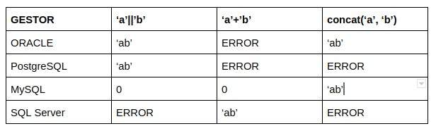

# **Unit 6. Advanced Aspects of Relational Databases and Introduction to Non-Relational Databases**
In relational databases, **procedural languages** are those that **allow writing blocks of code with programming logic** —such as conditions, loops, variables, etc.— to **manipulate data** or **automate tasks** within the database.

While standard SQL (like `SELECT`, `INSERT`, `UPDATE`, `DELETE`) is **declarative** (you specify *what* you want, not *how* to do it), procedural languages **let you program step by step** the *how*.

Famous examples:

- **PL/SQL** (Procedural Language/SQL) → used in **Oracle**.
- **PL/pgSQL** → used in **PostgreSQL**.
- **T-SQL** (Transact-SQL) → used in **SQL Server**.

## Stored Procedures

A stored procedure is an object that contains a set of SQL instructions stored in a database, and syntactically:

- It is created with the `CREATE PROCEDURE` statement.
- It is invoked with the `CALL` statement.

A procedure can have one or more input parameters and/or output parameters.

### Delimiter

To define a stored procedure, it is necessary to temporarily modify the delimiter character used to separate SQL statements.

The default delimiter character in SQL is the semicolon (`;`).

A MySQL client program uses the delimiter `;` to separate each statement to be executed (even in text files with multiple statements). However, in stored procedures, since they contain multiple SQL statements separated by `;` and the entire procedure is intended to be treated as a block, as a single composite statement, the statement delimiter must be temporarily redefined so that the MySQL server interprets the procedure as a single composite statement.

```sql
DELIMITER $$
CREATE PROCEDURE GetClients()
BEGIN
    SELECT * FROM clients;
    SELECT * FROM real_clients;
END $$
DELIMITER ;
```

### Parameters

In stored procedures, we can have three types of parameters:

**1. Input:**

- Indicated by placing the reserved word `IN` before the parameter name.
- These parameters cannot change their value within the procedure.

**2. Output:**

- Indicated by placing the reserved word `OUT` before the parameter name.
- These parameters change their value within the procedure (pass-by-reference of a parameter).

**3. Input/Output:**

- A combination of the `IN` and `OUT` types.
- These parameters are indicated by placing the reserved word `INOUT` before the parameter name.

```sql
CREATE PROCEDURE showClients(IN type VARCHAR(50))
```

### Calling Procedures

To call a stored procedure, the reserved word `CALL` is used.

Example:

```sql
DELIMITER ;
CALL presentarClientes ('Pymes');
```
## Functions

A stored function is an object created with the `CREATE FUNCTION` statement and invoked with the `SELECT` statement or within an expression.

A function can have several input parameters or none, and it always returns a value associated with the function's name.

- Created with `CREATE FUNCTION` and invoked with `SELECT`.
- Have **input parameters** (no need to specify `IN`) and **always return a value**.
- It is mandatory to specify the return data type (`RETURNS`) and use `RETURN` to return the value.

**Function Example:**

```sql
CREATE FUNCTION countClients(type VARCHAR(50)) RETURNS INT UNSIGNED
BEGIN
    DECLARE total INT UNSIGNED;
    SET total = (SELECT COUNT(*) FROM client WHERE client.type = type);
    RETURN total;
END;
```

## **Types of Functions**

- **DETERMINISTIC**: Always returns the same result for the same parameters.
- **NOT DETERMINISTIC**: The result may vary.
- **CONTAINS SQL**: Contains SQL but does not modify data.
- **NO SQL**: Does not contain SQL statements.
- **READS SQL DATA**: Only reads data.
- **MODIFIES SQL DATA**: Modifies data (not recommended in functions).

**Note:** When creating functions, you must specify at least one of the following: `DETERMINISTIC`, `NO SQL`, or `READS SQL DATA`.

## **Local Variables**

- Declared within `BEGIN...END` using `DECLARE`.
- Must be declared **before** cursors and handlers.

**Example:**

```sql
DECLARE total INT UNSIGNED;
```

---

# **Control Structures**

## **Conditionals and Loops**

- **IF-THEN-ELSE** and **CASE**: Allow decision-making.
- **Loops:** (`LOOP`, `REPEAT`, `WHILE`) Allow repeating instructions.

## **Loop Examples**

### **LOOP**

```sql
LOOP
    -- logic
    IF condition THEN
        LEAVE loop;
    END IF;
    ITERATE loop;
END LOOP;
```

### **REPEAT**

```sql
REPEAT
    -- logic
UNTIL condition
END REPEAT;
```

### **WHILE**

```sql
WHILE condition DO
    -- logic
END WHILE;
```

**All loops allow accumulating values, repeating operations, and controlling the execution of instructions.**

## Triggers in MySQL

### **What is a Trigger?**

A **trigger** is a **database object** associated with a specific table that **executes automatically** when an **event** occurs on that table (**INSERT**, **UPDATE**, or **DELETE**).

It is used to **automate actions** such as validating data, recording changes in another table (auditing), or maintaining data consistency.

---

### **Events that Activate a Trigger**

- **INSERT**: When a new row is added.
- **UPDATE**: When an existing row is modified.
- **DELETE**: When a row is deleted.

---

### **General Syntax**

```sql
CREATE TRIGGER trigger_name
{ BEFORE | AFTER } { INSERT | UPDATE | DELETE }
ON table_name
FOR EACH ROW
BEGIN
    -- SQL instructions
END;
```

- **BEFORE**: The trigger executes **before** the event occurs.
- **AFTER**: The trigger executes **after** the event occurs.
- **FOR EACH ROW**: The trigger executes **once for each affected row**.

---

### **Special Tables in Triggers**

Within a trigger, you can access two special "pseudo-tables":

- **NEW**: Represents the new row being inserted or updated.
- **OLD**: Represents the row before being updated or deleted.

## Events

**What is an Event?**

An **event** in MySQL is a scheduled task that executes **automatically** at a **specific time** or **periodically**.

👉 They are like **cron jobs** in Linux but **inside the database**.

They are used, for example, to:

- Clean old records from a table.
- Update statistics periodically.
- Backup data or create automatic copies.
- Perform maintenance tasks.

---

**Difference Between Event and Trigger**

| Trigger | Event |
| --- | --- |
| Executes when an action occurs (INSERT, UPDATE, DELETE). | Executes at a scheduled time (date/time). |
| Depends on someone interacting with the table. | Does not depend on users; activates automatically based on schedule. |
| No time control. | Can be configured for periodicity or a one-time date. |

---

**Enable the Event Scheduler**

Before using events, MySQL must have the **Event Scheduler** enabled.

You can enable it with:

```sql
SET GLOBAL event_scheduler = ON;
```

### **General Syntax for Creating an Event**

```sql
CREATE EVENT event_name
ON SCHEDULE
     { AT timestamp | EVERY interval [STARTS timestamp] [ENDS timestamp] }
DO
     -- SQL instructions;
```

- **AT** → Execute it once at a specific time.
- **EVERY** → Execute it **periodically**.

## **Transactions in MySQL**

### **What is a Transaction?**

A **transaction** is a **set of operations** executed as a **single unit**:

- If everything goes well → `COMMIT` (confirm changes).
- If something fails → `ROLLBACK` (undo changes).

The goal is to maintain **database integrity**.

---

### **How Do They Work in a Stored Procedure?**

Within a procedure (`CREATE PROCEDURE`), you can:

- Start a transaction with `START TRANSACTION`.
- Handle errors using **error handlers** (`DECLARE HANDLER`).
- End the transaction with `COMMIT` or `ROLLBACK` depending on what happens.

---

### **Basic Error Handling**

MySQL allows capturing errors using **handlers**.

The most commonly used:

- `SQLEXCEPTION` → Any serious SQL error.
- `SQLWARNING` → Non-fatal warnings (but could indicate issues).

---

### **Practical Example: Procedure with Transaction**

Suppose we have a `clients` table and want to do the following:

- Check if a client exists.
- If it exists, update its status to "active."
- If it does not exist, throw an error.
- If something goes wrong, perform a `ROLLBACK`.

### First, a Simple Table:

```sql
CREATE TABLE clients (
     client_id VARCHAR(10) PRIMARY KEY,
     name VARCHAR(100),
     status VARCHAR(20)
);
```

---

### Now the Procedure:

```sql
DELIMITER //

CREATE PROCEDURE checkClient(IN client_id VARCHAR(10))
BEGIN
     DECLARE EXIT HANDLER FOR SQLEXCEPTION
     BEGIN
          -- If an error occurs, rollback the transaction
          ROLLBACK;
     END;

     START TRANSACTION;

     -- Update status to 'active'
     UPDATE clients
     SET status = 'active'
     WHERE client_id = client_id;

     -- Verify that a record was actually updated
     IF ROW_COUNT() = 0 THEN
          -- If no rows were affected, manually throw an error
          SIGNAL SQLSTATE '45000'
                SET MESSAGE_TEXT = 'Client not found';
     END IF;

     COMMIT;
END;
//

DELIMITER ;
```

# SQL Injection

SQL injection is a vulnerability that allows an attacker to maliciously and maliciously inject SQL statements into SQL code programmed to manipulate databases.

In this case, all data in the database will be at risk.

**What are the objectives of this type of attack?**

- Modify the behavior of database queries by adding unwanted parameters, thus potentially falsifying identities.
- Obtain and expand critical database information (passwords, emails, financial data, bank accounts, etc.).
- Delete the database, rename tables, cancel transactions, etc., that is, render the database and all systems or applications connected to it inoperable.

### **DB Manager for SQL Injection**

Each DBMS stores the data schema for exploration differently, and it is important to know the DBMS you are working with.

An associated method of using SQL injection is based on injecting expressions specific to each SQL dialect based on each DBMS (syntax) and checking how the application behaves.
### **SQL Injection Example**

```sql
SELECT * FROM users WHERE username = 'admin' AND password = '1234';
```
```sql
SELECT * FROM users WHERE username = 'admin' AND password = '1234' OR 1=1;
```
```sql
SELECT * FROM users WHERE username = 'admin' AND password = '1234' OR 1=1; DROP TABLE users;
```



## Information Schema

### What is `INFORMATION_SCHEMA`?

It is a set of **special tables** in MySQL that store **information about the database itself**:

- What databases exist (`SCHEMATA`)
- What tables the databases have (`TABLES`)
- What columns the tables have (`COLUMNS`)
- What indexes exist, privileges, etc.

**⚡ It is like the "internal map" of the database server.**

---

### Objective in a SQL Injection attack

When we perform **SQL Injection**, one of the first goals is:

- **Discover what databases** exist.
- **Discover what tables** those databases have.
- **Discover what columns** those tables have.

Then:

- Steal data (SELECT)
- Modify or delete (UPDATE, DELETE) if possible.

---

### Step 1: Get the existing databases

**Query 1:**

```sql
-1' UNION SELECT schema_name, null
FROM INFORMATION_SCHEMA.SCHEMATA;#
```

✅ This will return a list of **databases** on the server.

🔵 `schema_name`: Name of each database.

---

### Step 2: Get the tables in a specific database

**Query 2:**

```sql
-1'
UNION SELECT table_name, null
FROM INFORMATION_SCHEMA.TABLES
WHERE table_schema LIKE 'IoT';#
```

✅ This will list all the **tables** within the **database** named `IoT`.

🔵 `table_name`: Name of each table.

🔵 `table_schema`: Name of the database to which this table belongs.

---

### Step 3: Get the columns of a specific table

**Query 3:**

```sql
-1'
UNION SELECT column_name, column_type
FROM INFORMATION_SCHEMA.COLUMNS
WHERE table_schema LIKE 'IoT' AND table_name LIKE 'products';#
```

✅ This will display all the **columns** from the `products` table in the `IoT` database.

🔵 `column_name`: Name of the column.

🔵 `column_type`: Data type (VARCHAR, INT, etc.).

---

### What can be done with this information?

Once you **know**:

- what databases there are,
- what tables exist,
- and what columns they have,

you can:

- Run **SELECT queries** to extract data.
- **Insert** new records (if you have permission).
- **Modify** data with **UPDATE**.
- **Delete** data with **DELETE**.
## How to Avoid **SQL Injection** Attacks

### Zero Trust Approach

- We assume that **no one is trustworthy**: no administrators, employees, or third-party vendors.
- No connection, user, or service is trusted **by default**.
- What does it entail?
- Apply **strict** access controls to information.
- **Eliminate** or **reduce** unnecessary external connection dependencies.
- **Always monitor and validate** the authenticity and authorization of connections before allowing access to the database.

✅ This minimizes the opportunity for an attacker to exploit weak connections or careless privileged users.

---

### **Limit User Privileges**

- Each user or account should **only** be assigned the **minimum necessary privileges** (Principle of Least Privilege).
- **Prevent**:
- Web applications from using users with **administrator** privileges.
- Database users from performing operations such as `DROP TABLE`, `DELETE`, or `UPDATE` unless strictly necessary.

✅ Fewer permissions = Less chance of damage in the event of an attack.

---

### Use of **Stored Procedures**

- A stored procedure:
- Is a **function** defined within the database.
- Executes **SQL queries** in a **controlled** and **secure** manner.

**Advantages:**

- The user does not interact directly** with the database or construct queries manually.
- Data is validated and processed before performing any operation.
- **Reduces** the possibility of injection, because the SQL is **predefined**.

✅ The system only receives **safe parameters**, not executable code fragments.

---

### Using **Parameterized Queries** (Prepared Statements)

- **What is it?**
- Separate the **SQL code** from the **user-supplied data**.
- The database engine compiles the query **before** the user data is added.

**Unsafe example (vulnerable to injection):**

```sql
SELECT * FROM users WHERE name = '$name';
```

**Safe example (parameterized query):**

```sql
SELECT * FROM users WHERE name = ?;
```

or (depending on the language):

```python
cursor.execute("SELECT * FROM users WHERE name = ?", (name,))
```

✅ Thus, the data is treated as **data**, not as **code**.

---

### Apply **Multi-Layered Security**

- It is not enough to protect the database. **Multiple layers of defense** must be applied:

**Recommended Measures:**

- **Firewall** to protect network access.
- **Strict input validation** in the web application.
- **Strong Authentication**:
- Strong passwords.
- Use of **two-factor authentication (2FA)**.
- **Constant monitoring** for suspicious activity.
- **Encryption** of sensitive data both in transit and at rest.
- **Frequent software updates** and security patches.

✅ Each additional layer **makes it harder** for an attacker to compromise the system.

# MongoDB

---

## MongoDB Access

**How ​​do I access MongoDB?**

- MongoDB can be configured to require user authentication.
- There are user roles, such as:
- `read`: read only.
- `readWrite`: read and write.
- `dbAdmin`: database administration (creating indexes, validating data, etc.).
- `userAdmin`: user creation and management.
- `root`: full access to all databases.

**Access Methods:**

- Local (`localhost`) or remote (public or private IP) connections.
- **Official drivers** for different languages: Node.js, Python, Java, Go, etc.
- Access via the **MongoDB shell** (`mongosh`) or through graphical interfaces such as **MongoDB Compass**.

**Important:**

- Enable **authentication** (`auth = true`) in production.
- Use **SSL/TLS certificates** for secure remote connections.

---

## Basic Elements in MongoDB

MongoDB is a **NoSQL** database oriented towards **documents** (not tables).

The main **elements** are:

| Level | Name | Description |
| --- | --- | --- |
| 1 | **Database** | A collection container. (Ex: `db = "ecommerce"`) |
| 2 | **Collection** | Similar to a SQL table, but flexible. (Ex: `products`) |
| 3 | **Document** | Basic unit of data, it is a JSON-like object. (Ex: `{"name": "T-shirt", "price": 20}`) |
| 4 | **Field** | Key-value attribute within a document. (Example: `"name": "T-shirt"`)

**Document example:**

```json
{
"_id": ObjectId("609b8f71e3e2f87a5b8cfe45"),
"name": "T-shirt",
"price": 20,
"sizes": ["S", "M", "L"],
"inStock": true}
```

- `_id`: Automatically unique identifier for each document (you can define it yourself if you want).

---

## Operations in MongoDB

MongoDB primarily works with **CRUD**:

| Operation Type | Command | Example |
| --- | --- | --- |
| **Create** | `insertOne()`, `insertMany()` | `db.products.insertOne({ name: "Cap", price: 15 })` |
| **Read** | `find()`, `findOne()` | `db.products.find({ price: { $lt: 50 } })` |
| **Update** | `updateOne()`, `updateMany()`, `replaceOne()` | `db.products.updateOne({ name: "Cap" }, { $set: { price: 18 } })` |
| **Delete** | `deleteOne()`, `deleteMany()` | `db.products.deleteOne({ name: "Cap" })` |

**Notes:**

- MongoDB uses special operators, such as `$set`, `$gt` (greater than), `$lt` (less than), `$or`, `$and`.
- Everything is handled as **documents** and **JSON filters**.

---

## Indexes in MongoDB

**What is an index?**

- An **index** in MongoDB speeds up searches, just like in relational databases.

**Types of indexes:**

- **Simple index** (`Single Field`):
- On a single field.
- Example: index on `name`.
- **Composite index**:
- On **two or more fields** combined.
- Example: `name + price`.
- **Unique indexes** (`unique: true`):
- Prevents duplicate values.
- Example: unique emails for users.
- **Text indexes** (`text`):
- For searching for words within strings.
- **Geospatial indexes** (`2dsphere`):
- For working with coordinates (Uber-like apps, Google Maps).

**Create a basic index:**

```jsx
db.productos.createIndex({ name: 1 })
```

(`1` is ascending, `-1` would be descending).

**View all indexes in a collection:**

```jsx
db.productos.getIndexes()
```

**Important about indexes:**

- **They improve** read speed (find).
- **They can degrade** write speed (insert/update) if there are many.
- They should be **planned** based on actual query usage.