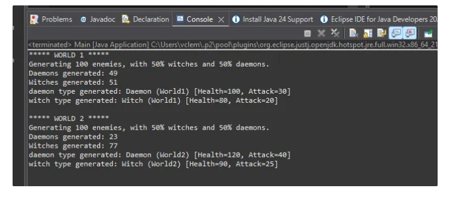
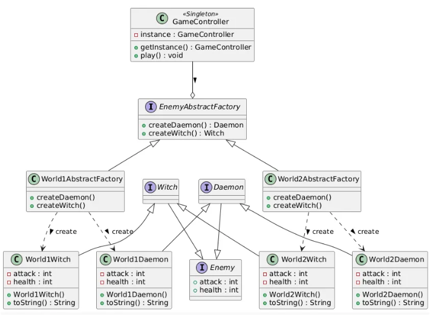

# Introduction

For this activity, we start from exercise 11 of this unit, abstract factory pattern, Enemy version 1, and the task is to modify it so that enemies can be generated randomly in both worlds. This will allow enemies to be generated equiprobably in World1 and with a higher probability of generating witches (75/25 ratio) in World2.

The activity has been divided as follows:

- Source Code (main code with comments, explanations for each code component).
    - Comments written in English.
- Expected Output.
- UML Diagram and Component Summary.

# Source Code

### EnemyInterface.java

- This is the **common base interface** for all enemies.
- Defines the essential methods that all enemies must implement: `getHealth()` and `getAttack()`.

```java
package src;

// Enemy Interface - base interface for any enemy
public interface Enemy {
    int getHealth();
    int getAttack();
}
```

### Daemon.java

- Both (Witch and Daemon) extend `Enemy`, inheriting the `getHealth()` and `getAttack()` methods.
- Represent **specific types of enemies**:
    - `Daemon`: demons
    - `Witch`: witches
- These interfaces are used as **abstract products** in the Abstract Factory pattern.

```java
package src;

// Daemon Interface - Abstract Factory Pattern: Abstract Product
public interface Daemon extends Enemy {
}
```

### Witch.java

```java
package src;

// Witch Interface - Abstract Factory Pattern: Abstract Product
public interface Witch extends Enemy {
}
```

### GameController.java

- Follows the **Singleton** pattern to ensure only one instance of the game exists.
- The `play()` method controls the main logic:
    - Calls `generateEnemies()` with different factories (`World1`, `World2`).
    - Generates 100 enemies per world.
    - Displays how many `Daemons` and `Witches` were created.
    - Prints an example of each generated type.

```java
package src;

import java.util.ArrayList;
import java.util.List;

public class GameController {
    // Singleton instance of GameController
    private static GameController instance = null;

    // Private constructor to enforce Singleton pattern
    private GameController() {
    }

    // Method to get the single instance of GameController
    public static GameController getInstance() {
        if (instance == null) {
            instance = new GameController();
        }
        return instance;
    }

    // Main game logic
    public void play() {
        // World 1 setup
        System.out.println("***** WORLD 1 *****");
        System.out.println("Generating " + 100 + " enemies, with " + (int)(0.5 * 100) 
        + "% witches and " + (int)(0.5 * 100) + "% daemons.");
        // Generate enemies for World 1
        List<Enemy> enemiesWorld1 = generateEnemies(new World1AbstractFactory(), 100, 
        0.5);

        // World 2 setup
        System.out.println("\n***** WORLD 2 *****");
        System.out.println("Generating " + 100 + " enemies, with " + (int)(0.5 * 100) 
        + "% witches and " + (int)(0.5 * 100) + "% daemons.");
        // Generate enemies for World 2
        List<Enemy> enemiesWorld2 = generateEnemies(new World2AbstractFactory(), 100, 
        0.25);
    }

    // Method to generate enemies for a given world
    private List<Enemy> generateEnemies(EnemyAbstractFactory factory, int count, 
    double daemonProbability) {
        // Input validations
        if (factory == null) {
            throw new IllegalArgumentException("Factory cannot be null.");
        }
        if (count <= 0) {
            throw new IllegalArgumentException("Count must be greater than 0.");
        }
        if (daemonProbability < 0 || daemonProbability > 1) {
            throw new IllegalArgumentException("Daemon probability must be between 0-1.");
        }

        List<Enemy> enemies = new ArrayList<>();
        int daemons = 0;
        int witches = 0;

        // Generate enemies based on the probability
        for (int i = 0; i < count; i++) {
            if (Math.random() < daemonProbability) {
                enemies.add(factory.createDaemon());
                daemons++;
            } else {
                enemies.add(factory.createWitch());
                witches++;
            }
        }

        // Print the count of generated daemons and witches
        System.out.println("Daemons generated: " + daemons);
        System.out.println("Witches generated: " + witches);

        // Example of a randomly selected daemon and witch
        Enemy exampleDaemon = null;
        Enemy exampleWitch = null;

        // Find one example of each type (daemon and witch)
        for (Enemy enemy : enemies) {
            if (exampleDaemon == null && enemy instanceof Daemon) {
                exampleDaemon = enemy;
            }
            if (exampleWitch == null && enemy instanceof Witch) {
                exampleWitch = enemy;
            }
            if (exampleDaemon != null && exampleWitch != null) {
                break;
            }
        }

        // Print details of the example daemon and witch
        if (exampleDaemon != null) {
            System.out.println("daemon type generated: " + exampleDaemon);
        } else {
            System.out.println("No daemons were generated.");
        }

        if (exampleWitch != null) {
            System.out.println("witch type generated: " + exampleWitch);
        } else {
            System.out.println("No witches were generated.");
        }

        return enemies;
    }
}
```

### EnemyAbstractFactory.java

- This is the **abstract factory**.
- Defines methods to create abstract objects: `Daemon` and `Witch`.
- Each "world" will implement this interface to create specific enemies.

```java
package src;

// Interface EnemyAbstractFactory - Abstract Factory Pattern: Abstract factory 
// for enemies
public interface EnemyAbstractFactory {
    Daemon createDaemon();
    Witch createWitch();
}
```

### World1AbstractFactory.java

- Concrete implementation of the factory for **World 1**.
- Creates specific instances of `World1Daemon` and `World1Witch`.

```java
package src;

// Concrete factory for World1 - Abstract Factory Pattern: Concrete Factory
// This class implements the EnemyAbstractFactory interface and provides
// specific implementations for creating World1-specific enemies (Daemon and Witch).
public class World1AbstractFactory implements EnemyAbstractFactory {

    // Creates and returns a World1-specific Daemon instance
    @Override
    public Daemon createDaemon() {
        return new World1Daemon();
    }
    
    // Creates and returns a World1-specific Witch instance
    @Override
    public Witch createWitch() {
        return new World1Witch();
    }
}

```

### World2AbstractFactory.java

- Concrete factory for **World 2**.
- Generates `World2Daemon` and `World2Witch`.

```java
package src;

// Concrete factory for World2 - Abstract Factory Pattern: Concrete Factory
// This class implements the EnemyAbstractFactory interface and provides
// specific implementations for creating Daemon and Witch objects for World2.
public class World2AbstractFactory implements EnemyAbstractFactory {
    @Override
    public Daemon createDaemon() {
        // Creates and returns a World2-specific Daemon instance
        return new World2Daemon();
    }
    
    @Override
    public Witch createWitch() {
        // Creates and returns a World2-specific Witch instance
        return new World2Witch();
    }
}

```

### World1Witch.java

- Implements the `Witch` interface.
- Represents a witch with specific statistics for World 1.

```java
package src;

// The World1Witch class implements the Witch interface and represents a witch character in World1.
public class World1Witch implements Witch {
    // Constants for the base health and attack values of the witch.
    private static final int BASE_HEALTH = 80;
    private static final int BASE_ATTACK = 20;
    private static final int MAX_HEALTH = 100; // Maximum health limit
    private static final int MAX_ATTACK = 50; // Maximum attack limit

    // Instance variables to store the current health and attack values of the witch.
    private int health;
    private int attack;

    // Constructor initializes the witch's health and attack to their base values.
    public World1Witch() {
        this.health = validateHealth(BASE_HEALTH);
        this.attack = validateAttack(BASE_ATTACK);
    }

    // Getter method to retrieve the current health of the witch.
    @Override
    public int getHealth() {
        return health;
    }

    // Setter method to update the health with validation.
    public void setHealth(int health) {
        this.health = validateHealth(health);
    }

    // Getter method to retrieve the current attack value of the witch.
    @Override
    public int getAttack() {
        return attack;
    }

    // Setter method to update the attack with validation.
    public void setAttack(int attack) {
        this.attack = validateAttack(attack);
    }

    // Private method to validate health values.
    private int validateHealth(int health) {
        if (health < 0) {
            throw new IllegalArgumentException("Health cannot be negative.");
        }
        return Math.min(health, MAX_HEALTH);
    }

    // Private method to validate attack values.
    private int validateAttack(int attack) {
        if (attack < 0) {
            throw new IllegalArgumentException("Attack cannot be negative.");
        }
        return Math.min(attack, MAX_ATTACK);
    }

    // Overrides the toString method to provide a string representation of the witch.
    @Override
    public String toString() {
        return "Witch (World1) [Health=" + health + ", Attack=" + attack + "]";
    }
}
```

### World2Witch.java

- Represents a witch from World 2, with different statistics compared to `World1Witch`.

```java
package src;

// The World2Witch class implements the Witch interface and represents a witch character
// with specific base health and attack values in the "World2" context.
public class World2Witch implements Witch {
    // Constants for the base health and attack values of the witch
    private static final int BASE_HEALTH = 90;
    private static final int BASE_ATTACK = 25;
    private static final int MAX_HEALTH = 120; // Maximum health limit
    private static final int MAX_ATTACK = 60;  // Maximum attack limit

    // Instance variables to store the current health and attack values of the witch
    private int health;
    private int attack;

    // Constructor initializes the witch's health and attack to their base values
    public World2Witch() {
        this.health = validateHealth(BASE_HEALTH);
        this.attack = validateAttack(BASE_ATTACK);
    }

    // Getter method to retrieve the current health of the witch
    @Override
    public int getHealth() {
        return health;
    }

    // Setter method to update the health with validation
    public void setHealth(int health) {
        this.health = validateHealth(health);
    }

    // Getter method to retrieve the current attack value of the witch
    @Override
    public int getAttack() {
        return attack;
    }

    // Setter method to update the attack with validation
    public void setAttack(int attack) {
        this.attack = validateAttack(attack);
    }

    // Private method to validate health values
    private int validateHealth(int health) {
        if (health < 0) {
            throw new IllegalArgumentException("Health cannot be negative.");
        }
        return Math.min(health, MAX_HEALTH);
    }

    // Private method to validate attack values
    private int validateAttack(int attack) {
        if (attack < 0) {
            throw new IllegalArgumentException("Attack cannot be negative.");
        }
        return Math.min(attack, MAX_ATTACK);
    }

    // Overridden toString method to provide a string representation of the witch
    @Override
    public String toString() {
        return "Witch (World2) [Health=" + health + ", Attack=" + attack + "]";
    }
}
```

### World1Daemon.java

- Demon from World 1.
- Includes validations in the setters to ensure health and attack values remain within valid ranges.

```java
package src;

// The {@code World1Daemon} class represents a daemon entity in the World1 environment.
// It implements the {@code Daemon} interface and provides basic attributes such as health and attack.
// This class uses constant base values for health and attack, which are initialized 
//in the constructor.
public class World1Daemon implements Daemon {
    // Base health value for the daemon
    private static final int BASE_HEALTH = 100;
    // Base attack value for the daemon
    private static final int BASE_ATTACK = 30;

    // Minimum and maximum allowed values for health and attack
    private static final int MIN_HEALTH = 0;
    private static final int MAX_HEALTH = 200;
    private static final int MIN_ATTACK = 0;
    private static final int MAX_ATTACK = 50;

    // Current health of the daemon
    private int health;
    // Current attack value of the daemon
    private int attack;

    // Constructs a new {@code World1Daemon} with default base health and attack values.
    public World1Daemon() {
        this.health = validateHealth(BASE_HEALTH);
        this.attack = validateAttack(BASE_ATTACK);
    }

    // Returns the current health of the daemon.
    // return the health value
    @Override
    public int getHealth() {
        return health;
    }

    // Sets the health of the daemon, ensuring it is within valid bounds.
    // param health the new health value
    public void setHealth(int health) {
        this.health = validateHealth(health);
    }

    // Returns the current attack value of the daemon.
    // return the attack value
    @Override
    public int getAttack() {
        return attack;
    }

    // Sets the attack value of the daemon, ensuring it is within valid bounds.
    // param attack the new attack value
    public void setAttack(int attack) {
        this.attack = validateAttack(attack);
    }

    // Returns a string representation of the daemon, including its health and 
    //attack values.
    // return a string describing the daemon
    @Override
    public String toString() {
        return "Daemon (World1) [Health=" + health + ", Attack=" + attack + "]";
    }

    // Validates the health value to ensure it is within the allowed range.
    // param health the health value to validate
    // return the validated health value
    // throws IllegalArgumentException if the health value is out of bounds
    private int validateHealth(int health) {
        if (health < MIN_HEALTH || health > MAX_HEALTH) {
            throw new IllegalArgumentException("Health must be between " + MIN_HEALTH + 
            " and " + MAX_HEALTH);
        }
        return health;
    }

    // Validates the attack value to ensure it is within the allowed range.
    // param attack the attack value to validate
    // return the validated attack value
    // throws IllegalArgumentException if the attack value is out of bounds
    private int validateAttack(int attack) {
        if (attack < MIN_ATTACK || attack > MAX_ATTACK) {
            throw new IllegalArgumentException("Attack must be between " + MIN_ATTACK + 
            " and " + MAX_ATTACK);
        }
        return attack;
    }
}

```
### World2Daemon.java

- Demon from World 2 with distinct statistics.

```java
package src;

// The {@code World2Daemon} class represents a daemon entity in the World2 environment.
// It implements the {@code Daemon} interface and provides basic attributes such as health and attack.
// This class uses constant base values for health and attack, which are initialized in the constructor.
public class World2Daemon implements Daemon {
    // Base health value for the daemon
    private static final int BASE_HEALTH = 120;
    // Base attack value for the daemon
    private static final int BASE_ATTACK = 40;

    // Minimum and maximum allowed values for health and attack
    private static final int MIN_HEALTH = 0;
    private static final int MAX_HEALTH = 250;
    private static final int MIN_ATTACK = 0;
    private static final int MAX_ATTACK = 60;

    // Current health of the daemon
    private int health;
    // Current attack value of the daemon
    private int attack;

    // Constructs a new {@code World2Daemon} with default base health and attack values.
    public World2Daemon() {
        this.health = validateHealth(BASE_HEALTH);
        this.attack = validateAttack(BASE_ATTACK);
    }

    // Returns the current health of the daemon.
    @Override
    public int getHealth() {
        return health;
    }

    // Sets the health of the daemon, ensuring it is within valid bounds.
    public void setHealth(int health) {
        this.health = validateHealth(health);
    }

    // Returns the current attack value of the daemon.
    @Override
    public int getAttack() {
        return attack;
    }

    // Sets the attack value of the daemon, ensuring it is within valid bounds.
    public void setAttack(int attack) {
        this.attack = validateAttack(attack);
    }

    // Returns a string representation of the daemon, including its health and attack values.
    @Override
    public String toString() {
        return "Daemon (World2) [Health=" + health + ", Attack=" + attack + "]";
    }

    // Validates the health value to ensure it is within the allowed range.
    private int validateHealth(int health) {
        if (health < MIN_HEALTH || health > MAX_HEALTH) {
            throw new IllegalArgumentException("Health must be between " +
            MIN_HEALTH + " and " + MAX_HEALTH);
        }
        return health;
    }

    // Validates the attack value to ensure it is within the allowed range.
    private int validateAttack(int attack) {
        if (attack < MIN_ATTACK || attack > MAX_ATTACK) {
            throw new IllegalArgumentException("Attack must be between " + 
            MIN_ATTACK + " and " + MAX_ATTACK);
        }
        return attack;
    }
}
```

### Main.java

1. **`GameController.getInstance()`**:
    
    Uses the Singleton pattern to ensure there is only one instance of the game controller.
    
2. **`game.play()`**:
    
    Executes the main game logic. In this case, it generates enemies for two different worlds (`World1` and `World2`), using the Abstract Factory pattern to create world-specific objects (`Daemon` and `Witch`).
    

```java
package src;

// Main class to start the application
public class Main {
    public static void main(String[] args) {
        // Get the singleton instance of GameController and start the game
        GameController game = GameController.getInstance();
        game.play();
    }
}
```

# Expected Output:



# UML Diagram



### Diagram Summary:

**1. Main Interfaces**

`EnemyAbstractFactory`

- Defines an **abstract factory** for creating enemies.
- Methods:
    - `createDaemon()`: returns a `Daemon` object.
    - `createWitch()`: returns a `Witch` object.

`Enemy`

- Common interface for all enemies.
- Attributes:
    - `attack` (attack power).
    - `health` (health points).
- Both `Witch` and `Daemon` inherit from this interface.

`Daemon` and `Witch`

- Specific interfaces for concrete enemy types.
- Both extend the `Enemy` interface.

---

**2. Concrete Factory Classes**

These implement the `EnemyAbstractFactory` interface for specific worlds:

`World1AbstractFactory`

`World2AbstractFactory`

- Each implements:
    - `createDaemon()` → creates a world-specific `Daemon`.
    - `createWitch()` → creates a world-specific `Witch`.

---

**3. Concrete Enemy Classes**

Each combination of world and enemy type has its own class:

- `World1Daemon`, `World2Daemon`
- `World1Witch`, `World2Witch`

Attributes:

- `attack`: attack power.
- `health`: health points.

Methods:

- No-argument constructor.
- `toString()`: textual representation of the object.

These classes **implement the interfaces** `Daemon` or `Witch`, respectively.

---

**4. Singleton: `GameController`**

Game controller class. It is marked as a **Singleton**, meaning only one instance can exist.

Attributes and Methods:

- `instance`: the single instance of `GameController`.
- `getInstance()`: returns the instance.
- `play()`: starts the game.

Association:

- Has a **composition relationship** with `EnemyAbstractFactory` (indicating it depends on an abstract factory to create enemies).
