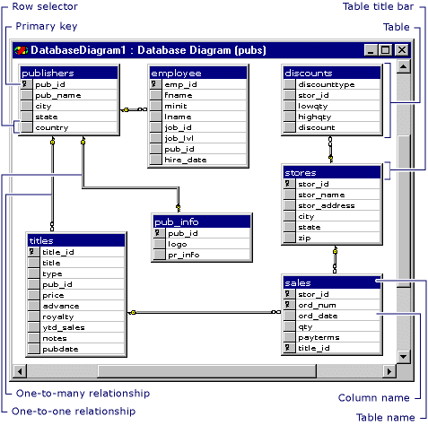

# Unidad 1

Creado: 29 de septiembre de 2025 12:06


En este bloque se aborda la evolución del manejo de datos desde el modelo relacional hasta las bases de datos NoSQL. Haciendo incapie en la importancia de las bases de datos relacionales y sus características, como la persistencia, concurrencia, integridad e integración. 

Posteriormente, se introduce el concepto de *impedance mismatch* y el declive de las bases de datos relacionales ante el auge de nuevas tecnologías. 

## Tipos de Datos

En el mundo de la gestión de datos se pueden clasificar los datos en tres categorías principales: no estructurados, semi-estructurados y estructurados. Cada tipo de datos tiene características y usos específicos que influyen en la elección de la base de datos adecuada para almacenarlos.

### Datos No Estructurados

Los datos no estructurados no siguen un formato o esquema predefinido, lo que los hace más difíciles de analizar y procesar. Estos datos incluyen:

- **Documentos de Lenguaje Natural:** incluyen correos electrónicos, artículos de noticias, publicaciones en redes sociales, y cualquier tipo de texto sin una estructura clara y definida. Ejemplos:
    - Un correo electrónico que puede contener texto, imágenes y archivos adjuntos.
    - Una publicación en redes sociales con comentarios y reacciones.
- **Audios y Videos:** archivos multimedia que, debido a su naturaleza, no tienen una estructura fija y requieren grandes capacidades de almacenamiento y procesamiento. Ejemplos:
    - Un archivo de audio MP3 o WAV.
    - Un video en formato MP4 o AVI.

### Datos semi-estrucutrados

Los datos semi-estructurados tienen una estructura flexible que permite cierta variabilidad en la organización de los datos. Estos datos incluyen:

- **Páginas Web:** contienen datos en formatos como HTML, que tienen una estructura definida pero
también pueden incluir datos no estructurados como textos y multimedia. Ejemplos:
    - Una página HTML con secciones claramente definidas, pero con contenido textual variado. Es posible estructurar las secciones de la página, aunque luego dentro de las secciones se pueden encontrar archivos como imágenes o una sección de comentarios, por ejemplo.
- **XML/JSON:** son formatos de datos que tienen una estructura definida pero flexible, permitiendo variaciones en cómo se organizan los datos. Estos formatos son comunes en la transmisión de datos entre sistemas y aplicaciones
web. Ejemplos:
    - Un archivo XML con etiquetas personalizadas para diferentes tipos de datos.
    - Un objeto JSON que puede anidar datos dentro de otros datos.

### Datos Estructurados

Este formato de datos esta organizado en un formato rígido y bien definido como las tablas en una base de datos relacional, facilmente manipulables en lenguajes de consulta como SQL. 

- Bases de Datos: datos organizadoes en tablas con filas y columnas donde cada una representa un registro único. Ejemplo:
    - Una tabla de clientes con números de teléfono dirección etc todo organizado en columnas.
    - Una tabla de productos con columnas para ID de producto, nombre, descripción y precio.
- **Recurso para utilizar: Note**
    - **SQL** (Structured Query Language): es el lenguaje de consulta más utilizado para interactuar con bases de datos relacionales. Permite realizar operaciones como la inserción, actualización, eliminación y consulta de datos de manera rápida y precisa. Las consultas SQL están diseñadas para ser altamente eficientes en la recuperación y manipulación de datos estructurados.
    
    | **Tipo de Datos** | **Descripción** | **Ejemplos Comunes** | **Formato / Tecnología Asociada** |
    | --- | --- | --- | --- |
    | **No Estructurados** | No tienen un formato ni esquema fijo. Son difíciles de analizar y procesar. | - Correos electrónicos- Publicaciones en redes- Audios (MP3, WAV)- Videos (MP4, AVI) | Texto libre, multimedia |
    | **Semi-estructurados** | Tienen cierta organización, pero con flexibilidad en la estructura. | - Páginas web (HTML)- Archivos XML o JSON con datos anidados | HTML, XML, JSON |
    | **Estructurados** | Datos organizados en un formato fijo, normalmente tabular. | - Tablas de bases de datos (clientes, productos, etc.) | SQL, Bases de datos relacionales (MySQL, PostgreSQL, etc.) |

## Bases de datos relacionales

Este modelo de base de datos ha sido la piedra angular de la gestión de datos desde su desarrollo en los 70s, radica su importancia en su capacidad para organizar, almacenar y recuperar datos de manera eficiente y estructurada lo cual es fundamental para el funcionamiento de las aplicaciones empresariales. 

### Concepto de Persistencia de Datos

Como su nombre indica, este concepto hace referencia a la capacidad de almacenar datos de forma permanente en el sistema lo cual resulta crucial para que las bases de datos relacionales aseguren de manera segura el acceso y almacenamiento de los propios datos. 

Si queremos que sea posible acceder a estos datos en el futuro es necesario tomar una serie de decisiones, la mas importante es como se lleva a cabo el amacenaje de datos ya que deben ser guardados de forma persistente, preferiblemente en un disco duro. 

Otro tema a tratar es el formato de archivos en los que guardaremos la información ya que guardarlos individualmente no es eficiente en terminos de consultas complejas y manejo masivo. Las BDR ofrecen una solución robusta a la persistencia mediante esquemas estructurados por tablas representadas con atributos especificos.

A través de su estructura tabular y el uso de claves primarias y ajenas, 
las bases de datos relacionales permiten acceder rápidamente a datos 
específicos. Las relaciones entre tablas facilitan la consulta de datos 
relacionados de manera eficiente. Para llevar a cabo estas **consultas** y manipular los datos, las bases de datos relacionales utilizan el lenguaje SQL.



### Concepto de Concurrencia

Este concepto ocurre en entornos donde múltiples usuarios o aplicaciones necesitan acceder a los datos simultáneamente. Sin un manejo adecuado de la concurrencia, los datos pueden corromperse, lo que llevaría a resultados inconsistentes y poco fiables.

Sobre este aspecto debemos tener en cuenta varias cosas. En primer lugar, cuando múltiples usuarios intentan acceder y modificar los mismos datos simultáneamente existe un riesgo significativo de que se produzcan conflictos. Por ejemplo, es posible que dos usuarios intenten actualizar el mismo registro al mismo tiempo, lo que podría resultar en datos inconsistentes. 

Por otro lado, la concurrencia sin control puede llevar a situaciones en las que los datos se **corrompen.** Esto puede ocurrir si una operación de escritura no se completa antes de que otra operación intente leer o escribir esos mismos datos, resultando en información incompleta o incorrecta.

Las bases de datos relacionales utilizan el concepto de **transacciones** para manejar la concurrencia de manera segura y eficiente. Una transacción es una secuencia de una o más operaciones de base de datos que se ejecutan como una unidad lógica.

| **Concepto** | **Descripción** | **Elementos Clave / Ejemplos** |
| --- | --- | --- |
| **Bases de Datos Relacionales (BDR)** | Modelo que organiza los datos en **tablas** relacionadas entre sí mediante **claves primarias y foráneas**. Permite un acceso rápido y estructurado a la información. | - Tablas con filas (registros) y columnas (atributos).- Relaciones entre tablas (1 a N, N a N).- Lenguaje **SQL** para consultas y manipulación. |
| **Persistencia de Datos** | Capacidad de **almacenar datos de forma permanente** en el sistema (por ejemplo, en disco). Garantiza que la información se mantenga disponible incluso tras apagar el sistema. | - Almacenamiento en disco duro.- Estructuras tabulares para organización eficiente.- Archivos estructurados y optimizados para consultas complejas. |
| **Concurrencia** | Mecanismo que permite el **acceso simultáneo de múltiples usuarios o procesos** sin que los datos se corrompan. | - Riesgo: conflictos o corrupción si varios usuarios modifican los mismos datos.- Solución: **Transacciones** que aseguran integridad y consistencia. |
| **Transacciones** | Conjunto de operaciones que se ejecutan como una **unidad lógica indivisible**: o se completan todas o ninguna (principio **ACID**). | - Ejemplo: transferencia bancaria (debe restar en una cuenta y sumar en otra).- Garantizan **atomicidad, consistencia, aislamiento y durabilidad.** |

### Propiedades ACID

Para garantizar la integridad y consistencia de los datos, las bases de datos relacionales implementan las propiedades **ACID** (Atomicidad, Consistencia, Aislamiento y Durabilidad) en sus transacciones. Estas propiedades son fundamentales para asegurar que las operaciones de la base de datos se realicen de manera fiable y segura.


Todas estas características aseguran que las bases de datos relacionales puedan manejar múltiples operaciones concurrentes sin comprometer la integridad de los datos.

### Concepto de Integración

La integración es un aspecto clave en el uso de bases de datos relacionales, especialmente en entornos donde múltiples aplicaciones y usuarios necesitan acceder a la información de manera coherente y eficiente.

En un entorno corporativo o empresarial, es común que varias aplicaciones y sistemas necesiten acceder a la misma base de datos. Esto puede incluir aplicaciones de ventas, inventario, recursos humanos, y más. Sin una estrategia de integración adecuada, este acceso simultáneo puede llevar a problemas de consistencia y redundancia de datos, así como a dificultades en la gestión de los permisos y la seguridad. 

Las bases de datos relacionales proporcionan una **interfaz de acceso común** que  permite a todas las aplicaciones y usuarios interactuar con los datos de manera uniforme. (SQL + APIs)

Esta interfaz común trae asociados una serie de beneficios. Estos son:

- Consistencia de datos: Al centralizar el acceso a los datos a través de una interfaz común se asegura que todas las aplicaciones vean y utilicen la misma información actualizada.
- Seguridad y Control: Las bases de datos relacionales permiten la implementación de políticas de seguridad y control de acceso, asegurando que solo los usuarios autorizados puedan acceder o modificar determinados datos.
- Facilidad de Mantenimiento: Un punto centralizado de acceso simplifica el mantenimiento y la actualización de la base de datos, ya que cualquier cambio en la estructura de los datos solo necesita realizarse una vez, evitando así inconsistencias.
- Interoperabilidad: La interfaz común facilita la interoperabilidad entre diferentes sistemas y aplicaciones, permitiendo que se integren de manera más efectiva en el ecosistema informático de cada organización.

| **Concepto** | **Descripción** | **Elementos Clave / Ejemplos** |
| --- | --- | --- |
| **Propiedades ACID** | Conjunto de principios que garantizan la **fiabilidad, integridad y consistencia** de las transacciones en una base de datos relacional. | **A – Atomicidad:** la transacción se ejecuta completamente o no se ejecuta.**C – Consistencia:** los datos siempre pasan de un estado válido a otro.**I – Aislamiento:** las transacciones no interfieren entre sí.**D – Durabilidad:** una vez confirmada, la transacción persiste incluso ante fallos del sistema. |
| **Integración** | Capacidad de la base de datos para **ser compartida por múltiples aplicaciones y usuarios** manteniendo coherencia y seguridad. | - **Interfaz común (SQL, APIs)** para acceso unificado.- **Consistencia de datos:** evita duplicidades y desactualizaciones.- **Seguridad y control de acceso:** gestión de permisos.- **Facilidad de mantenimiento:** cambios centralizados.- **Interoperabilidad:** conexión fluida entre distintos sistemas. |

### Modelo estandarizado

Las bases de datos relacionales se benefician de un modelo estandarizado que proporciona una base coherente y uniforme para la organización y gestión de los datos. Este modelo estandarizado es esencial para abordar una amplia variedad de situaciones y problemas de datos.

En el ámbito de la gestión de datos, es común enfrentar problemas similares en diferentes contextos y aplicaciones. Sin un modelo estandarizado, cada situación requeriría soluciones personalizadas, lo que podría llevar a ineficiencias y a la dificultad de mantener la consistencia y coherencia de los datos.

La normalización es un proceso clave en la estructura de las bases de datos relacionales que organiza los datos para reducir la redundancia y mejorar la integridad de los datos. A través de la normalización, las bases de datos se dividen en tablas más pequeñas y relacionadas que aseguran que cada pieza de datos se almacene solo una vez, lo que minimiza la redundancia. 


## Impedance Mismatch

Este concepto se refiere a las dificultades que surgen al intentar mapear y sincronizar dos modelos de datos diferentes: el modelo relacional utilizado en las bases de datos y el modelo en memoria utilizado por las aplicaciones. Este problema es particularmente notorio cuando se trata de bases de datos relacionales y estructuras de datos en memoria basadas en paradigmas diferentes, como la orientación a objetos.

**X Relational Mapping (XRM)** es el proceso de **relacionar el modelo relacional de una base de datos con el modelo de datos en memoria** usado por una aplicación (como objetos en memoria). Su objetivo es permitir que la aplicación acceda a la base de datos de manera eficiente, traduciendo estructuras y operaciones entre ambos modelos.

**Problema principal:** Los modelos relacional y en memoria son estructuralmente diferentes:

- Bases de datos relacionales → tablas y relaciones.
- Modelos en memoria (como objetos) → jerarquías de clases, objetos anidados y listas.

Esto genera dificultades al mapear directamente:

- **Objetos anidados:** No se representan igual en tablas.
- **Listas de objetos:** Las tablas no pueden almacenar colecciones directamente.

**ORM (Object Relational Mapping)** es una técnica concreta de XRM que mapea objetos a tablas, facilitando la integración, pero enfrentando los mismos desafíos estructurales.

### ¿Solución?

Para manejar estas diferencias, el modelo relacional suele requerir la creación de tablas adicionales. Estas tablas adicionales pueden usarse para representar relaciones de uno a muchos o muchos a muchos. Para los ejemplos anteriores podrían proponerse las siguientes soluciones:

- Para el caso de las entradas anidadas, en lugar de tener una lista de objetos "Producto" anidados dentro de un “Pedido", se crea una tabla separada para los "Productos" y una tabla de relación que asocia cada "Pedido" con sus respectivos "Productos".
- De manera similar, una lista de elementos se puede descomponer en una tabla adicional donde cada fila representa un elemento de la lista, y una clave ajena vincula estos elementos a la entidad principal.


## **Declive de las bases de datos relacionales**

Las bases de datos relacionales enfrentan desafíos frente a las necesidades de las aplicaciones modernas, lo que ha contribuido a su declive en ciertos contextos. Entre las causas principales está el **impedance mismatch**, que surge por la diferencia entre los modelos de datos en memoria (como orientado a objetos) y el modelo relacional. Para mitigar esto, se usan **capas intermedias** y **ORMs** (por ejemplo, Hibernate o Entity Framework) que traducen operaciones sobre objetos a SQL, facilitando la integración.

En aplicaciones web y distribuidas, el **acceso concurrente** es crítico. Se implementan mecanismos de control de concurrencia (bloqueos, transacciones) a través de middleware o servidores de aplicaciones para mantener la consistencia de los datos con múltiples usuarios.

El **crecimiento masivo de datos** y el surgimiento del Big Data han generado la necesidad de sistemas capaces de manejar grandes volúmenes de información. Para ello existen dos enfoques:

- **Escalado vertical:** mejorar el hardware de una sola máquina. Limitado en rendimiento y costoso.
- **Escalado horizontal (clústeres):** usar varias máquinas en conjunto, económico, redundante y tolerante a fallos, pero las bases de datos relacionales no están optimizadas para esto. Soluciones como **Oracle RAC** o **Microsoft SQL Server** permiten cierto escalado horizontal mediante virtualización o **sharding**, aunque este último puede comprometer las propiedades ACID.

| **Concepto** | **Descripción** | **Elementos Clave / Ejemplos** |
| --- | --- | --- |
| **Modelo Estandarizado** | Proporciona una estructura **uniforme y coherente** para organizar los datos, permitiendo abordar distintos problemas de forma eficiente. | - Basado en **tablas y relaciones**.- Facilita la interoperabilidad entre sistemas.- Evita soluciones personalizadas y redundancia. |
| **Normalización** | Proceso que organiza los datos para **reducir redundancia** y **mejorar integridad**. Divide los datos en tablas más pequeñas y relacionadas. | - Cada dato se almacena **una sola vez**.- Uso de **claves primarias y foráneas**.- Ejemplo: dividir una tabla de pedidos en *Pedidos* y *Productos*. |
| **Impedance Mismatch** | Dificultades al **mapear modelos relacionales (tablas)** con **modelos en memoria (objetos)** usados por las aplicaciones. | - Tablas ↔ Objetos y jerarquías no equivalentes.- Problemas con **objetos anidados** y **listas**.- Ejemplo: *Pedido* con varios *Productos* no se traduce directamente a una tabla. |
| **XRM (Cross/Relational Mapping)** | Proceso general para conectar modelos relacionales con estructuras en memoria. | - Traduce entre tablas y estructuras de datos en memoria.- Base conceptual de los ORM. |
| **ORM (Object Relational Mapping)** | Implementación práctica de XRM que **mapea clases y objetos a tablas SQL**. | - Ejemplos: **Hibernate**, **Entity Framework**.- Facilita integración, pero mantiene las limitaciones estructurales. |
| **Soluciones al Impedance Mismatch** | Uso de **tablas adicionales** o de **relaciones intermedias** para representar estructuras complejas. | - Tablas de relación (*PedidoProducto*) para vínculos *1:N* o *N:M*.- Descomposición de listas en filas separadas. |
| **Declive de las BDR** | Las bases de datos relacionales enfrentan límites frente a las necesidades modernas de escalabilidad y flexibilidad. | - **Problemas:** impedance mismatch, escalado, concurrencia.- **Respuestas:** uso de ORMs, middleware, y nuevas arquitecturas.- **Escalado vertical:** más potencia en un solo servidor (costoso).- **Escalado horizontal:** clústeres y sharding (más flexible, pero afecta ACID).- **Ejemplos:** Oracle RAC, SQL Server con virtualización. |

## Bases de Datos No SQL

NoSQL no reemplaza completamente a las bases relacionales. Cada tipo de base de datos tiene fortalezas: las relacionales son mejores para garantizar **integridad y transacciones ACID**, mientras que NoSQL destaca en **escalabilidad y flexibilidad**. Por ello, en sistemas modernos se recomienda un **enfoque híbrido**, integrando ambos tipos según las necesidades de cada aplicación.

Las bases de datos NoSQL representan un enfoque diferente al almacenamiento y gestión de datos, alejándose de las restricciones y estructuras tradicionales de las bases de datos relacionales.

El término NoSQL se refiere a "Not Only SQL" o "No REL" (bases de datos No Relacionales), indicando que estas bases de datos no se adhieren exclusivamente al modelo relacional y al lenguaje de consulta SQL. En lugar de eso, ofrecen una variedad de modelos de datos diseñados para abordar las limitaciones de las bases de datos relacionales, especialmente en el contexto de Big Data y aplicaciones distribuidas. 
Las bases de datos NoSQL eliminan varias restricciones intrínsecas de las bases de datos relacionales, permitiendo una mayor flexibilidad y escalabilidad.

### Desaparecen las restricciones de las BBDD, ahora encontramos:

- Modelado de datos por tablas.
- Mismo tipo de datos para todos los elementos de una misma entidad.
- Relaciones entre entidades: las relaciones entre tablas en bases de datos
relacionales están estrictamente definidas mediante claves primarias y
ajenas, lo cual puede complicar el modelado de datos complejos y
jerárquicos.

### Desaparece También la garantía ACID:

A diferencia de las bases de datos relacionales, las bases de datos NoSQL no garantizan las propiedades ACID (Atomicidad, Consistencia, Aislamiento y Durabilidad) de manera estricta. En lugar de eso, muchas bases de datos NoSQL optan por el modelo de consistencia eventual para 
lograr una mayor escalabilidad y rendimiento en entornos distribuidos. Como alternativa puede utilizarse el modelo de datos agregados. Este modelo aporta las siguientes ventajas:

- **Facilita el almacenamiento y acceso a datos en clústeres:** en lugar de dividir los datos en múltiples tablas relacionadas, el modelo de datos agregado agrupa los datos relacionados en una única unidad lógica. Esto facilita el almacenamiento y acceso a datos en clústeres, ya que se minimiza la necesidad de uniones complejas entre tablas.
- **Acceso a datos con una sola consulta:** con el modelo de datos agregados solo se necesita una consulta para acceder a datos relacionados, lo que mejora significativamente el rendimiento y la eficiencia en entornos distribuidos.

### Motivación para adoptar bases de datos NoSQL

Las bases de datos NoSQL surgen para abordar limitaciones de las bases de datos relacionales, ofreciendo **flexibilidad, escalabilidad y eficiencia**. Sus principales motivaciones son:

1. **Simplicidad y flexibilidad**
    - Simplifican la estructura y el diseño de las bases de datos.
    - Su administración y mantenimiento son menos complejos.
    - Permiten modelar los datos según cómo serán accedidos, optimizando rendimiento.
2. **Escalabilidad horizontal y tolerancia a fallos**
    - Distribuyen datos y cargas de trabajo entre múltiples servidores.
    - Más económicas y con mayor redundancia que el escalado vertical típico de bases relacionales.
3. **Desarrollo ágil y adaptación a cambios**
    - Facilitan cambios rápidos en los modelos de datos sin reestructuraciones complejas.
    - Ideales en entornos dinámicos con modelos de datos en constante evolución.
4. **Schemaless**
    - No requieren un esquema fijo, lo que permite almacenar datos nuevos sin interrupciones ni migraciones complicadas.
5. **Manejo de grandes volúmenes de datos y rendimiento en tiempo real**
    - Eficientes para **Big Data** y aplicaciones web que requieren respuestas rápidas.
    - Mejor adaptadas a datos no estructurados o semiestructurados que las bases relacionales tradicionales.
6. **Compatibilidad con paradigmas modernos de programación**
    - Facilitan el trabajo con tipos y estructuras de datos complejas.
    - Favorecen el desarrollo de aplicaciones flexibles y escalables.

### Enfoque equilibrado entre bases de datos relacionales y NoSQL

Aunque NoSQL ofrece flexibilidad y soluciones innovadoras, **las bases de datos relacionales siguen siendo útiles y eficientes**, especialmente para aplicaciones tradicionales y transaccionales que requieren consistencia y propiedades ACID.

- No existe una solución única para todos los tipos de datos; la elección depende de las necesidades del proyecto.
- Evaluar las características de los datos y los requerimientos de la aplicación ayuda a determinar si conviene usar una base relacional, NoSQL o ambas.
- Una **arquitectura híbrida** (polyglot persistence) permite combinar lo mejor de ambos mundos: usar relacionales para ciertas funciones críticas y NoSQL para datos que requieren escalabilidad o flexibilidad, optimizando así rendimiento y eficiencia del sistema.

| **Concepto** | **Descripción** | **Elementos Clave / Ejemplos** |
| --- | --- | --- |
| **Definición de NoSQL** | “Not Only SQL” o “No Relational”. Tipo de base de datos que rompe con el modelo relacional tradicional y permite estructuras más flexibles y distribuidas. | - Diseñadas para **Big Data** y **aplicaciones distribuidas**.- Permiten **alta escalabilidad** y **modelos de datos no tabulares**. |
| **Diferencias con las Relacionales** | Sustituye las restricciones rígidas de las BDR por un enfoque más flexible. | - No hay esquema fijo (*schemaless*).- No requiere mismo tipo de dato por entidad.- Relaciones menos estrictas (sin claves foráneas). |
| **Propiedades ACID (limitadas o ausentes)** | No garantizan las propiedades ACID de forma estricta; priorizan **rendimiento y escalabilidad** sobre la consistencia inmediata. | - Usan **consistencia eventual**.- Modelo de **datos agregados** que agrupa información relacionada en una sola unidad. |
| **Ventajas del Modelo de Datos Agregados** | Agrupa datos relacionados para facilitar acceso y rendimiento en entornos distribuidos. | - **Acceso con una sola consulta**.- **Menos uniones complejas**.- Mejora la eficiencia en clústeres. |
| **Motivaciones para usar NoSQL** | Nacen para superar las limitaciones de las BDR tradicionales. | **Flexibilidad y simplicidad:** estructuras más dinámicas.
**Escalabilidad horizontal:** distribución en varios nodos.
**Agilidad de desarrollo:** cambios rápidos en el modelo de datos.
**Schemaless:** sin esquema fijo. **Big Data y tiempo real:** alto rendimiento.
**Compatibilidad con programación moderna:** orientado a objetos y datos complejos. |
| **Tipos de Escalabilidad** | Capacidad de aumentar rendimiento del sistema. | - **Vertical:** mejora hardware de una sola máquina (limitado).- **Horizontal:** distribución entre varios servidores (más común en NoSQL). |
| **Enfoque Híbrido (Polyglot Persistence)** | Combinación de bases relacionales y NoSQL según las necesidades del sistema. | - **Relacionales:** consistencia y ACID para datos críticos.- **NoSQL:** flexibilidad y escalabilidad para grandes volúmenes.- **Ejemplo:** usar SQL para transacciones y NoSQL para logs o datos semiestructurados. |

## Clasificación BBDD NoSQL

### Documentos

- **Qué son**: Guardan datos en documentos estructurados (JSON, BSON, XML). Cada documento puede tener un esquema diferente.
- **Ventajas**: Flexibilidad en el esquema, fácil de mapear a objetos en código.
- **Casos de uso**: Aplicaciones web modernas, catálogos de productos, contenido dinámico.
- **Ejemplo de BD**: MongoDB, CouchDB.

**Ejemplo en MongoDB (Node.js)**:

```jsx
const { MongoClient } = require('mongodb');

async function run() {
    const client = new MongoClient('mongodb://localhost:27017');
    await client.connect();
    const db = client.db('tienda');
    const productos = db.collection('productos');

    // Insertar un documento
    await productos.insertOne({ nombre: 'Laptop', precio: 1200, stock: 10 });

    // Consultar documentos
    const resultado = await productos.find({ precio: { $gt: 1000 } }).toArray();
    console.log(resultado);

    await client.close();
}

run();
```

---

### Clave-Valor

- **Qué son**: Guardan datos como pares `clave: valor`. Extremadamente rápidas para búsquedas por clave.
- **Ventajas**: Rendimiento muy alto, simplicidad.
- **Casos de uso**: Cachés, sesiones de usuario, contadores en tiempo real.
- **Ejemplo de BD**: Redis, DynamoDB (modo clave-valor).

**Ejemplo en Redis (Node.js)**:

```jsx
const redis = require('redis');
const client = redis.createClient();

client.on('error', (err) => console.log('Redis Client Error', err));

async function run() {
    await client.connect();

    // Guardar un valor
    await client.set('usuario:1001', JSON.stringify({ nombre: 'Ana', edad: 28 }));

    // Recuperar valor
    const usuario = await client.get('usuario:1001');
    console.log(JSON.parse(usuario));

    await client.quit();
}

run();

```

---

### Columnas

- **Qué son**: Organizan los datos por columnas en lugar de filas. Esto permite consultas muy rápidas sobre grandes volúmenes de datos analíticos.
- **Ventajas**: Eficientes en agregaciones y análisis masivo.
- **Casos de uso**: Big Data, analítica, almacenamiento de logs.
- **Ejemplo de BD**: Apache Cassandra, HBase.

**Ejemplo en Cassandra (CQL)**:

```sql
CREATE KEYSPACE empresa WITH replication = {'class':'SimpleStrategy','replication_factor':1};

USE empresa;

CREATE TABLE empleados (
    id UUID PRIMARY KEY,
    nombre text,
    salario int,
    departamento text
);

INSERT INTO empleados (id, nombre, salario, departamento)
VALUES (uuid(), 'Carlos', 3000, 'IT');

SELECT * FROM empleados WHERE departamento='IT';

```

---

### Grafos

- **Qué son**: Diseñadas para almacenar relaciones complejas entre datos como nodos y aristas.
- **Ventajas**: Ideales para análisis de redes, recomendaciones y rutas.
- **Casos de uso**: Redes sociales, motores de recomendación, detección de fraudes.
- **Ejemplo de BD**: Neo4j, ArangoDB (también multimodal).

**Ejemplo en Neo4j (Cypher)**:

```
CREATE (a:Persona {nombre:'Alice'})
CREATE (b:Persona {nombre:'Bob'})
CREATE (a)-[:AMIGO_DE]->(b);

MATCH (p:Persona)-[:AMIGO_DE]->(amigo)
RETURN p.nombre, amigo.nombre;

```

---

### Orientadas a Objetos

- **Qué son**: Guardan objetos completos tal como se usan en el código, preservando sus métodos y atributos.
- **Ventajas**: Evita el "impedance mismatch" entre objetos en código y almacenamiento.
- **Casos de uso**: Aplicaciones con modelos de datos complejos, CAD/CAM, multimedia.
- **Ejemplo de BD**: db4o, ObjectDB.

**Ejemplo en ObjectDB (Java)**:

```java
EntityManagerFactory emf = Persistence.createEntityManagerFactory("objectdb://localhost/test.odb");
EntityManager em = emf.createEntityManager();

em.getTransaction().begin();
Empleado e = new Empleado();
e.setNombre("Luis");
e.setEdad(35);
em.persist(e);
em.getTransaction().commit();

TypedQuery<Empleado> query = em.createQuery("SELECT e FROM Empleado e", Empleado.class);
for (Empleado emp : query.getResultList()) {
    System.out.println(emp.getNombre());
}

em.close();
emf.close();

```

---

### Multimodales

- **Qué son**: Permiten combinar varios modelos de datos en una misma base (documentos, grafos, claves-valor, columnas).
- **Ventajas**: Gran flexibilidad, evita usar múltiples bases para distintos tipos de datos.
- **Casos de uso**: Aplicaciones complejas que manejan datos heterogéneos.
- **Ejemplo de BD**: ArangoDB, OrientDB, Cosmos DB.

**Ejemplo en ArangoDB (JavaScript)**:

```jsx
const { Database } = require('arangojs');
const db = new Database({ url: "http://127.0.0.1:8529" });

async function run() {
    const coleccion = db.collection('usuarios');
    await coleccion.save({ nombre: 'Eva', intereses: ['programacion', 'arte'] });

    // Crear un grafo simple
    const grafo = db.graph('redAmigos');
    await grafo.create({
        edgeDefinitions: [{ collection: 'amistades', from: ['usuarios'], to: ['usuarios'] }]
    });

    console.log('Datos multimodales creados');
}

run();
```

---

### Grid & Cloud

- **Qué son**: Bases diseñadas para entornos distribuidos en la nube o clusters, ofreciendo escalabilidad horizontal.
- **Ventajas**: Manejo de grandes volúmenes de datos distribuidos, tolerancia a fallos.
- **Casos de uso**: Aplicaciones SaaS, servicios de streaming, análisis en la nube.
- **Ejemplo de BD**: Google Bigtable, Amazon DynamoDB, Microsoft Azure Cosmos DB.

**Ejemplo en Google Bigtable (pseudo código Python)**:

```python
from google.cloud import bigtable

client = bigtable.Client(project='mi-proyecto', admin=True)
instance = client.instance('mi-instancia')
table = instance.table('usuarios')

row_key = 'user123'
row = table.direct_row(row_key)
row.set_cell('perfil', 'nombre', 'Ana')
row.set_cell('perfil', 'edad', '29')
row.commit()

```

---

### XML

- **Qué son**: Bases que almacenan y consultan datos directamente en formato XML.
- **Ventajas**: Buenas para aplicaciones que manejan documentos estructurados jerárquicos.
- **Casos de uso**: Aplicaciones gubernamentales, sanitarias, interoperabilidad entre sistemas.
- **Ejemplo de BD**: BaseX, eXistDB, MarkLogic.

**Ejemplo en BaseX (XQuery)**:

```
xquery version "3.1";

let $doc := <usuario><nombre>Pedro</nombre><edad>40</edad></usuario>
return $doc/nombre

```

---

### Multi-dimensionales

- **Qué son**: Orientadas a datos con múltiples dimensiones, ideales para OLAP (procesamiento analítico en línea).
- **Ventajas**: Soporte de consultas complejas en cubos de datos.
- **Casos de uso**: Inteligencia de negocios, análisis financiero, data warehouses.
- **Ejemplo de BD**: Apache Kylin, Druid, SAP HANA.

**Ejemplo en SAP HANA (SQL multidimensional)**:

```sql
CREATE CUBE ventas AS
SELECT producto, region, SUM(monto) as total
FROM facturas
GROUP BY producto, region;

SELECT * FROM ventas WHERE region='Europa';

```

---

### Multi-valor

- **Qué son**: Permiten que un campo almacene múltiples valores directamente (listas de datos).
- **Ventajas**: Simplifican el modelado cuando un atributo puede tener múltiples entradas.
- **Casos de uso**: Gestión de inventarios, directorios, telecomunicaciones.
- **Ejemplo de BD**: UniData, Rocket U2.

**Ejemplo en UniData (pseudo código)**:

```sql
INSERT INTO clientes (id, nombre, telefonos)
VALUES (1, 'Laura', ['600123123','911456789']);

SELECT nombre, telefonos FROM clientes WHERE id=1;

```

---

### Eventos

- **Qué son**: Bases optimizadas para registrar y procesar secuencias de eventos en tiempo real.
- **Ventajas**: Procesamiento rápido de flujos continuos.
- **Casos de uso**: IoT, análisis de logs, monitorización.
- **Ejemplo de BD**: Apache Kafka (streams), EventStoreDB.

**Ejemplo en EventStoreDB (JavaScript)**:

```jsx
const { EventStoreDBClient, jsonEvent } = require("@eventstore/db-client");

const client = new EventStoreDBClient({ endpoint: "localhost:2113" });

const event = jsonEvent({
  type: "OrderCreated",
  data: { orderId: "123", cliente: "Juan" }
});

await client.appendToStream("ordenes", [event]);

```

---

### Red

- **Qué son**: Basadas en el modelo de red (anterior a relacional), donde los datos se organizan en registros conectados por enlaces.
- **Ventajas**: Buen rendimiento en operaciones jerárquicas complejas.
- **Casos de uso**: Sistemas heredados, gestión de manufactura, telecomunicaciones.
- **Ejemplo de BD**: Integrated Data Store (IDS), IDMS.

**Ejemplo conceptual en IDMS (pseudo código)**:

```
RECORD Empleado { id, nombre, depto }
RECORD Departamento { id, nombre }

SET EMPLEADO-DEPARTAMENTO owner Departamento member Empleado;

STORE Departamento (id=10, nombre='IT');
STORE Empleado (id=1, nombre='Ana', depto=10);
```

## Tabla Comparativa

| Tipo | Qué son / Modelo principal | Ventajas clave | Casos de uso principales | Ejemplos de BD |
| --- | --- | --- | --- | --- |
| **Documentos** | Datos en JSON/BSON/XML | Flexibles, esquema dinámico | Catálogos, apps web, contenido dinámico | MongoDB, CouchDB |
| **Clave-Valor** | Pares clave:valor | Extremadamente rápidas y simples | Cachés, sesiones, contadores | Redis, DynamoDB |
| **Columnas** | Datos por columnas en lugar de filas | Analítica eficiente, consultas masivas | Big Data, logs, BI | Cassandra, HBase |
| **Grafos** | Nodos y aristas para relaciones | Ideal para redes y recomendaciones | Redes sociales, rutas, fraudes | Neo4j, ArangoDB |
| **Orientadas a Objetos** | Guardan objetos completos del código | No hay impedance mismatch en la BD | CAD/CAM, multimedia, apps complejas | db4o, ObjectDB |
| **Multimodales** | Combinan varios modelos (documentos, grafos...) | Gran flexibilidad, todo en una sola BD | Apps con datos heterogéneos | ArangoDB, OrientDB, Cosmos DB |
| **Grid & Cloud** | Distribuidas en clusters/nube | Escalables y tolerantes a fallos | SaaS, análisis cloud, streaming | Bigtable, Cosmos DB |
| **XML** | Datos en formato XML | Manejo de documentos jerárquicos | Gobierno, sanidad, interoperabilidad | BaseX, eXistDB |
| **Multi-dimensionales** | Datos en cubos OLAP | Análisis multidimensional rápido | BI, finanzas, data warehouses | Apache Kylin, SAP HANA |
| **Multi-valor** | Campos con múltiples valores | Simplifican atributos repetidos | Inventarios, telecomunicaciones | UniData, Rocket U2 |
| **Eventos** | Enfocadas en flujos de eventos | Procesamiento en tiempo real | IoT, logs, monitorización | EventStoreDB, Kafka |
| **Red** | Modelo de red (registros + enlaces) | Buen rendimiento jerárquico | Sistemas heredados, manufactura | IDMS, IDS |

---