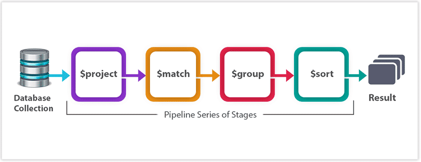

# Unidad 2

Creado: 21 de octubre de 2025 15:53


# **BBDD orientadas a documentos**

Las bases de datos orientadas a documentos presentan un modelo de datos flexible y adaptable, caracterizado por las siguientes propiedades:

- Modelado como en JSON: El formato de los datos en una base de datos orientada a documentos se asemeja a estructuras en JSON.
    
    > Su estructura es fácil de leer y escribir tanto para humanos como para máquinas, lo que lo hace muy popular en el desarrollo de aplicaciones. JSON se organiza en pares de clave-valor, donde cada clave es un texto y el valor puede ser de varios tipos, como números, cadenas, listas, o incluso objetos anidados.
    > 
- Documento como unidad completa: posee todos los atributos relevantes de esa entidad y pueden contener tanto datos estructurados como semiestructurados.
- Modelado accesible: con una estructura mas intuitiva que perminte la anidación de datos dentro del mismo documento (modelo agregado).
- Fácil Acceso a documentos: mediante una clave primaria que permite su búsqueda rápida, además se permite la creación de indices en los atributos dentro del documento para facilitar las búsquedas mas complejas o en múltiples campos
- Schemaless: no es necesario definir un esquema antes de insertar datos en la DB lo que proporciona gran flexibilidad en el escalado del modelo.

### **Rendimiento**

El rendimiento en bases de datos orientadas a documentos, como MongoDB, depende del modelo de datos y de la estructura de las consultas.

**Índices**

Los índices aceleran las búsquedas evitando escanear todos los documentos.

Es recomendable crear índices en los campos que se consultan con frecuencia.

```jsx
db.usuarios.createIndex({ edad: 1 })
```

**Modelado de datos**

Las operaciones como `$lookup` pueden ser costosas. Siempre que sea posible, conviene anidar documentos relacionados dentro de uno solo.

Ejemplo: incluir los pedidos dentro del documento del usuario en lugar de usar una colección separada.

**Búsquedas textuales**

Para consultas con texto o expresiones regulares, se recomienda usar Atlas Search o índices de texto.

Ejemplo:

```jsx
db.productos.createIndex({ nombreProducto: "text" })
```

Esto mejora el rendimiento en búsquedas parciales o por palabras clave.

**Diseño del esquema**

Evitar un número excesivo de colecciones. Controlar el tamaño de los arrays y de los documentos. Limitar el número de índices, ya que cada uno añade carga en las operaciones de escritura.

**Optimización de consultas**

Utilizar el método `explain()` para analizar el plan de ejecución de las consultas y detectar cuellos de botella.

Ejemplo:

```jsx
db.usuarios.find({ edad: { $gt: 25 } }).explain("executionStats")
```

**Caché y memoria**

MongoDB utiliza la memoria RAM como caché para almacenar los documentos e índices más accedidos. Asegurarse de disponer de suficiente memoria para evitar lecturas frecuentes desde disco.

**Sharding**

Para colecciones muy grandes, el sharding permite distribuir los datos entre varios servidores, mejorando tanto el rendimiento como la escalabilidad horizontal.

### **Índices en MongoDB**

Los índices son fundamentales para mejorar el rendimiento de las consultas, ya que permiten acceder a los datos de forma rápida evitando búsquedas secuenciales en toda la colección.

**Creación de índices**

Se utiliza el método `createIndex()` para crear un índice en el campo indicado.

Ejemplo:

```jsx
db.usuarios.createIndex({ edad: 1 })
```

**Tipos de índices en MongoDB**

- **Índices ascendentes y descendentes**
    - `{ campo: 1 }` → índice ascendente
    - `{ campo: -1 }` → índice descendente
    - Ejemplo:

```jsx
db.clientes.createIndex({ apellido: 1 })
```

**Índices de texto**

- Permiten realizar búsquedas textuales eficientes.
- Se crean con el tipo `"text"`.
- Solo puede haber un índice de texto por colección, pero puede incluir varios campos.
- Ejemplo:

```jsx
db.productos.createIndex({ descripcion: "text", nombre: "text" })
```

**Índices geoespaciales**

- Permiten consultas basadas en ubicaciones.
- Tipos:
    - `"2d"` → datos en plano.
    - `"2dsphere"` → datos en coordenadas esféricas (latitud y longitud).
- Ejemplo:

```jsx
db.restaurantes.createIndex({ ubicacion: "2dsphere" })
```

**Propiedades adicionales de los índices**

- Se puede definir un índice como único:

```jsx
db.students.createIndex({ name: 1 }, { unique: true })
```

**Gestión de índices**

- Eliminar un índice: `dropIndex()`
- Ver todos los índices de una colección: `getIndexes()`

**Buenas prácticas**

- No crear demasiados índices, ya que ralentizan las operaciones de escritura (insert, update, delete).
- Si las consultas suelen filtrar por varios campos, conviene usar **índices compuestos**.
    
    Ejemplo:
    

```jsx
db.clientes.createIndex({ apellido: 1, edad: 1 })
```

## **CRUD**

En este apartado, exploraremos el concepto CRUD, que es una de las bases fundamentales de cualquier sistema de bases de datos. CRUD es el acrónimo de Create, Read, Update y Delete (Crear o Escribir, Leer, Actualizar y Eliminar), las cuatro operaciones básicas que se pueden realizar sobre los datos en una base de datos.

### **Lectura**

**Comando `find` en MongoDB**

El comando `find` se utiliza para obtener documentos de una colección que cumplen ciertos criterios de búsqueda.Devuelve un **cursor** que permite iterar sobre los resultados. `findOne` devuelve solo el **primer documento** que cumple la condición.

**Sintaxis básica:**

```jsx
db.collection.find(<criteria>, <projection>)
db.collection.findOne(<criteria>, <projection>)
```

En **Python**, con el paquete **pymongo**, la sintaxis es similar:

```jsx
collection.find(<criteria>, <projection>)
```

**Operadores de búsqueda**

MongoDB proporciona diversos operadores para construir criterios de búsqueda complejos:

- **Comparación**: `$eq`, `$ne`, `$gt`, `$gte`, `$lt`, `$lte`, `$in`, `$nin`
- **Lógicos**: `$and`, `$or`, `$not`, `$nor`
- **Elementos**: `$exists`, `$type`
- **Evaluación**: `$regex`, `$text`, `$where`
- **Arrays**: `$all`, `$elemMatch`, `$size`

**Proyección**

La proyección permite especificar qué campos se deben incluir o excluir en los resultados:

```jsx
db.usuarios.find({}, { nombre: 1, email: 1, _id: 0 })
```

**Proyección de arrays**

Para trabajar con arrays dentro de documentos:

- `$slice`: limita el número de elementos devueltos del array
- `$elemMatch`: proyecta solo el primer elemento que cumple la condición
- `$`: proyecta el primer elemento que coincide con la consulta

Ejemplos:

```jsx
// Devolver solo los primeros 3 elementos del array
db.posts.find({}, { comentarios: { $slice: 3 } })

// Proyectar elementos que cumplen una condición
db.usuarios.find({}, { pedidos: { $elemMatch: { estado: "enviado" } } })
```

### **Escritura**

La escritura de datos en MongoDB se realiza mediante la **inserción de documentos** en una colección.

**Sintaxis básica:**

```jsx
db.collection.insertOne(<document>)
db.collection.insertMany(<array of documents>)

```

**insertOne()**

Inserta un único documento en la colección.

El documento se pasa en formato JSON válido.

**insertMany()**

Permite insertar varios documentos a la vez, pasados como un array.

**Consideraciones:**

- MongoDB genera automáticamente un identificador único (`_id`) para cada documento, aunque puede definirse manualmente.
- Si existe un esquema con validación, la inserción fallará si el documento no cumple los requisitos.

### **Actualización**

El proceso de actualización en MongoDB permite modificar uno o varios documentos dentro de una colección según los criterios especificados.

**Sintaxis:**

- `updateOne()` modifica el primer documento que cumpla con el criterio de búsqueda.
- `updateMany()` modifica todos los documentos que cumplan con el criterio de búsqueda.
- `replaceOne()` reemplaza completamente el primer documento que coincida con el criterio de búsqueda.

Otra de las diferencias entre los operadores *update* y el operador *replace* es que el primero no se ejecuta si no lleva asignados operadores de modificación, mientras que el segundo sí. Además, *update* permite el uso de *pipelines* además de los operadores de modificación.

**Operadores de modificación**

MongoDB ofrece diversos operadores para modificar documentos:

- **Campos**: `$set`, `$unset`, `$rename`, `$inc`, `$mul`, `$min`, `$max`
- **Arrays**: `$push`, `$pop`, `$pull`, `$addToSet`, `$pullAll`
- **Modificadores de arrays**: `$each`, `$position`, `$sort`, `$slice`
- **Arrays anidados**: `$[]` (todos los elementos), `$[<identifier>]` (elementos filtrados)

Ejemplos:

```jsx
// Incrementar un campo numérico
db.productos.updateOne({ _id: 1 }, { $inc: { stock: 5 } })

// Añadir elemento a un array
db.usuarios.updateOne({ _id: 1 }, { $push: { intereses: "programación" } })

// Actualizar elementos específicos de un array
db.estudiantes.updateMany(
  { "calificaciones.nota": { $lt: 5 } },
  { $set: { "calificaciones.$[elem].aprobado": false } },
  { arrayFilters: [{ "elem.nota": { $lt: 5 } }] }
)

```

**findAndModify()**

El comando **findAndModify()** permite buscar y modificar (o eliminar) un único documento y devolverlo en una sola operación.

### **Eliminación**

Las operaciones de eliminación permiten borrar documentos de una colección.

**Sintaxis:**

```jsx
db.collection.deleteOne(<criteria>)
db.collection.deleteMany(<criteria>)

```

**deleteOne()**

Elimina el primer documento que cumple con el criterio especificado.

**deleteMany()**

Elimina todos los documentos que cumplen con el criterio.

**Ejemplo:**

```jsx
// Eliminar un usuario específico
db.usuarios.deleteOne({ email: "usuario@example.com" })

// Eliminar todos los usuarios inactivos
db.usuarios.deleteMany({ activo: false })
```

**Consideraciones:**

- La eliminación es permanente y no se puede deshacer.
- Es recomendable realizar una consulta previa con `find()` para verificar qué documentos serán eliminados.
- Para eliminar todos los documentos de una colección, usar `deleteMany({})` o, más eficientemente, `drop()` para eliminar la colección completa.

## Consultas Agregadas

En el contexto de MongoDB, las **consultas agregadas** son una herramienta poderosa que permite realizar operaciones avanzadas sobre los datos, tales como filtrar, ordenar, agrupar y transformar documentos dentro de una colección. 

En una consulta agregada, cada documento pasa a través de una serie de etapas (o *stages*) en 
las que se aplican diferentes transformaciones o filtros, y el resultado final es un listado de los documentos que resultan de estas operaciones.



### Operadores y etapas del pipeline de agregación en MongoDB

- **$match:** Filtra documentos según las condiciones especificadas, funcionando de forma similar al método *find()*. Se recomienda colocarlo al inicio del pipeline para mejorar el rendimiento, ya que reduce el número de documentos que se procesarán en las etapas siguientes.
- **$lookup:** Permite realizar operaciones equivalentes a los *joins* en bases de datos relacionales, combinando documentos de diferentes colecciones según un campo común. Es útil, pero puede ser costoso en términos de rendimiento si se aplica sobre grandes volúmenes de datos.
- **$group:** Agrupa documentos en función de un campo o expresión, y permite aplicar funciones de agregación como sumas, promedios o conteos. Entre los operadores más comunes se encuentran *$sum*, *$avg*, *$first*, *$last*, *$max*, *$min*, *$push* y *$addToSet*.
- **$unwind:** Descompone los arrays contenidos en los documentos, creando un nuevo documento por cada elemento del array. Es útil para trabajar con datos anidados o listas dentro de un documento.
- **$sort:** Ordena los documentos resultantes según uno o varios campos, ya sea en orden ascendente o descendente.
- **$limit:** Restringe la cantidad de documentos devueltos por el pipeline, útil para obtener un número concreto de resultados.
- **$skip:** Omite una cantidad determinada de documentos antes de devolver los resultados. Se suele utilizar junto con *$limit* para implementar paginación.
- **$geoNear:** Permite realizar consultas geoespaciales, devolviendo documentos que se encuentran cerca de un punto geográfico específico.
- **$out:** Guarda el resultado final del pipeline en una colección. Si la colección existe, será sobrescrita; si no, se creará una nueva.
- **$project:** Permite seleccionar, excluir o transformar campos del resultado. Puede emplearse para renombrar campos, realizar cálculos o generar nuevas estructuras a partir de los datos originales.

---

### Operadores lógicos y de comparación

**Operadores lógicos:**

- *$and*: selecciona documentos que cumplen todas las condiciones.
- *$or*: selecciona documentos que cumplen al menos una condición.
- *$not*: invierte el resultado de una condición.

**Operadores de comparación:**

- *$eq*: igual a.
- *$ne*: distinto de.
- *$gt*: mayor que.
- *$gte*: mayor o igual que.
- *$lt*: menor que.
- *$lte*: menor o igual que.