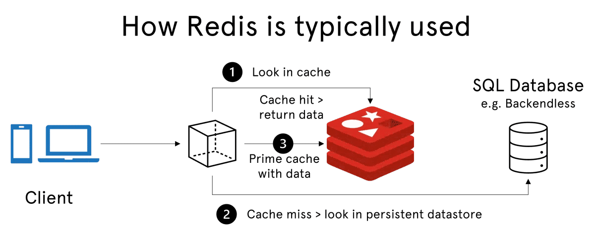

# Unidad 3

Creado: 3 de noviembre de 2025 11:16


# Bases de Datos Orientadas a Clave-Valor

Las bases de datos orientadas a clave-valor son uno de los tipos más simples y eficaces de sistemas de almacenamiento NoSQL. En este modelo, los datos se almacenan como pares de clave y valor, donde la **clave** es un identificador único que permite acceder al **valor** asociado.

> *“Este valor puede ser cualquier tipo de datos, desde cadenas de texto simples hasta objetos binarios complejos, dependiendo de la base de datos específica.”*
> 

## Redis: Base de Datos Clave-Valor



**Características principales**

- **In-Memory:**
    
    Redis almacena los datos en la **memoria RAM**, lo que permite accesos extremadamente rápidos y baja latencia.
    
    - Ideal para aplicaciones que necesitan respuestas inmediatas, como:
        - Chats en tiempo real
        - Juegos multijugador online
        - Servicios web con alto tráfico
    - **Ejemplo:** almacenar la sesión de un usuario en memoria para consultas rápidas:
        
        ```python
        clave: "ranking_juego1"
        valor: { "Usuario123": 1500, "Usuario456": 1200 }
        ```
        
- **Cache:**
    
    Redis se utiliza como **capa intermedia entre la aplicación y la base de datos principal**, guardando temporalmente datos de acceso frecuente.
    
    - Implementa algoritmos de reemplazo como **LRU (Least Recently Used)**.
    - **Ejemplo:** almacenar el resultado de una consulta frecuente a la base de datos:
        
        ```python
        clave: "top_10_productos"
        valor: "[{'id':1,'nombre':'Camiseta'},{...}]"
        ```
        
- **Pub/Sub:**
    
    Redis permite un sistema de **publicación y suscripción de mensajes**, facilitando la comunicación en tiempo real entre servicios o componentes de la aplicación.
    
    - **Ejemplo:** un canal de chat:
        
        ```python
        canal: "chat_sala1"
        mensaje: "Usuario123: Hola a todos!"
        ```
        

**Persistencia**

- Redis combina velocidad en memoria con **durabilidad opcional en disco**.
- **Modos de almacenamiento:**
    1. **Solo RAM:** acceso ultrarrápido, datos se pierden si hay fallo.
    2. **RAM + disco:** Redis guarda **snapshots** regulares en disco, equilibrando rendimiento y seguridad de datos.
- **Métodos de persistencia:**
    - **RDB (snapshots):** copias completas de la base de datos en intervalos regulares.
    - **AOF (Append Only File):** registra cada operación de escritura para reconstruir la base de datos en caso de fallo.
    
    
    
- **Ejemplo práctico:** guardar cada 5 minutos la lista de usuarios conectados:
    
    ```
    clave: "usuarios_conectados"
    valor: "[12345, 67890, 24680]"
    ```
    

**Clústeres y escalabilidad**

- Redis soporta **clústeres** para distribuir datos entre varios nodos y permitir **escalado horizontal**.
- Usa **hashing** para asignar claves a nodos, lo que permite manejar más datos que la memoria de un solo nodo.
- **Ejemplo:** en un clúster de 3 nodos, la clave `usuario:12345` puede ir al nodo 2, mientras que `producto:987` va al nodo 1.

---

**Replicación**

- Arquitectura **master-slave**:
    - Cada master tiene uno o varios slaves que replican sus datos.
    - Si el master falla, un slave puede ser promovido automáticamente.
- Beneficios:
    - **Alta disponibilidad:** la aplicación sigue funcionando aunque un nodo falle.
    - **Lecturas escalables:** los slaves pueden atender consultas de lectura, descargando al master.
    - **Tolerancia a fallos:** los datos se replican entre nodos.
- **Ejemplo:**

```python
master: "usuario:12345:session" -> slaves replican este dato
```


**Tipos de datos**

- Redis soporta varios tipos de valores asociados a claves:
    - **Strings**: cadenas o números simples
    - **Listas**: colecciones ordenadas de elementos
    - **Conjuntos (Sets)**: colecciones únicas, no ordenadas
    - **Conjuntos ordenados (Sorted Sets)**: conjuntos con puntuaciones para ordenar elementos
    - **Hashes**: estructuras tipo diccionario con campos y valores
    - **Geoespacial (Coordinates)**: almacenar ubicaciones y distancias
- **Persistencia configurable:**
    - **Persistente:** volcado regular en disco o registro de operaciones.
    - **Volátil:** solo en memoria, útil para caches temporales.
- **Ejemplo:** almacenar puntuaciones de un juego en un conjunto ordenado:
    
    ```
    clave: "ranking_juego1"
    valor: { "Usuario123": 1500, "Usuario456": 1200 }
    ```
    


**Resumen de ventajas clave**

- **In-Memory:** acceso ultrarrápido.
- **Cache:** mejora rendimiento en sistemas de alta demanda.
- **Pub/Sub:** comunicación en tiempo real entre componentes.
- **Persistencia:** opcional, asegura durabilidad de datos.
- **Clústeres:** distribución de datos y escalabilidad horizontal.
- **Replicación:** alta disponibilidad y lecturas escalables.
- **Tipos de datos flexibles:** strings, listas, conjuntos, hashes, conjuntos ordenados y geoespacial.

## Casos de uso de Redis

Redis, gracias a su **velocidad** y **almacenamiento en memoria**, es muy versátil y se puede aplicar en diferentes escenarios. Los casos de uso principales se agrupan en tres grandes áreas: **base de datos**, **caché** y **sistema de mensajería**.

### Redis como base de datos

Redis no solo actúa como cache, sino que también puede funcionar como **base de datos principal de alto rendimiento** para datos clave-valor que requieren accesos rápidos y frecuentes.

**Casos más comunes:**

- **Almacenamiento de sesiones de usuario**
    - Cada sesión se almacena en un único objeto clave-valor.
    - Permite establecer tiempos de expiración automáticos para liberar memoria.
    - **Ejemplo:**
        
        ```
        clave: "session:usuario:12345"
        valor: "{token:'abc123', login:'2025-11-03', carrito:[1,2,3]}"
        expiración: 30 min
        ```
        
- **Perfiles de usuario y preferencias**
    - Guardar configuraciones y preferencias de usuarios de manera rápida y eficiente.
    - Consultas frecuentes se realizan con **latencia mínima**, optimizando la experiencia del usuario.
    - **Ejemplo:**
        
        ```
        clave: "usuario:12345:perfil"
        valor: "{nombre:'Ismael', tema:'oscuro', idioma:'es'}"
        ```
        
- **Cesta de la compra**
    - Información sobre productos añadidos, cantidades y precios se almacena como un solo objeto.
    - Acceso rápido mientras el usuario interactúa con la cesta.
    - **Ejemplo:**
        
        ```
        clave: "carrito:usuario:12345"
        valor: "{items:[{id:1,cant:2},{id:7,cant:1}], total:59.99}"
        ```
        

### Redis como caché

Redis destaca como **caché de alto rendimiento**, almacenando datos en memoria para reducir la carga de la base de datos principal y mejorar los tiempos de respuesta.

- Soporta estructuras complejas (listas, sets, hashes) sin necesidad de serialización.
- **Casos típicos:**
    - Almacenar páginas web más visitadas.
    - Guardar resultados de consultas frecuentes a la base de datos.
- **Ejemplo:**
    
    ```
    clave: "pagina:home"
    valor: "<html>…contenido de la página…</html>"
    expiración: 5 min
    ```
    

### Redis como sistema de mensajería

Redis puede actuar como **sistema de mensajería** gracias a su arquitectura **pub/sub** y soporte de colas. Es ideal para entornos distribuidos donde se requiere comunicación rápida y eficiente entre múltiples procesos o servicios.

- **Casos típicos:**
    - Chats en tiempo real.
    - Timelines de redes sociales.
    - Intercambio de mensajes en videojuegos multijugador.
    - Sistemas de seguimiento en tiempo real.
- **Ejemplo:**
    
    ```
    canal: "chat_sala1"
    mensaje: "Usuario123: Hola a todos!"
    ```
    

### Tabla de casos:

| Área | Caso típico | Ejemplo práctico |
| --- | --- | --- |
| Base de datos | Sesiones, perfiles, cesta | `session:usuario:12345` |
| Caché | Páginas web, consultas frecuentes | `pagina:home` |
| Sistema de mensajería | Chat, timelines, colas de mensajes | `canal:chat_sala1` |

## Tipos de Datos en Redis

Redis es una base de datos **clave-valor**, pero sus valores no se limitan a strings simples: soporta estructuras más complejas que permiten manipular datos de forma eficiente y en memoria.

- Cada **clave** es única.
- Los datos pueden ser persistentes o volátiles según la configuración.

Perfecto, vamos a hacer un **resumen claro, mini por mini**, con ejemplos prácticos para cada tipo de dato de Redis. Esto va a ser **tipo apuntes rápidos** que realmente se puedan repasar sin leer las 50 páginas:

---

### Claves

- Las **claves** identifican de manera única cada valor.
- Son **strings** y distinguen mayúsculas/minúsculas.
- Se pueden usar **para organizar datos**, establecer expiraciones o aplicar operaciones de gestión.
- **Ejemplo:**

```
clave: "usuario:12345"
valor: "Ismael Hernández"
```

- Se puede establecer expiración: `EXPIRE usuario:12345 3600` → caduca en 1 hora.

---

### Cadenas (Strings)

- Valores **simples** de texto o números.
- Soporta hasta **512 MB por clave**.
- Operaciones típicas: obtener, modificar, incrementar, concatenar.
- **Ejemplo:**

```
SET contador 10
INCR contador  → ahora contador = 11
SET mensaje "Hola Mundo"
```

---

### Listas (Lists)

- Colecciones **ordenadas de strings**, tipo **array o cola**.
- Permite insertar o sacar elementos por **inicio o fin** (`LPUSH`, `RPUSH`, `LPOP`, `RPOP`).
- Muy útil para colas, logs o feeds.
- **Ejemplo:**

```
RPUSH tareas "tarea1" "tarea2"
LPUSH tareas "urgente"
LPOP tareas → devuelve "urgente"
```

---

### Tablas hash (Hashes)

- Tipo **diccionario o mapa**, con campos y valores.
- Ideal para almacenar objetos con propiedades (perfiles de usuario, configuraciones).
- **Ejemplo:**

```
HSET usuario:12345 nombre "Ismael" edad 28
HGET usuario:12345 nombre → "Ismael"
HGETALL usuario:12345 → {nombre:"Ismael", edad:28}
```

---

### Sets (Conjuntos)

- Colección de **elementos únicos y no ordenados**.
- Operaciones: añadir, eliminar, verificar existencia, intersección, unión.
- Útil para seguidores, etiquetas, categorías.
- **Ejemplo:**

```
SADD amigos:12345 "Ana" "Luis" "Pedro"
SADD amigos:12345 "Ana" → no se repite
SISMEMBER amigos:12345 "Luis" → true
SMEMBERS amigos:12345 → ["Ana","Luis","Pedro"]
```

---

### Sorted Sets (Conjuntos ordenados)

- Colección de elementos únicos con **una puntuación (score)**.
- Permite ordenar y recuperar rangos por puntuación.
- Ideal para rankings, puntuaciones de juegos, feeds ordenados.
- **Ejemplo:**

```
ZADD ranking 1500 "Usuario123"
ZADD ranking 1200 "Usuario456"
ZRANGE ranking 0 -1 WITHSCORES → ["Usuario456",1200,"Usuario123",1500]
```

---

### Bits

- Redis permite **manipular bits individuales dentro de un string**, útil para flags o contadores binarios.
- Operaciones: `SETBIT`, `GETBIT`, `BITCOUNT`.
- **Ejemplo:**

```
SETBIT usuario:12345:flags 0 1 → marca flag 0 como activo
GETBIT usuario:12345:flags 0 → 1
BITCOUNT usuario:12345:flags → número de bits activados
```

---

### Iteradores

- Redis ofrece comandos como **SCAN, HSCAN, SSCAN, ZSCAN** para iterar sobre grandes conjuntos de datos sin bloquear el servidor.
- Útil cuando hay muchos elementos y no se puede usar `KEYS` (que es costoso).
- **Ejemplo:**

```
SCAN 0 MATCH usuario:* COUNT 100
HSCAN usuario:12345 0
```

- Devuelve elementos en bloques, permitiendo procesar grandes datasets de manera eficiente.

---

| Tipo de dato | Explicación | Ejemplo rápido |
| --- | --- | --- |
| **Clave (Key)** | Identifica de forma única un valor. Puede expirar. | `SET usuario:12345 "Ismael"` |
| **String** | Valor simple de texto o número, hasta 512 MB. | `SET contador 10 → INCR contador` |
| **List** | Colección ordenada de strings, tipo cola/pila. | `RPUSH tareas "tarea1" → LPOP tareas` |
| **Hash** | Diccionario con campos y valores. Ideal para objetos. | `HSET usuario:12345 nombre "Ismael"` |
| **Set** | Conjunto de elementos únicos y no ordenados. | `SADD amigos:12345 "Ana"` |
| **Sorted Set** | Conjunto único con puntuaciones, ordenado por score. | `ZADD ranking 1500 "Usuario123"` |
| **Bit** | Manipulación de bits dentro de un string. | `SETBIT flags 0 1 → GETBIT flags 0` |
| **Iteradores** | SCAN/HSCAN/SSCAN/ZSCAN permiten recorrer grandes colecciones sin bloquear. | `SCAN 0 MATCH usuario:* COUNT 100` |

## Otras Características y Comandos

Entre ellas, se destacan el **pipelining**, que reduce la latencia al enviar varios comandos simultáneamente; y las **transacciones**, que garantizan la ejecución atómica de conjuntos de comandos, evitando errores intermedios. Además, Redis ofrece un sistema de **publicación y suscripción** (Pub/Sub), útil para aplicaciones de mensajería en tiempo real, como chats y notificaciones, y capacidades de **caché** con políticas de desalojo para gestionar eficientemente la memoria.

> *“Estas herramientas avanzadas permiten a Redis funcionar como algo más que una base de datos clave-valor, facilitando la creación de soluciones flexibles y de alto rendimiento para aplicaciones de tiempo real.”*
> 

### Pipelining

- **Qué es:**
    
    Pipelining permite enviar **varias operaciones al servidor Redis de manera consecutiva sin esperar la respuesta de cada una**. Redis ejecuta todas las operaciones y devuelve las respuestas juntas. Esto reduce significativamente la **latencia de red**, especialmente cuando se realizan muchas operaciones.
    
- **Cómo funciona:**
    - Normalmente, cada comando envía una petición y espera la respuesta.
    - Con pipelining, se agrupan varios comandos y se envían de golpe, recibiendo todas las respuestas a la vez.
- **Cuándo usarlo:**
    - Insertar o actualizar grandes volúmenes de datos.
    - Operaciones repetitivas donde la latencia de red sería significativa.
    - Ejemplos: actualizar contadores, agregar usuarios, registrar logs masivos.
- **Ejemplo práctico (Python):**

```python
import redis
r = redis.Redis(host='localhost', port=6379)

pipe = r.pipeline()
for i in range(1, 6):
    pipe.set(f'usuario:{i}', f'Usuario{i}')
pipe.execute()  # Envía todas las operaciones juntas

```

- **Beneficio:** Mejor rendimiento al evitar múltiples viajes de ida y vuelta entre cliente y servidor.

---

### Transacciones

- **Qué es:**
    
    Las transacciones en Redis permiten ejecutar un **grupo de operaciones de manera atómica**. Todas las operaciones incluidas se ejecutan juntas o ninguna se ejecuta. Esto se logra con los comandos `MULTI` y `EXEC`.
    
- **Cómo funciona:**
    - `MULTI`: inicia la transacción.
    - Comandos intermedios: se encolan y no se ejecutan inmediatamente.
    - `EXEC`: ejecuta todos los comandos en la transacción de forma atómica.
    - `WATCH`: permite supervisar claves y abortar la transacción si cambian, evitando inconsistencias.
- **Cuándo usarlo:**
    - Transferencias de dinero entre cuentas.
    - Modificación de varios campos relacionados.
    - Situaciones donde la consistencia de datos es crítica.
- **Ejemplo práctico:**

```
# Transferir saldo de una cuenta a otra
WATCH saldo:cuenta1 saldo:cuenta2
MULTI
DECR saldo:cuenta1 100
INCR saldo:cuenta2 100
EXEC

```

- Si otra conexión cambia alguno de los saldos mientras tanto, la transacción se cancela y se puede reintentar.

---

### Publicación y suscripción (Pub/Sub)

- **Qué es:**
    
    Redis permite un sistema de **mensajería en tiempo real** mediante canales.
    
    - Los **publishers** envían mensajes a un canal.
    - Los **subscribers** se suscriben a los canales y reciben los mensajes inmediatamente.
- **Cómo funciona:**
    - Los canales actúan como **colas de distribución**.
    - Redis entrega los mensajes a todos los subscribers del canal de manera instantánea.
- **Cuándo usarlo:**
    - Chats y notificaciones en tiempo real.
    - Feeds sociales que deben actualizarse inmediatamente.
    - Juegos multijugador o sistemas de seguimiento en tiempo real.
- **Ejemplo práctico:**

```
# Publisher
PUBLISH chat_sala1 "Usuario123 se ha unido al chat"

# Subscriber
SUBSCRIBE chat_sala1
# Recibe automáticamente: "Usuario123 se ha unido al chat"

```

- **Beneficio:**
    
    Facilita la **comunicación en tiempo real** entre múltiples servicios sin necesidad de bases de datos adicionales o polling constante.
    

---

### Caché

- **Qué es:**
    
    Redis se utiliza como **capa de cache** para almacenar temporalmente datos en memoria, acelerando el acceso y reduciendo la carga sobre la base de datos principal.
    
- **Cómo funciona:**
    - Datos frecuentemente consultados se guardan en memoria RAM.
    - Redis puede establecer expiración automática (`TTL`) para que los datos caducados se eliminen y la memoria se libere.
    - Soporta **estructuras complejas** como listas, hashes o sets, sin necesidad de serializar.
- **Cuándo usarlo:**
    - Almacenar resultados de consultas costosas.
    - Páginas web o APIs con alto tráfico.
    - Datos de sesión o preferencias de usuario.
- **Ejemplo práctico:**

```
# Guardar página web en cache por 5 minutos
SETEX pagina:home 300 "<html>…contenido de la página…</html>"

# Recuperar datos rápidamente
GET pagina:home

```

- **Beneficio:**
    - Mejora el rendimiento y reduce la latencia.
    - Disminuye la carga de la base de datos principal.
    - Escalabilidad en aplicaciones de alta demanda.

---