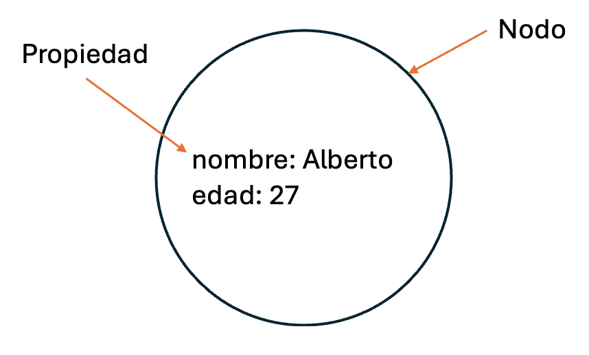

# Unidad 4

Creado: 17 de diciembre de 2025 20:53


# Bases de Datos Orientadas a Grafos

Las bases de datos orientadas a grafos son un modelo de almacenamiento de información que utiliza grafos como estructura principal para representar datos y sus relaciones. En este modelo, la información se organiza en tres componentes principales:

- Nodos: Los nodos representan entidades o "puntos de datos" dentro de la base de datos, como personas, ubicaciones, o productos. Cada nodo puede almacenar atributos específicos (propiedades) que proporcionan detalles sobre la entidad, como el nombre o la fecha de creación.
- Aristas: Las aristas (o relaciones) conectan nodos, representando la manera en que estos se relacionan entre sí. A diferencia de otros modelos de bases de datos, las aristas en una base de datos orientada a grafos pueden tener dirección (de un nodo a otro) y también pueden contener propiedades propias.
- Propiedades: Tanto nodos como aristas pueden almacenar propiedades adicionales que añaden contexto a la información.

Este modelo permite describir **patrones complejos** de relaciones entre entidades, de una forma intuitiva y estructurada, **similar a cómo las personas naturalmente asocian y organizan la información**. 

## Elementos

**Nodo y propiedades**

En  una base de datos orientada a grafos, los nodos son los componentes fundamentales que representan entidades específicas dentro del grafo. Cada nodo actúa como un "contenedor" de información para una entidad, como una persona, producto, lugar, o cualquier otro tipo de objeto que deseemos modelar.

Los nodos no solo existen de forma aislada, sino que se caracterizan por contener un conjunto de **propiedades** que proporcionan detalles adicionales sobre la entidad que representan. Estas propiedades son similares a los campos de una tabla en una base de datos relacional y pueden incluir distintos tipos de información dependiendo de la naturaleza de la entidad. 

Por ejemplo:

- En un nodo que representa a una persona, las propiedades podrían ser nombre, edad y ubicación.
- En un nodo que representa a un producto, podrían incluir nombre, precio y categoría.

Cada propiedad se almacena en pares **clave-valor**, donde la clave es el nombre de la propiedad y el valor es el dato asociado a esa clave. Esto permite que cada nodo tenga su propia estructura flexible de información, adaptándose a las necesidades de la entidad que representa.

Esta capacidad de almacenar propiedades adicionales en los nodos es uno de los elementos clave que hace que las bases de datos orientadas a grafos sean tan flexibles y adecuadas para modelar datos complejos.



### **Etiquetas**

En las bases de datos orientadas a grafos, los nodos pueden ser clasificados mediante etiquetas, que actúan como una forma de agrupar nodos en categorías o conjuntos específicos. Cada nodo puede tener cero, una o múltiples etiquetas, que pueden añadirse o eliminarse dinámicamente durante el tiempo de ejecución. Las etiquetas ayudan a organizar los nodos y permiten realizar consultas de manera más eficiente.

Por ejemplo, si tenemos nodos que representan personas y perros, podríamos utilizar las etiquetas Personas y Perros para agrupar cada tipo de nodo:


- Un nodo con la etiqueta Personas podría representar a un usuario llamado "Pepe" o "Juan".
    
    Personas = {Pepe, Juan}
    
- Un nodo con la etiqueta Perros podría representar a un perro llamado "Goofy".
    
    Perros = {Goofy}
    

Las etiquetas permiten realizar consultas más precisas, seleccionando solo aquellos nodos que pertenecen a un conjunto específico. 

Esto facilita la búsqueda y clasificación de nodos, ya que podemos filtrar por etiquetas en lugar de revisar todos los nodos del grafo. 

### **Relaciones**

En una base de datos orientada a grafos, las relaciones son un tipo de elemento esencial que conecta los nodos, formando así las aristas del grafo. Estas relaciones no solo representan el vínculo entre dos entidades, sino que también aportan contexto adicional sobre la naturaleza de esa conexión. 

Las principales características de las relaciones en un grafo son:

- Dirección: Las relaciones en un grafo son direccionales, es decir, tienen un punto de inicio y un punto de destino. Esto permite modelar conexiones que siguen una secuencia o una jerarquía, como una relación de "sigue a" entre usuarios de una red social o una "ruta de transporte" entre dos ubicaciones.
- Tipo de relación: Cada relación tiene un tipo que define su significado. Los tipos de relaciones permiten especificar la naturaleza del vínculo entre nodos, como "amigo de", "trabaja en", o "compró". Esto permite que el grafo capture no solo las conexiones, sino también la intención de cada vínculo.
- Propiedades de las relaciones: Al igual que los nodos, las relaciones pueden tener propiedades que añaden detalles adicionales. Por ejemplo, una relación de "amistad" entre dos personas puede incluir propiedades como el nivel de confianza. Estas propiedades enriquecen la información de la relación, permitiendo análisis más detallados y precisos.

Las relaciones en grafos permiten modelar complejas redes de interacciones de manera eficiente, y su capacidad para almacenar propiedades y direcciones hace que las bases de datos de grafos sean particularmente útiles en aplicaciones donde las conexiones entre datos son fundamentales, como análisis de redes, genealogía o recomendaciones.

### **Propiedades**


En las bases de datos orientadas a grafos, tanto los nodos como las relaciones pueden almacenar información adicional mediante propiedades, las cuales se representan como pares clave-valor. Estas propiedades permiten capturar detalles específicos de cada entidad (nodo) o conexión (relación), enriqueciendo la información almacenada en el grafo y haciendo posible realizar consultas más precisas y completas.

- Las claves en las propiedades son cadenas de texto que actúan como identificadores para cada valor almacenado. Por ejemplo, un nodo que representa una persona podría tener propiedades con claves como nombre, edad, y ubicación.
- Los valores asociados a cada clave pueden ser de varios tipos, lo que permite almacenar datos variados. Los tipos de valores admitidos incluyen:
    - **Números:** enteros o decimales, útiles para propiedades como edad, precio o puntuación.
    - **Cadenas de texto:** valores de texto como nombres, descripciones o direcciones.
    - **Booleanos:** valores de verdadero/falso, que pueden indicar, por ejemplo, si un nodo está activo.
    - **Colecciones:** conjuntos de valores como listas de números, cadenas de texto o
    booleanos, que permiten almacenar múltiples valores en una sola
    propiedad, como una lista de etiquetas o categorías.

La flexibilidad en el tipo de datos que se puede almacenar como valor permite modelar información compleja de manera eficaz en los grafos. Estas propiedades no solo mejoran la precisión de las consultas, sino que también permiten un análisis más detallado de las entidades y sus conexiones.

# Consultas

Las consultas en Neo4j se estructuran en torno al recorrido (traversal) de los grafos, navegando entre nodos y relaciones para localizar patrones específicos de interés. Este proceso permite definir caminos (paths), que son secuencias de nodos y relaciones que cumplen con ciertos 
criterios.

### **Traversal (recorrido)**

En Neo4j, el ***Traversal*** (o recorrido) es la forma en que se realizan consultas en la base de 
datos, explorando los nodos y relaciones según las reglas especificadas en la consulta. Este tipo de búsqueda permite navegar de un nodo a otro a través de sus conexiones, lo cual es fundamental para encontrar patrones y responder a preguntas complejas basadas en relaciones.

Para facilitar la creación de consultas, Neo4j utiliza un lenguaje llamado **Cypher** el cual está diseñado específicamente para realizar consultas en grafos de forma intuitiva y concisa, lo que permite expresar de manera clara consultas complejas que involucran múltiples relaciones. 

Al realizar un recorrido en Neo4j:

- Un nodo puede ser visitado varias veces a lo largo de la consulta, lo que permite regresar a él si forma parte de diferentes caminos dentro delgrafo.
- Una relación solopuede ser recorrida una vez durante un recorrido, lo cual asegura que cada conexión se explore sin repetición, optimizando el proceso de consulta y evitando redundancias en los resultados.

Esta capacidad para navegar a través de los grafos con flexibilidad y eficiencia es una de las principales ventajas de las bases de datos de grafos y hace que Neo4j sea ideal para aplicaciones que dependen de conexiones complejas, como recomendaciones, redes sociales y análisis de  redes.

### **Path (camino)**


En Neo4j, el término **path** (camino) hace referencia al resultado de una consulta realizada sobre 
el grafo. Un camino es la secuencia de nodos y relaciones que conecta un nodo de inicio con uno o varios nodos objetivo, cumpliendo con las restricciones y criterios especificados en la consulta.

El concepto de *path* permite a Neo4j estructurar los resultados en términos de conexiones, 
mostrando no solo los nodos individuales, sino también las rutas específicas que los interconectan. 

Los *paths* resultantes de una consulta se pueden visualizar en Neo4j como un grafo conectado, lo que facilita la interpretación y exploración de los datos directamente en la interfaz visual de Neo4j.

# Cypher

Cypher es un lenguaje de consulta declarativo, similar a SQL pero diseñado para bases de datos de grafos como Neo4j, que permite modelar, crear y consultar datos estructurados en nodos y relaciones de forma muy visual e intuitiva, usando una sintaxis que parece arte ASCII para representar patrones en el grafo.

## Nodos

En cypher los nodos se representan mediante paréntesis ( ), y se pueden describir de diversas maneras para agregar detalles sobre la entidad que representan, como un identificador, etiquetas y propiedades. La estructura básica de un nodo en Cypher puede tomar las siguientes formas:

- **( ):** representación básica de un nodo sin identificar.
- **(identificador):** nodo con un identificador, que facilita su referencia en consultas posteriores.
- **(:etiqueta):** nodo que incluye una etiqueta para clasificar el tipo de entidad que representa (por ejemplo, :persona).
- **(identificador:etiqueta):** nodo con identificador y etiqueta, como (a:persona), lo que permite identificar tanto su tipo como su función en la consulta.
- **(identificador:etiqueta {propiedad:valor}):** nodo que incluye propiedades específicas en formato de pares clave-valor, como (a:persona {nombre: "Pepe", edad: 21}).
- **(identificador:etiqueta WHERE ...):** nodo que añade una condición WHERE para filtrar por una propiedad
específica, como (a:persona WHERE a.nombre="Pepe" AND a.edad=21).

```bash
(a:persona {nombre: "Pepe", edad: 21}) 
```

## Relaciones

En Cypher, las relaciones entre nodos se representan con flechas y corchetes, y se pueden detallar con identificadores, etiquetas y propiedades. La dirección de la relación, representada por las flechas (-->, --, <--), permite definir la conexión entre los nodos y especificar si es unidireccional o bidireccional. La sintaxis para expresar relaciones en Cypher incluye varios niveles de detalle:

- **->:** representa una relación básica sin identificar entre dos nodos en una dirección específica.
- **[identificador]->:** una relación con un identificador que facilita hacer referencia a la conexión en la consulta.
- **[:etiqueta]->:** una relación etiquetada que especifica el tipo de conexión (por ejemplo, amigo, trabaja_en).
- **[identificador:etiqueta]->:** relación con un identificador y una etiqueta para mayor precisión.
- **[identificador:etiqueta {propiedad:valor}]->:** relación con identificador, etiqueta y propiedades en formato clave-valor. Por
ejemplo, una relación de "amigo" con una propiedad durante: 5, que
podría indicar que dos personas han sido amigas durante cinco años.
- **[identificador:etiqueta WHERE ...]->:** relación con una condición WHERE para filtrar por una propiedad
específica. Esto permite hacer consultas que seleccionen relaciones con
ciertas características, como una duración mínima.

```bash
-[r:amigo {durante: 5}]-> 
# relacion entre dos nodeos etiqueta como amigo 
```

## Patrón

Un **patrón** en Cypher representa una estructura de **nodos y relaciones** en un grafo, usada para buscar combinaciones de datos que cumplan ciertos criterios. Son esenciales para identificar redes, asociaciones y secuencias específicas.

**Elementos de un patrón:**

- **Nodos:** definidos con un identificador, etiqueta y/o propiedades.
    
    Ejemplo: `(p:persona {nombre: "Pepe", edad: 21})`
    
- **Relaciones:** conectan nodos de forma direccional o bidireccional, con etiquetas y propiedades.
    
    Ejemplo: `-[r:amigo {desde: 2013}]->`
    

**Ejemplo de patrón de amistad:**

```
(p:persona {nombre: "Pepe", edad: 21}) -[r:amigo {desde: 2013}]-> (j:persona {nombre: "Juan", edad: 23})
```

Este patrón indica que Pepe es amigo de Juan desde 2013.

**Asignación a identificador:**

Los patrones pueden guardarse en un identificador para reutilización:

```
mejor_amigo = (:persona {nombre: "Pepe", edad: 21}) -[:amigo {desde: 2013}]-> (:persona {nombre: "Juan", edad: 23})
```

**Formas de patrones en Cypher:**

- `(n)` → cualquier nodo.
- `(a)-->(b)` → conexión unidireccional.
- `(a)--(b)-[r:REL_TYPE]->()` → relación etiquetada.
- `(a)-[r:TYPE_1|TYPE_2]->()` → relación de varios tipos posibles.

**Caminos y repeticiones:**

- Longitud fija: `(a)-[*2]->(b)`
- Longitud variable: `(a)-[*2..5]->(b)`
- Cualquier longitud: `(a)-[*]->(c)`

**Operadores de iteración:**

- → al menos 1
- `n` → exactamente n
- `m..n` → entre m y n
- `m..` → m o más
- `..n` → entre 1 y n

**Repetición de patrones:**

- `(a)-[r]->(b){2}` → la relación se repite 2 veces.

**Formas canónicas de repetición:**

| Variante | Forma | Descripción |
| --- | --- | --- |
| `{m,n}` | `{m,n}` | Entre m y n iteraciones |
| `+` | `{1,}` | Al menos 1 iteración |
| `*` | `{0,}` | Cero o más iteraciones |
| `{n}` | `{n,n}` | Exactamente n iteraciones |
| `{m,}` | `{m,}` | m o más iteraciones |
| `{,n}` | `{0,n}` | Entre 0 y n iteraciones |
| `{,}` | `{0,}` | Cero o más iteraciones |

## **Consultas**

En Cypher, el comando **RETURN** define la salida que se espera obtener de una consulta, especificando los elementos, propiedades o expresiones que deben ser devueltos al finalizar la búsqueda. RETURN es un comando versátil que permite controlar qué información se muestra de los nodos, relaciones o propiedades seleccionadas. Aquí están las principales opciones y configuraciones que permite el uso de RETURN en Neo4j:

- **Identificador**: Permite devolver un nodo, relación o propiedad específica de la consulta. Utilizar un identificador facilita seleccionar partes específicas de la información encontrada:
    - **Nodo**: RETURN nodo devuelve el nodo completo.
    - **Relación:** RETURN relacion devuelve la relación completa.
    - **Propiedad**: RETURN identificador.propiedad devuelve solo una propiedad específica,
    por ejemplo, RETURN persona.nombre para obtener solo el nombre de cada
    nodo de tipo persona.
- **Todos los elementos**: Para devolver todos los elementos (nodos, relaciones y propiedades) encontrados en la consulta, se utiliza:
    - RETURN *
- **Resultados únicos:** Cypher  permite eliminar duplicados de los resultados con DISTINCT, lo cual es útil cuando se busca obtener una lista de valores únicos.
    - RETURN DISTINCT identificador[.propiedad]
- **Evaluación de expresiones**: RETURN también permite calcular y mostrar expresiones en lugar de solo 
devolver propiedades directamente. Por ejemplo, se pueden hacer cálculos
 o filtros adicionales como RETURN persona.edad > 30 para listar las 
personas mayores de 30 años.
    - RETURN expresión

RETURN es fundamental en Cypher para personalizar y refinar los datos que se obtienen en una consulta, permitiendo extraer solo la información necesaria y en el formato deseado.

## **Consultas de escritura básicas en Cypher – CREATE**

- El comando **CREATE** se usa para **añadir nodos, relaciones o patrones completos** al grafo en Neo4j.
- Permite construir desde nodos individuales hasta redes complejas de relaciones.
- **Sintaxis básica:**

```
CREATE patrón
[RETURN identificador]
```

- `patrón`: nodo o relación a crear.
- `RETURN`: opcional, muestra el identificador recién creado.

**Ejemplos:**

1. Crear un nodo:

```
CREATE (p:persona {nombre: "Pepe", edad: 21})
RETURN p
```

Crea un nodo `persona` con propiedades `nombre` y `edad` y devuelve el nodo.

1. Crear nodos y una relación:

```
CREATE (:persona {nombre: "Pepe", edad: 21})-[:amigo {desde: 2013}]->(:persona {nombre: "Juan", edad: 23})
```

Crea dos nodos `persona` y una relación `amigo` entre ellos (sin RETURN).

- **CREATE** permite definir **propiedades en nodos y relaciones** en una sola instrucción, ideal para inicializar el grafo o construir subredes complejas.

## Consultas de lectura

En Cypher, las consultas de lectura se realizan utilizando los comandos MATCH, OPTIONAL MATCH y WHERE, que permiten buscar y recuperar información específica de los grafos en Neo4j de acuerdo con patrones y condiciones.

- **Match**: Este comando es fundamental para realizar consultas en Neo4j, ya que permite buscar nodos y relaciones que coincidan con un patrón determinado. MATCH selecciona elementos del grafo que cumplen con las condiciones especificadas y se utiliza comúnmente junto con RETURN para definir qué información debe devolverse.
- **Optional Match:** se usa cuando queremos incluir patrones adicionales en una consulta, pero no queremos que su ausencia excluya un resultado. En otras palabras, si no se encuentra coincidencia con el patrón adicional, en lugar de omitir la fila, se devolverá null para esa parte de la consulta.
- **Where**:  añade condiciones a los patrones de consulta en Cypher, filtrando nodos o relaciones en función de propiedades, patrones específicos, o incluso expresiones regulares y colecciones.

## **Consultas de escritura avanzadas**

En Cypher es posible crear o asegurar la existencia de patrones en el grafo basándose en patrones ya existentes. Los comandos MATCH CREATE y MERGE son útiles para mantener y actualizar datos en Neo4j de manera flexible y controlada.

- **Match Create**: El comando MATCH CREATE permite crear nuevos patrones basados en nodos y relaciones que ya existen en el grafo. Primero se utiliza MATCH para identificar nodos o relaciones que coincidan con el patrón existente y, luego, CREATE para añadir nuevos elementos a ese patrón.
- **Merge**: asegura que un patrón exista en el grafo; si el patrón no existe, lo crea. Esto es útil para evitar duplicaciones, ya que, si el patrón está presente, se omite el paso de creación. MERGE es especialmente valioso cuando se trabaja con datos que deben estar presentes solo una vez en el grafo.
- **Match Merge**: El comando MATCH MERGE permite crear o asegurar la existencia de patrones a partir de nodos y relaciones existentes. Similar a MATCH CREATE, MATCH MERGE garantiza que la relación especificada esté presente entre dos nodos.

## Comandos para consultas de lectura

En Cypher, se pueden utilizar cláusulas como ORDER BY, LIMIT y SKIP en consultas de lectura para controlar la forma en que se presentan los resultados, permitiendo ordenar, limitar y ajustar el punto de inicio en los resultados devueltos.

- Order by: La cláusula ORDER BY permite especificar el orden en el que se presentan los resultados de una consulta. Se pueden ordenar los resultados en orden ascendente o descendente según el valor de una propiedad específica de un nodo o relación.
- Limit: La cláusula LIMIT limita la cantidad de resultados que se muestran al usuario, mostrando solo el número de elementos especificado.
- Skip: La cláusula SKIP permite omitir un número determinado de resultados al inicio de una consulta, comenzando a mostrar los resultados desde la posición especificada.

## **Agregación en Cypher**

Las funciones de agregación permiten **resumir y analizar datos** en Neo4j, como contar, sumar, promediar, agrupar o crear listas de valores.

**Principales funciones:**

| Función | Descripción |
| --- | --- |
| `count(*)` | Cuenta todas las filas |
| `count(identificador)` | Cuenta elementos no nulos de un identificador |
| `sum(identificador)` | Suma los valores |
| `avg(identificador)` | Calcula el promedio |
| `max(identificador)` | Valor máximo |
| `min(identificador)` | Valor mínimo |
| `collect(identificador)` | Crea una colección/lista de valores |
| `DISTINCT identificador` | Elimina duplicados |

**Ejemplos:**

- Contar todas las relaciones:

```
MATCH (p)-[r]->(s)
RETURN count(*)
```

- Obtener edades de todas las personas:

```
MATCH (p:persona)
RETURN collect(p.edad)
```

- Obtener edades únicas:

```
MATCH (p:persona)
RETURN collect(DISTINCT p.edad)
```

- Agrupar por tipo de relación y contar:

```
MATCH (p)-[r]->(s)
RETURN type(r), count(*)
```

Las funciones de agregación permiten **resumir datos, eliminar duplicados y analizar estadísticas** de manera sencilla en consultas Cypher.

---

## **Consultas de lectura avanzadas en Cypher**

Cypher ofrece herramientas para **gestionar resultados complejos** y combinar conjuntos de datos: **WITH**, **UNWIND** y **UNION**.

**1. WITH**

- Permite **pasar resultados de una etapa de la consulta a otra**, renombrar columnas y aplicar agregaciones parciales.
- Sintaxis:

```
WITH identificadores [AS alias]
WITH función AS alias
```

- Ejemplo:

```
MATCH (p:persona)
WITH collect(p) AS personas
RETURN personas
```

Agrupa todos los nodos `persona` en una colección y la pasa a la siguiente etapa.

**2. UNWIND**

- Convierte una **colección en múltiples filas individuales**, útil para procesar cada elemento por separado.
- Sintaxis:

```
UNWIND colección AS iterador
```

- Ejemplos:

```
UNWIND [1,2,3,4] AS numero
RETURN numero
```

Devuelve cada número en una fila.

Eliminar duplicados:

```
UNWIND [1,1,2,3,4,4] AS numero
WITH DISTINCT numero
RETURN collect(numero) AS conjunto
```

Expande la lista, elimina duplicados y la vuelve a agrupar.

**3. UNION**

- Combina resultados de varias consultas.
- Tipos:
    - `UNION ALL` → incluye duplicados.
    - `UNION` → elimina duplicados.
- Ejemplo:

```
MATCH (n:persona)
RETURN n.nombre AS nombre
UNION
MATCH (n:animal)
RETURN n.nombre AS nombre

```

Combina nombres de `persona` y `animal`, eliminando duplicados.

Estas herramientas permiten **consultas más versátiles**, gestionar colecciones y combinar resultados de forma eficiente en Neo4j.

---

## **Funciones en consultas de lectura en Cypher**

Cypher ofrece funciones avanzadas para trabajar con datos en Neo4j: **predicados, escalares, colecciones y operaciones matemáticas/cadenas**.

### Predicados (booleanos)

Permiten verificar condiciones sobre colecciones o propiedades:

- `ALL`: todos los elementos cumplen la condición.
- `ANY`: al menos un elemento cumple la condición.
- `NONE`: ninguno cumple la condición.
- `SINGLE`: solo un elemento cumple la condición.
- `EXISTS`: verifica si un patrón o propiedad existe.

**Ejemplo:**

```
MATCH relación = ()-[r:amigo]-()
WHERE all(n IN nodes(relación) WHERE n.edad > 18)
RETURN relación
```

### Funciones escalares

Devuelven un **solo valor**:

- `length(path)`: longitud de un camino.
- `size(lista o cadena)`: tamaño de lista o cadena.
- `type(rel)`: tipo de relación.
- `head / last`: primer o último elemento de una colección.
- `timestamp()`: tiempo actual.
- `toInt / toFloat / toString`: conversiones de tipo.
- `startNode / endNode`: nodo inicial o final de una relación.
- `coalesce`: primer valor no nulo.
- `elementId`: ID de nodo o relación.
- `properties(nodo/relación)`: obtiene propiedades.

### Funciones de colección

Operan sobre listas, caminos y propiedades:

- `nodes(path)`: devuelve todos los nodos de un camino.
- `relationships(path)`: devuelve todas las relaciones de un camino.
- `labels(nodo)`: lista de etiquetas de un nodo.
- `keys(nodo/relación)`: lista de claves de propiedades.
- `reduce`: aplica una operación acumulativa sobre una colección.
- `tail`: todos los elementos excepto el primero.
- `range(start, end, step)`: genera una colección de números.

**Ejemplo:**

```
UNWIND [1,2,3,4,5] AS numero
RETURN sum(numero) AS total_suma, collect(numero) AS numeros
```

Calcula la suma total y crea una colección de los números.

### Otras funciones

- **Matemáticas y numéricas:** [Enlace oficial](https://neo4j.com/docs/cypher-manual/current/functions/mathematical-numeric/)
- **Cadenas:** [Enlace oficial](https://neo4j.com/docs/cypher-manual/current/functions/string/)
- **Funciones generales:** [Enlace oficial](https://neo4j.com/docs/cypher-manual/current/functions/)

---

## **Consultas de actualización en Cypher**

Permiten **modificar etiquetas, propiedades de nodos y relaciones**, y gestionar datos de forma dinámica. Los principales comandos son **SET** y **FOREACH**.

### SET

Se utiliza para **añadir/modificar/eliminar etiquetas y propiedades**.

**Actualizar etiquetas y propiedades:**

```
MATCH (a:persona {nombre: "Pepe"})
SET a:extraterrestre:Marte       // Añade etiquetas

MATCH (a:persona {nombre: "Pepe"})
SET a.nombre = "Juan", a.edad = 29  // Modifica propiedades

MATCH (a:persona {nombre: "Pepe"})
SET a.nombre = NULL                // Elimina propiedad

MATCH (a:persona {nombre: "Pepe"})
SET a = {}                         // Borra todas las propiedades
```

**Copiar propiedades entre nodos:**

```
MATCH (a:persona {nombre: "Pepe"}), (b:persona {nombre: "Juan"})
SET a = properties(b)               // Copia todas las propiedades de b a a
```

**Añadir o reemplazar propiedades mediante mapas:**

- Añadir sin eliminar existentes:

```
MATCH (a:persona {nombre: "Pepe"})
SET a += {altura: 1.80, peso: 75}
```

- Reemplazar todas las propiedades:

```
map = {altura: 1.80, peso: 75}
MATCH (a:persona {nombre: "Pepe"})
SET a = $map
```

### FOREACH

Permite **iterar sobre colecciones** y aplicar operaciones en cada elemento.

```
MATCH c = (:persona)-[*]-(:persona)
FOREACH (n IN nodes(c) | SET n :adulto)
```

Ejemplo: añade la etiqueta `adulto` a todos los nodos en una ruta entre personas.

---

## **Consultas de eliminación en Cypher**

Las consultas de eliminación permiten **borrar nodos, relaciones o propiedades** dentro de un grafo Neo4j. Los comandos principales son **DELETE** y **REMOVE**.

### DELETE

Se usa para **eliminar nodos o relaciones completas**.

- Sintaxis:

```
MATCH patrón
DELETE identificador
```

- Ejemplos:

```
// Eliminar un nodo
MATCH (a:persona {nombre: "Pepe"})
DELETE a

// Eliminar una relación
MATCH (:persona {nombre:"Pepe"})-[r:amigo]->(:persona {nombre:"Juan"})
DELETE r
```

> Nota: No se pueden eliminar nodos que tengan relaciones existentes sin eliminar primero esas relaciones.
> 

### REMOVE

Se utiliza para **quitar etiquetas o propiedades** de nodos o relaciones.

- Sintaxis:

```
MATCH patrón
REMOVE etiqueta | propiedad
```

- Ejemplos:

```
// Quitar una etiqueta
MATCH (a:persona {nombre: "Pepe"})
REMOVE a:extraterrestre

// Quitar una propiedad
MATCH (a:persona {nombre: "Pepe"})
REMOVE a.edad
```

### Combinar operaciones

Es posible **eliminar propiedades y luego borrar nodos o relaciones**, o combinar varias etiquetas y propiedades:

```
MATCH (a:persona {nombre: "Pepe"})
REMOVE a:extraterrestre
DELETE a
```

# Schema

En este apartado exploraremos dos elementos clave en la gestión de datos en Neo4j: **índices** y **restricciones**. Los índices permiten optimizar el rendimiento de las consultas, mejorando la velocidad de búsqueda y acceso a los datos a través de propiedades específicas en nodos o relaciones. 

Por su parte, las restricciones aseguran la integridad de los datos, estableciendo reglas que deben cumplir las propiedades, como la unicidad o la no nulidad. En conjunto, los índices y las restricciones ayudan a mantener una base de datos eficiente y consistente, esencial para el manejo de datos en grafos de gran escala.

## **Índices en Neo4j**

Los índices permiten **mejorar el rendimiento de las consultas**, haciendo más rápida la búsqueda de nodos y relaciones según sus propiedades.

### Crear índices

- Comando: `CREATE INDEX`
- Sintaxis general:

```
CREATE [TIPO] INDEX nombre [IF NOT EXISTS]
FOR (n:etiqueta)
ON (n.propiedad)
```

- Tipos de índices:
    - **RANGE**: acceso por rangos de valores.
    - **TEXT**: búsquedas de texto completo.
    - **POINT**: datos espaciales o geográficos.

**Ejemplo:**

```
CREATE INDEX persona_nombre IF NOT EXISTS
FOR (p:persona)
ON (p.nombre)
```

### Ver y eliminar índices

- Mostrar índices:

```
SHOW INDEXES
```

- Eliminar un índice:

```
DROP INDEX persona_nombre
```

### Índices de vectores (embeddings)

- Representan **datos complejos como vectores numéricos**.
- Útiles en IA y aprendizaje automático para medir similitud entre nodos, texto o imágenes.
- Permiten **consultas de similaridad rápida** en el espacio vectorial.
- Se crean especificando la propiedad que contiene el vector, similar a otros índices.

**Embeddings:**

- Son representaciones numéricas que permiten comparar entidades en un espacio multidimensional.
- Ejemplo de uso: encontrar nodos más cercanos según sus características vectoriales.

Los índices, incluyendo los de vectores, son **fundamentales para mejorar el rendimiento y la eficiencia** en bases de datos Neo4j con grandes volúmenes de datos o aplicaciones de IA.


## **Restricciones en Neo4j**

Las restricciones aseguran la **integridad de los datos** y garantizan que ciertas condiciones se cumplan en las propiedades de nodos o relaciones. Crear una restricción de propiedad también genera un **índice automático**, mejorando la eficiencia de las consultas.

### Crear restricciones

- Comando: `CREATE CONSTRAINT`
- Sintaxis:

```
CREATE CONSTRAINT nombre [IF NOT EXISTS]
FOR (n:etiqueta)
REQUIRE n.propiedad IS UNIQUE | NOT NULL
```

- Tipos comunes:
    - **UNIQUE** → asegura que los valores sean únicos (evita duplicados).
    - **NOT NULL** → asegura que la propiedad no sea nula.

**Ejemplo:**

```
CREATE CONSTRAINT dni_unico IF NOT EXISTS
FOR (p:persona)
REQUIRE p.dni IS UNIQUE
```

Garantiza que cada `persona` tenga un `dni` único.

### Eliminar restricciones

- Comando: `DROP CONSTRAINT`
- Sintaxis:

```
DROP CONSTRAINT nombre_restricción
```

- Ejemplo:

```
DROP CONSTRAINT dni_unico
```

Elimina la restricción y el índice asociado, permitiendo duplicados en la propiedad. Las restricciones son **clave para mantener la consistencia y proteger la integridad** de los datos en Neo4j.