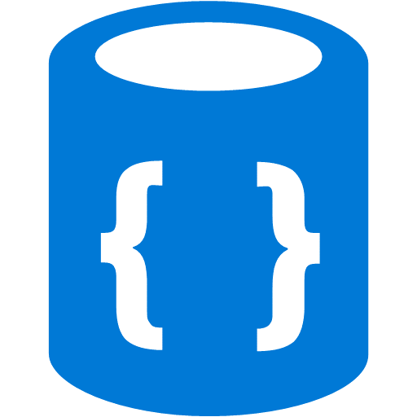
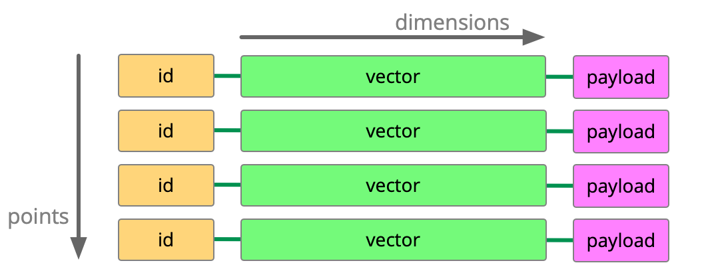

# Unidad 5

Creado: 17 de diciembre de 2025 20:54



# Bases de Datos de Vectores

Las **Bases de Datos de Vectores** son la infraestructura clave para trabajar con representaciones numéricas de la información como texto, imagen, audio o código -*embeddings*- y realizar b**úsqueda por similitud** a gran escala.  En esta unidad estudiaremos este tipo de base de datos,
 las cuales nos permiten realizar búsquedas por significado y no solo coincidencias de cadenas.

## Vectores y Embeddings: Conceptos Básicos

Perfecto, vamos a explicarlo paso a paso y de manera clara, conectando todos los conceptos: **vector, espacio métrico, embeddings y su uso en bases de datos de vectores**.

---

## Vector y espacio métrico

**Vector:**

- Una **lista ordenada de números** que representa un objeto en un espacio multidimensional.
- Cada número se llama **componente** o **dimensión**.
- Ejemplo 3D:

```
x = [0.2, -0.7, 0.3]

```

**Dimensionalidad:**

- Número de componentes de un vector: 3D, 128D, 768D, 1536D…
- A mayor dimensionalidad, más rica es la representación del objeto.

**Espacio métrico:**

- Conjunto donde se puede medir **distancia o similitud** entre elementos.
- Para vectores, las métricas más comunes son:
    - **Distancia Euclídea**: distancia “lineal” en el espacio.
    - **Similitud coseno**: compara la orientación de los vectores, muy usada en NLP y embeddings.

---

## Qué es un embedding

- Un **embedding** es un **vector que representa un objeto complejo** (texto, imagen, nodo de grafo, usuario, etc.) en un **espacio vectorial continuo**.
- Permite **comparar objetos mediante distancia o similitud** en lugar de comparar directamente sus datos originales.
- Ejemplo: palabras “rey” y “reina” en NLP pueden estar representadas por vectores cercanos en el espacio vectorial, reflejando similitud semántica.

**Características de los embeddings:**

- Generalmente vectores **densos** (casi todos los valores distintos de 0).
- Dimensiones altas: 128D, 256D, 768D… dependiendo de la complejidad del objeto.
- Usados para **recuperación por similaridad, clustering, clasificación y búsqueda semántica**.

---

## Cómo se generan embeddings

1. **Entrenamiento con modelos de ML o DL:**
    - Redes neuronales, Transformers, Word2Vec, BERT, CLIP, etc.
    - El modelo aprende a **mapear objetos complejos a vectores** que preservan relaciones semánticas o de características.
2. **Métodos basados en matrices:**
    - Por ejemplo, factorizar matrices de co-ocurrencia (en NLP o recomendación).
3. **Uso de funciones pre-entrenadas:**
    - Muchos modelos ya ofrecen embeddings listos para texto, imágenes o nodos de grafos.

**Ejemplo:**

- Texto: “Neo4j es una base de datos de grafos” → embedding → vector de 768 dimensiones.
- Imagen: foto de gato → embedding → vector de 512 dimensiones.

---

## Modelo de datos en una base de datos de vectores



- **Objetivo:** almacenar y consultar vectores de manera eficiente, generalmente para **búsqueda por similaridad**.
- **Estructura típica:**

```
Nodo/Objeto
  ├─ id: identificador único
  ├─ vector: [v1, v2, ..., vn]  (embedding)
  ├─ metadata: información adicional (nombre, categoría, fecha…)

```

- **Índices vectoriales:**
    - Permiten buscar rápidamente vectores “cercanos” en el espacio métrico.
    - Ejemplo en Neo4j: índices de vectores optimizados para embeddings, útiles en IA y NLP.
- **Operaciones comunes:**
    - Búsqueda de los k vecinos más cercanos (k-NN) según similitud o distancia.
    - Filtrado por metadatos junto con búsqueda vectorial.

**Resumen:**

- **Vector** → representación numérica de un objeto.
- **Espacio métrico** → permite medir distancias o similitudes.
- **Embedding** → vector que captura las características de un objeto complejo.
- **Generación** → mediante modelos de ML/DL o funciones pre-entrenadas.
- **Base de datos vectorial** → almacena embeddings y permite consultas rápidas por similitud.

---

# Aplicaciones

## Busqueda semantica y RAG

Cuando hablamos de búsqueda semántica y RAG nos referimos a recuperar información “por significado” y a usar esa información para ayudar a un modelo generativo a responder con datos reales. La idea es simple: primero se busca, después se decide qué fragmentos son los mejores y, por último, se construye la respuesta apoyándose en esos fragmentos. 

En esta sección verás tres piezas que debes dominar para que el sistema funcione bien: cómo trocear el contenido (chunking), cómo combinar búsqueda léxica y vectorial (búsqueda híbrida), y cómo reordenar los candidatos (reranking) antes de entregarlos al generador.

### Chunking (troceo del contenido)

**Qué es:**

- Dividir documentos largos en **fragmentos más pequeños y coherentes** llamados *chunks*.
- Cada chunk es más fácil de buscar y más útil para modelos generativos.

**Por qué se hace:**

- Mejora la probabilidad de recuperar justo lo que la consulta necesita.
- Reduce ruido: el modelo generativo recibe contexto más relevante.

**Decisiones importantes:**

- **Tamaño del chunk:**
    - General: 200–400 palabras.
    - Técnico/legal: más corto, con solape del 15–20%.
- **Cortar por límites naturales:** párrafos, títulos, bloques de código, tablas.
- **Metadatos:**
    - Guardar información útil: `doc_id`, `chunk_id`, `título`, `sección`, `fecha`, `idioma`, permisos.
- **Limpieza del texto:** eliminar saltos de línea extra, normalizar espacios, quitar menús repetitivos.

**Ejemplo práctico:**

Documento original (simplificado):

```
Título: Introducción a Neo4j
Neo4j es una base de datos de grafos.
Permite modelar relaciones complejas entre datos.
...
```

Chunked en dos trozos de 50 palabras (con solape 20%):

```
Chunk 1:
Neo4j es una base de datos de grafos. Permite modelar relaciones complejas entre datos. ...

Chunk 2:
Permite modelar relaciones complejas entre datos. Soporta consultas Cypher para explorar conexiones ...
```

---

## Búsqueda híbrida (BM25 + vectorial)

**Qué es:**

- Combina **búsqueda léxica** (BM25) con **búsqueda vectorial** (embeddings).
- **BM25:** busca coincidencias exactas de palabras.
- **Vectorial:** busca por **significado**, usando la similitud entre embeddings.

**Por qué combinar:**

- BM25 asegura exactitud: códigos, fechas, nombres.
- Vectorial aporta sinónimos, parafraseo y comprensión semántica.

**Cómo hacerlo:**

1. Crear **dos índices** sobre los chunks:
    - Léxico (BM25).
    - Vectorial (similitud semántica).
2. **Prefiltrar candidatos** por metadatos (idioma, categoría, fecha).
3. **Recuperar candidatos**:
    - Ej.: 50 por léxico, 50 por vector.
4. **Fusionar puntuaciones**:
    - Normalizar scores y ponderarlos (ej. 0.4 BM25, 0.6 vectorial).
5. **Diversidad**: evitar candidatos casi idénticos usando MMR (Maximum Marginal Relevance).

**Ejemplo práctico:**

Consulta: `"zapatillas trail Gore-Tex"`

- BM25 encuentra trozos que contienen literal `"Gore-Tex"`.
- Vectorial encuentra trozos con `"impermeable"`, `"membrana Gore-Tex"`.
- Se combinan: el top-k final contiene ambos tipos de trozos relevantes.

---

## Reranking (reordenar candidatos)

**Qué es:**

- Reordena los candidatos para **seleccionar los más útiles** antes de enviar al modelo generativo.
- Se aplica sobre un **conjunto reducido** (ej. top 20).

**Métodos comunes:**

1. **Cross-encoder:**
    - Modelo que lee **consulta + chunk completo**.
    - Devuelve una puntuación precisa de relevancia.
    - Más lento, por eso solo se aplica a pocos candidatos.
2. **Diversidad (MMR):**
    - Selecciona items relevantes y penaliza duplicados.
3. **Reglas de negocio:**
    - Filtro por permisos, fecha, categoría, fuente prioritaria.

**Ejemplo práctico:**

Top 20 candidatos (tras búsqueda híbrida) para consulta `"tratamiento resfriado"`:

| Chunk | Score Híbrido |
| --- | --- |
| A | 0.95 |
| B | 0.92 |
| C | 0.90 |
| D | 0.90 |
| E | 0.85 |

- Cross-encoder reordena: top 5 final → A, C, B, E, D
- MMR aplica diversidad: penaliza B y D por repetición, dejando A, C, E como top 3 más distintos.

---

## Flujo completo RAG

1. **Chunking:** dividir y limpiar documentos, guardar metadatos.
2. **Indexación:**
    - BM25 para búsqueda exacta.
    - Vectorial para búsqueda semántica.
3. **Consulta:**
    - Prefiltrado por metadatos.
4. **Recuperación híbrida:**
    - Obtener k candidatos de cada índice.
5. **Fusión de scores** y aplicar diversidad.
6. **Reranking:**
    - Cross-encoder + MMR para top-k final (3–8 chunks).
7. **Generación:**
    - Modelo generativo crea respuesta usando chunks seleccionados.
8. **Evaluación:**
    - Recall@k, MRR, fidelidad de la respuesta.

**Ejemplo final (resumen visual simplificado):**

```
Documento → Chunking → Índices (BM25 + Vectorial)
→ Consulta → Recuperación candidatos → Fusión + Diversidad
→ Reranking → Top-k final → Generación de respuesta
```

---

## **Recomendación y deduplicación usando bases de datos de vectores**

### Recomendación por vecinos más cercanos (k-NN)

**Concepto:**

- Si representamos usuarios o ítems como **vectores**, los más cercanos en el espacio vectorial son **buenos candidatos para recomendar**.
- La cercanía se mide con una **métrica de similitud** (coseno, producto interno o L2, según cómo se generaron los embeddings).

**Tipos de recomendación:**

1. **Item-to-item:** recomendar ítems parecidos a un producto.
    - Ejemplo: `"zapatos trail Gore-Tex"` → devuelve otros modelos de zapatos con membrana Gore-Tex o similares.
2. **User-to-item:** recomendar ítems basados en el historial del usuario.
    - Ejemplo: usuario compró zapatillas y mochila → recomendar chaquetas de montaña relacionadas.

**Cómo implementarlo:**

- **Búsqueda aproximada top-k:** recuperar rápido los candidatos más cercanos.
- **Reordenación ligera con reglas de negocio:** precio, stock, permisos, país.
- **Filtrado por metadatos:** categoría, idioma, marca, disponibilidad.
- **Métricas de evaluación:**
    - Recall@k → porcentaje de veces que el recomendado correcto aparece en top-k.
    - Cobertura → porcentaje del catálogo que puede alcanzar el recomendador.

**Nota:** Para ítems nuevos, usar embeddings de contenido (texto, imagen) antes de tener historial de comportamiento.

---

### Detección de duplicados y casi duplicados

**Concepto:**

- Identificar entradas que representan **el mismo contenido o variantes mínimas**.
- Se basa en la **similitud vectorial**: dos vectores muy cercanos son probablemente duplicados.

**Cómo hacerlo:**

1. Para cada ítem, consultar sus **vecinos más próximos**.
2. Marcar como duplicados los pares con similitud ≥ umbral (ej. coseno ≥ 0,95).
3. Evitar coste cuadrático:
    - Recuperar vecinos dentro de una ventana de similitud.
    - Agrupar pares en **componentes conectados** → cada componente es una “familia de duplicados”.
4. Aplicar reglas de fusión:
    - Conservar ítem más reciente, más completo o de mayor calidad.
5. En catálogos multimodales: combinar embeddings textuales e imagen; si dudas, usar metadatos adicionales.

**Ejemplo práctico:**

- Dos fotos casi idénticas de un producto → embeddings vectoriales muy cercanos → se agrupan como duplicados.

---

### Diversidad en listas de recomendación (MMR)

**Problema:**

- Un top-k por relevancia puede contener **resultados casi idénticos**, poco útiles para el usuario.

**Solución: Maximum Marginal Relevance (MMR)**

- Elige cada ítem que sea:
    1. **Relevante** con la consulta.
    2. **Lo menos similar** posible a los ítems ya seleccionados.
- Controlado por parámetro **λ**:
    - λ bajo → prioriza relevancia → lista más homogénea.
    - λ alto → fuerza variedad → lista más diversa.

**Usos típicos:**

- Feeds de noticias: evitar 10 artículos sobre el mismo suceso.
- Catálogos de productos: mezclar marcas, rangos de precio o estilos.
- Resultados de búsqueda: reducir clics duplicados o redundantes.

**Ejemplo práctico:**

- Consulta: `"zapatos trail"`
    - Sin MMR → top-k puede mostrar 5 pares casi idénticos de la misma marca.
    - Con MMR → mezcla modelos distintos, marcas y estilos manteniendo relevancia.

---


### Flujo de trabajo completo

1. Representar **ítems y usuarios como vectores**.
2. **Nearest neighbors (k-NN):** recuperar ítems cercanos según similitud.
3. **Prefiltrar candidatos:** aplicar filtros de metadatos.
4. **Deduplicación:** agrupar ítems muy similares o idénticos.
5. **Aplicar MMR:** generar lista top-k relevante y diversa.
6. Entregar resultados al usuario o al sistema generativo.

## **Búsqueda multimodal**

La **búsqueda multimodal** permite encontrar resultados cruzando **distintas modalidades de información**: texto, imágenes, audio, video o combinaciones de ellas. Esto es útil porque muchas veces el usuario no puede describir exactamente lo que busca, pero sí puede mostrar un ejemplo (foto, clip, grabación).

---

### **Concepto clave**

- Cada modalidad se proyecta a un **vector** en un mismo **espacio vectorial**.
- Si un texto y una imagen representan lo mismo, sus vectores estarán **cerca** en ese espacio.
- La búsqueda se reduce a **vecinos más cercanos (k-NN)** usando la misma métrica (coseno, L2).

---

### **Arquitectura típica: Dual-Encoder**

- Dos redes separadas (“torres”) entrenadas para que pares correctos estén próximos:
    - **Texto → vector**
    - **Imagen → vector**
- Permite:
    - Texto → imagen: “zapatillas rojas con suela blanca” → fotos relevantes.
    - Imagen → texto: dada una foto → encontrar fichas, descripciones o productos similares.

**Buenas prácticas:**

- Normalizar vectores antes de buscar.
- Filtrar por metadatos (temporada, marca, categoría, disponibilidad).
- Mantener campos clave en el payload (precio, popularidad) para desempatar.
- Evaluar con **Recall@k** sobre pares validados y revisar casos ambiguos manualmente.

**Ejemplo práctico:**

Usuario sube foto de un vestido → sistema devuelve vestidos similares aunque los títulos no coincidan palabra por palabra.

---

### **Texto/imagen ↔ audio**

- Se aplica también a audio y multimedia:
    - Ejemplo: búsqueda de “sonidos de lluvia intensa” → clips de audio correspondientes.
    - Dado un clip de audio → recuperar textos descriptivos o contenidos relacionados.

**Buenas prácticas:**

- Generar embeddings consistentes (ej., espectrogramas preprocesados).
- Añadir metadatos (género, duración, idioma).
- Filtrar por duración y fuente para comparaciones justas.

---

### **Casos prácticos: catálogos y medios**

- **E-commerce:** subir foto de un producto → recuperar alternativas en inventario.
- **Medios:** encontrar vídeos o artículos similares a una imagen.

**Recomendaciones:**

- Indexar múltiples vectores por ítem (título, descripción, imagen).
- Combinar con búsqueda híbrida (vectorial + léxica/BM25).
- Aplicar **MMR** para diversidad y evitar resultados casi idénticos.

---

### **Soporte vectorial en motores clásicos**

Muchos motores de búsqueda modernos permiten combinar **índices léxicos y vectoriales**:

- Guardar el vector de imagen y texto dentro del mismo documento.
- Permite consultas híbridas (BM25 + vectorial).
- Filtrar por metadatos antes de la búsqueda para reducir latencia y mejorar recall.
- Ajustar parámetros de índices ANN (HNSW, IVF) según dimensión y métricas.

**Ejemplo práctico:**

- Documento:
    - Texto: título + descripción
    - Imagen: vector de la foto
    - Metadatos: categoría, idioma, fecha
- Consulta: texto “zapatillas Gore-Tex” → combina score léxico (BM25) + score vectorial (imagen/texto) → devuelve top resultados más precisos.

## **Detección de anomalías y outlier scoring en espacios vectoriales**

La **detección de anomalías** consiste en identificar elementos que **no encajan** con el patrón general de los datos. En un **espacio vectorial**, un outlier suele estar **lejano** de sus vecinos o en zonas de baja densidad.

Se aplica en casos como:

- Control de calidad (productos defectuosos)
- Fraude financiero o transaccional
- Moderación de contenidos (texto, imagen, audio)
- Depuración de catálogos (duplicados o inconsistencias)
- Monitorización de pipelines de datos

---

### **Representación de datos**

Cada elemento se representa como un **vector (embedding)** y se puede acompañar de **metadatos**:

- Ejemplo:

```json
{
  "id": 1234,
  "vector": [0.12, -0.45, 0.78, ...],
  "metadatos": {"fecha": "2025-12-17", "categoría": "zapatos", "país": "ES"}
}
```

- **Normalización**: si se usa **similitud coseno**, todos los vectores se normalizan a longitud 1.

---

### **Estrategias de scoring**

### **a) Distancia a vecinos (k-NN)**

- Se calcula la distancia media o máxima a los **k vecinos más cercanos**.
- **Ventaja:** simple y rápido con base vectorial.
- **Inconveniente:** sensible a la escala si no hay normalización.

**Ejemplo:**

Un producto que tiene un embedding muy distinto al resto → gran distancia a sus 5 vecinos más cercanos → outlier.

---

### **b) Densidad relativa (LOF/DBSCAN)**

- Un punto es atípico si su **densidad local** es menor que la de sus vecinos.
- Útil en espacios heterogéneos donde hay zonas densas y dispersas.

**Ejemplo:**

En un catálogo de imágenes de zapatos, un par de botas raras en un clúster de zapatillas deportivas aparecerá como outlier.

---

### **c) Centroides y clústeres**

- Se crean clústeres (por ejemplo, k-means) y se mide la **distancia al centroide más cercano**, normalizada por dispersión.
- Adecuado cuando hay “familias” claras en los datos.

**Ejemplo:**

En un catálogo de ropa: camisetas, pantalones y chaquetas → un zapato se aleja de todos los centroides → outlier.

---

### **d) Distancias robustas**

- Distancia de Mahalanobis o z-score robusto usando mediana y MAD.
- Funciona bien cuando hay valores extremos o colas pesadas.

---

### **e) Modelos de una sola clase o aislamiento**

- **One-Class SVM** o **Isolation Forest** generan un score de novedad/aislamiento.
- Se suelen ejecutar **fuera del motor vectorial** y utilizan la base vectorial para obtener vecinos o generar negativos sintéticos.

**Ejemplo:**

Isolation Forest construye árboles que aíslan rápidamente los puntos raros, como imágenes corruptas o texto fuera de tema.

---

### **f) Combinación con reglas de negocio**

- El score de outlier puede combinarse con reglas de negocio:
    - Precio imposible
    - Stock negativo
    - Permisos incorrectos

Esto ayuda a **reducir falsos positivos**.

---

### **Umbrales y calibración**

- Transformar el score en decisión usando un **umbral**.
- Métodos:
    - Percentil (p.ej., top 0,5% → alertas)
    - Curvas ROC si hay etiquetas
- Sistemas multicliente: **umbrales por segmento** (idioma, categoría).
- Control de alertas diarias según **presupuesto humano**.

---

### **Ventanas temporales y drift**

- Lo que es raro cambia con el tiempo (estacionalidad, modas).
- Usar **ventanas deslizantes** (ej., últimos 30 días) para recalibrar estadísticas.
- Detectar drift si sube la media de scores o la proporción de alertas.
- Ajustar umbrales o refrescar embeddings según sea necesario.

**Ejemplo:**

Si en invierno aparece un gran número de botas nuevas → recalibrar umbral para que no se marquen como outliers.

## **Monitorización de contenido y cumplimiento en bases vectoriales**

Cuando usamos embeddings (vectores que representan texto, imagen o audio) en una base de datos, debemos tener cuidado con dos cosas principales:

1. **Detección de contenido problemático**: insultos, violencia, información ilegal, spam, etc.
2. **Cumplimiento legal**: proteger datos personales y cumplir normas como el RGPD.

---

### **Sensibilidad y privacidad de embeddings**

- Aunque eliminemos nombres o identificadores directos (**pseudonimización**), los vectores pueden **revelar información implícita**.
- Ejemplo: un embedding de un correo con preferencias políticas podría permitir inferir la ideología de la persona.
- Por ello, los embeddings derivados de datos personales se consideran **datos personales** según la ley.

**Tipos de datos sensibles:**

- Ordinarios: nombres, direcciones, localizaciones.
- Especiales: salud, orientación sexual, biometría, creencias.

---

### **Ciclo de vida del embedding y RGPD**

El RGPD introduce requisitos que afectan todo el proceso de creación y uso de embeddings:

### **a) Roles**

- **Responsable del tratamiento**: decide fines y medios (por ejemplo, la empresa que usa la base vectorial).
- **Encargado del tratamiento**: procesa los datos por cuenta del responsable (por ejemplo, proveedor de cloud vectorial).

### **b) Base jurídica**

- Debe existir un **motivo legal para procesar datos**:
    - Consentimiento explícito
    - Ejecución de contrato
    - Interés legítimo justificado
- Ejemplo: “Usar embeddings solo para búsqueda interna de productos y detección de duplicados”.

### **c) Principios de tratamiento**

1. **Limitación de finalidad**: no usar embeddings para fines distintos a los previstos.
2. **Minimización de datos**: guardar solo lo necesario (vector + metadatos imprescindibles).
3. **Exactitud**: actualizar embeddings si cambian los datos originales.
4. **Limitación de conservación**: definir fecha de borrado o caducidad.
5. **Integridad y confidencialidad**: proteger vectores y metadatos con cifrado, accesos controlados, auditoría.
6. **Responsabilidad proactiva**: registrar decisiones, auditorías y evidencias de cumplimiento.

### **Derechos de las personas**

El RGPD garantiza derechos que se aplican a embeddings:

- **Acceso**: saber qué datos y para qué se usan.
- **Rectificación**: corregir información incorrecta.
- **Supresión / Derecho al olvido**: eliminar embeddings y metadatos derivados.
    - Ejemplo: un usuario solicita borrar su historial → se deben eliminar embeddings y sus fragmentos en todos los índices vectoriales y copias de seguridad.
- **Limitación y oposición**: restringir tratamiento o rechazar su uso.
- **Portabilidad**: exportar datos de forma legible.

---

### **Buenas prácticas en bases vectoriales**

1. **Metadatos claros**: asociar cada embedding a doc_id, fecha, categoría, idioma, permisos.
2. **Filtros de seguridad**: antes de consultas, aplicar filtros que eviten acceso no autorizado.
3. **Gestión de supresiones**:
    - Propagar borrado a índices secundarios, snapshots, backups.
    - Regenerar índices si cambian los embeddings o el modelo.
4. **Evaluación de impacto (DPIA)**: obligatorio si hay grandes volúmenes de datos sensibles o categorías especiales.

---

### **Ejemplo práctico de flujo compliant**

1. Generas embeddings de documentos legales:

```json
{
  "doc_id": 123,
  "vector": [0.12, -0.45, 0.78, ...],
  "metadatos": {"categoría": "legal", "fecha": "2025-12-17"}
}

```

1. Indexas en la base vectorial.
2. Usuario solicita **derecho al olvido**:
    - Eliminamos embeddings asociados a doc_id 123
    - Actualizamos índices y backups según política de retención
3. Sistema de monitorización detecta contenido sensible o prohibido usando métricas de similitud y reglas de negocio, generando alertas si es necesario.

---

# **Búsqueda de vecinos más cercanos en motores vectoriales**

Cuando queremos recuperar los elementos más parecidos a un vector de consulta, existen **dos estrategias fundamentales**:

1. **Búsqueda exacta (Exact Nearest Neighbors o FLAT / brute-force)**
2. **Búsqueda aproximada (Approximate Nearest Neighbors, ANN)**

---

## **Búsqueda exacta (FLAT / brute-force)**

- **Cómo funciona:**
    
    Compara el vector de consulta contra **todos los vectores de la colección**, calculando la distancia o similitud.
    
- **Ventajas:**
    - Garantiza el top-k exacto.
    - Sirve como “ground truth” para evaluar otras técnicas.
    - Funciona muy bien si aplicas filtros selectivos (por ejemplo, idioma, categoría) que reducen drásticamente los candidatos.
- **Desventajas:**
    - El coste crece linealmente con el número de vectores y su dimensión.
    - No escala bien para millones de vectores sin optimización.
- **Ejemplo práctico:**
    
    Supongamos que tienes **10.000 descripciones de productos**, cada una con un embedding de 768 dimensiones.
    
    - Usuario busca “zapatillas rojas”.
    - FLAT calcula la similitud con los 10.000 vectores y devuelve el top-5 exacto.
    - Si más adelante aplicas filtro por marca, reduces a 2.000 vectores, y la búsqueda exacta sigue siendo rápida.

---

## **Búsqueda aproximada (ANN)**

- **Cómo funciona:**
    
    Usa **índices especializados** (grafos de navegación, centroides, listas particionadas) para **explorar solo una fracción del espacio**.
    
- **Ventajas:**
    - Muy rápido y eficiente en memoria para colecciones grandes (millones de vectores).
    - Permite cumplir requisitos de baja latencia y alto QPS.
- **Desventajas:**
    - No garantiza el top-k exacto: puede “perder” algún vecino real.
    - Requiere **ajustar parámetros** para equilibrar latencia y recall.
    - Necesita **memoria extra** para almacenar el índice y tiempo de construcción del mismo.
- **Ejemplo práctico:**
    - Catálogo con **10 millones de productos**.
    - Consulta “zapatillas rojas con suela blanca”.
    - ANN explora solo los 100.000 vectores más prometedores y devuelve los top-50 candidatos.
    - Luego, se aplica **reranking exacto** sobre estos 50 para obtener los 5 más cercanos con precisión.

# Familias e Indices

## **Grafos navegables (HNSW: Hierarchical Navigable Small World)**

### Concepto

- Imaginemos vectores como nodos en un **grafo de varios niveles**.
- Los niveles superiores tienen pocos nodos “coarses”, niveles bajos contienen todos los vectores.
- La búsqueda empieza en un nodo superior y “navega” hacia los vecinos más cercanos hasta llegar al nivel base.

### Parámetros importantes

| Parámetro | Qué hace | Valor típico |
| --- | --- | --- |
| M | Número de enlaces por nodo | 16–32 |
| efConstruction | Exploración al construir grafo | 100–200 |
| efSearch | Exploración al buscar | 64–200 |

### Ventajas

- Gran recall con CPU, rápido para consultas.
- Inserciones y borrados online posibles.

### Desventajas

- Más memoria que FLAT.
- Build más lento.
- Filtros de payload muy restrictivos pueden degradar conectividad y recall.

**Ejemplo práctico:**

- Catálogo de 1M de imágenes.
- Usuario sube foto → HNSW recorre el grafo y devuelve las 10 imágenes más similares en ~5 ms.

---

## **Listas invertidas con particiones (IVF / IVF_FLAT)**

### Concepto

- Divide el espacio vectorial en **nlist celdas**, cada una con un **centroide (k-means)**.
- Para una consulta, solo se exploran **nprobe celdas** cercanas al centroide de la query.

### Variantes

- **IVF_FLAT:** vectores dentro de cada celda sin compresión.
- **IVF_PQ/OPQ:** combina con cuantización para ahorrar memoria.

### Ventajas

- Control de latencia y build ajustando `nprobe`.
- Compatible con GPU.

### Desventajas

- Necesita entrenamiento (k-means).
- Recall sensible a la partición.
- Inserciones masivas pueden desbalancear celdas si no se reentrena.

**Ejemplo práctico:**

- Base de datos de 10M de embeddings de texto.
- `nlist=1024` → divide el espacio en 1024 celdas.
- `nprobe=8` → busca solo en 8 celdas cercanas.
- Resultado: top-50 candidatos rápidamente para reranking exacto.

---

## **Cuantización (PQ y OPQ: Product Quantization / Optimized PQ)**

### Concepto

- Divide un vector en **M subespacios** y cuantiza cada subvector en índices de código (`nbits`).
- OPQ aplica **rotación previa** para reducir el error de cuantización.
- Se usa normalmente junto con IVF: **IVF_PQ o IVF_OPQ**.

### Parámetros principales

| Parámetro | Qué hace |
| --- | --- |
| M | Número de subcuantizadores (más M → menos error pero más cómputo) |
| nbits | Precisión de codificación por subvector (más bits → más precisión) |

### Ventajas

- Permite colecciones **muy grandes** en RAM/SSD.
- Aumenta QPS y eficiencia de búsqueda.

### Desventajas

- Pérdida de precisión si la compresión es agresiva.
- Requiere entrenamiento y es sensible al **drift** de la distribución de datos.

**Ejemplo práctico:**

- Embeddings de 100M de documentos de 768 dimensiones.
- PQ: divide cada vector en 16 subvectores de 48 dimensiones y codifica con 8 bits.
- Resultado: memoria reducida de ~30 GB en vez de 300 GB, top-k aproximado eficiente.

---

## **Otros índices especializados**

| Índice | Características | Cuándo usarlo |
| --- | --- | --- |
| Annoy | Bosques de árboles aleatorios, fácil de operar, read-heavy | Índices estáticos, memoria mapeada |
| ScaNN (Google) | Particionado + hashing asimétrico, excelente para dot-product/coseno | Consultas rápidas con alta velocidad en CPU |
| DiskANN (Microsoft) | Grafo optimizado para SSD, escala a billions | Cuando no caben todos los vectores en RAM |
| SPANN | Escala masiva, memoria + SSD | Catálogos enormes con límite estricto de RAM |

---

# Métricas y Tunning

## **Métricas clave para evaluar un índice vectorial**

| Métrica | Qué mide | Interpretación práctica |
| --- | --- | --- |
| **Recall@k** | Porcentaje de los vecinos verdaderos (según búsqueda exacta FLAT) que aparecen en el top-k del índice aproximado (ANN) | Ej.: Recall@10 = 0.95 → 95% de los 10 vecinos reales están en la lista recuperada. Cuanto más alto, mejor calidad. |
| **Latencia P95 / P99** | Tiempo máximo que tarda el 95% o 99% de las consultas | P95 = 60 ms → el 95% de consultas responde en ≤ 60 ms. Ayuda a cumplir SLA y experiencia de usuario. |
| **Tamaño de índice** | Memoria/disco adicional sobre los vectores crudos | Ej.: un índice HNSW de 1M vectores de 768D ocupa 1.5× la memoria de los vectores → determina coste y escalabilidad. |
| **Tiempo de build** | Tiempo que tarda en construir o entrenar el índice | Ej.: IVF con k-means para 20M vectores → build = 4 h. Impacta la frecuencia de refresco y reindex. |

---

## **Ejemplo práctico de objetivos conjuntos**

Supongamos que tenemos un catálogo de **20M de vectores de 768 dimensiones**:

- Queremos que **Recall@10 ≥ 0.98** → la mayoría de los vecinos relevantes aparezcan en top-10.
- Latencia máxima **P95 ≤ 60 ms** → experiencia fluida para casi todas las consultas.
- Índice que ocupe **≤ 1.5× el tamaño de los vectores** → eficiencia en memoria.
- Tiempo de construcción **≤ 6 h por shard** → refrescos y actualizaciones aceptables.

> La clave: iterar sobre los parámetros del índice hasta cumplir todas estas métricas al mismo tiempo.
> 

---

## **Cómo afecta cada parámetro según la familia de índice**

### **HNSW**

- **M** (enlaces por nodo): aumenta recall y memoria.
- **efConstruction**: más alto → mejor grafo inicial, mayor tiempo de build.
- **efSearch**: más alto → mejor recall, mayor latencia.

**Tuning práctico:**

- Subir efSearch mejora Recall@k pero aumenta P95.
- Ajustar M y efConstruction para balancear build y memoria.

---

### **IVF / IVF_PQ**

- **nlist**: más celdas → menor número de vectores por celda, build más largo, menor latencia si nprobe constante.
- **nprobe**: más celdas exploradas → mayor recall, más tiempo de consulta.
- **PQ/OPQ**: más subcuantizadores o bits → mayor precisión, más memoria y cómputo.

**Tuning práctico:**

- Primero ajustar nlist para distribuir bien vectores.
- Luego nprobe para alcanzar Recall@k deseado sin superar latencia.
- PQ/OPQ → comprimir hasta equilibrio entre precisión y tamaño.

---

### **Otros índices**

- **Annoy** → número de árboles aumenta recall pero eleva memoria y build.
- **DiskANN / ScaNN** → parámetros de lista, probes o fanout afectan recall y latencia.

---

## **Estrategia de tuning iterativa**

1. Establecer **ground truth** con búsqueda exacta (FLAT).
2. Definir **conjunto de validación** (ej. 10k consultas).
3. Ajustar parámetros grandes primero (M, nlist).
4. Ajustar parámetros de búsqueda (efSearch, nprobe).
5. Medir **Recall@k, P95, tamaño índice, build**.
6. Repetir hasta cumplir **todos los objetivos simultáneamente**.

> Nota: nunca ajustar una métrica sin revisar las otras; por ejemplo, subir efSearch mejora recall pero puede disparar la latencia.
> 

---