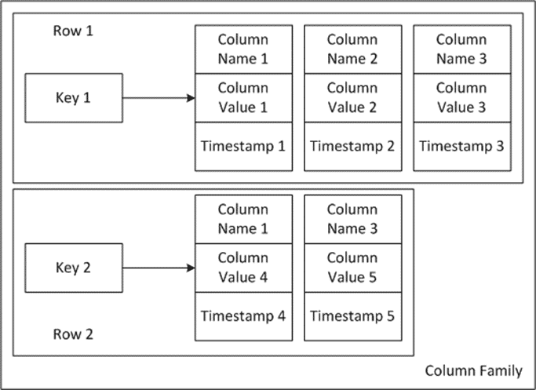

# Unidad 6

Creado: 17 de diciembre de 2025 20:54

# Bases de Datos Distribuidas

## Bases de Datos Orientadas a Columnas

Las bases de datos orientadas a columnas representan una aproximación diferente al almacenamiento y organización de la información. A diferencia de las bases de datos tradicionales orientadas a filas, estas están diseñadas para optimizar consultas de grandes volúmenes de datos en escenarios donde es crucial analizar un número reducido de columnas en conjuntos de datos extensos. Este modelo es esencial en entornos de Big Data y análisis masivo.

### **Principales características del modelo**

**Estrucutra de almacenamiento**

- **Clave:** cada columna tiene un identificador único que permite referenciarla de
manera específica en los sistemas distribuidos. Este nombre sirve como
punto de acceso principal para las operaciones.
- **Valor:** es el contenido que almacena la columna. Puede ser un dato único o una
colección de datos relacionados que comparten una misma clave.
- **Timestamp:** a cada operación de inserción o actualización en la base de datos se le
asocia una marca de tiempo (timestamp). Este campo es clave en sistemas
distribuidos para resolver conflictos de sincronización y asegurar la
validez de los datos en contextos de replicación y concurrencia.

**Ventajas Principales**

- Optimización para lecturas selectivas: las consultas que involucran una o pocas
columnas son mucho más rápidas, ya que solo se accede a las partes
relevantes del sistema.
- Compresión de datos eficiente: almacenando datos similares en bloques contiguos,
se logra una mayor compresión, lo que reduce costos de almacenamiento y
mejora la velocidad de transmisión.
- Escalabilidad horizontal: las bases de datos orientadas a columnas, como Cassandra,
están diseñadas para escalar de manera distribuida en clústeres de
servidores.

**Casos de uso**

- Análisis de datos masivos: por su capacidad para manejar grandes volúmenes de
información y realizar consultas analíticas rápidas.
- Registros históricos: perfectas para almacenar y consultar grandes series temporales de datos debido al uso del timestamp.

## **Cassandra**

Cassandra es una base de datos NoSQL orientada a columnas, desarrollada para manejar grandes volúmenes de datos distribuidos de manera eficiente en un clúster de servidores. Fue diseñada inicialmente por Facebook para soportar su sistema de mensajería, pero rápidamente se convirtió en una herramienta adoptada por organizaciones que requieren alta disponibilidad, tolerancia a fallos y escalabilidad.

En un mundo donde los datos crecen exponencialmente, Cassandra se posiciona como una solución confiable para empresas que necesitan procesar y almacenar información crítica sin interrupciones. Su arquitectura descentralizada y distribuida garantiza el acceso continuo a
 los datos, incluso en escenarios de fallos masivos, proporcionando un sistema robusto y altamente disponible.

### **Principales características de Cassandra:**

- **Descentralización:**
    - Cassandra no tiene un nodo maestro, lo que elimina el punto único de fallo. En su lugar, cada nodo del clúster es idéntico y cumple roles iguales,
    permitiendo que cualquier nodo pueda manejar solicitudes de lectura y
    escritura.
    - Esta
    descentralización asegura una alta disponibilidad, ya que el sistema
    puede seguir operando incluso si uno o más nodos fallan.
- **Replicación:**
    - Los datos se replican automáticamente en varios nodos del clúster para garantizar redundancia y disponibilidad.
    - Cassandra permite configurar el "factor de replicación", que determina cuántas
    copias de los datos se almacenarán en diferentes nodos. Esto permite un
    equilibrio entre consistencia y disponibilidad.
- **Tolerancia a Fallos:**
    - Gracias a la replicación y a su capacidad para manejar fallos de nodos
    individuales o incluso de racks completos, Cassandra es ideal para
    entornos críticos donde la pérdida de datos es inaceptable.
    - La arquitectura de Cassandra asegura que los datos se puedan recuperar rápidamente y de manera automática en caso de fallo.
- **Escalabilidad horizontal:**
    - Cassandra permite agregar nuevos nodos al clúster sin necesidad de detener el
    sistema, lo que facilita el crecimiento dinámico para manejar mayores
    volúmenes de datos o incrementos en la carga de trabajo.
    - Esta escalabilidad no afecta el rendimiento, ya que los datos y solicitudes
    se distribuyen automáticamente entre los nuevos nodos.

## Arquitectura de Cassandra

**1. Nodo**

- Unidad básica de Cassandra, instancia del sistema en ejecución.
- Desarrollo: múltiples nodos por servidor posibles.
- Producción: 1 nodo por servidor físico/virtual para eficiencia y aislamiento.

**2. Partición**

- Unidad básica de almacenamiento.
- Función: determina distribución y replicación de datos en el clúster.
- Datos dentro de la partición ordenados por clave primaria para consultas rápidas.

**3. Rack**

- Conjunto lógico de nodos agrupados por proximidad física o tolerancia a fallos.
- Facilita replicación eficiente y disponibilidad ante fallos de rack completo.
- Configuración optimizada para latencia y balance de carga.

**4. Centro de Datos (Data Center)**

- Conjunto lógico de racks.
- Permite segmentación geográfica y adaptación a diferentes usuarios/aplicaciones.
- Soporta replicación entre data centers para alta disponibilidad remota.

**5. Clúster y Token Ring**

- Clúster: conjunto completo de nodos trabajando juntos.
- Token Ring: organización lógica de nodos en un anillo, cada nodo responsable de un rango de tokens.
- Garantiza distribución equilibrada de datos y cargas de trabajo.

## Nodos

Cassandra utiliza nodos como unidades fundamentales para la operación y administración de su arquitectura distribuida. Cada nodo tiene roles específicos que le permiten interactuar con los clientes y otros nodos en el clúster. 

Los nodos son las instancias básicas de Cassandra, es decir, un nodo es una instancia activa de Cassandra que forma parte del clúster. Puede ser un servidor físico o una máquina virtual que contribuye al almacenamiento y procesamiento de datos distribuidos. Los nodos se clasifican en los siguientes tipos:

- **El nodo semilla** es el primer punto de contacto para un nodo nuevo que se une al clúster.
    - **Función principal:**
        - Proporciona al nodo entrante la información necesaria sobre la estructura del
        clúster, como qué nodos existen y cómo están organizados.
    - **Recomendaciones:**
        - En un clúster, es común definir varios nodos semilla para garantizar la confiabilidad en caso de fallos.
        - El nodo semilla no tiene un rol especial en la replicación o en las
        consultas una vez que el nodo está completamente integrado en el
        clúster.
- **El coordinador** es cualquier nodo del clúster que recibe una petición directamente de un cliente y se encarga de gestionarla.
    
    **Funciones del coordinador:**
    
    - Recepción de la petición: el nodo elegido como coordinador recibe la solicitud del cliente.
    - Gestión de la petición:
        - Consulta o escribe en los nodos correspondientes en función del rango de datos almacenados y la replicación.
        - Coordina la respuesta al cliente, consolidando los datos obtenidos de varios nodos si es necesario.
    - Estrategia de selección:
        - El nodo coordinador se elige de forma aleatoria en función de la disponibilidad.
        - Si el nodo coordinador falla, el cliente redirige la solicitud a otro nodo disponible, manteniendo la operación continua.

### Ventaja principal de la descentralización

Dado que cualquier nodo puede actuar como coordinador, no hay un punto único de fallo ni cuellos de botella.

**Driver:** El driver es la interfaz que conecta al cliente con el clúster de Cassandra.

Funciones principales:

- Determinación del nodo coordinador:
    - Utiliza estrategias como el patrón Round-robin, en el que distribuye las
    solicitudes del cliente a diferentes nodos de manera uniforme.
    - Esto balancea la carga entre los nodos del clúster.
- Manejo de fallos:
    - Si un nodo no responde, el driver redirige automáticamente la petición a otro nodo activo.
- Compatibilidad y optimización:
    - Los drivers están diseñados para diferentes lenguajes de programación,
    facilitando la integración de Cassandra en aplicaciones diversas.

### Relación entre los componentes

- Los nodos semilla facilitan la incorporación de nuevos nodos.
- Los coordinadores aseguran que las peticiones se gestionen de manera eficiente.
- El driver permite que el cliente interactúe de forma transparente con el clúster, incluso en entornos distribuidos y dinámicos.

## **Particiones en Cassandra**

### **Definición y función**

En Cassandra, la **partición** es la unidad básica de almacenamiento y organización de los datos. Cada partición agrupa un conjunto de registros que comparten la misma **clave de partición**, normalmente derivada de la **clave primaria**.

El concepto de partición es central para el funcionamiento de Cassandra, ya que permite:

- **Distribución eficiente de los datos** entre todos los nodos del clúster.
- **Acceso rápido** a los datos, incluso en clústeres con miles de nodos.
- **Equilibrio de carga**, evitando que un nodo gestione demasiada información.
- **Replicación y tolerancia a fallos**, ya que cada partición puede copiarse en varios nodos.

**Ejemplo:** Todos los datos de un cliente con ID=123 pueden almacenarse en la misma partición, lo que permite acceder rápidamente a toda la información de ese cliente.

---

### **El particionador**

El **particionador** es el componente encargado de **decidir en qué nodo se almacenará cada partición**.

- Toma la **clave primaria** de un registro y genera un **token único**, que será usado para asignar la partición a un nodo.
- Cada nodo del clúster tiene asignado un **rango de tokens**, que determina su responsabilidad sobre los datos.
- Gracias a esto, Cassandra distribuye los datos de forma **uniforme** y eficiente.

### **Tipos de particionadores**

- **Murmur3Partitioner (por defecto):**
    
    Algoritmo hash rápido que genera tokens distribuidos uniformemente.
    
- **RandomPartitioner:**
    
    Genera tokens aleatorios para lograr una distribución equilibrada de los datos.
    
- **ByteOrderedPartitioner:**
    
    Ordena las claves de forma lexicográfica. Útil para consultas secuenciales, pero puede causar **desbalances** si muchas claves tienen prefijos similares.
    

---

### **Token Ring (Anillo de tokens)**

Cassandra organiza los nodos y particiones en un **anillo lógico**, llamado **Token Ring**:

- Cada nodo es responsable de un **rango de tokens** dentro del anillo.
- Cada token representa una **partición o conjunto de particiones** que ese nodo debe almacenar.
- Esta estructura asegura que los datos estén **distribuidos de forma equilibrada** y que sea fácil escalar el sistema.

### **Ventajas del Token Ring**

- **Acceso eficiente:** Al conocer el token de una clave, Cassandra puede localizar la partición en el nodo responsable sin recorrer todo el clúster.
- **Equilibrio de carga:** Cada nodo recibe un rango similar de tokens, evitando sobrecargas.
- **Escalabilidad horizontal:** Se pueden añadir nodos al clúster; los rangos de tokens se redistribuyen automáticamente.
- **Alta disponibilidad:** Las particiones se replican según el **factor de replicación**, asegurando que los datos estén accesibles incluso si un nodo falla.

---

### **Flujo de almacenamiento y consulta**

1. La **clave primaria** de un registro pasa por el particionador.
2. Se genera un **token** que identifica la partición.
3. El **nodo coordinador** recibe la solicitud del cliente y determina qué nodo almacena la partición.
4. La partición se guarda en el nodo responsable y en otros nodos según el factor de replicación.
5. Si el nodo principal falla, otra réplica permite que los datos sigan siendo accesibles.

---

### **Replicación**

Cassandra replica cada partición en varios nodos para garantizar **tolerancia a fallos**.

- El número de copias se define mediante el **factor de replicación**.
- La replicación puede configurarse para **un mismo data center** o **entre data centers**, lo que aumenta la disponibilidad geográfica.
- Esto significa que incluso si uno o varios nodos dejan de funcionar, las particiones siguen disponibles en otras ubicaciones.

---

### **Beneficios principales de las particiones**

- **Acceso rápido y eficiente**: Las particiones permiten localizar los datos directamente.
- **Distribución equilibrada**: Los datos se reparten entre nodos para evitar sobrecargas.
- **Escalabilidad**: Añadir nuevos nodos es sencillo, con redistribución automática de los rangos de tokens.
- **Alta disponibilidad**: Réplicas automáticas protegen los datos frente a fallos.
- **Optimización de consultas**: Las particiones ordenadas por clave primaria permiten consultas rápidas y predecibles.

---

### **Ejemplo práctico**

Supongamos que queremos almacenar información de clientes usando el **ID del cliente** como clave primaria:

1. El ID pasa por el particionador y se genera un **token**.
2. Este token determina **qué nodo** dentro del token ring almacenará la partición.
3. Los datos se replican automáticamente en otros nodos según el factor de replicación.
4. Si un nodo falla, los datos siguen accesibles a través de sus réplicas, asegurando **alta disponibilidad**.

## **Nodos virtuales (vNodes) en Cassandra**

### **Introducción**

Con Cassandra 2.0 se introdujeron los **nodos virtuales (vNodes)**, un avance importante para mejorar la **gestión, distribución y resiliencia** de los datos en el clúster.

Los vNodes resuelven problemas tradicionales de distribución de particiones y balanceo de carga que existían cuando cada nodo físico gestionaba un solo segmento continuo del token ring.

---

### **Concepto de vNode**

- Un **nodo virtual** es una subdivisión de un nodo físico en el clúster.
- Cada nodo físico ya no está asociado a un **único segmento continuo** del token ring, sino que se divide en múltiples vNodes que gestionan **segmentos discontinuos**.
- Los vNodes son **transparentes** para los usuarios y para el sistema, comportándose como nodos normales.

---

### **Beneficios principales**

**Distribución uniforme**

- Los vNodes permiten que los datos se distribuyan de manera **más equilibrada** entre todos los nodos del clúster.
- Mitigan desbalances de carga que podían ocurrir con nodos físicos únicos.

**Escalabilidad dinámica**

- Facilitan la **adición o eliminación de nodos** sin intervención manual.
- Las particiones se **reasignan automáticamente**, evitando tiempos de inactividad prolongados.

**Tolerancia a fallos**

- Si un nodo físico falla, los vNodes permiten que **otros nodos gestionen sus particiones**, asegurando **alta disponibilidad** y continuidad del servicio.

---

### **Procesos asociados a vNodes**

### **Bootstrap**

- Proceso que ocurre al **añadir un nuevo nodo** al clúster.
- Cassandra asigna automáticamente segmentos del token ring al nuevo nodo y redistribuye sus réplicas.
- Reduce la necesidad de redistribuir manualmente grandes volúmenes de datos.

### **Decommission**

- Proceso que ocurre al **retirar un nodo** del clúster.
- Las particiones y réplicas gestionadas por los vNodes del nodo eliminado se reasignan a los nodos restantes.
- Garantiza que el clúster continúe funcionando sin interrupciones.

---

### **Funcionamiento interno**

- Cada nodo físico contiene **múltiples vNodes**, cada uno responsable de segmentos discontinuos del token ring.
- Esto **reduce el impacto** de cambios en el clúster (como agregar o quitar nodos) y mantiene la **distribución balanceada de los datos**.
- Los clientes no necesitan modificar sus consultas, ya que los vNodes operan de forma transparente en la capa de infraestructura.

---

### **Ejemplo práctico**

### **Nodo añadido (Bootstrap)**

- Antes: clúster con 3 nodos físicos gestionando el token ring.
- Después: se añade un cuarto nodo.
- Cassandra redistribuye automáticamente segmentos del token ring entre los vNodes del nuevo nodo y los existentes.

### **Nodo eliminado (Decommission)**

- Antes: un nodo físico falla o debe retirarse.
- Después: las particiones y réplicas gestionadas por los vNodes de ese nodo se redistribuyen entre los nodos restantes, manteniendo la disponibilidad.

## **Replicación en Cassandra**

### **Concepto**

La **replicación** es un pilar fundamental en Cassandra. Permite garantizar:

- **Alta disponibilidad** de los datos.
- **Tolerancia a fallos**, evitando pérdida de información.
- **Fiabilidad** en entornos distribuidos.

En Cassandra, **todas las réplicas de una partición son iguales**, sin distinguir entre “original” y “copia”. Esto asegura un manejo **flexible y robusto** de la información.

---

### **Partición como unidad básica**

- Cada partición se replica en **varios nodos** según la configuración del **keyspace**.
- Esto asegura que si un nodo falla, otras réplicas mantengan la disponibilidad de los datos.
- El **factor de replicación (RF)** define el número de nodos que almacenan cada partición:
    - **RF = 1:** cada partición tiene una sola copia.
    - **RF = total de nodos:** cada nodo contiene todos los datos del clúster.
- El factor de replicación afecta directamente:
    - **Lecturas:** pueden realizarse desde cualquier réplica, balanceando la carga.
    - **Escrituras:** deben llegar a un mínimo de réplicas según el **nivel de consistencia** configurado.

---

### **Estrategias de replicación**

### **SimpleStrategy**

- Distribuye las réplicas **de forma secuencial** a lo largo del token ring.
- Adecuada para clústeres **de un solo data center**.
- No considera la topología de la red, por lo que no es recomendable en entornos complejos o multi-datacenter.

### **NetworkTopologyStrategy**

- Diseñada para **clústeres con múltiples data centers**.
- Cada data center puede tener su **propio factor de replicación**, permitiendo control granular.
- Distribuye las réplicas entre **racks** dentro de cada data center, asegurando disponibilidad ante fallos de racks completos.
- Designa un **coordinador remoto** en cada data center para gestionar la replicación inter-datacenter.

---

### **Escrituras y lecturas**

### **Escrituras**

- El **cliente envía la solicitud** al nodo coordinador.
- El coordinador envía la escritura a los nodos responsables de las réplicas.
- Se cumple el **nivel de consistencia** definido (ej.: ONE, QUORUM, ALL) antes de confirmar la operación al cliente.

### **Lecturas**

- Pueden realizarse desde **cualquier réplica disponible**.
- El nivel de consistencia define cuántas réplicas se deben consultar para garantizar resultados consistentes.
- Esto permite balancear carga y mejorar el rendimiento.

---

### **Ejemplo práctico**

Supongamos un clúster con:

- 4 nodos
- Factor de replicación = 3
- Estrategia: **NetworkTopologyStrategy** con 2 data centers

**Distribución de réplicas:**

- Cada partición tiene 3 réplicas: dos en el primer data center y una en el segundo.
- Si un nodo falla, las réplicas restantes aseguran la disponibilidad.

**Escritura de datos:**

- El cliente envía la escritura al coordinador.
- El coordinador confirma la operación cuando al menos 2 réplicas (QUORUM) han recibido los datos.

**Lectura de datos:**

- El cliente puede leer desde cualquier réplica disponible, ajustando la consistencia según la necesidad.

## **Nivel de consistencia en Cassandra**

## **Concepto**

El **nivel de consistencia** define cuántas réplicas deben confirmar una operación de lectura o escritura antes de que el **coordinador** devuelva la respuesta al cliente.

Permite ajustar el **equilibrio entre consistencia, disponibilidad y rendimiento**, adaptándose a distintos escenarios según las necesidades del sistema.

---

## **Consistencia en escrituras y lecturas**

- **Escrituras:** indica cuántos nodos deben confirmar que la partición ha sido almacenada correctamente antes de considerarla exitosa.
- **Lecturas:** indica cuántos nodos deben responder con los datos para que el coordinador devuelva un resultado consistente.

---

## **Niveles básicos**

- **ONE, TWO, THREE:**
    
    Requiere confirmación de 1, 2 o 3 nodos, respectivamente.
    
    - Alta disponibilidad, menor consistencia en clústeres grandes.
- **ANY:**
    
    Permite que cualquier nodo (incluso nodos intermedios) confirme la operación.
    
    - Máxima disponibilidad, pero no garantiza que los datos estén en nodos definitivos.
- **ALL:**
    
    Todos los nodos deben confirmar la operación.
    
    - Garantiza **consistencia completa**, pero sensible a fallos de nodos.

---

## **Niveles avanzados y quórum**

- **QUORUM:**
    
    Requiere confirmación de al menos el 51% del factor de replicación.
    
    - Buen balance entre consistencia y disponibilidad.
- **LOCAL_ONE:**
    
    Solo confirma en el primer nodo del data center local.
    
    - Lecturas rápidas en clústeres multirregionales.
- **LOCAL_QUORUM:**
    
    Requiere quórum dentro del data center local.
    
    - Consistencia asegurada dentro de la región sin depender de otros data centers.
- **EACH_QUORUM:**
    
    Requiere quórum en cada data center involucrado.
    
    - Útil en sistemas distribuidos globalmente donde la consistencia en múltiples ubicaciones es crucial.

---

## **Resumen de niveles de consistencia**

| Nivel | Significado |
| --- | --- |
| ONE, TWO, THREE | Confirmación de 1, 2 o 3 nodos respectivamente |
| ANY | Confirmación de cualquier nodo |
| ALL | Todos los nodos deben confirmar |
| QUORUM | Al menos el 51% del factor de replicación |
| LOCAL_ONE | Primer nodo del data center local |
| LOCAL_QUORUM | Quórum dentro del data center local |
| EACH_QUORUM | Quórum en cada data center |

---

## **Ejemplo práctico**

Supongamos un clúster con 3 nodos y factor de replicación 3:

- **Escrituras:**
    - ONE: basta con que un nodo confirme.
    - ALL: los tres nodos deben confirmar.
    - QUORUM: al menos dos nodos confirman.
- **Lecturas:**
    - ONE: solo un nodo responde, máxima velocidad.
    - QUORUM: al menos dos nodos responden, mayor consistencia.

**Ejemplo extendido:**

- Clúster de 6 nodos, factor de replicación 3, nivel QUORUM → se requieren 2 réplicas para confirmar lecturas/escrituras.

---

## **Impacto del nivel de consistencia**

- **Latencia:**
    - Niveles bajos (ONE, LOCAL_ONE) → baja latencia.
    - Niveles altos (ALL) → mayor latencia por más confirmaciones.
- **Fiabilidad:**
    - Niveles altos aseguran datos consistentes y recientes.
    - Niveles bajos maximizan disponibilidad, sacrificando consistencia en caso de fallos.
- **Escenarios de uso:**
    - ANY → operaciones críticas de disponibilidad.
    - ALL → sistemas financieros o donde la exactitud es prioritaria.
    - QUORUM → balance ideal para la mayoría de aplicaciones.

---

## **Hinted Handoff en Cassandra**

### **Concepto**

El **Hinted Handoff** es un mecanismo diseñado para mantener la **alta disponibilidad** y la **consistencia eventual** en Cassandra, incluso cuando algunos nodos están temporalmente inactivos o presentan fallos.

Su objetivo principal es **garantizar que las escrituras no se pierdan** y que la consistencia del clúster se restablezca automáticamente cuando los nodos afectados vuelvan a estar operativos.

---

### **Funcionamiento**

### **Detección de fallos**

- Cuando un nodo está temporalmente fuera de servicio, el **coordinador** detecta que no puede comunicarse con él.

### **Registro del hint**

- El coordinador almacena un **hint** (sugerencia) que contiene información de las escrituras pendientes:
    - La **partición** afectada.
    - La **réplica** correspondiente.
    - Los **datos a escribir**.

### **Reintento de escritura**

- Una vez que el nodo vuelve a estar operativo, el coordinador **reenviará los hints** almacenados para actualizar el nodo y completar las escrituras pendientes.

### **Tiempo límite**

- Si un nodo permanece inactivo por más de **tres horas** (configurable), Cassandra deja de almacenar hints para ese nodo.

---

### **Beneficios del Hinted Handoff**

- **Alta disponibilidad:** permite que las escrituras continúen incluso si algunos nodos están caídos.
- **Consistencia eventual:** asegura que los datos se replicarán en todos los nodos cuando estos vuelvan a estar disponibles.
- **Gestión automática de fallos:** reduce la intervención manual necesaria para restaurar la consistencia.

**Impacto:**

- Aunque mejora la disponibilidad, almacenar y procesar muchos hints puede aumentar la carga sobre los coordinadores y nodos del clúster.

---

### **Ejemplo práctico**

Supongamos un clúster con tres nodos: A, B y C.

1. Un cliente realiza una escritura en una partición que debe replicarse en los tres nodos.
2. Si el **Nodo C está caído**, el coordinador (por ejemplo, Nodo A) almacena un **hint** con los datos destinados a C.
3. Más tarde, cuando el Nodo C vuelve a estar operativo, el coordinador **envía el hint**, completando la escritura y restaurando la consistencia.

## **Write Path Flow en Cassandra**

El **Write Path Flow** en Cassandra describe todo el proceso que sigue una operación de escritura (insert, update o delete) desde que llega al clúster hasta que los datos quedan **persistidos, consistentes y disponibles**. Este flujo está diseñado para garantizar **alta durabilidad, eficiencia y consistencia eventual** en sistemas distribuidos con grandes volúmenes de datos.

---

### **Recepción de la escritura**

Cuando un cliente realiza una operación de escritura:

1. La solicitud llega al **nodo coordinador**, que se encarga de gestionar la operación y decidir qué nodos deben almacenar los datos según la **estrategia de replicación**.
2. El nodo coordinador:
    - Determina los nodos que contienen las **réplicas** de la partición afectada.
    - Aplica el **nivel de consistencia** configurado para la operación (ONE, QUORUM, ALL, etc.).
3. En este punto, el flujo bifurca en dos caminos simultáneos:
    - **Memtable**: almacenamiento temporal en memoria.
    - **Commitlog**: registro secuencial en disco para durabilidad.

Este doble almacenamiento asegura que los datos estén disponibles inmediatamente en memoria y protegidos ante fallos del nodo.

---

### **Memtables: almacenamiento en memoria**

**Definición y estructura**

- Una **Memtable** es una estructura en memoria asociada a cada tabla de Cassandra (CQL Table).
- Actúa como **caché de escritura** y puente entre la operación en tiempo real y el almacenamiento persistente.
- Generalmente implementada como un **árbol ordenado** (ej. Red-Black Tree o Skip List) para facilitar búsquedas y escrituras ordenadas.

### **Funcionalidad**

1. **Acumulación de escrituras:**
    - Todas las operaciones de escritura se guardan primero en la Memtable.
    - Insert, update y delete coexisten en memoria, manteniendo la última versión de cada dato.
2. **Consultas rápidas:**
    - Las lecturas revisan primero las Memtables, asegurando que los datos más recientes se puedan devolver **sin esperar a disco**.
3. **Volcado periódico (Flush):**
    - Cuando la Memtable alcanza un **límite de tamaño** o un **criterio temporal**, sus datos se vuelcan a **SSTables** en disco.
    - Tras el flush, la Memtable se limpia, liberando memoria para nuevas operaciones.
4. **Optimización de disco:**
    - Agrupa varias operaciones en memoria antes de escribir en disco, reduciendo escrituras aleatorias y mejorando el rendimiento.

### **Interacción con Commitlog**

- Cada operación que entra a la Memtable también se registra en el Commitlog para asegurar durabilidad.
- Esto permite reconstruir la Memtable en caso de fallo antes de persistir en SSTables.

---

### **Commitlog: durabilidad garantizada**

### **Definición**

- El **Commitlog** es un archivo secuencial en disco que registra todas las operaciones de escritura antes de confirmarlas al cliente.
- A diferencia de la Memtable, el Commitlog es **persistente**, garantizando que ninguna escritura se pierda en caso de fallo del nodo.

### **Flujo de funcionamiento**

1. **Registro inicial:**
    - Cada operación de escritura se registra primero en el Commitlog antes de actualizar la Memtable.
    - Esto asegura que el sistema puede recuperar los datos incluso si falla antes del flush.
2. **Confirmación de durabilidad:**
    - Solo tras registrar la operación en el Commitlog, Cassandra confirma al cliente que la escritura fue exitosa.
3. **Flushing de Memtables a SSTables:**
    - Cuando las Memtables se vacían en SSTables, las entradas correspondientes del Commitlog se marcan como **persistidas**.
4. **Limpieza del Commitlog:**
    - Periódicamente, Cassandra elimina los registros ya persistidos en SSTables para evitar crecimiento indefinido del archivo.

### **Beneficios**

- Alta **durabilidad y tolerancia a fallos**.
- Escritura secuencial de bajo costo en disco, optimizando rendimiento.
- Esencial para la **consistencia eventual** y la recuperación ante fallos del nodo.

---

### **SSTables: almacenamiento permanente**

**Definición**

- Las **SSTables (Sorted String Tables)** son archivos inmutables en disco donde se almacenan los datos de forma definitiva.
- Cada flush de Memtable genera una nueva SSTable.

**Características**

1. **Inmutabilidad:**
    - Una vez creadas, no se modifican.
    - Actualizaciones y eliminaciones se registran en nuevas SSTables, evitando bloqueos y conflictos de escritura/lectura.
2. **Estructuras auxiliares:**
    - **Bloom Filters:** determinan rápidamente si una clave no está presente.
    - **Summary:** resumen de claves para saltos rápidos en búsqueda.
    - **Index:** índice de todas las claves de la SSTable.
    - **Data File:** datos reales almacenados.
3. **Lecturas eficientes:**
    - El sistema primero consulta Memtables y luego SSTables para devolver datos.
    - Varias SSTables pueden consultarse simultáneamente gracias a su estructura ordenada.

**Compactación**

- Proceso de fusionar múltiples SSTables en una sola.
- **Objetivos:**
    - Eliminar versiones obsoletas y datos redundantes.
    - Reducir la cantidad de archivos en disco.
    - Optimizar espacio y velocidad de lectura.
- **Estrategias:**
    - **SizeTieredCompactionStrategy (STCS)**: fusiona SSTables de tamaño similar.
    - **LeveledCompactionStrategy (LCS)**: organiza SSTables en niveles para minimizar lecturas múltiples.

### **Interacción**

- Con **Memtables:** recibe datos volcados durante flush.
- Con **Commitlog:** garantiza durabilidad hasta que se escriben los datos en disco.
- Con **lecturas:** las SSTables contienen los datos persistentes que se consultan si no están en memoria.

---

### **Resumen del flujo completo de escritura**

| Etapa | Componente | Función |
| --- | --- | --- |
| 1 | Nodo coordinador | Recibe la escritura y determina nodos responsables. |
| 2 | Memtable | Almacena datos en memoria para consultas rápidas y optimización de disco. |
| 3 | Commitlog | Registra secuencialmente la operación en disco para durabilidad. |
| 4 | Flush | Memtable se vacía en SSTables al alcanzar tamaño o tiempo límite. |
| 5 | SSTables | Almacenamiento permanente, optimizado para lectura y replicación. |
| 6 | Compactación | Fusiona SSTables, elimina duplicados y obsoletos, optimiza espacio y rendimiento. |

---

### **Beneficios del Write Path Flow**

- **Durabilidad:** Commitlog asegura que ninguna operación se pierda.
- **Disponibilidad y velocidad:** Memtables permiten lecturas inmediatas y escrituras rápidas.
- **Eficiencia en disco:** Flushing y compactación optimizan las operaciones de E/S.
- **Escalabilidad:** Permite distribuir la carga de escritura entre nodos de manera uniforme.
- **Consistencia eventual:** Integración de Memtables, SSTables y Commitlog asegura que los datos sean consistentes a lo largo del clúster.

## **Read Path Flow en Cassandra**

El **Read Path Flow** en Cassandra describe el recorrido que realiza una consulta de lectura desde que llega al clúster hasta que se devuelve el resultado al cliente. Este flujo está diseñado para garantizar lecturas rápidas, precisas y consistentes en un sistema distribuido que maneja grandes volúmenes de datos. Combina acceso a memoria, disco y estructuras auxiliares de optimización, además de mecanismos de validación y reparación para mantener la **consistencia eventual**.

---

### **Recepción de la consulta y rol del coordinador**

Cuando un cliente realiza una lectura, la solicitud es enviada al **nodo coordinador**, que puede ser cualquiera de los nodos del clúster. El coordinador utiliza la **clave de partición** para determinar qué nodos contienen las réplicas de la información solicitada, de acuerdo con la estrategia de replicación configurada.

Dependiendo del **nivel de consistencia** elegido para la operación, el coordinador puede requerir que uno, varios o todos los nodos respondan antes de devolver un resultado. Esto permite equilibrar latencia, disponibilidad y precisión de los datos.

El coordinador actúa como un mediador: recopila los datos de los nodos relevantes, fusiona la información y garantiza que la respuesta enviada al cliente sea consistente y actualizada, aplicando mecanismos de **read repair** si se detectan discrepancias entre réplicas.

---

### **Acceso a Memtables**

El primer paso en la búsqueda de datos dentro de un nodo es revisar las **Memtables**, estructuras en memoria que almacenan los datos más recientes aún no volcados a disco.

Las Memtables permiten:

- Acceder rápidamente a los datos más recientes.
- Responder lecturas sin necesidad de acceder inmediatamente al disco.
- Reducir la latencia en consultas frecuentes y mejorar la eficiencia general.

Cuando una Memtable contiene parte de la información solicitada, esta se incluye en el **merge** final para garantizar que la versión más reciente de cada registro sea utilizada.

---

### **Acceso a SSTables y estructuras auxiliares**

Si los datos no se encuentran completamente en Memtables, Cassandra busca en las **SSTables** (Sorted String Tables), archivos inmutables en disco que contienen la información persistente. Las SSTables son fundamentales para la durabilidad y consistencia del sistema.

Cassandra utiliza varias estructuras auxiliares para optimizar la búsqueda en SSTables:

- **Bloom Filters**: estructuras probabilísticas que permiten determinar rápidamente si una clave **no** se encuentra en una SSTable, evitando accesos innecesarios a disco.
- **Partition Summary**: un índice compacto en memoria que apunta a segmentos específicos del Partition Index en disco, reduciendo la cantidad de lecturas requeridas.
- **Partition Index**: almacena la posición exacta de cada clave dentro de la SSTable, permitiendo el acceso directo a los datos.

Estas estructuras trabajan en conjunto para minimizar los accesos a disco y acelerar el tiempo de respuesta de las lecturas.

---

### **Proceso de merge**

Tras recopilar los datos de Memtables y SSTables, Cassandra realiza un **merge** de la información. Este proceso incluye:

- Comparación de **timestamps** para determinar cuál es la versión más reciente de cada registro.
- Eliminación de registros obsoletos o marcados como eliminados (**tombstones**).
- Construcción de la respuesta final que será devuelta al cliente.

El merge asegura que, incluso si existen múltiples versiones de un mismo registro distribuidas en diferentes nodos o SSTables, el cliente reciba la versión más actualizada y coherente.

---

### **Read Repair y consistencia eventual**

Cassandra implementa mecanismos de **read repair** para detectar y corregir inconsistencias entre réplicas:

- Cada lectura tiene una probabilidad configurable de activar el read repair.
- Cuando se detectan discrepancias entre nodos, los datos desactualizados son actualizados en segundo plano.
- Este proceso garantiza que, con el tiempo, todas las réplicas converjan hacia la misma versión de los datos, asegurando **consistencia eventual** sin comprometer la disponibilidad.

---

### **Caches de lectura**

Cassandra utiliza varias caches para optimizar el rendimiento de las consultas:

- **Row Cache**: almacena filas completas de resultados previamente consultados, eliminando la necesidad de acceder a Memtables y SSTables ni de realizar merge. Es especialmente útil para consultas repetitivas. La row cache puede persistir en disco para restaurarse tras reinicios.
- **Key Cache**: guarda la ubicación de las claves de partición dentro de las SSTables, acelerando la búsqueda y reduciendo la necesidad de consultar el Partition Index en lecturas repetidas.
- **Partition Summary**: índice de alto nivel en memoria que permite localizar rápidamente segmentos de datos relevantes dentro del Partition Index.

Estas caches trabajan en conjunto para reducir la latencia y mejorar la eficiencia en sistemas distribuidos con gran volumen de datos.

---

### **Eficiencia y tolerancia a fallos**

El diseño del Read Path en Cassandra permite:

- Acceso rápido a datos recientes mediante Memtables.
- Lecturas persistentes y confiables desde SSTables optimizadas con Bloom Filters, Partition Summary e Index.
- Reducción de latencia en consultas repetitivas gracias a caches como row cache y key cache.
- Mantenimiento de la **consistencia eventual** a través de read repair.
- Escalabilidad y tolerancia a fallos en entornos distribuidos, donde los nodos pueden caerse o demorarse en responder.

La combinación de estos mecanismos garantiza un equilibrio entre velocidad, consistencia y disponibilidad, adaptándose a distintos patrones de acceso y requerimientos de las aplicaciones.