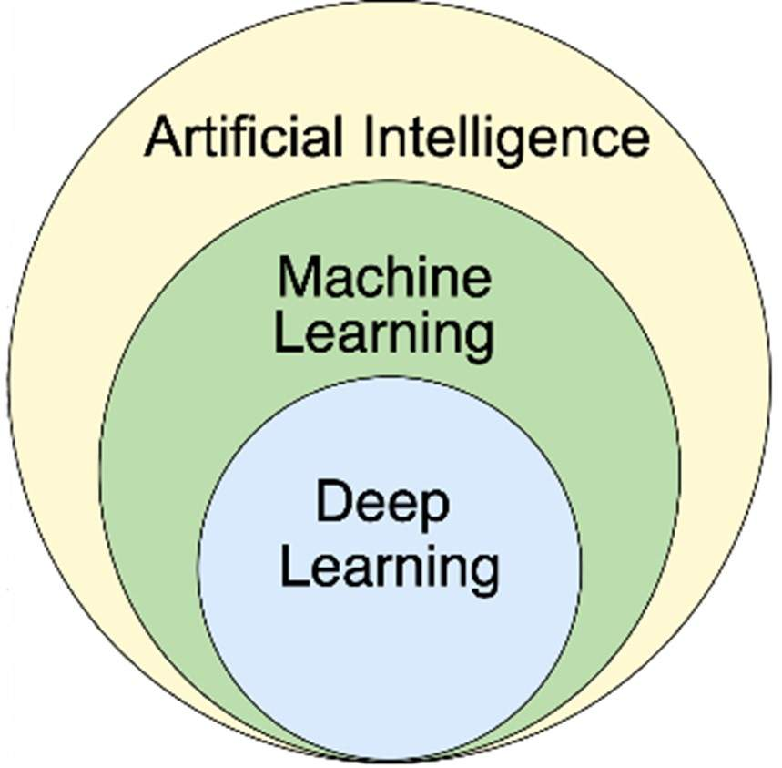
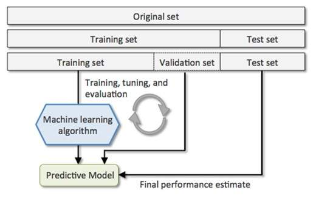
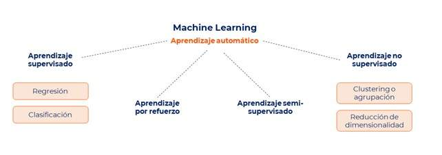
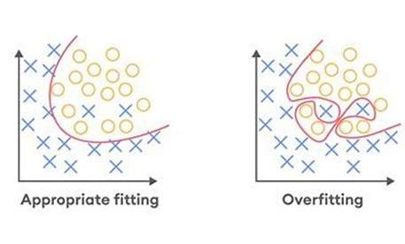

# Unidad 1

Creado: 29 de septiembre de 2025 12:07

Definimos las redes neuronales como el componente esencial de la inteligencia artificial moderna, catalogaremos las IAs según su desarrollo actual destacando aplicaciones prácticas del machine learning centrandonos en las aplicaciones como el perceptrón y el perceptrón multicapa. 

- Redes neuronales Artificiales
- Redes neuronales Artificiales Básicas
- Ejemplos prácticos para crear entrenar y ejecutar ANNS.

## Redes Neuronales Artificiales

Para contextualiza la IA es el conjunto de software creado para imitar la función cognitiva humana, un concepto surgido en los años 40 con un enorme desarrollo actual gracias en parte al surgimiento de conceptos como el big data, que permiten entrenar las redes neuronales a base de gran cantidad de datos y a la velocidad de procesamiento de las maquinas actuales. 

Estos sistemas han evolucionado hasta llegar al machine learning, que es un subconjunto de la IA y al deep learning que a su vez es un subconjunto del machine learning. 

Todas las **aplicaciones actuales de ML** se encuentran dentro de lo que conocemos como **inteligencia Artificial Estrecha (Narrow AI).**  Las inteligencias artificiales actuales comienzan a imitar las capacidades de razonamiento y pensamiento de los seres humanos. No sólo siguen reglas y mantienen el contexto, sino que también simulan los procesos de pensamiento humano. 

Actualmente estamos a mitad de camino de lo que sería la **Inteligencia General Artificial (Artificial General Intelligence-AGI)** que de momento es en gran medida teórica. Estos sistemas podrán comprender, aprender, adaptar y aplicar conocimientos a tareas, de forma similar a la de los seres humanos. 

Hipotéticamente la inteligencia artificial general podría convertirse en **Superinteligencia Artificial (Artificial Superintelligence-ASI)**. La llegada de la inteligencia artificial también trae consigo una serie de **problemas éticos y de seguridad.** 

Para la medición del progreso / destreza de una IA debemos poder definir y evaluar la inteligencia para hacer comparaciones entre sistemas, las propias IA y la inteligencia humana, no siendo realmente suficiente el media únicamente una habilidad completa (debemos medir la inteligencia general). Las **redes neuronales artificiales (ANNs**) imitan el comportamiento del cerebro humano, conocido por su eficiencia en tareas cognitivas complejas y de procesamiento de información. 

### Aplicaciones de las redes neuronales artificiales

Las ANN básicas tienen las siguientes aplicaciones principales: 

- Reconocimiento de patrones simples para clasificar datos sencillos como formas básicas o categorías de texto.
- Tareas de predicción básicas, como la predicción de tendencias en datos simples y lineales.

## Redes Neuronales Artificiales Básicas (ANNs)

Con este punto se potencian los conceptos de preceptrón simple y el multicapa, ampliando su posible integración con el aprendizaje automático y aprendizaje profundo. Se explicará en detalle el algoritmo de retropropagación (backpropagation), siendo esta la técnica de propagación por excelencia, así como la optimización por descenso de gradiente para minimización de la función de perdida que ajusta los peses de la red neuronal y mejora su desempeño en clasificación y regresión. 

Comenzando con esta introducción las redes neuronales artificiales básicas son por definición las arquitecturas mas simples y fundamentales de las redes neuronales, siendo su principal característica su falta de capacidad respecto a sus hermanas mayores y su adecuación para resolver problemas menos complejos. 

### Tipos de Redes neuronales artificiales básicas (ANN)

Existen varios tipos de redes neuronales artificiales, el preceptrón simple es la forma mas básica de red neuronal con una sola capa de salida utilizada mayoritariamente para clasificación lineal donde la función de activación decide si activar o no la neurona basándose en una combinación lineal de entradas y pesos. 

El perceptrón multicapa (MPL) es una red con una o más capas ocultas lo que permite modelar relaciones no lineales mucho mas complejas, con múltiples capas de neuronas algunas ocultas entre la entrada y la salida. Pueden aprender y modelar relaciones no lineales en los datos. 

Además de los perceptrones y de las redes neuronales multicapa, existen otros datos de redes neuronales artificiales básicas, representando fundamentos y conceptos clave en las redes neuronales artificiales. Son las siguientes:

- Redes de Kohonen: Se trata de un tipo de red utilizada para la reducción de dimensionalidad y visualización de datos, su misión es mapear datos de alta dimensión preservando la topología original.
- Redes de Hopfield: son un tipo de red neuronal recurrente utilizadas para el almacenamiento y recuperación de patrones. Las redes de Hopfield son binarias y se usan principalmente en problemas de optimización y de memoria asociativa.
- Máquinas de Boltzman: son redes neuronales estocásticas que pueden aprender distribuciones de probabilidad sobre sus conjuntos de entrada. Las Máquinas de Boltzmann Restringidas (RBM) son una versión simplificada y comúnmente utilizada para tareas de reducción de dimensionalidad, filtrado colaborativo y preentrenamiento de redes neuronales profundas.

Además de estas redes neuronales artificiales básicas, se pueden considerar otras arquitecturas fundamentales que, aunque no son tan comúnmente clasificadas como ‘básicas’, han jugado un papel importante en el desarrollo de la teoría y las aplicaciones de las redes neuronales. Se trata de las Redes de Base Radial (RBF) y de las Máquinas de Vector de Soporte con Kernel (SVM con Kernel).

Estas redes son redes neuronales feedforward con una capa oculta que utiliza tanto 
funciones de base radial como funciones de activación. Son útiles para problemas de clasificación y regresión y las **Máquinas de Vector de Soporte con Kernel (SVM con Kernel)** no son redes neuronales en el sentido tradicional, pero pueden ser vistas como una forma de red neuronal que proyecta datos a un espacio de  mayor dimensión para encontrar un hiperplano de separación óptimo.

## Integración en ML y DL de las ANNs

Las redes neuronales básicas pueden ser utilizadas tanto en machine learning como en deep learning. La principal diferencia radica en la profundidad de la red. Su uso dependerá del contexto y de la complejidad de la tarea.

- En **machine learning**  se pueden utilizar para tareas relativamente simples o con conjuntos de
 datos pequeños y menos complejos. Estas redes neuronales pueden tener una o pocas capas ocultas y se utilizan para problemas donde la complejidad de los datos no requiere una arquitectura profunda con técnicas y algoritmos, incluyendo redes neuronales, aunque no se limitan a ellas. Otros ejemplos de algoritmos de ML son los árboles de decisión, máquinas de vectores de soporte (SVM), K-means, entre otros.
- El **deep learning** se asocia con redes profundas, siendo su principal característica el uso de redes con muchas capas para capturar complejidades elevadas y representaciones más abstractas, pero también puede incluir redes neuronales con una o pocas capas. Se consideran parte del DL en el sentido de que siguen utilizando los principios de aprendizaje profundo, pero con una arquitectura más sencilla.

## **Componentes y funciones de las redes neuronales artificiales (ANNs) básicas**

Las redes neuronales artificiales básicas (ANNs) aprenden y procesan datos a través de capas de entrada, capas ocultas y una capa de salida. Utilizan pesos, sesgos y funciones de activación para modelar y resolver problemas, aprendiendo a capturar relaciones complejas entre entradas y salidas, así como a identificar patrones en los datos. A continuación, se detallan estos componentes y las funciones necesarias para cumplir con su objetivo.

- Las **Neuronas Artificiales** están organizadas en distintas capas dentro de la red siendo los elementos básicos de una RN.
- En la **capa de entrada**, los datos iniciales son recibidos del entorno externo y son pasados a 
la siguiente capa para su procesamiento. Cada neurona aplica una **función de activación** a las **entradas recibidas** (que pueden ser múltiples) y produce una **salida** que puede servir como entrada para las capas siguientes.
- En las **capas ocultas** es donde ocurre la mayor parte del procesamiento y de transformación de
 las entradas. Pueden ser una o varias capas intermedias entre la capa de entrada y la capa de salida. Una red se denomina **profunda** si tiene al menos dos capas ocultas.
- La **capa de salida** es la última capa de la red que produce el resultado final del modelo. Aquí se obtiene la salida final de la red neuronal. Cada nodo en esta capa representa una posible **clase** o **valor** predicho.
- Los **pesos** en las conexiones entre neuronas determinan la importancia de las entradas. Cada entrada se multiplica por un peso ajustable, que es crucial para el funcionamiento y la precisión del modelo. El peso ajusta la influencia de la entrada en la neurona, aprendido durante el entrenamiento.
- Los **sesgos** ajustan la función de activación de cada neurona, permitiendo que el modelo aprenda de manera efectiva. Además de las entradas ponderadas, cada neurona suma un sesgo a la combinación lineal de entradas ponderadas.
- La **función de activación** introduce no linealidades en el modelo, lo que permite a la red aprender y representar relaciones complejas entre los datos. Ejemplos de funciones de activación incluyen la **función sigmoide, ReLU** y **tanh**, cada una con características específicas que las hacen adecuadas para diferentes tipos de problemas. En teoría, una red neuronal puede aprender cualquier función.

## **Algoritmos principales para entrenar las redes neuronales**

El **algoritmo de retropropagación (Backpropagation)** es el método más usado para entrenar redes neuronales. Se basa en el **descenso por gradiente**, ajustando los pesos para minimizar la función de pérdida y mejorar la precisión en tareas como clasificación o regresión.

El proceso consiste en:

1. **Inicializar pesos y sesgos**.
2. **Propagación hacia adelante**: calcular salidas aplicando funciones de activación y obtener la pérdida comparando con los valores esperados.
3. **Propagación hacia atrás**: calcular gradientes del error respecto a cada peso.
4. **Actualización**: modificar pesos y sesgos siguiendo la dirección que reduce la pérdida (usualmente con SGD).

Este ciclo se repite hasta que el error sea suficientemente bajo, permitiendo que la red aprenda a realizar mejor su tarea.

## **Conceptos matemáticos clave de las ANNs**

En **álgebra lineal**,  las entradas, pesos y salidas se representan como vectores y matrices, y las transformaciones lineales se aplican mediante multiplicación de matrices en cada capa. En **cálculo**, es crucial calcular derivadas y gradientes para entender cómo los cambios en los pesos afectan la salida, utilizando el gradiente descendente para ajustar los pesos y minimizar la función de pérdida. 

Las funciones de activación, como Sigmoid, Tanh y ReLU, introducen no linealidades que permiten a las ANN aprender representaciones complejas. La optimización en ANN se basa en la función de pérdida para medir el rendimiento, y se utilizan algoritmos como el gradiente descendente estocástico (SGD), Adam y RMSprop para minimizar esta función. 

En **probabilidad y estadística**, las ANN se aplican a tareas de regresión y clasificación, y se usan técnicas de regularización como L1 y L2 para prevenir el sobreajuste. La teoría de la información aporta conceptos como entropía y entropía cruzada, utilizados en funciones de pérdida para clasificación.

## **Niveles de medición de los datos**

Las bases metodológicas de Machine Learning se fundamentan en los **niveles de medición de los datos**, que determinan cómo deben ser procesados y analizados. Los niveles de medición obligan a elegir ciertos **modelos** y **técnicas** debido a las propiedades de los datos.

- Los **datos nominales y ordinales**, que no requieren operaciones aritméticas, son adecuados para técnicas como la regresión logística, árboles de decisión y redes neuronales con 
codificación adecuada, y generalmente se utilizan para modelos de clasificación.
- los **datos de intervalo y razón** permiten una mayor flexibilidad y son compatibles con una amplia gama de modelos, incluidos la regresión lineal, análisis de componentes principales (PCA) y redes neuronales, utilizados principalmente para modelos de regresión.

La **relación entre los niveles de medición y los modelos cuantitativos/cualitativos** es importante para elegir las técnicas adecuadas.

- Los datos nominales son ideales para **modelos cualitativos**, como técnicas de clasificación y categorización, y suelen ser representados mediante codificación en redes neuronales para tareas de clasificación, por ejemplo, la clasificación de especies de plantas basada en características categóricas.
- Los datos ordinales, aunque categóricos, tienen un orden intrínseco que puede ser utilizado en **modelos cualitativos y cuantitativos,** como los niveles de satisfacción de clientes (bajo, medio, alto).
- Los datos de intervalo permiten operaciones aritméticas y son adecuados para **análisis estadísticos cuantitativos**, como las temperaturas diarias en grados Celsius.
- Los datos de razón, con un verdadero cero, permiten **análisis más completos y precisos**, incluyendo operaciones proporcionales, como los ingresos mensuales o el peso de individuos.

El nivel de medición de los datos influye directamente en el tipo de modelo que se debe utilizar.

### **Metodología para entrenamiento y evaluación**

Una **metodología genérica** es un enfoque estándar utilizado para entrenar y evaluar modelos. Esta metodología incluye pasos comunes como la **preparación de datos**, la **definición del modelo**, el **entrenamiento**, la **evaluación** y la **optimización**, como se puede ver en la imagen de debajo. Es adaptable a una amplia gama de problemas, permitiendo ajustes según las características específicas de los datos y las necesidades del problema.

### **Validación de datos cruzada**

La **validación cruzada** es una técnica para evaluar modelos de *machine learning*. Divide los datos en varios subconjuntos (*folds*), entrenando en algunos y probando en el restante. El proceso se repite hasta que cada fold haya sido usado como prueba. Esto ayuda a prevenir *overfitting* y ofrece una estimación más robusta y generalizable del rendimiento del modelo.

## Aprendizaje supervisado y no supervisado

La **clasificación de datos en aprendizaje automático** se divide en dos enfoques principales:

- **Aprendizaje supervisado**: usa datos con etiquetas conocidas para entrenar un modelo que prediga salidas a partir de entradas. Se aplica en tareas de **clasificación** y **regresión**. Ejemplos de algoritmos: Regresión Lineal, Regresión Logística, SVM, K-NN, Árboles de Decisión, Redes Neuronales y Random Forest.
- **Aprendizaje no supervisado**: trabaja con datos sin etiquetas, buscando **patrones ocultos, agrupaciones o estructuras**. Sus aplicaciones incluyen **clustering**, **reducción de dimensionalidad** y **detección de anomalías**. Ejemplos: K-Means, Clustering Jerárquico, DBSCAN, PCA, t-SNE y Autoencoders.

**Comparación y diferencias clave entre aprendizaje supervisado y no supervisado:**

| **Aspecto** | **Aprendizaje Supervisado**
***Utilizado para las redes neuronales artificiales básicas** | **Aprendizaje No Supervisado** |
| --- | --- | --- |
| **Etiquetas** | Sí | No |
| **Objetivo** | Predecir resultados basados en ejemplos etiquetados | Descubrir patrones ocultos en los datos |
| **Modelos** | Clasificación, regresión | Clustering, reducción de dimensionalidad, detección de anomalías |
| **Evaluación** | Comparación directa con etiquetas verdaderas | Más complejo, suele basarse en métricas internas |
| **Ejemplos** | Clasificación de imágenes, predicción de precios | Segmentación de clientes, compresión de datos |

La **búsqueda de patrones en aprendizaje automático** se aborda de manera distinta según el enfoque:

- **Aprendizaje supervisado**: busca **relaciones entre características y etiquetas conocidas**. El modelo aprende una función que minimiza el error entre predicciones y resultados reales. Ejemplos:
    - Clasificación de correos como *spam* o *no spam*.
    - Clasificación de imágenes (gatos vs. perros).
    - Predicción de precios de viviendas a partir de tamaño, habitaciones y ubicación.
- **Aprendizaje no supervisado**: busca **estructuras ocultas o agrupaciones** sin usar etiquetas. Se centra en detectar similitudes, reducir dimensionalidad o identificar anomalías. Ejemplos:
    - Segmentación de clientes en grupos con hábitos de compra similares.
    - Agrupamiento de datos con *clustering*.
    - Detección de fraudes al encontrar transacciones que no siguen el patrón general.

### **Modelo, conjunto de datos de validación, evaluación del rendimiento y overfitting**

### Modelo

Una **representación matemática** que aprende patrones y relaciones a partir de datos de entrenamiento para realizar tareas como clasificación o predicción. Su calidad depende de la representatividad de los datos.

### Conjuntos de datos

- **Entrenamiento**: usado para que el modelo aprenda.
- **Validación**: permite ajustar hiperparámetros y optimizar el modelo sin sesgar la evaluación.
- **Prueba (test)**: reservado para el final; evalúa de forma objetiva la capacidad de generalización en datos completamente nuevos.

### Evaluación del rendimiento

Se mide con **métricas específicas** según el problema (precisión, exactitud, sensibilidad, etc.), que indican qué tan bien cumple el modelo su tarea.

### Overfitting (sobreajuste)

Ocurre cuando el modelo aprende en exceso los detalles y el ruido de los datos de entrenamiento, perdiendo capacidad de generalización.

- **Síntoma**: rendimiento muy alto en entrenamiento pero bajo en prueba.
- **Soluciones**: regularización, más datos, validación cruzada, selección adecuada de hiperparámetros, simplificación del modelo.

## Modelo de Regresión Lineal

La regresión lineal es uno de los modelos más fundamentales y utilizados en el aprendizaje automático, ya que sirve como punto de partida para comprender técnicas más avanzadas. Su objetivo principal es modelar la relación entre una variable dependiente y una o varias variables independientes, mediante una línea recta —o un hiperplano en dimensiones superiores— que minimiza el error entre los valores reales y los predichos. Este modelo destaca por su simplicidad, facilidad de interpretación y utilidad tanto en la predicción de nuevos datos como en el análisis descriptivo de las relaciones entre variables.

En términos prácticos, la regresión lineal ajusta coeficientes (pendiente e intercepto) a través de métodos como los mínimos cuadrados ordinarios, con el fin de reducir medidas de error como el error cuadrático medio. Además, guarda una estrecha relación con las redes neuronales: un perceptrón básico sin función de activación es equivalente a una regresión lineal, mientras que la introducción de funciones de activación no lineales permite superar sus limitaciones y modelar relaciones más complejas.

Además de su simplicidad y facilidad de interpretación, la regresión lineal también proporciona medidas de incertidumbre en las estimaciones, como los intervalos de confianza para los coeficientes, y estadísticas de ajuste, como el coeficiente de determinación (R²), que indica cuánta variabilidad en la variable dependiente es explicada por el modelo.