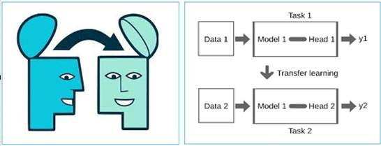

# Unidad 3

Creado: 1 de noviembre de 2025 17:08

# Transfer Learning

Transfer Learning (TL) es una técnica dentro del campo de la inteligencia artificial y del aprendizaje automático basada en la reutilización del conocimiento previamente adquirido por un modelo en una tarea o dominio específico para mejorar el rendimiento en una tarea o dominio diferente pero relacionado.

En lugar de entrenar un modelo desde cero para una nueva tarea, se aprovechan los modelos ya entrenados en otras tareas para transferir su conocimiento a la nueva tarea, ahorrando tiempo y recursos de procesamiento.



## Ejemplos de Transfer Learning

Para comprender mejor este concepto, puedes pensar en cómo prendemos nosotros. Si una persona ya sabe hablar italiano, aprender español puede ser más fácil debido a las similitudes entre ambos idiomas. En este caso, el conocimiento adquirido al aprender italiano (la tarea original) se transfiere y se utiliza para aprender español (la nueva tarea).

De manera similar, en TL, un modelo entrenado para reconocer imágenes de gatos podría ser adaptado para reconocer imágenes de perros con menos datos de entrenamiento, o incluso para reconocer imágenes que no sean de animales.

Un modelo preentrenado en ImageNet puede ser reutilizado como punto de partida para una nueva tarea, por ejemplo, la clasificación de imágenes médicas. En este caso, se pueden aprovechar las capas iniciales del modelo que ya han aprendido a detectar características generales como bordes, texturas, y formas, mientras que las capas finales se ajustan (fine-tuning) a las especificaciones de la nueva tarea.


## Feature Extraction

**Definición general:**

- Técnica de *Transfer Learning* que reutiliza **características intermedias** aprendidas por un modelo preentrenado para una nueva tarea.
- Se extraen representaciones relevantes (*features*) en lugar de emplear el modelo completo.

> “Consiste en utilizar las características aprendidas por una red en una tarea previa como entrada para un nuevo modelo en una tarea diferente.”
> 

---

**Características principales:**

- Aprovecha los **pesos preentrenados** de las capas internas, normalmente las más profundas.
- Solo se **modifica la capa de salida**, adaptándola al número de clases de la nueva tarea.
- **Reduce la necesidad de datos etiquetados**, ya que el modelo base aporta conocimiento previo.
- **Eficiente** en términos de cómputo y almacenamiento, al reutilizar representaciones existentes.
- Las *features* pueden **no ser totalmente adecuadas** si la nueva tarea difiere mucho de la original.

> “Las características transferidas pueden no ser completamente adecuadas para la nueva tarea.”
> 

---

**Proceso general:**

1. Seleccionar un **modelo preentrenado** (por ejemplo, una CNN entrenada en ImageNet).
2. Determinar **qué capas** se usarán para extraer las características (normalmente las últimas convolucionales).
3. **Extraer las representaciones intermedias** de los nuevos datos mediante el modelo preentrenado.
4. **Entrenar un nuevo clasificador** (por ejemplo, una red densa o un SVM) con esas *features*.
5. **Evaluar y ajustar** el modelo resultante según la tarea de destino.

---

**Ejemplo en visión por computador:**

- Utilizar una **CNN entrenada para clasificación de imágenes** con el fin de extraer características visuales.
- Aplicar esas características para una tarea diferente, como **detección de objetos o segmentación**.

> “En visión por ordenador, las características aprendidas por una CNN pueden reutilizarse en diferentes tareas visuales.”
> 

---

**Ventajas:**

- Requiere **menos datos** y **menos tiempo de entrenamiento**.
- **Evita el sobreajuste** en tareas con conjuntos de datos pequeños.
- **Aprovecha el conocimiento general** aprendido por el modelo base.

**Desventajas:**

- Puede haber **pérdida de precisión** si las tareas son poco relacionadas.
- Requiere **seleccionar adecuadamente** las capas y características más útiles.

## Fine Tunning

**Definición general:**

- Técnica de *Transfer Learning* basada en parámetros que **ajusta un modelo preentrenado** a una nueva tarea.
- A diferencia de *Feature Extraction*, **no solo se modifican las capas de salida**, sino que también **se actualizan los pesos de algunas capas previas**.

> “En lugar de entrenar un modelo desde cero, se parte de los parámetros previamente aprendidos y se ajustan (fine-tuning) para adaptarse a la nueva tarea.”
> 

---

**Características principales:**

- Reutiliza los **pesos de un modelo preentrenado** como punto de partida.
- **Congela las primeras capas** (características generales) y **ajusta las últimas capas** (características específicas).
- Permite que el modelo **aprenda detalles propios de la nueva tarea** manteniendo el conocimiento previo.
- **Reduce el tiempo y los recursos de entrenamiento** al aprovechar una base ya entrenada.
- Requiere **cuidado al decidir qué capas congelar y cuáles ajustar**.

> “Las capas inferiores se congelan para preservar el conocimiento aprendido, mientras que las capas superiores se ajustan para la nueva tarea.”
> 

---

**Proceso general:**

1. **Seleccionar un modelo preentrenado** en una tarea amplia (por ejemplo, una CNN entrenada en ImageNet).
2. **Congelar las primeras capas** del modelo, que capturan características generales como bordes y texturas.
3. **Descongelar las capas superiores** para permitir el reajuste de sus pesos durante el nuevo entrenamiento.
4. **Modificar la capa de salida** para adaptarla al número de clases de la nueva tarea.
5. **Entrenar parcialmente el modelo** con la nueva base de datos, ajustando solo las capas descongeladas.
6. **Evaluar el rendimiento** y ajustar el grado de fine-tuning según los resultados.

> “Durante el entrenamiento, tanto la nueva capa de salida como las capas descongeladas se ajustan con los nuevos datos.”
> 

---

**Ejemplo en visión por computador:**

- Una **red convolucional entrenada en ImageNet** se utiliza como base para clasificar un nuevo conjunto de imágenes con menos clases.
- Se **mantienen fijas las primeras capas** y se **reentrenan las últimas**, adaptando el modelo a las nuevas categorías.

> “El modelo ajusta los pesos de las capas descongeladas para adaptarse mejor a las características específicas de la nueva tarea.”
> 

---

**Ventajas:**

- Ahorra **tiempo y recursos** de entrenamiento.
- **Mejor rendimiento** que entrenar desde cero, especialmente con pocos datos.
- Permite **especializar el modelo** en la nueva tarea sin perder del todo el conocimiento previo.

**Desventajas:**

- Si las tareas son **demasiado diferentes**, los parámetros preentrenados pueden **perjudicar el aprendizaje**.
- Riesgo de **sobreajuste** si se descongelan demasiadas capas o si el nuevo conjunto de datos es pequeño.
- Requiere **ajuste cuidadoso de las capas y de la tasa de aprendizaje**.

---

**Aplicación recomendada:**

- Adecuado cuando **la nueva tarea es similar a la original**.
- Ejemplo: reutilizar una red entrenada para clasificar animales y adaptarla a clasificar razas de perros.

> “La transferencia basada en parámetros es adecuada cuando existe una fuerte similitud entre la tarea original y la nueva.”
> 

---

## Transferencia basada en relación (Relational Knowledge Transfer)

Este tipo de Transfer Learning se enfoca en transferir relaciones entre 
datos en lugar de características o parámetros. Aquí el conocimiento 
adquirido en la relación entre datos en una tarea se transfiere a una 
nueva tarea.

> Un ejemplo es el uso de modelos de red neuronal gráfica (GNN), donde las relaciones entre nodos (que representan entidades) en un grafo se transfieren para predecir nuevas relaciones en un grafo diferente.
> 

Otro enfoque es el **aprendizaje multitarea**, donde un modelo aprende a realizar múltiples tareas relacionadas simultáneamente, transfiriendo el conocimiento de las relaciones entre estas tareas.

Aprovecha el conocimiento relacional, que puede ser más robusto y generalizable que características individuales y puede mejorar el rendimiento en tareas donde las relaciones entre los datos son críticas, como en la recomendación de sistemas o en el análisis de redes sociales.

Este tipo de transferencia es especialmente útil en sistemas de recomendación, análisis de redes sociales, y cualquier otro dominio donde las relaciones entre datos jueguen un papel fundamental en la predicción o clasificación.

## **Transferencia basada en dominio (Domain-based Transfer Learning)**

En la **Transferencia basada en dominio** (*Domain-based Transfer learning*), el objetivo es **transferir conocimiento entre dominios diferentes pero relacionados**, incluso si las tareas son las mismas.

- Se busca **aprovechar un modelo entrenado en un dominio fuente** (por ejemplo, imágenes de alta calidad) para **mejorar el rendimiento en un dominio destino** (por ejemplo, imágenes con baja resolución o diferente iluminación).

> “El propósito de la transferencia basada en dominio es aplicar el conocimiento aprendido en un dominio a otro dominio con distribución distinta de datos, pero con la misma tarea.”
> 

---

**Características principales:**

- El **conjunto de datos fuente y destino** difieren en su **distribución o características**, pero **comparten la misma tarea** (por ejemplo, clasificación).
- El modelo debe **adaptarse a las diferencias estadísticas** entre dominios (cambio de iluminación, estilo, resolución, idioma, etc.).
- Utiliza técnicas de **adaptación de dominio (domain adaptation)** o **alineamiento de distribuciones** para reducir la brecha entre ambos dominios.
- El conocimiento se transfiere **ajustando las representaciones aprendidas** para que sean válidas en el nuevo dominio.

> “El reto principal está en que los datos del dominio destino siguen una distribución distinta de los del dominio fuente.”
> 

---

**Proceso general:**

1. **Entrenar un modelo base** en el dominio fuente con una gran cantidad de datos etiquetados.
2. **Obtener datos del dominio destino**, que suelen ser menos numerosos o no etiquetados.
3. **Detectar las diferencias de distribución** entre los dos dominios (por ejemplo, diferentes estilos visuales o condiciones).
4. **Aplicar técnicas de adaptación de dominio**, como:
    - Reentrenamiento parcial del modelo en el nuevo dominio.
    - Alineamiento de características entre dominios (por ejemplo, *Domain-Adversarial Training*).
    - Normalización o ajuste estadístico de las representaciones.
5. **Evaluar el modelo** en el dominio destino y ajustar según los resultados.

---

**Ejemplo práctico:**

- Un modelo entrenado para **reconocer objetos en fotografías reales** puede adaptarse a **dibujos o imágenes sintéticas** sin necesidad de entrenar desde cero.
- En procesamiento del lenguaje natural, un modelo entrenado en **noticias en inglés** puede adaptarse a **textos científicos en inglés** (misma lengua, diferente dominio).

> “El modelo debe aprender a generalizar entre dominios distintos, manteniendo la capacidad de resolver la misma tarea.”
> 

---

**Ventajas:**

- Permite **reutilizar conocimiento** entre dominios relacionados sin necesidad de grandes bases de datos nuevas.
- **Reduce el coste de anotación** y el tiempo de entrenamiento.
- Mejora la **generalización** del modelo en contextos variados.

**Desventajas:**

- Si la **diferencia entre dominios es muy grande**, la transferencia puede fallar o degradar el rendimiento.
- Requiere **técnicas avanzadas de alineamiento** y ajuste fino de las representaciones.
- En algunos casos, puede introducir **sesgos** si los dominios no están bien balanceados.

---

**Aplicación recomendada:**

- Adecuada cuando se **mantiene la misma tarea**, pero el **entorno o los datos cambian**.
- Ejemplos típicos:
    - Transferir modelos de visión entrenados en imágenes sintéticas a imágenes reales.
    - Adaptar sistemas de reconocimiento de voz de un idioma a otro con acentos o ruidos distintos.

---

## Redes a las que se aplican estas técnicas de implementación

Las técnicas de **fine-tuning** y **feature extraction** no se limitan exclusivamente a las redes convolucionales (CNN). Aunque es cierto que son comúnmente aplicadas este tipo de redes debido a su uso en tareas de visión por ordenador, estas técnicas pueden ser implementadas en otros tipos de modelos de aprendizaje profundo, dependiendo de la naturaleza de la tarea y la arquitectura del modelo. 

> Son de utilidad por ejemplo para las Redes Neuronales Convolucionales (CNN), para las Redes Neuronales Recurrentes (RNN) y algunas variantes (LSTM, GRU), para los modelos Transformer, para las redes FeedForward (perceptrones Multicapa-MLP), para redes autoencoder, para modelos híbridos, etc…
> 

### Retos a los que se enfrenta el TL

Este modelo ofrece una solución interesante para superar los retos del ML tradicional sin embargo presenta los siguientes desafíos:

- Grandes volumenes de datos: para que funcione de forma óptima el modelo es indispensable y su obtención en algunas areas es costoso y poco práctico.
- Elevados costes en recursos: Entrenar de 0 es una tarea que requiere infraestructuras preparadas y tiempo de entrenamiento.
- Dificil aplicación: si entrenamos los modelos en base a un conjunto de datos es dificil que luego se pueda generalizar nuevos datos o tareas distintas.
- Riesgos de Overfitting: el modeli si se entrena con los datos disponibles solo, puede llegar a aprender patrones y tender a generalizar con nuevos datos fallando.

### Beneficios del Transfer Learning

- **Eficiencia con pocos datos:** el modelo ya ha aprendido patrones generales, por lo que necesita menos datos nuevos.
- **Ahorro de tiempo y costes:** evita entrenar desde cero, ya que solo requiere un ajuste (fine-tuning) del modelo.
- **Reutilización de características útiles:** las representaciones aprendidas (como bordes o contexto lingüístico) se aplican a nuevas tareas.
- **Mejor rendimiento en tareas complejas:** especialmente en visión por computador y PLN, donde los datos suelen ser limitados.
- **Mayor capacidad de generalización:** ayuda a manejar diferencias entre dominios o distribuciones de datos, adaptándose a nuevas tareas con flexibilidad.

## Aplicaciones del Transfer Learning

El **Transfer Learning** tiene un papel fundamental en muchos campos de la inteligencia artificial moderna, ya que permite aprovechar el conocimiento adquirido por modelos preentrenados para resolver nuevos problemas con menos datos o recursos. Esto hace que sea una herramienta muy útil en ámbitos donde obtener grandes conjuntos de datos etiquetados es costoso o complicado.

### Visión por Ordenador

Primeramente el claro exponente es el campo de la visión por ordenador, Transfer Learning ha permitido que modelos preentrenados en grandes conjuntos de datos, como ImageNet, se ajusten y adapten para resolver problemas específicos con menores volúmenes de datos etiquetados.

- **Medicina:** se usa en diagnóstico por imágenes (radiografías, resonancias, tomografías) para detectar enfermedades como cáncer o fracturas, mejorando la precisión y rapidez del diagnóstico incluso con datos limitados.
- **Seguridad:** optimiza sistemas de videovigilancia y monitoreo en tiempo real, ajustando modelos para reconocer comportamientos anómalos, intrusiones o movimientos sospechosos en distintos entornos.
- **Detección de anomalías:** permite identificar desviaciones de patrones normales, reforzando la prevención en ámbitos públicos y privados.
- **Vehículos autónomos:** mejora los sistemas de visión artificial para detectar señales, peatones, obstáculos y otros vehículos. Los modelos se adaptan a distintas condiciones climáticas y urbanas, aumentando la precisión, seguridad y eficiencia del aprendizaje.

### Procesamiento del lenguaje natural (NLP)

Modelos como BERT, GPT o RoBERTa se entrenan con enormes corpus de texto y luego se ajustan para tareas concretas como traducción automática, análisis de sentimientos, generación de texto o respuesta a preguntas. 

> Este enfoque permite que los sistemas entiendan el contexto y la semántica del lenguaje humano con mucha más profundidad, reduciendo la necesidad de entrenar un modelo desde cero para cada aplicación lingüística.
> 

### Sector Automovilístico

El Transfer Learning se utiliza en el desarrollo de sistemas de conducción autónoma y asistencia al conductor. Los modelos preentrenados en tareas de reconocimiento visual o detección de peatones se adaptan para analizar entornos de tráfico reales, identificar señales, predecir el movimiento de otros vehículos o incluso detectar condiciones peligrosas en la carretera.

> Esto reduce el tiempo y el coste necesarios para entrenar modelos de visión y decisión en este tipo de sistemas complejos.
> 

### Finanzas y Banca

Se aplica al análisis de riesgos, la detección de fraudes y la predicción de mercados. Por ejemplo, un modelo que ha aprendido a detectar patrones anómalos en transacciones puede adaptarse a un nuevo país o sistema financiero con solo unos pocos ajustes. También se usa para analizar el comportamiento de los clientes, recomendar productos financieros personalizados o prever fluctuaciones bursátiles basándose en datos históricos y noticias.

### Redes Sociales

Modelos lingüísticos preentrenados pueden adaptarse para detectar emociones, opiniones o tendencias en comentarios, publicaciones o reseñas. Esto resulta clave para medir la percepción pública de una marca, analizar el impacto de campañas políticas o entender cómo reacciona la sociedad ante determinados eventos. 

> Al reutilizar modelos entrenados con grandes volúmenes de texto, se obtiene una comprensión más precisa del tono y la intención de los mensajes.
> 

### Marketing y Publicidad

Ayuda a personalizar la experiencia del usuario y optimizar campañas publicitarias. Los modelos se adaptan para predecir preferencias, segmentar audiencias o recomendar productos basándose en comportamientos previos. Gracias a la transferencia de conocimiento desde modelos entrenados con grandes bases de datos de usuarios, las empresas pueden crear estrategias más efectivas y con menor coste computacional.

### Ciencias Ambientales

Se emplea para analizar grandes volúmenes de datos provenientes de sensores, satélites o redes eléctricas. Modelos preentrenados en visión o en series temporales se adaptan para detectar deforestación, predecir fenómenos meteorológicos, optimizar el consumo energético o identificar fugas en infraestructuras críticas. 

> Este uso del Transfer Learning permite acelerar la investigación científica y desarrollar soluciones más sostenibles e inteligentes ante los desafíos climáticos actuales.
> 

## Componentes del Transfer Learning

### Modelo base

El **modelo base** (base model, backbone, pretrained model) es el punto de partida en Transfer Learning: es el modelo ya entrenado en una tarea amplia y grande (por ejemplo, clasificación en ImageNet o preentrenamiento con grandes corpus textuales) cuya representación de conocimiento vamos a reutilizar. Su papel es **proveer pesos y una arquitectura** que ya capturan patrones útiles (bordes, texturas, sintaxis, semántica, etc.), de modo que podamos ahorrar tiempo de entrenamiento y datos al adaptarlo a una tarea específica.

Qué contiene y por qué importa

- Arquitectura: define la capacidad y el tipo de patrones que puede aprender (por ejemplo, una CNN profunda como ResNet es buena para imágenes; un Transformer como BERT/GPT para texto).
- Pesos preentrenados: parámetros aprendidos que actúan como detectores generales (features de bajo y medio nivel). Reusar estos pesos acelera convergencia y mejora rendimiento con pocos datos.
- Capacidad de adaptación: algunos backbones son más fáciles de ajustar (p. ej. MobileNet o EfficientNet en dispositivos móviles) mientras que otros ofrecen mayor representación pero son costosos (p. ej. ResNet-152, transformer grandes).

**Ejemplos concretos (por dominio)**

- Visión por ordenador: ResNet, VGG, Inception, EfficientNet, MobileNet. Preentrenados en ImageNet suelen usarse como base para clasificación, detección (cuando se acoplan a R-CNN/YOLO/SSD) o segmentación (con U-Net o DeepLab).
- NLP: BERT, RoBERTa, DistilBERT, GPT-family, T5. Se usan como encoders/decoders para clasificación, extracción de entidades, generación o preguntas y respuestas.
- Audio / voz: WaveNet, VGGish, wav2vec. Reutilizados para reconocimiento de voz, clasificación de audio o detección de eventos acústicos.
- Series temporales / señales: modelos basados en LSTM/GRU o Transformer adaptados a forecasting o detección de anomalías.

**¿Cuándo elegir uno u otro?**

- Tamaño del dataset objetivo: con datos muy limitados conviene un modelo más pequeño o uno probado en tareas parecidas; con muchos datos puedes permitirte un backbone más grande y hacer más fine-tuning.
- Recursos computacionales: si debes desplegar en dispositivo, prioriza MobileNet, EfficientNet-lite, DistilBERT; para servidor con GPU/TPU puedes usar modelos grandes.
- Similitud de tarea: si la tarea objetivo es cercana a la tarea del preentrenamiento (imagen natural ↔ imagen natural), transferencia será más efectiva. Si es muy distinta (imágenes médicas vs ImageNet), quizás convenga reentrenar más capas o buscar un modelo preentrenado en un dominio más cercano.
- Latencia y eficiencia: para aplicaciones en tiempo real, escoger un backbone eficiente importa tanto como la precisión.

**Estrategias de uso del modelo base**

- Usarlo como *feature extractor*: congelas la mayoría o todo el modelo base y solo entrenas un clasificador encima (útil con pocos datos y cuando las features ya sirven).
- Fine-tuning parcial: descongelas algunas capas superiores (más cercanas a la salida) y las ajustas junto con la nueva cabeza. Equilibrio entre adaptación y sobreajuste.
- Fine-tuning completo: descongelar todo y reentrenar (necesita más datos y cuidado con la tasa de aprendizaje).
- Reusar arquitectura + inicializar pesos desde cero: a veces interesa la arquitectura pero no transferir los pesos (cuando el dominio es muy distinto).

**Ventajas y riesgos**

- Ventajas: acelera entrenamiento, mejora generalización con pocos datos, reduce coste de etiquetado, permite resultados competitivos sin entrenar desde cero.
- Riesgos: sesgos heredados del dataset de preentrenamiento, performance subóptima si el dominio es demasiado diferente, posible sobreajuste si haces fine-tuning sin regularización adecuada.

**Práctica: pasos comunes para usar un modelo base**

1. Escoger un backbone preentrenado apropiado al dominio y restricciones (precisión vs recursos).
2. Cargar pesos preentrenados (biblioteca: PyTorch, TensorFlow, Hugging Face, etc.).
3. Reemplazar o añadir la cabeza según la nueva función (clasificador, regresor, detector).
4. Decidir qué capas congelar/descongelar.
5. Ajustar tasa de aprendizaje (por ejemplo: lr más baja para capas preentrenadas, lr mayor para la nueva cabeza).
6. Entrenar/validar y monitorizar sobreajuste; usar técnicas como data augmentation, regularización y early stopping.

**Ejemplo:**

- Visión (PyTorch, usar como feature extractor):

```python
import torchvision.models as models
import torch.nn as nn

base = models.resnet50(pretrained=True)    # modelo base con pesos ImageNet
for param in base.parameters():
    param.requires_grad = False            # congelar todo

# reemplazar la cabeza
num_ftrs = base.fc.in_features
base.fc = nn.Linear(num_ftrs, num_classes)  # nueva cabeza entrenable
```

**Consejos prácticos y heurísticas**

- Si hay <1k ejemplos, empezar por usar el modelo base como extractor y entrenar solo la cabeza.
- Si los resultados se estancan, descongelar gradualmente capas superiores y usar una lr pequeña (p. ej. 1e-5 a 1e-4).
- Aplicar augmentations (imágenes) o técnicas de regularización (dropout, weight decay) para evitar sobreajuste.
- Probar varias semillas y guarda checkpoints: la variabilidad puede ser grande al ajustar pesos finos.
- Revisar licencias del checkpoint (algunos modelos tienen restricciones comerciales).

**Casos reales:** 

- Detectar tumores en radiografías: suele comenzarse con un modelo preentrenado en imágenes naturales y luego hacer fine-tuning extenso, o preferir modelos preentrenados en imágenes médicas si existen.
- Chatbots para soporte: se parte de un modelo como BERT o T5 y se fine-tunea con conversaciones y FAQs de la empresa para que entienda el lenguaje y dominio específicos.

### Features (características)

En Transfer Learning, las **features** son las **representaciones internas o patrones** que el modelo aprende a detectar durante su entrenamiento previo. En esencia, son la “base de conocimiento” que se transfiere del modelo base a la nueva tarea.

Estas características son lo que hace útil la transferencia: en lugar de aprender desde cero, el nuevo modelo aprovecha esas representaciones ya aprendidas —por ejemplo, bordes y texturas en imágenes, o relaciones sintácticas y semánticas en texto— y las adapta a su nuevo contexto.

**Tipos de características según el dominio**

- **Visión por ordenador:**
    
    En redes convolucionales (CNN), las primeras capas aprenden *features de bajo nivel* (bordes, colores, esquinas), las intermedias detectan *formas o texturas*, y las últimas capturan *conceptos de alto nivel* (caras, ruedas, hojas, etc.).
    
    Durante la transferencia, se suelen conservar las capas que generan las features generales y se modifican las últimas capas para adaptar el modelo a la nueva tarea.
    
- **Procesamiento del lenguaje natural (NLP):**
    
    En modelos Transformer, las primeras capas capturan *patrones de palabras* (morfología, gramática), las intermedias detectan *contexto* y las últimas entienden *significado global o intención*.
    
    En TL, estas features permiten que el modelo reconozca el tono o tema de nuevos textos con poca adaptación.
    
- **Audio y series temporales:**
    
    En redes recurrentes (LSTM, GRU) o CNN 1D, las features representan patrones de frecuencia, ritmo o correlaciones temporales.
    
    Por ejemplo, un modelo entrenado para reconocer sonidos puede reutilizar sus features para identificar fallos en maquinaria o detectar emociones en voz.
    

**Cómo se reutilizan las features**

1. **Extracción directa (Feature Extraction):**
    
    Se toma el modelo base (por ejemplo, ResNet50 sin su capa final) y se usa su salida intermedia como vector de características. Luego se entrena un clasificador ligero (SVM, MLP, etc.) sobre esas features.
    
    - Muy usado cuando hay *pocos datos* o el dominio es *parecido* al original.
    - Ejemplo: usar un modelo entrenado en ImageNet para obtener embeddings de imágenes de radiografías y entrenar solo una capa final para distinguir sano/enfermo.
2. **Ajuste de features (Fine-Tuning):**
    
    Se permite que parte del modelo base actualice sus pesos durante el entrenamiento. Esto afina las features para que encajen mejor con la nueva tarea.
    
    - Recomendado cuando el dominio tiene *diferencias moderadas* respecto al original.
    - Ejemplo: ajustar capas superiores de BERT para análisis de sentimientos en un idioma o sector concreto.
3. **Reentrenamiento de features:**
    
    Si el dominio es *muy distinto* (p. ej. imágenes médicas vs fotos naturales), puede ser mejor reentrenar más capas o incluso todo el modelo, usando las features iniciales solo como punto de partida.
    

**Características buenas vs malas**

- **Buenas features:** generalizan bien a nuevos datos, son compactas y capturan patrones relevantes.
- **Malas features:** están sobreajustadas, dependen de ruido o de detalles irrelevantes del dataset original.

El objetivo del Transfer Learning es **maximizar la reutilización de features útiles** y minimizar la necesidad de aprender nuevas desde cero.

**Ejemplo conceptual**

- En una CNN entrenada en millones de imágenes, las primeras capas actúan como *detectores universales* de patrones visuales. Si adaptamos ese modelo para identificar tipos de plantas, solo necesitamos ajustar las últimas capas que combinan esas features para clasificar las hojas específicas.
- En NLP, BERT genera *embeddings contextuales*: un vector numérico por palabra que representa su significado según el contexto. Estos embeddings son las features reutilizables que se aprovechan en tareas como resumen de texto, clasificación o detección de spam.

**Consejos prácticos**

- Cuanto más parecidos sean los dominios, más capas (y features) se pueden reutilizar.
- Si el nuevo conjunto de datos es pequeño, conviene congelar la mayoría de las features.
- Si es grande o muy distinto, permite que el modelo actualice las capas más profundas.
- Visualizar las features (por ejemplo, con PCA o t-SNE) puede ayudar a comprobar si las representaciones del modelo separan bien las clases.

### Fine-Tuning

El **Fine-Tuning** (ajuste fino) es la fase en la que **se adaptan los pesos del modelo base** a la nueva tarea o dominio. En lugar de usar las features tal cual, se permite que algunas o todas las capas del modelo **sigan aprendiendo** con el nuevo conjunto de datos. Es una de las técnicas clave del Transfer Learning porque ajusta el conocimiento general previo a las necesidades específicas del nuevo problema.

**Concepto general**

Durante el preentrenamiento, el modelo aprende representaciones amplias del mundo (por ejemplo, qué es un borde o cómo se relacionan las palabras). El Fine-Tuning “refina” ese conocimiento para que funcione bien en un contexto más concreto.

Se trata de **reutilizar los pesos preentrenados** pero **continuar el entrenamiento**, con un *learning rate* más bajo, para que el modelo no “olvide” lo que ya sabe (fenómeno conocido como *catastrophic forgetting*).

En resumen:

> Se conserva la base del conocimiento, pero se especializa para la nueva tarea.
> 

**Estrategias comunes de Fine-Tuning**

1. **Fine-Tuning parcial:**
    
    Solo se actualizan las últimas capas del modelo, mientras las primeras se mantienen congeladas.
    
    - Ideal cuando el dominio es similar al original y hay pocos datos.
    - Ejemplo: usar un ResNet preentrenado en ImageNet y ajustar solo las últimas capas para clasificar radiografías.
2. **Fine-Tuning progresivo:**
    
    Se van descongelando capas poco a poco durante el entrenamiento.
    
    - Útil cuando el nuevo dominio es algo más diferente y se necesita adaptar más profundamente las features.
    - Ejemplo: entrenar BERT para lenguaje médico, liberando progresivamente más capas del encoder.
3. **Fine-Tuning total:**
    
    Se reentrenan todas las capas del modelo con una tasa de aprendizaje muy pequeña.
    
    - Se usa cuando hay muchos datos o el dominio es distinto.
    - Ejemplo: adaptar un modelo entrenado en texto general a uno de lenguaje jurídico o financiero.

**Parámetros y buenas prácticas**

- **Learning rate:**
    
    Usar una tasa de aprendizaje más baja que la de un entrenamiento desde cero (p. ej. 1e-5 o 1e-6).
    
    A veces se emplean *learning rate schedules* o tasas diferentes por capas: las inferiores aprenden más lento, las superiores más rápido (*discriminative learning rates*).
    
- **Regularización:**
    
    Dropout, weight decay o early stopping ayudan a evitar sobreajuste, especialmente con datasets pequeños.
    
- **Data augmentation:**
    
    En visión, rotaciones, recortes o cambios de color; en texto, sinónimos o traducción inversa. Aumentar la variabilidad ayuda a que el Fine-Tuning no memorice ejemplos.
    
- **Monitorización:**
    
    Evaluar continuamente con un conjunto de validación para detectar cuándo el modelo empieza a sobreajustarse (suele ocurrir rápido).
    

**Cuándo conviene usar Fine-Tuning**

- Cuando el nuevo dataset tiene *tamaño moderado o grande*.
- Cuando el dominio es *diferente pero relacionado* (por ejemplo, texto técnico vs texto general).
- Cuando se necesita una adaptación más precisa que la que da la simple extracción de features.

**Ejemplos prácticos**

- **Visión:**
    
    Un modelo preentrenado en fotos naturales (ImageNet) se ajusta para clasificar imágenes de microscopio. Se descongelan las últimas capas y se entrena con learning rate bajo.
    
- **NLP:**
    
    BERT se fine-tunea con pocas frases etiquetadas para análisis de sentimientos. Solo la parte del *encoder* y la cabeza final se ajustan, manteniendo la semántica general del lenguaje.
    
- **Audio:**
    
    Un modelo como wav2vec2 preentrenado en grandes volúmenes de audio se fine-tunea con clips médicos para reconocer anomalías cardíacas en sonidos.
    

**Ventajas y riesgos**

- **Ventajas:**
    - Mejora la precisión frente a usar el modelo congelado.
    - Adapta el modelo al dominio real de trabajo.
    - Permite aprovechar modelos grandes sin tener que entrenarlos desde cero.
- **Riesgos:**
    - Si la tasa de aprendizaje es alta, el modelo puede olvidar lo aprendido.
    - Si el dataset nuevo es pequeño, puede sobreajustarse rápidamente.
    - Requiere más recursos que el uso como simple feature extractor.

**Ejemplo (visión con PyTorch):**

```python
import torchvision.models as models
import torch.nn as nn

model = models.resnet50(pretrained=True)
num_ftrs = model.fc.in_features
model.fc = nn.Linear(num_ftrs, num_classes)

# Fine-tuning parcial: solo entrenar capas superiores
for name, param in model.named_parameters():
    if "layer4" not in name and "fc" not in name:
        param.requires_grad = False

```

### Adaptación del Dominio

La **Adaptación del Dominio (Domain Adaptation)** es una de las partes más importantes del Transfer Learning. Se refiere al proceso de **ajustar un modelo preentrenado para que funcione correctamente en un dominio diferente** del original. Es decir, cuando el conjunto de datos nuevo tiene características distintas (distribución, estilo, ruido, contexto), el modelo necesita adaptarse para mantener un buen rendimiento.

Por ejemplo, un modelo entrenado con imágenes de animales en color puede fallar al clasificar radiografías médicas en blanco y negro si no se realiza una correcta adaptación del dominio.

---

**Concepto clave:**

En Transfer Learning, hay dos dominios:

- El **dominio origen**, donde se entrena el modelo base.
- El **dominio destino**, donde se aplica.

Si ambos dominios son muy parecidos, la transferencia funciona fácilmente. Pero cuando son distintos (por tipo de datos, estilo o condiciones), el modelo necesita una *adaptación del dominio* para reducir esa brecha.

---

**Tipos de diferencias entre dominios**

- *Diferencia de distribución:* los datos del dominio destino tienen otra distribución estadística (por ejemplo, fotos tomadas con distinta iluminación o cámaras).
- *Diferencia de representación:* los datos tienen formato distinto (texto vs audio, o distintas resoluciones de imagen).
- *Diferencia de contexto:* la tarea puede ser similar, pero los significados cambian (sentimientos en reseñas de películas vs reseñas de productos).

---

**Técnicas comunes de adaptación**

1. **Fine-Tuning del modelo base:**
    
    Ajustar algunas capas para que el modelo aprenda las características del nuevo dominio.
    
    Ejemplo: adaptar una CNN entrenada en fotos normales para imágenes de satélite.
    
2. **Reentrenamiento parcial o total:**
    
    Si el dominio es muy distinto, se reentrenan más capas o todo el modelo con datos del nuevo dominio.
    
3. **Adaptación no supervisada (Unsupervised Domain Adaptation):**
    
    Se usa cuando el dominio destino **no tiene etiquetas**. Se intenta alinear las distribuciones de los dos dominios mediante técnicas como:
    
    - *Adversarial training* (modelos tipo GAN que hacen que las features del dominio origen y destino sean indistinguibles).
    - *Feature alignment* (emparejar representaciones internas entre dominios).
4. **Adaptación basada en datos sintéticos:**
    
    Cuando hay pocos datos del dominio destino, se generan datos artificiales similares (por ejemplo, usando *data augmentation* o modelos generativos).
    
5. **Domain-specific normalization:**
    
    Algunas redes usan distintas estadísticas (media y varianza) para normalizar datos de cada dominio, ayudando al modelo a ajustarse sin alterar todos los pesos.
    

---

**Ejemplos prácticos**

- *Visión por ordenador:* adaptar un modelo entrenado en imágenes naturales a radiografías, imágenes térmicas o satelitales.
- *NLP:* ajustar BERT general a lenguaje legal, médico o financiero.
- *Audio:* transferir un modelo de reconocimiento de voz entrenado en inglés a otro idioma con poca data.

---

**Indicadores de que necesitas adaptación de dominio**

- El modelo preentrenado rinde mal en el nuevo dataset.
- Los datos tienen diferente estilo, fuente o condiciones de captura.
- Aparece *domain bias*: el modelo confunde ejemplos por su procedencia, no por su contenido.

---

**Buenas prácticas**

- Recolectar una pequeña muestra etiquetada del nuevo dominio para calibrar el modelo.
- Usar *fine-tuning progresivo* (descongelar capas gradualmente).
- Mezclar datos de ambos dominios durante el entrenamiento para suavizar la transición.
- Aplicar regularización para evitar sobreajuste al nuevo dominio.

> Un modelo de detección de peatones entrenado con imágenes diurnas puede fallar de noche. Para adaptarlo, se recopilan algunas imágenes nocturnas y se hace *fine-tuning* con *data augmentation* que simule poca luz o reflejos. Así, las nuevas features aprenden las condiciones del dominio destino sin perder lo aprendido en el origen.
> 

### Evaluación del rendimiento

La **Evaluación del rendimiento** en Transfer Learning es el proceso de **medir cómo de bien se adapta el modelo transferido a la nueva tarea o dominio**. Es fundamental porque un modelo que funcionaba bien en el dominio original puede no rendir igual en el nuevo, y la única forma de comprobarlo es mediante una evaluación cuidadosa y comparativa.

---

**Objetivo principal**

Determinar si la transferencia ha sido efectiva: si las *features* aprendidas y el *fine-tuning* realmente mejoran el desempeño respecto a entrenar un modelo desde cero o usar el modelo base sin ajustes.

---

**Aspectos clave a evaluar**

1. **Rendimiento en el dominio destino:**
    
    El punto más importante. Se evalúa con los datos del nuevo dominio usando métricas apropiadas según la tarea (precisión, recall, F1-score, etc.).
    
2. **Capacidad de generalización:**
    
    Se mide cómo responde el modelo ante ejemplos nuevos o condiciones diferentes dentro del dominio destino. Un buen modelo transferido no debe memorizar los pocos datos nuevos, sino generalizar correctamente.
    
3. **Comparación con modelos base y de referencia:**
    - Comparar el modelo transferido con el modelo original (sin fine-tuning) muestra cuánto mejora la adaptación.
    - Compararlo con un modelo entrenado desde cero permite comprobar si la transferencia realmente aporta ventajas.
4. **Estabilidad del entrenamiento:**
    
    Analizar si el modelo converge más rápido o si el aprendizaje es inestable. Un TL bien aplicado suele reducir el tiempo de convergencia.
    

---

**Métricas más usadas**

- *Clasificación:* precisión (accuracy), recall, F1-score, AUC-ROC.
- *Regresión:* error cuadrático medio (MSE), error absoluto medio (MAE), R².
- *Detección / segmentación:* IoU (Intersection over Union), mAP (mean Average Precision).
- *NLP:* exactitud, BLEU (traducción), Perplexity, F1 (clasificación de texto).

En la práctica, siempre se recomienda usar más de una métrica para tener una visión completa del comportamiento del modelo.

---

**Evaluación en distintos escenarios**

- **Fine-tuning parcial:** comprobar si la precisión mejora sin sobreajuste.
- **Fine-tuning total:** verificar que el modelo no olvida conocimiento del dominio original (evaluación cruzada entre ambos dominios si es posible).
- **Adaptación de dominio:** comparar el rendimiento antes y después de aplicar técnicas de adaptación, midiendo la reducción de la brecha de rendimiento.

---

**Técnicas de validación**

- **Train/Validation/Test Split:** separar adecuadamente el conjunto de datos del dominio destino.
- **Cross-validation:** útil si el dataset nuevo es pequeño; asegura una evaluación más estable.
- **Learning curves:** observar cómo evoluciona la pérdida y la precisión para detectar sobreajuste o subentrenamiento.

---

**Evaluación del coste y eficiencia**

Además de la precisión, conviene evaluar:

- Tiempo de entrenamiento tras la transferencia.
- Recursos usados (GPU, memoria).
- Tamaño del modelo y viabilidad para despliegue.

Un modelo más pequeño o rápido puede ser preferible aunque tenga una ligera pérdida de precisión.

---

**Ejemplo:**

Supón que adaptas una ResNet preentrenada en ImageNet para clasificar imágenes médicas.

- Entrenas con 1,000 radiografías y haces fine-tuning parcial.
- Evalúas en un conjunto de validación con *accuracy* y *F1-score*.
- Comparas los resultados con un modelo entrenado desde cero.
    
    Si el modelo transferido logra mayor precisión y converge más rápido, la transferencia fue exitosa.
    

---

**Buenas prácticas**

- Mantener un conjunto de prueba totalmente independiente del entrenamiento.
- Evaluar también interpretabilidad y posibles sesgos heredados.
- Medir el impacto de cada etapa del TL (modelo base, features, fine-tuning).
- Documentar métricas antes y después del ajuste para justificar el beneficio real.

### Dominio origen y dominio destino

En Transfer Learning, los conceptos de **dominio origen** y **dominio destino** son fundamentales. Ambos definen **de dónde proviene el conocimiento** y **a dónde se quiere aplicar**.

- El **dominio origen** es el conjunto de datos y tareas en los que el modelo se entrena originalmente.
- El **dominio destino** es el nuevo conjunto de datos o problema al que se transfiere ese conocimiento.

La idea principal del TL es que lo aprendido en el dominio origen (D_S) sea **útil** para resolver tareas en el dominio destino (D_T), incluso cuando estos no son exactamente iguales.

---

**Definición formal**

Un **dominio (D)** se describe por dos elementos:

- **X:** el espacio de entrada o características (imágenes, texto, audio, etc.)
- **P(X):** la distribución de probabilidad de esos datos.

Por tanto:

- Dominio origen → D_S = { X_S , P_S(X) }
- Dominio destino → D_T = { X_T , P_T(X) }

Normalmente, en Transfer Learning se cumple que:

- X_S ≈ X_T (los datos son parecidos, pero no idénticos)
- P_S(X) ≠ P_T(X) (la distribución de los datos es diferente)

Esto significa que el tipo de información puede ser el mismo (por ejemplo, imágenes), pero cambia su contexto o estilo (fotos naturales vs radiografías, inglés general vs lenguaje jurídico, etc.).

- Dominio origen (D_S): donde el modelo aprende inicialmente.
- Dominio destino (D_T): donde se aplica el conocimiento aprendido.
- Condición común:
    - Mismo tipo de datos, distinta distribución (P_S(X) ≠ P_T(X)).
- Clave: cuanto más parecidos sean los dominios, mejor funciona la transferencia.

---

**Ejemplos en distintos campos**

- *Visión por ordenador:*
    - Dominio origen: dataset **ImageNet** con millones de imágenes de objetos comunes.
    - Dominio destino: imágenes médicas (radiografías, resonancias).
        
        El modelo reutiliza el conocimiento general sobre formas y texturas para detectar patrones médicos específicos.
        
- *Procesamiento del lenguaje natural:*
    - Dominio origen: textos generales como Wikipedia o Twitter.
    - Dominio destino: documentos legales o correos de atención al cliente.
        
        El modelo ya entiende la estructura del lenguaje y solo necesita adaptarse al nuevo vocabulario.
        
- *Audio:*
    - Dominio origen: grabaciones de voz general (audiolibros, YouTube).
    - Dominio destino: llamadas telefónicas o grabaciones médicas.

---

**Importancia de la relación entre dominios**

El éxito del Transfer Learning depende de **cuánta similitud hay entre el dominio origen y el destino**.

- Si los dominios son **muy parecidos**, la transferencia suele ser directa y efectiva.
- Si son **muy distintos**, se necesita un proceso de *adaptación de dominio* (Domain Adaptation) para ajustar las representaciones aprendidas.

Una mala elección de dominios puede provocar **negative transfer**, es decir, que el modelo empeore su rendimiento al aplicar conocimiento inadecuado.

---

**Ejemplo:** 

1. Entrenamos una red en **ImageNet** → aprende bordes, colores, texturas.
2. La transferimos a un dataset de **plantas medicinales**.
    - El dominio destino cambia: nuevas clases, distinta iluminación, otro contexto.
3. Gracias al TL, el modelo no parte de cero: conserva la base visual aprendida y se adapta con menos datos y entrenamiento.

---

## Función de tarea

En Transfer Learning, la **función de tarea** (task function) define **qué objetivo se busca resolver** con los datos del dominio, es decir, **qué salida o predicción debe aprender el modelo**.

Cada dominio tiene asociada una tarea concreta, y el TL se basa en **transferir el conocimiento aprendido en una tarea del dominio origen** para **mejorar el rendimiento en una tarea del dominio destino**.

---

**Definición formal**

Una tarea (T) se describe por:

- **Y:** el espacio de etiquetas o salidas posibles.
- **f(x):** la función objetivo que el modelo aprende, es decir, cómo se mapean los datos de entrada (X) con las etiquetas (Y).

Por tanto:

- Tarea origen → T_S = { Y_S , f_S(X) }
- Tarea destino → T_T = { Y_T , f_T(X) }

En la práctica, el objetivo del TL es **mejorar f_T** usando el conocimiento de **f_S**, especialmente cuando el dominio destino tiene pocos datos o etiquetas.

---

**Ejemplo general**

- En el dominio origen, un modelo aprende a **clasificar imágenes de objetos comunes** (T_S).
- En el dominio destino, esa experiencia se usa para **clasificar imágenes médicas** (T_T).
    
    Aunque las clases cambian, las bases visuales (bordes, formas, texturas) son reutilizables.
    

---

**Tipos de relación entre tareas**

1. **Tareas iguales, dominios distintos**
    - Ejemplo: Clasificación de gatos y perros en fotos normales (origen) → Clasificación de gatos y perros en cámaras térmicas (destino).
    - Se transfiere la misma tarea, pero con datos diferentes.
2. **Tareas diferentes, dominio similar**
    - Ejemplo: Clasificación de imágenes (origen) → Detección de objetos en las mismas imágenes (destino).
    - Se aprovechan las mismas representaciones visuales, pero con un objetivo distinto.
3. **Tareas y dominios diferentes**
    - Ejemplo: Clasificar texto en opiniones positivas/negativas (origen) → Detectar intención en correos de soporte (destino).
    - Requiere más adaptación, pero la base lingüística sigue siendo útil.

---

**Importancia de la función de tarea**

- Define el **tipo de aprendizaje**: clasificación, regresión, segmentación, generación de texto, etc.
- Determina **qué partes del modelo base pueden reutilizarse** (por ejemplo, las capas convolucionales en visión o las capas de atención en NLP).
- Cuanto más relacionada esté la tarea destino con la tarea origen, **más eficiente será la transferencia**.

**Ejemplo:**

- *Visión:* un modelo entrenado para identificar 1000 clases en ImageNet puede adaptarse a detectar tipos de frutas o células.
- *NLP:* BERT, preentrenado con tareas de predicción de palabras, se ajusta para tareas nuevas como análisis de sentimientos o clasificación de textos.