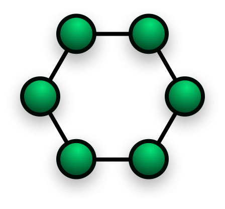
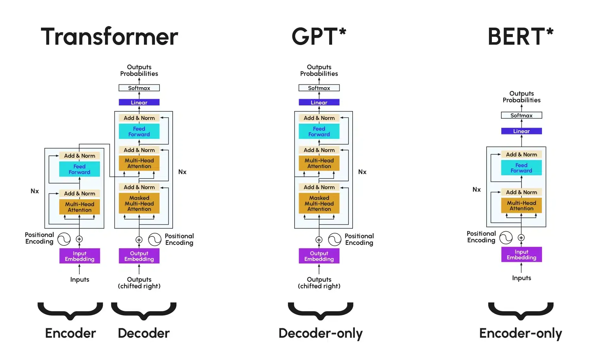

# Unidad 5

Creado: 9 de diciembre de 2025 12:04

## Topologías Comunes

Una de las características más relevantes de las redes neuronales es su topología, es decir, la forma en la que sus neuronas están interconectadas, organizadas y la forma en la que estas neuronas interactúan entre sí.

Cada topología tiene características únicas que la hacen adecuada para diferentes tipos de problemas. Las topologías más conocidas son las siguientes: Redes Neuronales Feedforward, Redes Recurrentes, Redes Convolucionales, Redes Generativas Antagónicas (GAN), Redes Neuronales de Autoencoders, Redes Neuronales Híbridas, Redes de Atención y Transformers… siendo especialmente conocidas las tres primeras. 

### **Redes neuronales Feedforward**

Son redes en las que la información fluye en una única dirección, sin retroalimentación. Esta información fluye desde la capa de entrada hacia la capa de salida, sin ciclos ni bucles.

Estas redes son ideales para tareas donde la salida depende exclusivamente de la entrada actual. Un ejemplo de este tipo de redes son las redes multicapa (MLP).

- Redes Multicapa (MLP): La Red Neuronal Multicapa (MLP) es uno de los tipos más simples de redes neuronales. Su estructura está formada por una capa de entrada, una o varias capas ocultas y una capa de salida. Cada neurona de una capa está conectada a todas las neuronas de la capa siguiente mediante "pesos".
- Una MLP es una red feedforward, lo que significa que la información fluye en una única dirección: desde la entrada hacia la salida, sin retroalimentación. Otro ejemplo de red feedforward es el perceptrón simple, con una única neurona. Características clave:
    - Se utilizan para problemas de clasificación y regresión.
    - Cada nodo en una capa está completamente conectado a los nodos de la siguiente capa.
    - Los ajustes de los pesos se realizan mediante el algoritmo de
    backpropagation, basado en la minimización de una función de error. Este algoritmo se utiliza en la fase de entrenamiento.
        
        
        
- Redes Completamente conectadas: En una red completamente conectada cada neurona de una capa está conectada con todas las neuronas de la capa siguiente. Este tipo de red es un caso particular de la MLP, donde todas las capas de la red siguen esta estructura, aunque suelen considerarse lo mismo.
    
    Su principal característica es que permite que toda la información se transmita entre capas consecutivas, lo que lo hace útil para tareas de clasificación, reconocimiento de patrones y predicción de datos.
    
    
    

### Redes neuronales recurrentes (RNN)

Las **redes neuronales recurrentes** permiten que la información se retroalimente de las capas anteriores, lo que les permite aprender de secuencias de datos. Estas redes son útiles para tareas con datos secuenciales como series temporales o procesamiento del lenguaje natural. Permiten conexiones cíclicas, ideales para datos secuenciales.

Por ejemplo, las RNN se utilizan con frecuencia en problemas de predicción de texto, donde el contexto de palabras anteriores es relevante para predecir la siguiente palabra en una oración. Ejemplos de RNN son las siguientes: LSTM (Long Short-Term Memory) o GRU (Gated Recurrent Unit).

### Redes neuronales convolucionales

Las redes neuronales convolucionales (CNN) son una clase de redes neuronales especialmente diseñadas para procesar datos que tienen una estructura de cuadrícula, como imágenes. Su topología está inspirada en la organización visual del cerebro, donde se emplean distintas capas para capturar características en diferentes niveles de complejidad.

En una CNN, las neuronas interactúan de manera jerárquica. Las capas iniciales detectan características de bajo nivel (bordes, texturas), mientras que las capas más profundas combinan estas características para identificar formas y patrones más complejos. Esta jerarquía permite que
 las CNN sean especialmente efectivas en tareas de visión por ordenador, donde las características de los datos son complejas y variadas.

### Redes generativas antagónicas (GAN)

Las redes generativas antagónicas (GAN) son un tipo de red neuronal que se compone de dos elementos clave: un generador y un discriminador. Estas redes operan bajo un juego de suma cero, donde ambos componentes compiten entre sí, creando una dinámica de aprendizaje única.

El generador es una red neuronal que recibe como entrada un vector de ruido aleatorio y produce datos sintéticos que intentan imitar la distribución de los datos reales. Su arquitectura puede incluir capas densas o convolucionales, dependiendo del tipo de datos a generar, ya sean imágenes, texto u otros. Su objetivo es crear datos lo suficientemente realistas como para engañar al discriminador.

Por otro lado, el discriminador es otra red neuronal que evalúa tanto los datos reales como los generados por el generador, clasificándolos en dos categorías: reales o falsos. Su estructura suele asemejarse a la de una red convolucional, lo que le permite aprender características 
distintivas de los datos reales.

La interacción entre las neuronas en una GAN se produce a través de la competencia entre el generador y el discriminador; durante el entrenamiento, el generador mejora continuamente sus datos sintéticos en respuesta a la capacidad del discriminador para detectar datos falsos, mientras que el discriminador se ajusta para ser más preciso en su clasificación. Este proceso iterativo de mejora mutua establece un ciclo dinámico que optimiza ambas redes.

## Redes Neuronales de Autoencoders

Los **autoencoders** son un tipo de **red neuronal** diseñada específicamente para aprender **representaciones eficientes** de los datos de entrada, a menudo para lograr una **reducción de dimensionalidad**. Se entrenan de forma **no supervisada**, buscando que la salida sea lo más parecida posible a la entrada.

Un autoencoder se compone de dos partes fundamentales que trabajan juntas:

**Codificador (Encoder):**

- **Función:** Toma los datos de entrada y los transforma en una representación de **menor dimensionalidad** conocida como **código** (o espacio latente).
- **Mecanismo:** Utiliza capas densas o convolucionales para **extraer las características más relevantes**, eliminando ruido y redundancia.
- **Objetivo:** **Comprimir** la información, forzando a la red a centrarse en los aspectos más significativos de la entrada.

**Decodificador (Decoder):**

- **Función:** Recibe el **código** (la representación comprimida) y lo reconstruye para que se parezca lo máximo posible a los **datos de entrada originales**.
- **Mecanismo:** Utiliza capas inversas a las del codificador (por ejemplo, capas densas o de-convolucionales/transpuestas).
- **Objetivo:** Verificar la calidad del código, asegurando que contenga suficiente información para la **reconstrucción** de los datos originales.

Con este modelo tenemos la capacidad de transformar datos complejos en representaciones más simples y densas hace que los autoencoders sean útiles en varias tareas:

- **Reducción de Dimensionalidad:** El código es una versión compacta y útil de los datos originales.
- **Eliminación de Ruido (Denoising):** Al forzar a la red a reconstruir una versión "limpia" de una entrada ruidosa.
- **Detección de Anomalías:** Un autoencoder entrenado con datos normales tendrá un alto error de reconstrucción para entradas que no ha visto (anomalías).
- **Aprendizaje No Supervisado:** Son una herramienta clave para aprender la estructura intrínseca de los datos sin la necesidad de etiquetas.

## Redes Neuronales Híbridas (HNN)

Las **Redes Neuronales Híbridas (HNN)** representan un avance en el aprendizaje automático al combinar la arquitectura de diferentes tipos de redes neuronales para abordar problemas de alta complejidad.

### Concepto y Ventajas

Este enfoque integra las fortalezas de varias arquitecturas, lo que permite aprovechar sus capacidades específicas para tareas que requieren distintos tipos de procesamiento.

- **Integración de Procesamiento:** Las HNN son particularmente valiosas para manejar desafíos que requieren el análisis de **datos espaciales y temporales** simultáneamente.
- **Capacidades Superiores:** Pueden lograr un rendimiento que va más allá de lo que conseguiría una única arquitectura por sí sola.

### Composición Típica

Las redes híbridas a menudo combinan modelos clave con diferentes funciones:

- **Redes Neuronales Convolucionales (CNN):** Ideales para el procesamiento espacial y la extracción de características jerárquicas (imágenes o datos tipo *grid*).
- **Redes Neuronales Recurrentes (RNN):** Ideales para el procesamiento temporal y la gestión de secuencias (series de tiempo, video, o texto).

La integración de estas partes permite el flujo de información estructurada y un entrenamiento conjunto que optimiza la solución de problemas complejos.

¡Entendido! Aquí tienes una versión más **desarrollada y detallada** del resumen sobre las Redes de Atención y los modelos Transformer, manteniendo un formato apto para apuntes.

## Redes de Atención y Modelos Transformer

Los mecanismos de **atención** y la arquitectura **Transformer** han redefinido la forma en que el *machine learning* procesa datos secuenciales, alcanzando un éxito sin precedentes, especialmente en el **Procesamiento del Lenguaje Natural (PLN)**.

---

### El Mecanismo de Atención (Attention Mechanism)

El concepto central es la **Atención**, que permite a la red ponderar la importancia relativa de las diferentes partes de la entrada al generar una salida.

- **Problema que Resuelve:** En arquitecturas previas (como RNNs), el modelo tenía que comprimir toda la información de una secuencia larga en un único vector de estado (*context vector*), lo que a menudo causaba la pérdida de información crucial (el llamado cuello de botella).
- **Funcionamiento:** En lugar de intentar codificar la secuencia entera en un solo estado, el mecanismo de atención permite al modelo "mirar hacia atrás" en diferentes partes de la secuencia de entrada en cada paso de la salida.
    - Asigna **pesos** (puntuaciones de relevancia) a cada elemento de la entrada.
    - Solo utiliza la información de los elementos con mayor peso para la tarea actual, permitiendo un **enfoque dinámico y selectivo**.

### La Arquitectura Transformer

El modelo **Transformer**, introducido en el artículo *“Attention Is All You Need”* (2017), marcó un cambio de paradigma al **eliminar por completo la necesidad de recurrencia y convolución** para manejar secuencias, confiando únicamente en los mecanismos de atención.

**Componentes Estructurales**

El Transformer sigue el tradicional marco de secuencia a secuencia (seq2seq), compuesto por un codificador y un decodificador:

- **Codificador (Encoder):**
    - Compuesto por múltiples capas idénticas.
    - Su función es **mapear** la secuencia de entrada (ej., una frase) en una representación densa y continua.
    - Cada capa contiene una sub-capa de **Autoatención Multicabeza** (*Multi-Head Self-Attention*) y una sub-capa de **Red *Feed-Forward*** (FFN).
- **Decodificador (Decoder):**
    - También compuesto por múltiples capas idénticas.
    - Su función es **generar** la secuencia de salida (ej., la traducción).
    - Contiene las dos sub-capas del codificador, más una sub-capa de **Atención Codificador-Decodificador** (*Encoder-Decoder Attention*), que permite que el decodificador mire la salida del codificador.

### Autoatención (Self-Attention)

Este es el corazón del Transformer. Permite que cada elemento de la secuencia de entrada (ej., cada palabra) interactúe con **todos** los demás elementos de la misma secuencia para entender el contexto.

- Por ejemplo, en la frase "El banco del río", la palabra "banco" usa la autoatención para entender que debe relacionarse con "río" y no con "del".
- Esto se consigue utilizando tres vectores derivados de la entrada: **Query (Q)**, **Key (K)**, y **Value (V)**. La atención se calcula como:

### Embeddings de Posición (*Positional Embeddings*)

Debido a que la autoatención procesa todos los elementos de la secuencia **en paralelo** (no secuencialmente como las RNNs), se necesita una manera de inyectar información sobre el **orden** de las palabras. Esto se logra añadiendo vectores llamados *Positional Embeddings* a los *Embeddings* de las palabras, permitiendo al modelo saber la posición de cada *token*.

## Capas Fundamentales de una Red Neuronal

Una red neuronal típica está compuesta por una secuencia de capas que procesan y transforman los datos de entrada para producir la salida deseada.

### Capa de Entrada (**Input Layer**)

- **Función:** Es la primera capa de la red. Recibe directamente los datos de entrada brutos (el *dataset*).
- **Estructura:** El número de neuronas en esta capa es igual a la **cantidad de características** o variables de los datos de entrada (la dimensionalidad de la muestra).

---

### Capas Ocultas (**Hidden Layers**)

- **Función:** Realizan la mayor parte del **procesamiento** y la **extracción de características** de los datos. Están situadas entre la capa de entrada y la de salida.
- **Mecanismo:** Cada neurona en una capa oculta realiza una operación en dos pasos:
    1. Calcula la **suma ponderada** de las salidas de la capa anterior.
    2. Aplica una **función de activación** (como ReLU o Sigmoide) a ese resultado, introduciendo la **no linealidad** crucial para resolver problemas complejos.
- **Tipos de Capas Ocultas Comunes:**
    - **Capa Densa (Fully Connected/Dense):** Cada neurona está conectada a todas las neuronas de la capa anterior. Se utilizan para aprender relaciones complejas globales.
    - **Capa Convolucional (Conv2D):** Utilizada principalmente en **CNNs** para imágenes. Aplica filtros para extraer características locales (bordes, texturas) de la entrada.
    - **Capa Recurrente (RNN/LSTM/GRU):** Utilizada principalmente en **RNNs** para datos secuenciales. Mantienen un estado interno (*memoria*) para procesar secuencias de datos (texto, audio).

---

### Capa de Salida (**Output Layer**)

- **Función:** Produce el resultado final de la red.
- **Estructura:** El número de neuronas y la función de activación dependen del **tipo de problema** que se esté resolviendo:
    - **Clasificación Binaria:** 1 neurona, función de activación **Sigmoide** (salida entre 0 y 1).
    - **Clasificación Multiclase:** N neuronas (donde N es el número de clases), función de activación **Softmax** (la suma de las salidas es 1).
    - **Regresión:** 1 o más neuronas (dependiendo del número de valores a predecir), sin función de activación específica o **lineal**.

## Funciones de activacion

Las funciones de activación son fundamentales en las redes neuronales porque permiten introducir no linealidades en el modelo, lo que es esencial para resolver problemas complejos. A continuación, te indico las funciones de activación más utilizadas. 

**Función de activación lineal**

La función de activación lineal es la función de activación más sencilla. Su función es: f(x)=x. No introduce linealidades, simplemente devuelve la entrada x como salida. Es utilizada para problemas de regresión. No reduce ni transforma la entrada, por lo que devuelve el valor real previsto.

**ReLU (Rectified Linear Unit)**

La función de activación **ReLU** es la más común en redes neuronales profundas. Su fórmula es simple: f(x)=max(0,x). Esto significa que cualquier valor negativo se convierte en 0, mientras que los valores positivos permanecen sin cambios.

Ventajas:

- Es eficiente computacionalmente
- Introduce no linealidades necesarias para que la red aprenda patrones complejos

**Por ejemplo, en** un problema de clasificación de imágenes, ReLU permitiría a la red aprender características visuales en las capas ocultas.

**Función Sigmoide**

La función **sigmoide** convierte un valor de entrada en un valor entre 0 y 1, lo que es útil en problemas de clasificación binaria. Su fórmula es: F(x)=(1/1+e-x)

Por ejemplo, si queremos clasificar correos electrónicos como spam o no spam, una red neuronal podría utilizar una función sigmoide en la capa de salida para predecir una probabilidad entre 0 y 1.

**Softmax**

La función **softmax** es habitualmente utilizada en problemas de clasificación multiclase. Transforma un vector de valores en un vector de probabilidades, donde cada valor representa la probabilidad de que una entrada pertenezca a una clase específica.

Por ejemplo, en un problema de clasificación de imágenes con 10 categorías diferentes, la función softmax en la capa de salida asignaría una probabilidad a cada categoría, y la clase con mayor probabilidad sería la predicción final.

Además de las funciones de activación ReLU, sigmoide y softmax, hay varias otras funciones de activación que se utilizan con frecuencia en redes neuronales. Cada función de activación tiene propiedades particulares que la hacen adecuada para ciertos tipos de problemas o arquitecturas. 
Te incluyo aquí otras funciones conocidas: Tanh (Tangente Hiperbólica), Leaky ReLU (ReLU con Fugas), Parametric ReLU (PReLU), Swish, ELU (Exponential Linear Unit), SELU (Scaled Exponential Linear Unit), Softplus, Hard Sigmoid, GELU (Gaussian Error Linear Unit), …

## Forward Pass y BackPropagation

En este apartado vamos a explorar los dos procesos clave que permiten a una red neuronal aprender de los datos: el **Forward Pass** y el **Backpropagation**. Ambos son esenciales para el entrenamiento y ajuste de una red neuronal.

### Forward Pass (Propagación hacia adelante)

El **Forward Pass** es el proceso fundamental donde los datos de entrada fluyen a través de las capas de una red neuronal, desde la **capa de entrada** hasta la **capa de salida**, generando una predicción.

**Proceso Básico**

En las capas ocultas y la capa de salida, cada neurona realiza la misma operación:

1. **Suma Ponderada:** Multiplica los valores de entrada (xi) recibidos de la capa anterior por sus respectivos **pesos** (wi).
2. **Adición del Sesgo (Bias):** Suma un valor de **sesgo** (b).
3. **Activación:** Aplica una **función de activación** (σ) al resultado, que introduce la no linealidad.

La salida de una neurona (z) se calcula matemáticamente como

**Peculiaridades por Tipo de Red**

Aunque la lógica de pesos, sesgos y activación se mantiene, las operaciones varían:

- **Redes Recurrentes (RNN/LSTM/GRU):** El proceso de cálculo se repite en cada **paso temporal**. Las neuronas tienen conexiones recursivas que les permiten mantener un "estado" o memoria del contexto anterior.
- **Redes Convolucionales (CNN):** Se utiliza la operación de **Convolución** en lugar de la multiplicación matricial simple. Esto permite que la red detecte **patrones locales** (ej. bordes) mediante el uso de filtros (*kernels*) que recorren la entrada.

| **Capa** | **Función** | **Proceso Clave** |
| --- | --- | --- |
| **Capa de Entrada** | Recibe los **datos crudos** (ej. píxeles de una imagen, vectores de texto). | No hay procesamiento ni activación; solo distribución de los valores. |
| **Capas Ocultas** | **Transforman** los datos, extrayendo características relevantes. | Multiplicación por Pesos ($w$), suma de Sesgo ($b$), y aplicación de **Activación** ($\sigma$). |
| **Capa de Salida** | Genera la **predicción final** de la red. | El número de neuronas y la función de activación dependen de la tarea (ej. Softmax para clasificación). |

**Funciones de Coste Comunes**

| **Función de Coste** | **Uso Principal** | **Descripción** |
| --- | --- | --- |
| **Error Cuadrático Medio (MSE)** | Problemas de **Regresión**. | Calcula el promedio de los **cuadrados de las diferencias** entre las predicciones (y’) y los valores reales (y). Penaliza fuertemente los errores grandes. |
| **Entropía Cruzada (Cross-Entropy)** | Problemas de **Clasificación**. | Mide la diferencia entre la distribución de probabilidad generada por el modelo (y’) y la distribución de probabilidad real (y). |

## BackPropagation

La **Backpropagation** es el algoritmo utilizado para **ajustar los pesos** y sesgos de una red neuronal, con el objetivo de **minimizar el error** entre la predicción de la red y el valor real (la etiqueta). Este proceso es clave para el **aprendizaje supervisado** y se basa en el cálculo de derivadas y el algoritmo de Gradiente Descendente.

---

### Base Teórica: Gradiente Descendente

El ajuste de los pesos se basa en el **Gradiente Descendente** (Gradient Descent), un método de optimización.

- **Función de Coste (J):** La red tiene una función de coste (como MSE o Entropía Cruzada) que cuantifica el error. El objetivo es encontrar el punto más bajo (mínimo) de esta función.
- **Gradiente:** El gradiente es un vector de **derivadas parciales** de la función de coste con respecto a cada peso de la red. Indica la **dirección de máximo crecimiento** de la función de error.
- **Actualización:** El algoritmo ajusta los pesos en la **dirección opuesta** al gradiente (la dirección de **descenso** más pronunciado), lo que garantiza que el error se reduzca progresivamente.

### Descripción del Algoritmo

La Backpropagation es esencialmente una aplicación eficiente de la regla de la cadena para calcular el gradiente a través de toda la red.

| **Etapa** | **Descripción del Proceso** | **Objetivo** |
| --- | --- | --- |
| **Paso 1: Forward Pass** | Los datos fluyen desde la entrada a la salida para generar una predicción ($\hat{y}$) y calcular el error total ($E$). | Obtener una predicción y el error inicial. |
| **Paso 2: Cálculo del Gradiente del Error** | Se calcula la **tasa de cambio del error** ($\frac{\partial E}{\partial \hat{y}}$) con respecto a la salida de la última capa, y luego con respecto a cada peso en esa capa. | Saber cuánto contribuye cada peso al error. |
| **Paso 3: Propagación del Error Hacia Atrás** | El error calculado en la capa de salida se **propaga hacia atrás** (de ahí el nombre) hacia las capas ocultas anteriores, capa por capa. | Distribuir el crédito (o culpa) del error entre las neuronas y sus pesos. |
| **Paso 4: Actualización de Pesos** | Se utiliza el gradiente (derivadas parciales) y la tasa de aprendizaje ($\alpha$, *learning rate*) para actualizar cada peso ($w$) según la fórmula del Gradiente Descendente. | **Minimizar el Error** ($E$) para la siguiente iteración. |

### Ejemplo Práctico de Backpropagation (Red Simple)

Considerando una red simple con una capa oculta, el flujo de ajuste de pesos es el inverso al Forward Pass:

1. **Cálculo del Error en la Capa de Salida:** Se cuantifica la pérdida usando la función de coste (MSE o **Entropía Cruzada**).
2. **Ajuste de Pesos Finales (Capa Oculta → Salida):**
    - Se calcula el gradiente del error con respecto a los pesos de la última conexión.
    - Los pesos se **actualizan** usando el Gradiente Descendente.
3. **Propagación del Error a la Capa Oculta:** El error se propaga hacia atrás para determinar cuánto "error" le corresponde a cada neurona de la capa oculta.
4. **Ajuste de Pesos Intermedios (Capa de Entrada → Capa Oculta):**
    - Se calcula el gradiente del error propagado con respecto a los pesos de las primeras conexiones.
    - Los pesos se **actualizan** de nuevo.

## Optimización en Redes Neuronales

La **Optimización** es el proceso de **ajustar los pesos** de la red neuronal para **minimizar la Función de Coste** (o Pérdida, J), permitiendo que la red aprenda de los datos.

### Gradiente Descendente (GD)

El **Gradiente Descendente** (Gradient Descent, GD) es el algoritmo fundamental de optimización.

### Definición y Funcionamiento

El GD ajusta iterativamente los parámetros del modelo en la **dirección opuesta** al gradiente de la función de pérdida con respecto a los pesos.

- **Gradiente:** Indica la dirección de **mayor crecimiento** de la función de coste. Al moverse en la dirección opuesta, el coste disminuye.
- **Actualización de Pesos:** Los pesos se ajustan mediante la siguiente fórmula:

wnuevo=wanterior−α⋅∂wanterior∂J

Donde:

- wnuevo y wanterior son los pesos.
- α es la **Tasa de Aprendizaje** (*Learning Rate*), que controla el tamaño del paso.
- anteriorJ es el gradiente de la función de coste (J) con respecto al peso (w).

### Convergencia (Batch Gradient Descent)

El **Batch Gradient Descent** (GD por Lotes) es el GD "estándar" donde el gradiente se calcula utilizando **todo el conjunto de datos** de entrenamiento antes de realizar una única actualización de pesos.

- **Ventaja:** Más **preciso** y estable, ya que utiliza una estimación de gradiente fiable.
- **Desventaja:** **Lento** y costoso en recursos para grandes conjuntos de datos, ya que requiere cargar y procesar toda la información.
- Variantes del Gradiente Descendente

---

Las variantes buscan mejorar la velocidad, estabilidad y eficiencia del GD, especialmente con grandes volúmenes de datos.

### Stochastic Gradient Descent (SGD)

En **SGD**, los pesos se actualizan utilizando el gradiente calculado a partir de un **único ejemplo de entrenamiento** o, más comúnmente, un **mini-lote pequeño** de datos.

| Aspecto | Ventaja | Desventaja |
| --- | --- | --- |
| **Recursos** | Menor consumo de memoria, no requiere cargar el *dataset* completo. | --- |
| **Velocidad** | **Convergencia más rápida** en las primeras iteraciones. | --- |
| **Estabilidad** | Puede ayudar a **escapar de mínimos locales** gracias a la variabilidad. | **Actualizaciones ruidosas** que causan fluctuaciones alrededor del mínimo global, afectando la precisión final. |

### RMSprop

**RMSprop** (Root Mean Square Propagation) introduce la adaptación de la tasa de aprendizaje. Ajusta una tasa de aprendizaje **individual** para cada peso dividiendo la tasa base por la media de los **gradientes recientes al cuadrado**.

- **Mecanismo Clave:** Utiliza el promedio móvil exponencial de los gradientes cuadrados para normalizar la actualización de los pesos.
- **Fórmula (Concepto Básico):** El ajuste de pesos se modera dividiendo el gradiente por la raíz cuadrada de esta media cuadrática (E[g2]t).

| **Ventajas** | **Desventajas** |
| --- | --- |
| Reduce el riesgo de **oscilaciones** al amortiguar los gradientes grandes. | Es sensible a la elección de la **tasa de aprendizaje inicial** ($\alpha$). |
| Buen rendimiento en problemas con gradientes **dispersos y no estacionarios**. | --- |

### ADAM (Adaptive Moment Estimation)

**Adam** combina las fortalezas de **RMSprop** y el concepto de **Momentum** (que ayuda a mantener la dirección del paso).

- **Mecanismo Clave:** Calcula adaptativamente tasas de aprendizaje individuales para cada parámetro utilizando dos "momentos":
    1. **Primer Momento (Media):** Similar al Momentum, estima la media de los gradientes.
    2. **Segundo Momento (Varianza):** Similar a RMSprop, estima la media de los gradientes al cuadrado.
- **Fórmula de Actualización:** Combina ambos momentos corregidos por sesgo para realizar la actualización.

| **Ventajas** | **Desventajas** |
| --- | --- |
| Combina la **estabilidad de RMSprop** con la capacidad de **escapar de mínimos locales** (por el momento). | Requiere el ajuste de **más hiperparámetros** (tasas de decaimiento del momento), lo que puede complicar la configuración. |
| Es el optimizador más ampliamente **aceptado** por su robustez y rendimiento. | --- |

### Comparación de Optimizadores

| Optimizador | Ventajas | Desventajas |
| --- | --- | --- |
| GD | Es preciso. Ideal cuando el conjunto de datos es pequeño. | Lento en grandes conjuntos de datos |
| SGD | Menos memoria. Convergencia rápida | Alta variabilidad en las actualizaciones |
| RMSprop | Estabiliza oscilaciones. Bueno para gradientes variables | Sensible a la tasa de aprendizaje |
| Adam | Combinación de SDG y RMSprop | Requiere ajuste de hiperparámetros complejos |

## Problematicas de un entrenamiento: el Overfitting y Underfitting

El sobreajuste y el subajuste son problemas clave en el entrenamiento de modelos que afectan a la **capacidad de generalización** de la red; es decir, la capacidad del modelo para desempeñarse bien con **datos no vistos** (de validación o prueba).

### **Subajuste (*Underfitting*)**

El **Subajuste** ocurre cuando el modelo es **demasiado simple** o tiene una capacidad insuficiente para capturar las relaciones subyacentes y los patrones relevantes presentes en los datos de entrenamiento.

- **Baja Complejidad:** El modelo no tiene suficiente flexibilidad para aprender patrones complejos (ej., usar un modelo lineal para datos inherentemente no lineales).
- **Rendimiento Deficiente:** El modelo rinde mal tanto en los datos de entrenamiento como en los de validación.

**Indicadores de Subajuste**

- **Error Alto:** Alto error (pérdida) tanto en el conjunto de **entrenamiento** como en el de **validación**.
- **Pérdida Estancada:** La pérdida del modelo **no disminuye significativamente** a medida que avanzan las épocas de entrenamiento.

**Posibles Causas**

- **Modelo Insuficiente:** Muy pocas capas u muy pocas neuronas.
- **Capacidad Limitada:** Función de activación inadecuada para la complejidad del problema.
- **Entrenamiento Insuficiente:** Un número muy bajo de épocas de entrenamiento.

---

### Sobreajuste (*Overfitting*)

El Sobreajuste ocurre cuando el modelo ha aprendido demasiado bien los detalles y el ruido específico del conjunto de entrenamiento. En lugar de generalizar patrones útiles, el modelo esencialmente memoriza los datos de entrenamiento, lo que perjudica severamente su rendimiento en datos nuevos o no vistos.

**Características**

- Alta Complejidad: El modelo tiene una capacidad excesiva (demasiadas capas o parámetros).
- Falla de Generalización: Excelente rendimiento en el entrenamiento, pero pobre rendimiento en la validación.

**Indicadores de Sobreajuste**

- Divergencia de Error:
    - Bajo error en el conjunto de entrenamiento.
    - Alto error en el conjunto de validación.
- Aumento de Pérdida en Validación: La pérdida en el conjunto de validación comienza a aumentar mientras que la pérdida en el conjunto de entrenamiento sigue disminuyendo. Este es el indicador más claro.

**Métodos para Mitigar el Sobreajuste**

Existen varias técnicas de regularización para reducir el sobreajuste y mejorar la capacidad de generalización:

- Regularización L1 y L2 (Weight Decay): Añaden un término de penalización a la función de coste basado en la magnitud de los pesos, forzando a la red a mantener pesos pequeños y simplificar el modelo.
- Dropout: Desactiva aleatoriamente un porcentaje de neuronas durante cada paso de entrenamiento. Esto evita que las neuronas dependan demasiado de sus vecinas y las obliga a aprender características más robustas.
- Aumento de Datos (*Data Augmentation*): Crear nuevas muestras de entrenamiento a partir de las existentes (ej., rotar o voltear imágenes) para aumentar el tamaño del conjunto de entrenamiento.
- Detención Temprana (*Early Stopping*): Detener el proceso de entrenamiento tan pronto como el rendimiento en el conjunto de validación deja de mejorar o comienza a deteriorarse.

## Retos de Escalabilidad, Complejidad y Coste Computacional

La evolución de las redes neuronales profundas (*Deep Learning*) ha traído consigo la capacidad de resolver problemas complejos, pero también ha generado importantes desafíos en términos de **escalabilidad**, **complejidad del modelo** y el **coste computacional** asociado, tanto al entrenamiento como a la inferencia.

---

### Escalabilidad y Complejidad

La tendencia actual en *Deep Learning* es construir modelos cada vez más grandes, con miles de millones de parámetros (ej., modelos Transformer como GPT). Esta complejidad incrementada presenta varios retos:

- **Aumento Exponencial de Parámetros:** Más parámetros significan una mayor capacidad de modelado, pero también aumentan el riesgo de **sobreajuste** (*overfitting*) y requieren una cantidad de datos de entrenamiento proporcionalmente mayor.
- **Gestión de Memoria:** Los modelos gigantes no caben en la memoria de una sola GPU (Unidad de Procesamiento Gráfico). Esto obliga a implementar técnicas complejas de **paralelización de datos y modelos** (ver sección 3).
- **Latencia de Inferencia:** A pesar de estar entrenados, los modelos complejos tardan más en generar una predicción (latencia). Para aplicaciones en tiempo real, esto puede ser un factor limitante, requiriendo técnicas de **destilación del conocimiento** (*knowledge distillation*) o **cuantización** para simplificar el modelo desplegado.

---

### Coste Computacional del Entrenamiento

El entrenamiento de modelos de vanguardia consume recursos computacionales masivos, lo que plantea barreras significativas para la investigación y el desarrollo.

- **Requisitos de Hardware:** El entrenamiento requiere *clusters* de hardware especializado, como miles de GPUs o TPUs (Unidades de Procesamiento Tensorial), durante días o semanas. Este hardware es costoso de adquirir, mantener y alimentar.
- **Consumo Energético:** El tiempo y la escala del entrenamiento se traducen en un **elevado consumo de energía**, generando un impacto ambiental y un coste operativo directo.
- **Costo de Exploración:** Probar diferentes arquitecturas, optimizadores e hiperparámetros (el ajuste de modelos) implica ejecutar múltiples experimentos de entrenamiento. Cada experimento fallido o subóptimo suma un coste considerable.

---

### Paralelización y Entrenamiento Distribuido

Para manejar el volumen de datos y el tamaño de los modelos, es necesario distribuir el trabajo a través de múltiples dispositivos o máquinas.

- **Paralelización de Datos (*Data Parallelism*):** La forma más común. Cada dispositivo (GPU) tiene una copia idéntica del modelo. El conjunto de datos se divide, y cada dispositivo calcula el gradiente en su subconjunto de datos. Los gradientes se promedian y sincronizan para actualizar los pesos en todos los dispositivos.
- **Paralelización de Modelos (*Model Parallelism*):** Necesaria cuando el modelo es demasiado grande para caber en una sola GPU. Las capas del modelo o grupos de capas se distribuyen en diferentes dispositivos. Esto es más complejo ya que requiere sincronización constante de la información (activaciones) entre las capas distribuidas.
- **Entrenamiento Asíncrono vs. Síncrono:** La forma en que se sincronizan los gradientes y se actualizan los pesos es crítica para la estabilidad del entrenamiento distribuido.

---

### Tasa de Aprendizaje

La **Tasa de Aprendizaje (α)** es el hiperparámetro más crítico, controlando la magnitud de los ajustes de peso realizados durante el Gradiente Descendente.

- **Impacto en la Convergencia:** Una α demasiado **alta** puede causar que el optimizador se "salte" el mínimo de la función de coste (divergencia). Una α demasiado **baja** hace que el entrenamiento sea excesivamente lento y el modelo puede atascarse en un mínimo local subóptimo.
- **Programación de la Tasa de Aprendizaje (*Learning Rate Scheduling*):** En modelos profundos, se ha demostrado que es ineficiente usar una tasa constante. Los programadores ajustan α a lo largo del entrenamiento (ej., reduciéndola gradualmente o usando calentamiento (*warmup*)) para mejorar la convergencia y la estabilidad.
- **Tasas Adaptativas:** Optimizadores como Adam o RMSprop ajustan la tasa de aprendizaje individualmente para cada parámetro, mejorando la robustez en entornos de datos complejos.

---

### Evaluación y Ajuste de Modelos

Evaluar y ajustar modelos profundos de manera eficiente es un desafío debido a los altos costes de entrenamiento.

- **Necesidad de *Datasets* de Validación:** La evaluación se basa en el rendimiento en conjuntos de **validación** y **prueba** para asegurar la **generalización** y detectar el sobreajuste.
- **Ajuste de Hiperparámetros (Hyperparameter Tuning):** Encontrar la combinación óptima de hiperparámetros (ej. α, tamaño del lote, tasa de *dropout*) es una tarea intensiva que requiere probar muchas configuraciones. Esto se mitiga parcialmente con métodos automatizados como la búsqueda bayesiana.
- **Interpretación:** La **complejidad** de las redes profundas las convierte en "cajas negras". Entender por qué un modelo tomó una decisión específica o qué características aprendió es un reto activo (campo de **IA Explicable** o XAI).

---

### Retos Actuales y Futuros de las Redes Profundas

- **Eficiencia Energética:** La búsqueda de arquitecturas que logren alto rendimiento con menor consumo computacional (ej. modelos que dependen menos de la atención y más de arquitecturas ligeras).
- **Entrenamiento con Menos Datos (Few-Shot Learning):** Reducir la dependencia de *datasets* masivos, haciendo que los modelos puedan aprender de pocos ejemplos, imitando mejor el aprendizaje humano.
- **Robustez y Seguridad:** Asegurar que los modelos no sean susceptibles a **ataques adversarios** (pequeños cambios en la entrada que engañan al modelo) y que su rendimiento sea consistente en entornos reales.
- **Democratización del Deep Learning:** Reducir los costes computacionales para que la investigación y el desarrollo de modelos avanzados no se restrinjan a corporaciones con recursos ilimitados.