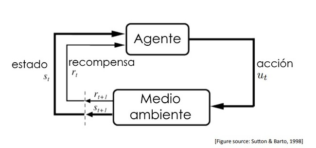

# Unidad 6

Creado: 15 de diciembre de 2025 22:29

El aprendizaje por refuerzo y el aprendizaje generativo son dos de las áreas más dinámicas y revolucionarias de la inteligencia artificial.

El aprendizaje por refuerzo se basa en la interacción continua de un agente con su entorno, permitiendo que el agente aprenda comportamientos óptimos a través de un sistema de recompensas y penalizaciones. Esta técnica ha sido clave para lograr avances impresionantes en áreas como los videojuegos, la robótica y la toma de decisiones autónoma.

Por otro lado, el aprendizaje generativo ha transformado la capacidad de los modelos de IA para crear contenido nuevo, como imágenes, música y texto, basándose en patrones aprendidos. Con modelos como las redes generativas antagónicas (GAN) y los autoencoders variacionales (VAE), las aplicaciones en la creación de medios sintéticos y en la mejora de la calidad de los datos han tomado un rol protagonista en la investigación de IA moderna.

## Tipos de Aprendizaje Automático

En el campo de la inteligencia artificial, existen diferentes enfoques para que los modelos aprendan a partir de datos, y estos se clasifican principalmente en tres tipos: aprendizaje supervisado, aprendizaje no supervisado, y aprendizaje por refuerzo. Adicionalmente, el aprendizaje generativo ha ganado relevancia debido a su capacidad para generar datos nuevos a partir de distribuciones aprendidas.

### Aprendizaje Supervisado

En este paradigma el modelo aprende a partir de ejemplos etiquetados, donde cada entrada tiene una salida correspondiente. El objetivo es predecir la etiqueta correcta para nuevas entradas. Es común en tareas como la clasificación de imágenes o el reconocimiento de voz.

Un ejemplo de aprendizaje supervisado es el algoritmo de Retropropagación.

### Aprendizaje no Supervisado

Aquí, el modelo se entrena con datos no etiquetados y busca descubrir patrones o estructuras subyacentes en los datos. Los algoritmos no supervisados son útiles en tareas como la agrupación (clustering) o la reducción de dimensionalidad donde a diferencia del aprendizaje supervisado, no se basa en un resultado conocido para entrenar el modelo

- **Datos sin etiquetar:** trabajan con datos en bruto, sin ninguna guía o instrucción explícita sobre lo que representan.
- **Descubrimiento de patrones:** Encontrar la estructura inherente de los datos y extraer información directamente de su naturaleza.
- **Ausencia de variable objetivo:** No existe una variable "target" o resultado deseado al cual dirigir el algoritmo.

| Tipo | Descripción | Algoritmos Comunes |
| --- | --- | --- |
| **Agrupamiento (Clustering)** | Agrupa elementos basándose en características similares o su proximidad. | **K-Means**, **DBSCAN**, Agrupamiento Jerárquico |
| **Reducción de Dimensionalidad** | Simplifica los conjuntos de datos al reducir el número de variables (atributos), manteniendo la información más relevante. | Análisis de Componentes Principales (**PCA**) |

### **Aprendizaje generativo**

Este enfoque se centra en la creación de datos nuevos que sigan la misma distribución que el conjunto de datos de entrenamiento. Los modelos generativos, como las Redes Generativas Antagónicas (GAN) y los Autoencoders Variacionales (VAE), permiten la generación de imágenes, texto y otros tipos de datos. A diferencia de los modelos discriminativos, que solo intentan clasificar los datos, los modelos generativos también pueden crear nuevos ejemplos que son coherentes con los datos aprendidos.

Estos modelos utilizan técnicas de *machine learning* y *deep learning* para analizar grandes volúmenes de datos. 

Durante este entrenamiento masivo, la IA no solo identifica la información, sino que aprende las reglas subyacentes, la gramática y los estilos presentes en los datos. 

Una vez entrenado, el modelo puede generar secuencias o elementos que imitan la calidad y el estilo de los datos originales, pero que son creaciones nuevas. 

> **Fiorella y Mayer** propusieron ocho estrategias específicas para promover el aprendizaje generativo:
> 

| Estrategia | Descripción | Ejemplo de Actividad |
| --- | --- | --- |
| **Resumir** | Producir una versión condensada del material, enfocándose en las ideas principales. | Escribir un párrafo corto con las ideas clave de un capítulo. |
| **Mapear** | Crear representaciones gráficas de las relaciones entre conceptos. | Elaborar un **mapa conceptual** o diagrama de flujo. |
| **Dibujar** | Representar visualmente el contenido para fomentar la comprensión espacial. | Dibujar el ciclo del agua o las partes de una célula. |
| **Imaginar** | Formarse imágenes mentales detalladas de la información presentada. | Visualizar un proceso histórico o un escenario descrito en un texto. |
| **Autoevaluar** | Poner a prueba el propio conocimiento sobre el tema. | Crear y responder preguntas de práctica sobre el material estudiado. |
| **Autoexplicar** | Expresar en voz alta o por escrito cómo funciona algo o por qué un concepto es válido. | Explicar los pasos para resolver un problema de matemáticas a uno mismo. |
| **Enseñar** | Prepararse para o realmente enseñar el material a otra persona. | Explicar un tema a un compañero de clase o a un familiar. |
| **Representar** | Utilizar un formato diferente (tabla, gráfico) para presentar la misma información. | Convertir un texto narrativo sobre estadísticas en una **tabla de datos**. |

# Introducción al Aprendizaje por Refuerzo

A diferencia de los enfoques anteriores, en RL el modelo (agente) interactúa con un entorno y aprende mediante ensayo y error. En lugar de etiquetas fijas, el agente recibe recompensas o castigos en función de las acciones que toma, y ajusta su comportamiento para maximizar una recompensa acumulada a largo plazo.

- **Agente:** El sistema de IA (por ejemplo, un robot o un programa de *software*) que toma decisiones y realiza acciones.
- **Entorno:** El mundo exterior o contexto con el que interactúa el agente.
- **Estado:** La situación actual del entorno en un momento dado.
- **Acción:** Un movimiento o decisión tomada por el agente en un estado particular.
- **Política (o Estrategia):** El método o conjunto de reglas que el agente utiliza para decidir qué acción tomar en cada estado. El objetivo del aprendizaje es encontrar la política óptima.

> Por último definimos la **Recompensa** como una señal numérica (positiva o negativa) que recibe el agente tras realizar una acción, indicando si la acción fue buena o mala para su objetivo final.
> 

En el aprendizaje por refuerzo, el algoritmo comienza sin conocimiento previo y, mediante la experimentación y la acumulación de recompensas, desarrolla una estrategia óptima. 

### Ciclo del Aprendizaje por Refuerzo

El ciclo del aprendizaje por refuerzo es un bucle continuo e interactivo entre un agente y su entorno. El objetivo del agente es aprender a tomar la mejor secuencia de acciones posible para maximizar una recompensa total a largo plazo.

Este ciclo, que se basa en un Proceso de Decisión de Markov (MDP), se compone de los siguientes pasos fundamentales que se repiten constantemente:

1. **Observación del Estado (S):** En un momento dado, el agente percibe y evalúa su situación o estado actual dentro del entorno.
2. **Toma de Acción (A)**: Basado en su política actual (su estrategia o conjunto de reglas), el
agente decide y ejecuta una acción específica en ese estado.
3. **Interacción con el Entorno**: La acción del agente interactúa con el entorno, lo que provoca un cambio en la situación general.
4. **Recepción de Recompensa (R):** El entorno proporciona una señal de retroalimentación numérica, conocida como recompensa. Esta recompensa puede ser positiva (premio) o negativa (penalización) y le indica al agente qué tan buena o mala fue la acción tomada en
función del objetivo final.
5. **Observación del Nuevo Estado (S')**: El agente observa el nuevo estado resultante de su acción anterior.
6. **Actualización de la Política y Función de Valor:** El agente utiliza la información de la recompensa y la transición de estado para actualizar su conocimiento (por ejemplo, su tabla Q o red neuronal). Este paso es crucial para refinar su estrategia o "política" y mejorar la toma de decisiones futuras.

Este proceso se repite una y otra vez, permitiendo al agente aprender por prueba y error a lo largo del tiempo, sin recibir instrucciones explícitas sobre qué hacer en cada momento, sino aprendiendo de las consecuencias de sus propias acciones.

## Métodologías y modelos

### **Métodos Basados en el Valor (Value-Based Methods)**

Estos métodos se centran en aprender una **función de valor** que estima cuánta recompensa futura puede esperar un agente por estar en un estado o tomar una acción específica. El objetivo es elegir siempre la acción con el valor más alto. Son ideales para **entornos discretos** (espacios de estados y acciones finitos).

**Algoritmos y Ejemplos**

- **Q-Learning:** Es quizás el algoritmo más conocido. Crea y actualiza una tabla Q (o una red neuronal profunda, en el caso de Deep Q-Networks o DQN) que asocia cada par estado-acción con un valor de recompensa esperado.
    - **Ejemplo Práctico:** Enseñar a un agente a jugar al **Pac-Man** o al **solitario Buscaminas** en una cuadrícula (grid-world). El agente aprende, mediante prueba y error, a qué casillas moverse para maximizar puntos y evitar penalizaciones (minas).
- **SARSA:** Similar a Q-Learning, pero "on-policy" (aprende de las acciones que realmente ejecuta), mientras que Q-Learning es "off-policy" (aprende de la acción óptima, independientemente de la que realmente hizo para explorar).
    - **Ejemplo Práctico:** Un **coche autónomo de juguete** que aprende a navegar un circuito simple. SARSA podría ser más seguroen las primeras etapas porque es más cauteloso, aprendiendo las penalizaciones de los movimientos "cercanos al borde" que realmente
    toma, no solo las óptimas teóricas.

### **Métodos Basados en Políticas (Policy-Based Methods)**

Estos métodos aprenden directamente la **política** (la estrategia o mapeo de estados a acciones) sin necesidad de calcular explícitamente el valor de cada estado o acción. Son muy potentes para **entornos continuos o de alta dimensión**, como la robótica, donde el número de acciones posibles es infinito o muy grande.

**Algoritmos y Ejemplos**

- **REINFORCE (o Monte-Carlo Policy Gradient):** Un algoritmo fundamental que ajusta los parámetros de la política (a menudo una red neuronal) en función del resultado final de un episodio completo (por ejemplo, una partida completa de un juego).
    - **Ejemplo Práctico:** Enseñar a un **brazo robótico** a realizar una tarea de control motor fino, como "alcanzar y agarrar" un objeto. La acción es un valor continuo (ej. ángulo exacto del motor), no discreto. REINFORCE ajusta los parámetros de la red neuronal que
    controla los ángulos para mejorar la probabilidad de agarres exitosos.
- **PPO (Proximal Policy Optimization):** Un algoritmo moderno muy popular y estable, utilizado por organizaciones como OpenAI, que optimiza la política mediante gradiente de manera eficiente y segura.
    - **Ejemplo Práctico:** Entrenar a agentes de IA para **jugar videojuegos complejos** como Dota 2 o a **robots humanoides** para caminar y correr de forma fluida en terrenos irregulares, tareas que requieren una coordinación continua y compleja.

### Modelos Actor-Critic (Actor-Critic Models)

Estos métodos combinan las fortalezas de los enfoques anteriores, utilizando dos componentes que trabajan juntos: un **Actor** (que decide la acción, basado en políticas) y un **Crítico** (que evalúa la acción, basado en valores).

**Algoritmos y Ejemplos**

- **A2C (Advantage Actor-Critic):** Una implementación eficiente y síncrona del marco Actor-Critic.
    - **Ejemplo Práctico:** **Optimización de procesos industriales** o sistemas de **control de tráfico**. El Actor decide parámetros de control (ej. temperatura del horno, tiempo del semáforo) y el Crítico evalúa la eficiencia energética o la fluidez del tráfico resultante, proporcionando una señal de error para mejorar la política del actor de forma continua.
- **SAC (Soft Actor-Critic):** Un algoritmo avanzado que incorpora un componente de entropía para fomentar la exploración, resultando en un aprendizaje muy robusto y estable.
    - **Ejemplo Práctico:** **Robótica avanzada para entornos del mundo real**, como un robot de almacén que navega entre personas y obstáculos dinámicos, donde necesita una política fiable (explotación) pero también la flexibilidad para adaptarse a cambios inesperados (exploración).

## Desafios del Aprendizaje por Refuerzo

### El Dilema Exploración / Explotación

Este es el desafío fundamental del RL. El agente debe decidir constantemente entre dos estrategias opuestas: 

- **Explotación:** Utilizar el conocimiento actual para elegir la acción que sabe que proporciona la mayor recompensa inmediata o esperada a largo plazo.
    - (Ejemplo: Seguir comiendo en tu restaurante favorito que sabes que es bueno).
- **Exploración:** Probar acciones nuevas o desconocidas para descubrir información nueva sobre el entorno que podría llevar a recompensas aún mayores en el futuro.
    - (Ejemplo: Probar un restaurante nuevo que podría ser mejor que tu favorito, pero también podría ser decepcionante).

> Un enfoque demasiado **exploratorio** hace que el aprendizaje sea lento e ineficiente a corto plazo. Un enfoque demasiado **explotador** puede hacer que el agente se quede "atascado" en un óptimo local (una solución buena, pero no la mejor globalmente).
> 

*“Por ejemplo un agente jugando al ajedrez que solo explota sus conocimientos iniciales podría aprender una apertura básica y nunca desviarse de ella, perdiendo la oportunidad de descubrir estrategias más potentes que nunca ha explorado. ”*

**Formas de Evitarlo (Soluciones)** 

- **Estrategia Épsilon-Glotona (ϵepsilon𝜖-greedy):** Es la solución más simple. El agente explota (elige la mejor acción conocida) la mayor parte del tiempo, pero con una pequeña probabilidad ϵepsilon𝜖 (ej. 10%), elige una acción completamente al azar para explorar. La epsilon suele disminuir con el tiempo a medida que el agente aprende más.
- **Motivación Intrínseca (Curiosidad):** El agente recibe una "recompensa interna" o **bonificación de exploración** por visitar estados novedosos o poco conocidos, lo que le incentiva a explorar áreas inexploradas del entorno por sí mismo, sin depender solo de la recompensa externa.
- **Algoritmos Avanzados (PPO, UCB):** Algoritmos como la Optimización de Políticas Proximas (**PPO**) o Upper Confidence Bound (**UCB**) incorporan mecanismos más sofisticados para medir la incertidumbre y priorizar la exploración de acciones con alto potencial de recompensa, en lugar de acciones puramente aleatorias.

### Escalabilidad (Large State & Action Spaces)

La escalabilidad se refiere a la capacidad de los algoritmos de RL para manejar entornos con un número gigantesco (o infinito/continuo) de estados y acciones. 

- **Problema:** Los métodos tradicionales basados en tablas (como el Q-Learning tabular) simplemente no pueden funcionar cuando hay millones de estados (ej. cada frame de un videojuego en alta definición) o acciones continuas (ej. los ángulos exactos de 20 articulaciones de un robot). El entrenamiento requiere recursos computacionales abrumadores y una cantidad de datos ingente.

**Formas de Evitarlo (Soluciones)** 

- **Aproximación de Funciones (Deep Learning):** El avance clave para la escalabilidad fue el uso de **redes neuronales profundas (Deep RL)**. En lugar de almacenar el valor de cada estado/acción individualmente, la red neuronal *aprende a generalizar* y estimar los valores o las políticas a partir de los datos de entrada brutos (como píxeles de una imagen).
- **Computación Paralela/Distribuida:** El uso de plataformas de computación en la nube permite distribuir la carga de trabajo y entrenar agentes de forma más eficiente en entornos complejos, como se menciona en la documentación de [Tencent Cloud](https://www.tencentcloud.com/techpedia/106696).

### Estabilidad y Eficiencia de Datos

El entrenamiento de algoritmos de RL, especialmente los que usan *deep learning*, es notoriamente **inestable** y sensible a los hiperparámetros. 
Los datos generados durante el aprendizaje están altamente correlacionados (un paso sigue al anterior) y no son estacionarios (la distribución de los datos cambia constantemente a medida que el agente mejora su política). Esto dificulta la convergencia y puede llevar a que un agente "olvide" políticas que funcionaban bien (deterioro del rendimiento). 

**Formas de Evitarlo (Soluciones)** 

- **Experience Replay (Memoria de Experiencias):** Una técnica fundamental introducida en DQN. El agente almacena sus experiencias (transiciones estado-acción-recompensa-nuevo estado) en un búfer de memoria. Durante el entrenamiento, muestrea aleatoriamente lotes de estas experiencias pasadas, rompiendo la correlación secuencial y haciendo que los datos sean más estables para el entrenamiento de la red neuronal.
- **Redes Objetivo (Target Networks):** Para los métodos basados en valor, se usa una segunda red neuronal "objetivo" congelada temporalmente para calcular los valores futuros, proporcionando un objetivo de aprendizaje estable durante cientos o miles de pasos antes de ser actualizada, lo que reduce la inestabilidad.
- **Optimización de Hiperparámetros y Arquitecturas Robustas:** Algoritmos como **PPO** fueron diseñados específicamente para ser más robustos y menos sensibles a la sintonización fina de parámetros (hiperparámetros), mejorando la estabilidad general del proceso de entrenamiento.

## Aplicaciones del Aprendizaje por refuerzo

El **aprendizaje por refuerzo (RL)** ha evolucionado más allá de la academia para convertirse en una tecnología con aplicaciones impactantes en múltiples industrias, permitiendo a los sistemas tomar decisiones complejas en entornos dinámicos.

### Videojuegos e IA Maestra

El campo de los videojuegos ha sido el banco de pruebas principal para el RL, logrando hitos que superan las capacidades humanas.

- **AlphaGo y AlphaStar (DeepMind):** Agentes que aprendieron a jugar y **derrotaron a los campeones mundiales** en juegos de mesa complejos como Go y StarCraft II, partiendo de cero conocimiento y aprendiendo únicamente mediante prueba y error y jugando
contra sí mismos.
- **Juegos de Atari:** Los primeros grandes éxitos del *Deep Reinforcement Learning* (DQN) demostraron que una sola arquitectura de IA podía aprender a jugar docenas de juegos clásicos de Atari (como Pac-Man o Pong) a niveles sobrehumanos simplemente a partir de la entrada de píxeles en pantalla.

### Robótica y Sistemas Autónomos

El RL permite a los robots aprender habilidades motoras finas y navegar en el mundo real sin una programación manual exhaustiva de cada movimiento.

- **Brazos Robóticos:** Se utilizan algoritmos de RL para enseñar a los brazos robóticos a
realizar tareas delicadas como agarrar objetos de formas y tamaños variados, o ensamblar componentes industriales con precisión.
- **Navegación Autónoma:** En robótica móvil y **vehículos autónomos** (como los sistemas de autopiloto de Tesla), el RL ayuda a optimizar la detección de obstáculos, la planificación de rutas y la toma de decisiones de conducción en tiempo real para evitar colisiones y llegar a destinos.

### Optimización Industrial y Eficiencia Energética

En  entornos industriales, el RL se aplica para optimizar procesos complejos donde una pequeña mejora en la eficiencia puede generar grandes ahorros.

- **Gestión de Centros de Datos de Google:** Google DeepMind utilizó RL para optimizar el **control de los sistemas de refrigeración** de sus centros de datos, lo que resultó en una reducción significativa del consumo de energía (hasta un 40% en algunas áreas) al ajustar la
temperatura, la ventilación y las bombas de manera óptima.
- **Optimización de la Cadena de Suministro:** Las empresas de logística utilizan RL para optimizar rutas de entrega, gestión de inventarios y operaciones de almacén, maximizando la
eficiencia y minimizando costes.

# Introducción al Aprendizaje generativo

El aprendizaje generativo es una rama del aprendizaje automático que se enfoca en la generación de nuevos datos a partir de modelos que aprenden las distribuciones subyacentes en los datos de entrenamiento. A diferencia de los modelos discriminativos, que se enfocan en clasificar o predecir etiquetas a partir de características observadas, los modelos generativos intentan capturar la estructura y las dependencias en los datos, lo que les permite generar muestras nuevas que son consistentes con las observaciones originales.

## Definicion y concepto básico

El aprendizaje generativo implica el uso de modelos de *machine learning* para aprender los patrones y la distribución subyacente de un conjunto de datos de entrenamiento. Su objetivo principal es generar nuevos datos que sean similares a los datos originales, pero que no sean copias exactas.

El concepto se basa en modelar cómo se generan los datos. Una vez que el modelo "entiende" la estructura de los datos (por ejemplo, la gramática del español, la composición de caras humanas, o la estructura del código de programación), puede producir muestras sintéticas, creativas y 
realistas a demanda.

## Diferencia entre modelos Generativos y Discriminatorios

Los modelos discriminativos aprenden la distribución condicional P(Y|X), lo que significa que están diseñados para predecir una etiqueta o salida basada en las características de entrada. Este enfoque los hace más adecuados para tareas de clasificación y predicción directa. Los modelos discriminativos son más sencillos de entrenar y suelen ser más eficientes en términos de precisión cuando se trata de problemas de clasificación específicos.

| **Característica** | **Modelos Generativos** | **Modelos Discriminativos** |
| --- | --- | --- |
| **Objetivo principal** | Crear o sintetizar nuevos datos y contenido (imágenes, texto, audio). | Clasificar o predecir etiquetas para datos existentes. |
| **Lo que aprenden** | Aprenden la distribución completa de los datos para entender cómo se generan las características y las etiquetas conjuntamente (P(datos, etiquetas)). | Aprenden el límite de decisión entre clases; la probabilidad de una etiqueta dado un dato específico (P(etiqueta \mid dato)). |
| **Uso típico** | Chatbots, asistentes de escritura, creación de arte digital, traducción automática. | Filtros de spam, detección de fraude, reconocimiento de objetos en imágenes, diagnóstico de enfermedades. |
| **Ejemplos de algoritmos** | Redes Generativas Antagónicas (GANs), Modelos de Lenguaje Grande (LLMs como GPT), Autoencoders Variacionales (VAEs). | Regresión Logística, Máquinas de Vectores Soporte (SVM), la mayoría de las Redes Neuronales Convolucionales (CNNs) usadas para clasificación. |

# Modelos Probabilisticos y Deterministas

Existen dos enfoques principales en el aprendizaje generativo, diferenciados por cómo incorporan la aleatoriedad y la incertidumbre en el proceso de creación de nuevos datos: el probabilístico y el determinista.

## Modelos Generativos Probabilísticos

Estos modelos se centran en **aprender y modelar explícitamente la distribución de probabilidad subyacente** (P(X)) de los datos de entrada. La generación de datos es esencialmente un proceso de muestreo a partir de esta distribución aprendida.

El objetivo es capturar las propiedades estadísticas de los datos para poder generar nuevas muestras que sigan fielmente esa misma distribución. Se busca una representación concisa en un espacio latente donde la distribución es simple y manejable (a menudo una distribución normal o gaussiana).

### **Variational Autoencoders (VAE)**

**Autoencoders:** 

Un **autoencoder** es un tipo de red neuronal entrenada para reproducir su entrada. Se compone de dos partes principales:

- **codificador**: La función del codificador es reducir la dimensionalidad de los datos de entrada y comprimirlos en una representación más pequeña, llamada **código latente o espacio latente.**
 El codificador actúa como un extractor de características, identificando patrones o estructuras importantes dentro de los datos.
- **Decodificador:** toma el código latente y lo transforma de nuevo en el espacio de los datos originales, tratando de reconstruir la entrada original lo más fielmente posible. El objetivo del entrenamiento es minimizar la diferencia entre la entrada y la salida, normalmente utilizando una función de pérdida como el **error cuadrático medio (MSE).**

El proceso de aprendizaje de un autoencoder se basa en la compresión y posterior reconstrucción de la información. Aunque los autoencoders no se diseñaron inicialmente como modelos generativos, pueden usarse para la generación de datos nuevos al muestrear del espacio latente y decodificar esos puntos latentes de vuelta a datos completos. 

> En este sentido, los autoencoders permiten generar variaciones de los datos de entrada.
> 

**Variational Autoencoders (VAE)**

El **Autoencoder Variacional (VAE)** es un modelo generativo probabilístico que evoluciona a partir del Autoencoder tradicional al introducir un enfoque basado en la distribución de probabilidad en el espacio latente, se caracterizan por: 

**Representación Latente Probabilística**

- **Distribución, no un Punto:** A diferencia del Autoencoder clásico, el VAE no codifica la entrada a un único punto z en el espacio latente, sino a una **distribución probabilística** para cada entrada x.
- **Modelado:** El VAE aprende los parámetros (μ - media y σ - desviación estándar) de una **distribución normal (Gaussiana)** que representa la entrada en el espacio latente.
- **Generación:** Se introducen nuevas muestras al **muestrear aleatoriamente** puntos del espacio latente a partir de estas distribuciones, lo que asegura la variabilidad en la generación.

**La Función de Pérdida (Loss Function)**

La función de pérdida del VAE es crítica y se compone de dos términos que equilibran la calidad de la reconstrucción y la estructura del espacio latente:

1. **Error de Reconstrucción:** Mide la fidelidad con la que el decodificador logra reproducir la entrada original x. (Similar al Autoencoder tradicional).
2. **Divergencia de Kullback-Leibler (KL):**
    - Mide la diferencia entre la distribución latente aprendida (posterior) y una **distribución *prior*** predefinida (generalmente una Normal Estándar).
    - **Propósito:** Este término obliga al espacio latente a ser **continuo y suave**, asegurando que los puntos latentes estén bien agrupados y que el muestreo de nuevos datos sea coherente.

### VAE y GAN Diferencias

La diferencia fundamental reside en cómo se estructura el proceso de aprendizaje y generación.

| **Característica** | **VAE (Probabilístico)** | **GAN (Determinista)** |
| --- | --- | --- |
| **Arquitectura** | Una sola red (Codificador + Decodificador). | Dos redes que compiten (Generador + Discriminador). |
| **Enfoque de Aprendizaje** | Aprende la **distribución de probabilidad** explícita del espacio latente. | Aprende una **función de mapeo** por medio de una competencia adversarial. |
| **Generación de Muestras** | Se basa en el **muestreo probabilístico** de la distribución latente. | El generador transforma un ruido de entrada de forma **determinista**. |
| **Función de Pérdida** | Basada en **Divergencia KL** + **Error de Reconstrucción**. | Basada en la **Teoría de Juegos** (pérdida adversarial). |
| **Fidelidad** | Tiende a producir muestras con buena **coherencia y estructura**, facilitando la interpolación. | Tiende a producir muestras con **mayor realismo visual y nitidez** (Estado del arte en generación de imágenes). |

## Modelos Generativos Deterministas

Estos modelos se centran en la **transformación directa** de datos de entrada (generalmente ruido aleatorio) en datos coherentes, utilizando un proceso que, aunque produce resultados variables, no se basa en el modelado explícito de una distribución de probabilidad.

El modelo aprende una **función de mapeo complejo** (G) que transforma un vector de ruido inicial (z) en una muestra de datos deseada (x). La aleatoriedad se introduce en el *input* (z), pero el proceso de transformación interna (G) es una función fija y determinista definida por los pesos de la red neuronal.

### **Redes Generativas Antagonistas (GAN)**

Consisten en dos redes que compiten: un **Generador** (G) y un **Discriminador** (D). El generador intenta crear muestras realistas a partir del ruido, mientras que el discriminador intenta distinguir entre las muestras reales y las generadas.

Son reconocidas por su capacidad para generar muestras con un **realismo visual excepcional**.

El generador toma el ruido inicial y lo transforma a través de capas neuronales. El resultado final es determinado por la función aprendida por la red, no por un muestreo probabilístico del espacio latente.

**Arquitectura de las GAN**

Las GAN son una clase de modelos generativos que utilizan una estructura de **Teoría de Juegos** (Antagónica) para el entrenamiento. Se componen de dos redes neuronales que compiten y se mejoran mutuamente: el **Generador** y el **Discriminador**.

| **Red** | **Rol** | **Objetivo** |
| --- | --- | --- |
| **Generador (G)** | **Creador de Falsificaciones.** Toma una entrada de **ruido aleatorio** y la transforma, capa tras capa, en una muestra de datos sintéticos (ej. una imagen). | **Engañar al Discriminador.** Trata de **maximizar** la probabilidad de que el Discriminador clasifique su salida como "real". |
| **Discriminador (D)** | **Clasificador Binario.** Recibe datos reales (entrenamiento) y datos falsos (del Generador). | **Clasificar Correctamente.** Trata de **maximizar** su precisión al clasificar datos reales como reales y datos generados como falsos. |

**Proceso de Entrenamiento Iterativo**

El entrenamiento de una GAN es un juego de suma cero donde ambas redes se entrenan de forma alternativa en ciclos continuos, buscando un **Equilibrio de Nash**.

- **Paso del Generador:** El Generador produce datos falsos a partir del ruido. Se le penaliza si el Discriminador identifica correctamente que los datos son falsos. Su objetivo es actualizar sus pesos para que sus próximas muestras sean más convincentes.
- **Paso del Discriminado:** que recibe un lote de datos reales y otro de datos falsos. Se le entrena para que sus clasificaciones sean lo más precisas posible. Esto actualiza sus pesos para ser mejor detector de falsificaciones.

**Resultado Final (Equilibrio de Nash):** El proceso termina cuando el Generador es tan bueno que el Discriminador ya no puede distinguir los datos reales de los falsos con una precisión superior al azar (50%). En este punto, el Generador ha aprendido efectivamente a replicar la distribución de los datos reales.

**Variantes Populares de las GAN**

Para superar problemas como la inestabilidad en el entrenamiento y permitir una generación más controlada, se han desarrollado diversas arquitecturas:

- **DCGAN (Deep Convolutional GAN):**
    - **Enfoque:** Utiliza **redes convolucionales profundas (CNN)** en lugar de redes totalmente conectadas.
    - **Aplicación:** Mejoró drásticamente la estabilidad y la calidad en la generación de **imágenes**.
- **WGAN (Wasserstein GAN):**
    - **Enfoque:** Reemplaza la función de pérdida tradicional por la **Distancia de Wasserstein**.
    - **Beneficio:** Proporciona un gradiente más robusto y suave, lo que resulta en un **entrenamiento más estable** y controlado.
- **GANs Condicionales (cGAN):**
    - **Enfoque:** Permite **controlar** la generación proporcionando una **etiqueta o condición** (ej. "generar un gato" o "generar la imagen con esta descripción") como entrada tanto al Generador como al Discriminador.
- **CycleGAN:**
    - **Enfoque:** Permite la **traducción de imágenes entre dominios** (ej. caballo a cebra) **sin necesidad de pares de entrenamiento** correspondientes.
    - **Aplicación:** Útil para transferencia de estilo y simulación sin datos etiquetados.

## Aplicaciones del aprendizaje generativo

### Generación de imágenes

Los modelos generativos permiten crear imágenes realistas o artísticas a partir de ruido, texto u otras imágenes.

**Aplicaciones principales:**

- Creación de arte digital y diseño gráfico
- Generación de rostros o escenarios sintéticos
- Restauración y mejora de imágenes (super-resolución, colorización)
- Generación de imágenes a partir de texto (text-to-image)

**Modelos típicos:** GAN, Diffusion Models

### Generación de texto y música

Los modelos generativos pueden producir **secuencias estructuradas** como texto, música o código.

**Aplicaciones en texto:**

- Chatbots y asistentes virtuales
- Redacción automática y resumen de documentos
- Traducción automática
- Generación de código

**Aplicaciones en música y audio:**

- Composición musical automática
- Generación de efectos de sonido
- Síntesis de voz (text-to-speech)

**Modelos típicos:** Transformers, LLMs, modelos autoregresivos

### Aumento de datos (Data Augmentation)

El aprendizaje generativo permite **crear datos sintéticos** para ampliar conjuntos de entrenamiento cuando los datos reales son escasos o costosos de obtener.

**Ventajas:**

- Reduce el sobreajuste
- Mejora la generalización del modelo
- Equilibra conjuntos de datos desbalanceados

**Ejemplo:** generar imágenes adicionales para clases minoritarias en clasificación.

### Mejora del entrenamiento de modelos

Los datos generados pueden usarse para **entrenar o preentrenar otros modelos**.

**Usos comunes:**

- Simulación de entornos complejos
- Entrenamiento previo con datos sintéticos
- Evaluación de modelos en escenarios poco frecuentes

Esto es habitual en robótica, conducción autónoma y visión artificial.

### Imágenes médicas sintéticas

En el ámbito sanitario, los modelos generativos permiten generar imágenes médicas artificiales que respetan la distribución de datos reales.

**Aplicaciones:**

- Aumento de datos para entrenamiento de modelos diagnósticos
- Protección de la privacidad del paciente
- Simulación de patologías poco frecuentes

**Ejemplos de imágenes:** resonancias magnéticas, radiografías, TAC.

### Generación de datos en finanzas

El aprendizaje generativo se emplea para crear **series temporales financieras sintéticas** que imitan el comportamiento real del mercado.

**Aplicaciones:**

- Simulación de escenarios de riesgo
- Pruebas de estrés financiero
- Entrenamiento de modelos de detección de fraude
- Evaluación de estrategias de inversión

---