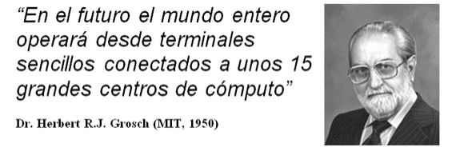

# Unidad 1

Creado: 29 de septiembre de 2025 15:12
progress: 100

Entendemos como modelo distribuido a cualquier sistema de “nodos de computo” conectados a través de una red de comunicaciones. Siendo el Nodo de cómputo aquel hardware con una mínima autonomía para ejecutar una serie de ordenes y a una red como un sistema de envío / recepción. 

Una vez se tiene el sistema básico definido, se abre la posibilidad de pasarnos a un modelo de cómputo basado en “servicios” donde los usuarios pueden alquilar sistemas que dan un servicio bajo ciertas condiciones.

## Contexto Historico (1940-1970)

Desde el comienzo se ha tenido un objetivo claro poder operar desde terminales sencillos manejando equipos de gran potencia de cómputo desde cualquier lugar. 

### Compartición de recursos distribuidos (Herbert Grosch, años 50)

- **Separación mainframe–terminal**: el cómputo no debía hacerse necesariamente “in situ”; se podía acceder de forma remota.
- **Time sharing**: varios usuarios y proyectos podían compartir la capacidad de un mismo sistema.
- **Distribución global**: propuso crear centros de supercomputación repartidos en el mundo para que hubiera recursos accesibles para más gente.
- Antecedente de las regiones AWS o Google cloud actuales.
    
    
    

### Cómputo como servicio (John McCarthy, años 60)

- **Acceso para el gran público**: planteó que cualquiera podría usar un ordenador, no solo personal autorizado.
- **Enfoque comercial**: además de verlo como un servicio que podía ser público público, abrió la puerta a su explotación económica como servicio privado.
- **Computación como servicio público/privado**: anticipó el modelo actual de la nube (ej. AWS), donde se paga por uso.

### Definición de cómputo como servicio (Douglas Parkhill, 1966)

- Sistematizó el concepto de “**Servicios de cómputo**” en su libro *The Challenges of the Computer Utility*.
- Definió la visión de la computación como un **utility**, comparable a la electricidad o el agua, accesible bajo demanda.
- Definió casi todos los conceptos actuales de la nube: Acceso remoto, recursos compartidos, pago por uso, seguridad y privacidad e infraestructura repartida en centros de datos.

En la práctica realmente solo fueron hipótesis que se desarrollaron de forma teórica, y fueron antecedentes necesarios para  llegar a crear los sistemas de cómputo distribuido que usamos actualmente. Sin embargo, aún carecían de la tecnología necesaria para ponerlas en funcionamiento. La mayoría de esas ideas se englobaban dentro de historias de ciencia ficción, para un futuro que aún estaba por llegar. 

## Evolución de los modelos Distribuidos (1970-actualidad)

A inicios de los años 70 disponíamos de la mayoría de las ideas necesarias para implementar los sistemas de cómputo distribuidos usados actualmente. Sin embargo, se carecía de algunas características necesarias para ponerlo en funcionamiento:

- **Tecnologías Especificas**: En concreto, en las definiciones vistas anteriormente se hacía hincapié en la necesidad de acceso remoto. No existía aún una red global que 
pusiera en comunicación a los usuarios con los sistemas de cómputo.
- **Modelo de Negocio:** No existía un público que necesitara de cómputo distribuido, lo que encarecía el desarrollo de cualquier tecnología relacionada. No se veía el beneficio de venta de servicios de cómputo, por lo que pocos trabajaban en ello.
- **Contexto social**: En aquel momento las tecnologías informáticas eran de uso mayormente en centros de investigación y militar. Los usuarios potenciales eran muy concretos, y pocos podrían pagarlo.

## Etapas:

**1980-1990**

- **Llegada del “ordenador personal”.** A lo largo de la década de los 80 se fue introduciendo poco a poco los sistemas informáticos en varias secciones de la sociedad:
    - **Trabajo:** Cada vez más se usaba en oficinas y lugares de trabajo para acelerar y facilitar la labor de los empleados.
    - **Ocio:** Aunque sencillos, diversos sistemas de cómputo se adaptaban para poder reproducir videojuegos, facilitando que personas pudieran hacer uso de los mismos desde jóvenes.
    - **Educación:** Poco a poco se ve la necesidad de educar usando sistemas informáticos, facilitando la búsqueda de información y el uso de elementos audiovisuales.
- **Llegada de “internet”:** Uno de los principales problemas que comentamos anteriormente era la inexistencia de una red que comunicara “todos con todo”. A lo largo de los años 80 pasó de ser de uso exclusivo para comunicar datos a corta distancia entre centros de investigación, universidades, etc… a ser una red global.

**1990-2000**

- Aparición de sistemas “tipo cluster”:
    - Con la llegada de los ordenadores personales, surge un nuevo modelo de negocio basado en sistemas de cómputo “sencillos”. Anteriormente se usaban sistemas de cómputo creados específicamente para dar soluciones a un único problema:
    - Almacenamiento/Bases de datos en empresas
    - Cómputo matemático
    - Gestión de sistemas complejos de telecomunicación, finanzas, etc…
- Esos sistemas eran caros de producir y mantener, además de necesitar ser actualizados cada cierto tiempo. También eran difíciles de diseñar y
construir, por lo que resultaban una inversión muy costosa que sólo
grandes empresas o universidades podían plantearse.
- Con la llegada de los ordenadores personales aparece una nueva forma de crear “sistemas de cómputo de altas prestaciones”, abaratando los costes y permitiendo que empresas y centros más humildes puedan hacer uso de ellos.
- Se define un sistema “tipo cluster” como la unión de una red de nodos de cómputo, que en este caso pueden ser ordenadores de bajo coste.

**2000 - 2006**

Con la aparición de los sistemas tipo cluster y la evolución de las redes 
de comunicaciones como internet, surgen nuevas plataformas que permiten 
la implementación de cómputo distribuido y cómputo como servicio. Surgen
 dos enfoques que modelarán el modelo comercial y uso de la informática:

- **Grid computing:**
    - Una vez se tienen centros de desarrollo informático alojadas a lo largo del mundo, surge la necesidad de poder compartir recursos entre ellos. Una
    de las primeras tecnologías que se desarrollaron para dar soluciones a
    cómputo distribuido globalmente serían los sistemas tipo Grid:
        - Cada centro dispone de “servicios informáticos” que pueden ser accedidos desde otro punto del mundo de forma online
        - Cada centro tecnológico dispone de un tipo de hardware distinto, formando redes de recursos computacionales globales.
        - Se exploran posibilidades de un nuevo modelo de computación distribuida a gran escala.

- **Cloud computing:**
- Paralelamente con Grid, surge la idea de los sistemas de computación “en la nube”. La arquitectura es muy similar a lo visto en Grid, pero su objetivo es distinto:
    - Ofrecen servicios “al gran público”: Cualquier persona puede alquilar cómputo, siempre que pueda pagar por ello.
- En general Grid y Cloud son sistemas que se basan en la misma idea:
Ofertar servicios de forma online. Su principal diferencia es el modelo
de negocio:
    - Sistemas Grid: Unión de varios centros/empresas para un único proyecto. Modelo de negocio centrado en el desarrollo de un proyecto en común.
    - Sistemas Cloud: Una (o varias) empresas ofreciendo servicios para cualquier persona que pueda pagar por él. Modelo de negocio centrado en llegar al máximo número de usuarios y ofrecerles paquetes de servicios a medida.
    - En la definición anterior habría que matizar distintos modos de funcionamiento, se analizará en futuras unidades.

**2006 - presente** 

A finales del siglo XX ya se tenía la tecnología necesaria para crear y 
explotar servicios a través de internet. Sin embargo, faltaba un modelo 
de negocio lo suficientemente estable como para permitir el crecimiento 
de las plataformas tipo Cloud que tenemos hoy en día. Un suceso marcó un
 punto de inflexión en el modelo de explotación de sistemas informáticos
 en internet:

La burbuja de las “puntocom” (dot-com bubble) que fue un suceso que marcó la evolución del mercado en internet. De forma resumida, se produjo al exagerar el valor de empresas que ofrecían algún tipo de servicio que salieron a bolsa. Podían ofrecer servicios como:

- Venta online, Entretenimiento, Buscadores de internet, etc.

Algunas  de esas empresas se beneficiaban de la facilidad para crear una red de  ordenadores tipo cluster para montar servidores sencillos y ofertar 
servicios por encima de sus posibilidades. Se usaban datos como número 
de visitas, usuarios o posibilidad de ganar dinero por nombres de 
dominios “.com” valiosos para inflar el posible valor en bolsa de la 
empresa.

A principios del siglo XIX el sistema no aguantó más, propiciando la 
caída en bolsa seguida de la quiebra de grandes empresas del sector.

Entre las empresas que sobrevivieron al declive del sector de ventas en internet se encontró Amazon, que supo aprovechar la situación y relanzó la empresa siguiendo el modelo Grid para ofertar servicios en internet.

Inicialmente ofertó sus servicios EC2 con máquinas configurables para que los usuarios instalaran sus servidores/programas de forma privada. En los sucesivos años amplió el número de servicios, siendo actualmente una de las más grandes empresas del sector informático.

| **Periodo / Etapa** | **Conceptos Clave** | **Protagonistas / Ejemplos** | **Características / Aportaciones** |
| --- | --- | --- | --- |
| **1940–1970** | **Cómputo remoto y compartición de recursos** | *Herbert Grosch* (años 50) | - Separación mainframe–terminal.- “Time sharing”: varios usuarios en un mismo sistema.- Propuesta de centros distribuidos globalmente. |
|  | **Computación como servicio** | *John McCarthy* (años 60) | - Propuso el acceso público a la computación.- Anticipó el modelo de pago por uso (“Cloud”).- Enfoque comercial del cómputo. |
|  | **Definición formal del servicio de cómputo** | *Douglas Parkhill* (1966) | - Concepto de “Computer Utility”: computación como un servicio público, como electricidad o agua. |
| **1970–1980** | **Bases del cómputo distribuido** | — | - Se tenían las ideas teóricas, pero faltaban redes globales e interés comercial.- Uso limitado a investigación y ámbito militar. |
| **1980–1990** | **Ordenador personal e Internet** | — | - Introducción del PC en trabajo, ocio y educación.- Nace Internet como red global (de uso civil). |
| **1990–2000** | **Clusters** | — | - Unir varios PCs en red para obtener alto rendimiento.- Reducción de costes frente a mainframes.- Uso en investigación y empresas pequeñas. |
| **2000–2006** | **Grid Computing** | *Proyectos científicos internacionales* | - Conexión de centros de cómputo globales.- Compartición de recursos entre instituciones.- Enfocado a proyectos colaborativos. |
|  | **Cloud Computing (inicio)** | *Empresas privadas* | - Computación bajo demanda “para todos”.- Modelo comercial: pago por uso.- Accesible a individuos y empresas. |
| **2006–Presente** | **Consolidación del Cloud** | *Amazon (AWS), Google, Microsoft…* | - Nacimiento de Amazon EC2 (2006).- Expansión de servicios en la nube.- Auge tras la burbuja “dot-com”.- Computación como infraestructura básica global. |

## Sistemas Tipo Cluster

La base de un sistema de cómputo es la red de ordenadores interconectados, los llamados clusters. Estos sistemas han evolucionado hasta el termino “datacenter” donde encontramos redes de cientos de nodos de cómputo para tareas de alto rendimiento. 

### Diseño básico de un sistema tipo cluster

De forma tradicional se han usado sistemas multi-CPU para aumentar las prestaciones de los sistemas informáticos:

- Una CPU-> “X” unidades de trabajo realizadas en tiempo T
- N CPUs-> N * X unidades de trabajo en el mismo tiempo T

Sin embargo, integrar varias CPUs en un único chip es costoso:

- Dificultad en el diseño de buses de acceso a memoria: Cuantas más CPUs haya
ejecutando trabajo a la vez, más accesos a memoria. Eso limita el ancho
de banda de datos efectivo
- Diseño de jerarquía de memoria, niveles de caché, etc…
- Tamaños de transistores y niveles de integración: Hay un límite físico para el mínimo tamaño del sistema
- Gasto energético….

Imagen de un procesador multicore de 4 núcleos. Se puede apreciar la complejidad para poder acceder de forma eficiente a zonas de memoria compartidas, como puede ser la memoria caché. 

Existe un bus de datos compartido para el acceso a memoria, el cual permite accesos concurrentes siempre que no accedan al mismo banco de datos. La caché se subdivide en 3 niveles:

- L1: Guarda una copia de datos de L2
- L2: Grupos de 2 a 2 contiene una copia de L3
- L3: Compartida por todos los núcleos guarda registros de RAM.

Al existir tantos niveles de caché, surgen problemas de coherencia de datos. Si un núcleo modifica un dato en su caché L1 privada, en algún momento debe compartir ese cambio con el resto de niveles hasta llegar a memoria RAM principal.

Aquí llegamos a la definición sencilla de cluster: siendo este un sistema de nodos de cómputo interconectados por cualquier red que permita una comunicación. 

El sistema puede escalar de forma fácil y rápida añadiendo más nodos. Cada nodo añadirá capacidad de cómputo, almacenamiento, RAM, etc… Sin embargo, ahora el problema pasa a estar en el diseño de la red de comunicaciones y en el estudio de la aplicación que se querrá implementar. Se deben tener en cuenta varios elementos al crear el sistema:

El tipo de red usada marcará la latencua de las comunicaciones siendo lo mas interesante contruirlas de forma sencilla y barata segun la aplicación. 

Dependiendo de la topología de la red y características de la aplicación, podemos diseñar un sistema de comunicaciones eficiente para aprovechar las características del modelo distribuido.

### Mantenimiento del sistema distribuido

También surge un segundo problema en el mantenimiento del sistema. Se han abaratado costes de fabricación, pero se incrementa el coste para tenerlo encendido y reemplazar partes dañadas:

La ampliación de un cluster es costosa en grandes tamaños. Normalmente la construcción de la red de comunicaciones suele ser una de las partes más caras de realizar, por lo que se mantiene la red hasta que se sature el número de conexiones.

En el momento que no se puedan conectar más ordenadores, se pasará a sustituir por máquinas nuevas. En último término, se cambiará la red por una de mayores prestaciones.

**Redes Infrautilizadas**

Los gastos que surjan durante el mantenimiento son cubiertos por los beneficios de tener el sistema encendido y trabajando. También hay que tener en cuenta el ahorro al detectar recursos infrautilizados:

- **Necesidad de crear un buen plan de gestión de recursos**
    - ¿Dos nodos al 50% de carga o un nodo al 100%?
        - El objetivo del administrador del sistema es llegar al 100% de carga (sin pasarse)
        - 100% de carga de trabajo implica que no se está infrautilizando, por lo que no se desperdicia el sistema y el gasto en mantenimiento es eficiente:
- **Mejor un nodo al 100% (sistema óptimo) que dos nodos al 50% (sistema infrautilizado)**
    - Es difícil dar métricas para definir correctamente la carga de trabajo que puede soportar un sistema. Normalmente pasa un tiempo hasta que se tienen pruebas de rendimiento y uso para las aplicaciones usadas.
    - Se necesitan herramientas específicas para rebalancear cargas de trabajo en el sistema, migrar procesos de nodos poco cargados, opciones a apagar nodos infrautilizados…
- **Modo ahorro de energía en ordenadores personales**
    - En ordenadores personales y portátiles actuales existe una opción de ahorro energético que permite tener el sistema al 100% de carga:
    - Si el sistema operativo detecta que no se está usando el 100% del hardware, pasa a apagar partes del ordenador
    - Si el sistema cuenta con 4 núcleos de cómputo, pero sólo se usan 2 (50% de uso), se pueden apagar los dos núcleos infrautilizados para llegar al 100% de carga (nivel óptimo para no desperdiciar dinero)

**Ejemplo en un centro de cómputo:**

> En estos centros se cuenta con cientos de ordenadores. Si el sistema está al 50% de uso se puede ahorrar la mitad del coste de mantenerlo encendido migrando las aplicaciones de ordenadores infrautilizados para posteriormente apagarlos.
> 

### Aplicaciones de sistemas de cómputo de alto rendimiento

La principal necesidad para crear estos sistemas has sido la existencia de grandes retos computacionales, con un número de recursos elevados. 

- **Ciencia e ingeniería**: simulación de naves aeroespaciales con modelos físicos realistas que requieren gran capacidad de cómputo.
- **Medicina y farmacéutica**: simulación de sistemas moleculares (ej. NAMD) para probar fármacos sin los altos costes ni riesgos de laboratorio; necesitan clusters con GPU y redes de alta velocidad.
- **Comercio online**: plataformas como Amazon dependen de centros de datos para transacciones seguras, gestión de clientes y logística automatizada.
- **Mercados financieros**: bolsas como la de Nueva York requieren infraestructuras de baja latencia (fibra, redes privadas, centros de datos estratégicos) para soportar el trading de alta frecuencia y enormes volúmenes de transacciones.

| **Tema / Sección** | **Concepto Clave** | **Descripción / Puntos Importantes** |
| --- | --- | --- |
| **Definición** | Sistema tipo *cluster* | Red de ordenadores (nodos) interconectados para trabajar como una sola unidad de cómputo. Escalable añadiendo nodos. Base de los *datacenters*. |
| **Motivación** | Limitaciones del multi-CPU | - Integrar muchas CPUs en un chip es caro y complejo.- Problemas: buses de memoria saturados, jerarquías de caché complicadas, alto consumo energético. |
| **Arquitectura básica** | Jerarquía de memoria y caché | - L1: copia de L2.- L2: copia parcial de L3.- L3: compartida entre núcleos, copia de RAM.- Problemas de coherencia entre niveles de caché. |
| **Ventajas del cluster** | Escalabilidad y flexibilidad | - Se puede ampliar fácilmente con nuevos nodos.- Cada nodo aporta CPU, RAM y almacenamiento.- Coste mucho menor que un superordenador tradicional. |
| **Desafíos técnicos** | Red de comunicaciones | - La eficiencia depende de la **latencia** y **topología de red**.- Es clave diseñar la red según el tipo de aplicación distribuida. |
| **Mantenimiento** | Costes y gestión | - Ampliar o mantener redes grandes es caro.- Cuando se satura la red, se sustituye por otra más potente.- Se busca mantener nodos al 100 % de carga para eficiencia. |
| **Gestión de recursos** | Balanceo y ahorro energético | - Mejor 1 nodo al 100 % que 2 al 50 %.- Uso de herramientas para rebalancear cargas y migrar procesos.- Apagado de nodos o núcleos infrautilizados (modo ahorro). |
| **Aplicaciones principales** | Cómputo de alto rendimiento (HPC) | - **Ciencia e ingeniería**: simulaciones aeroespaciales.- **Medicina/farmacéutica**: simulaciones moleculares (GPU, redes rápidas).- **Comercio online**: gestión y seguridad de transacciones (ej. Amazon).- **Mercados financieros**: *trading* de alta frecuencia, baja latencia. |