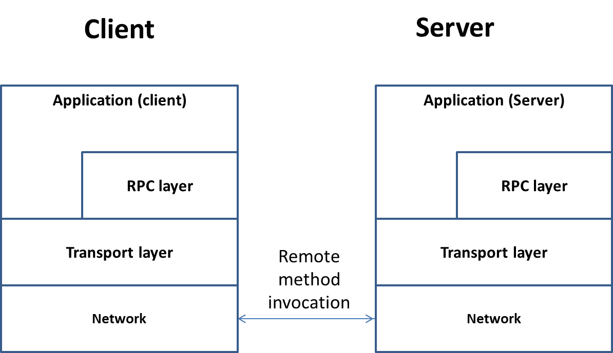

# Unidad 3

Creado: 29 de septiembre de 2025 23:32
progress: 0


> *“Esta unidad aborda los principios de computación distribuida y paralela, mostrando cómo las aplicaciones pueden adaptarse para funcionar en entornos de múltiples máquinas y procesadores. Se introduce la noción de objetos distribuidos y llamadas a procedimientos remotos (RPC), destacando cómo los conceptos de programación orientada a objetos se extienden más allá de un único sistema para aprovechar recursos distribuidos. A*
> 

## Configuración y Administración de un sistema tipo cluster

Al trabajar con un sistema multicomputador es necesario añadir configuraciones que faciliten la distribución y pruebas de código entre varias máquinas. 

### Administraciñón de acceso a red

Las instancias de EC2 que se crean en AWS gestionan sus configuraciones de puertos y conexiones a través de los servicios de “Security groups”. En la unidad 1 se explicó cómo crear una instancia y asignar un “Security Group”, el alumno deberá crear una nueva instancia EC2 llamada “Maquina 2” con las configuraciones mostradas en esa unidad. 

En concreto, con cada nueva instancia pedida en los ejercicios, se deberá asignar el “Security group” marcado como ““Grupo de seguridad 1”.

### Administracion de carpetas compartidas

---

El acrónimo **`sshfs`** significa **S**ecure **Sh**ell **F**ile **S**ystem, o "sistema de ficheros a través de ssh".

### Concepto y Funcionamiento

`sshfs` es un cliente de sistema de archivos que permite **montar un directorio remoto** en un equipo local. La clave es que utiliza el protocolo **SSH (Secure Shell)** para toda la comunicación.

- **Montaje:** Al igual que montas una unidad USB o un disco duro, `sshfs` te permite "montar" una carpeta que se encuentra en un servidor remoto (la **Máquina 1** en tu caso) en una ubicación de tu sistema de archivos local (la **Máquina 2**).
- **Protocolo Base (SSH):** Toda la transferencia de datos (lectura y escritura de archivos, listado de directorios, etc.) se realiza a través de una conexión SSH cifrada. Esto significa que es **segura** y no requiere abrir puertos adicionales ni configurar servicios complejos como NFS o Samba.
- **FUSE (Filesystem in Userspace):** `sshfs` se basa en la tecnología **FUSE**. FUSE es un módulo del kernel de Linux (y está disponible en otros sistemas) que permite a usuarios sin privilegios (no `root`) crear sus propios sistemas de archivos virtuales sin modificar el código del kernel. `sshfs` actúa como un programa en el espacio de usuario que traduce las operaciones de archivos (como abrir, leer, escribir) en comandos SSH.

### Ventajas Clave

1. **Seguridad:** Toda la comunicación está **cifrada** gracias a SSH, lo que lo hace ideal para entornos no confiables.
2. **Facilidad de Configuración:** Si ya tienes una conexión SSH funcionando (como en tu caso, usando el archivo de claves `.pem`), configurar `sshfs` es trivial, ya que aprovecha esa misma infraestructura.
3. **Transparencia:** Una vez montado, el directorio remoto se comporta exactamente como si fuera una carpeta local. Puedes usar comandos estándar como `ls`, `cp`, `vi`, o ejecutar aplicaciones que accedan a los archivos, y estos se manipularán en el servidor remoto de forma transparente.

---

## Ejemplo de Uso Detallado de `sshfs`

### 1. El Comando de Montaje (Compartir)

Asumiendo que:

- **Máquina Remota (Servidor):** Tiene el *hostname* `mi-servidor-aws`. La carpeta a compartir es `/home/ubuntu/PSDI_Dist`.
- **Máquina Local (Cliente):** La carpeta local donde se montará es `/home/ubuntu/compartido`.

**Comando:**

Bash

`sshfs mi-servidor-aws:/home/ubuntu/PSDI_Dist /home/ubuntu/compartido`

| **Parte del Comando** | **Descripción** |
| --- | --- |
| `sshfs` | La utilidad para iniciar el montaje. |
| `mi-servidor-aws:` | El **host remoto** al que se conecta SSH. Si no especificas un usuario, asume el usuario actual (ej. `ubuntu@mi-servidor-aws`). |
| `/home/ubuntu/PSDI_Dist` | El **directorio remoto** que queremos compartir y montar. |
| `/home/ubuntu/compartido` | El **punto de montaje local** (debe existir previamente) donde aparecerán los archivos remotos. |

**Lo que sucede:**

- **En la Máquina Local (Cliente):** Abre el directorio `/home/ubuntu/compartido`.
- **Comprobar:** Si ejecutas `ls /home/ubuntu/compartido`, verás inmediatamente los archivos que están realmente en el directorio `/home/ubuntu/PSDI_Dist` de la Máquina Remota.

### 2. El Comando de Desmontaje (Finalizar)

Es crucial desmontar el sistema de archivos cuando ya no se necesita, especialmente antes de apagar las máquinas, para evitar errores o corrupción.

Para desmontar un punto de montaje FUSE (como el creado por `sshfs`), se usa la utilidad **`fusermount`** con la opción `-u` (unmount).

**Comando:**

Bash

`fusermount -u /home/ubuntu/compartido`

| **Parte del Comando** | **Descripción** |
| --- | --- |
| `fusermount` | La utilidad estándar para gestionar sistemas de archivos FUSE. |
| `-u` | Opción para **desmontar** (unmount). |
| `/home/ubuntu/compartido` | El **punto de montaje local** que quieres liberar. |

**Lo que sucede:**

- La conexión SSH se cierra.
- El directorio `/home/ubuntu/compartido` deja de mostrar los archivos remotos de la Máquina 1 y vuelve a estar vacío (o a tener solo los archivos que tenía antes de ser un punto de montaje).

---

## Introducción a la programación paralela

> *“En un sistema monoprocesador, todos los procesos se ejecutan en tiempo compartido.  Sin embargo, hoy en día es fácil encontrar sistemas multiprocesadores que permiten la ejecución de código realmente en paralelo, siendo el Sistema Operativo el que asigna piezas de código a cada procesador.”*
> 

En general, cada vez que un programa quiere crear un hilo nuevo de ejecución paralela, debe especificar la pieza de código que quiere que se ejecute. Aquí nace el concepto de programación multithread. 

### La programación multithread

Estos códigos suelen estar formados por un bucle de repetición, el cual se rompe únicamente cuando se desea terminar el thread.

Al acabar los threads, las variables privadas (memoria de pila/stack) se liberan automáticamente, pero el resto de variables creadas con memoria dinámica (operadores “new” o llamadas a malloc en C) se deben liberar de forma explícita.

Un esquema de función que permita ejecutarse en paralelo podría ser la siguiente:

```cpp
void funcionThread(int param1, int param2)
{
   bool salir = false;
   //mientras se ejecute este bucle, el thread sigue vivo
   while (!salir)
   {
       //cuerpo del hilo, hacer "trabajo útil"
       param1++;
       param2--;
       //determinar si el thread debe continuar
       salir = param1 > param2;
   }
   //al salir del bucle, el hilo "desaparece"
   //liberar memoria/recursos asignados antes de acabar
} 
```

### **Hilos sincronizables (joinables)**

Necesarios cuando se necesita crear threads a los que se debe esperar para recuperar un resultado.

```cpp
#include <vector>
#include <thread>
#include <iostream> 

using namespace std;
void fSuma(int pos, vector<int> a, vector<int> b, vector<int>& result)
{
   //sumar la posición "pos" de los vector "a" y "b"
   //almacenar resultado en "result"
   result[pos] = a[pos] + b[pos];
}

int main(int argc, char** argv)
{
   //Crear tres vectores con 4 datos
   //El vector c tiene 4 elementos sin iniciar
   vector<int> a = { 1,2,3,4 };
   vector<int> b = { 1,2,3,4 };
   vector<int> c(4);
   //Crear un vector para almacenar threads

   vector<thread*> threads(4);

   for (int i = 0; i < 4; i++)
   {
       //Crear un hilo con la función "fsuma"
       //Se le pasa a continuación los parámetros "pos","a","b" y "result"
       //El parámetro "result" es una referencia (lectura/escritura)
       threads[i] = new thread(fsuma, i, a, b, std::ref(c));
   }
   //Se obtendrán los resultados cuando acaben "todos" los threads
   // Invocar la función "join" por cada uno de los threads almacenados

   for (int i = 0; i < 4; i++)
   {
       threads[i]->join();
       delete threads[i];
   }
   //mostrar resultados
   for (auto& d : c)
   {
       cout << d << endl;
   }
   return 0;
}
```

### **Hilos no sincronizables (detached)**

Necesarios cuando no es necesario sincronizarse y se autogestionan.

```cpp
#include <vector>
#include <thread>
#include <iostream> 

using namespace std;
void fHelloWorld(int pos)
{
   cout << "Hola desde el thread " << pos << endl;
}

int main(int argc, char** argv)
{
   for (int i = 0; i < 4; i++)
   {
       //Se pueden crear directamente sin necesidad de almacenarlos
       //LLamar a la función "detach" para permitir que se ejecuten/eliminen
       //automáticamente
       thread(fHelloWorld, i).detach();
   }
   return 0;
}
```

## Regiones de exlusion mutua

La memoria está compartida entre los threads. Esto nos da la posibilidad de crear variables y estructuras de datos compartidas, accesibles desde todos los hilos. Sin embargo, es necesario sincronizar los threads para evitar accesos concurrentes que pongan en riesgo la integridad de los datos.

> *“En reglas generales, hay que asegurar que sólo un thread modifica una variable compartida en un momento dado. Para ello se definen “regiones de exclusión mutua”, o “mutex”.”*
> 

La mayoría de lenguajes que soportan creación de threads implementan variables de tipo “mutex”:

- Cerrojos: Variables de “un bit” con dos estados: abierto/cerrado.
    - Se implementan a partir de instrucciones “test and set” del propio procesador
    - Cualquier programa puede crearlas/invocarlas:
        - Mientras el cerrojo esté cerrado, esperar
- Semáforos: Variables de tipo contador, que permiten invocar un número máximo de “cierres” antes de bloquear el programa.
    - Normalmente, gestionados por el sistema operativo.
    - Permiten el acceso de un número de hilos a la región protegido
        - Mientras el semáforo esté abierto, pasar.
- Variables Condicionadas: Son un caso de cerrojo en el que se espera a que se cumpla una condición para despertar a todos los hilos que estén esperando.
    - Se usan para implementar esperas durmientes. Cuando se abre un cerrojo compartido por una condición, se despierta a todos los threads para que puedan averiguar si pueden continuar dependiendo de esa condición.
    - **Mientras no se cumpla una condición:**
        - Test de cerrojo. Si sigue cerrado, esperar.

Ejemplo:

```cpp
#include <vector>
#include <thread>
#include <mutex>
#include <iostream>

using namespace std;
void fSuma(int& contador, mutex& t)
{

   //Cerrar el cerrojo
   //sólo un hilo accede a la variable compartida
   t.lock();
       //actualizar la variable
       contador++;
       //abrir cerrojo
   t.unlock();
}
 int main(int argc, char** argv)
{
   //Crear variable compartida
   int contador = 0;
   //crear el cerrojo compartudo
   mutex cerrojo;
   //Crear un vector para almacenar threads
   vector<thread*> threads(4);

   for (int i = 0; i < 4; i++)
   {
       //Crear un hilo con la función "fsuma"
       //Se le pasa a continuación los parámetros compartidos "contador" y
       //"cerrojo"
       threads[i] = new thread(fSuma,std::ref(contador), std::ref(cerrojo));
   }
   //Se obtendrán los resultados cuando acaben "todos" los threads
   // Invocar la función "join" por cada uno de los threads almacenados
   for (int i = 0; i < 4; i++)
   {
       threads[i]->join();
       delete threads[i];
   }
   //mostrar resultados
   cout << contador << endl;
   return 0;
}
```

## Llamadas a procedimientos remotos

> *“En entornos empresariales es habitual que existan aplicaciones previas que deban modificarse para funcionar en varios equipos, separando la interfaz de usuario del núcleo de la aplicación y permitiendo que este último se ejecute en servidores remotos.”*
> 

El enfoque más común para distribuir funcionalidades ya existentes es el uso de *llamadas a procedimientos remotos* (RPC), que permiten que una parte del programa invoque funciones que realmente se ejecutan en otra máquina. En las secciones siguientes se formalizarán estos conceptos y se implementarán ejemplos prácticos para comprender su funcionamiento.

### Definición de RPC

Las llamadas a procedimiento remoto (RPC) permiten la invocación de código en máquinas remotas conectadas a través de red.

Para ello debemos definir un protocolo de comunicación y un formato de mensaje para que ambas máquinas (cliente y servidor) se puedan entender independientemente del tipo de hardware y lenguaje que implementen.

> *“También es interesante implementar funcionalidades que permitan que existan varios servidores y varios clientes en el sistema, de tal manera que se asignen los clientes de forma apropiada y balancear el acceso a los recursos entre varias máquinas.”*
> 

Por un lado, es importante separar la interfaz de usuario (aplicación cliente) del núcleo de la aplicación, mantenida por los servidores.

- Para ello creamos capas software (middleware) que nos facilite reutilizar el código ya realizado a ambos lados.
- En concreto, crearemos una capa que sustituirá las llamadas originales a las librerías del núcleo de aplicación por llamadas RPC que comuniquen con el servidor:



De esta manera, el paso a la invocación remota se centra en el envío de la información mínima necesaria entre máquinas:

- Tipo de función que se quiere invocar.
- Parámetros de la función.
- Retorno de resultados.

Cuando tenemos esa infraestructura implementada, podemos añadir más opciones al sistema para escalar en eficiencia y uso de recursos:

- Disponemos de varias máquinas que permiten la ejecución del núcleo de aplicación.
- El número de clientes puede incrementarse igualmente, sobrecargando los servidores.
- Podemos levantar más servidores para dar cobertura a los nuevos clientes, pero
éstos no los conocen. No pueden encontrarlos si no estaban listados
previamente.
- Es necesario un sistema de anunciación de servicios y rebalanceo del sistema.

Una opción es crear un programa intermedio, el cual llamaremos en esta sección “broker de objetos”, el cual almacena estadísticas del sistema y mantiene listas de nuevos servidores que aparezcan.


Los servidores se anuncian en el broker cuando se levantan, y le mandan una descripción de su estado, recursos disponibles, etc... Cada cliente que se conecta, le pide al broker el servidor “que mejor le convenga” a partir de una lista de requisitos.

Dado que el broker mantiene información de todo el sistema, debería ser capaz de responder con el servidor más óptimo. A partir de estos programas intermedios entre clientes y servidores se puede escalar el sistema y hacer que funcione de manera más flexible:

- Cuando haya picos de usuarios, puede realizar un trabajo adicional para levantar nuevos servidores.
- Cuando haya usuarios pidiendo servicios “específicos”, el broker puede ofrecer funcionalidades para que las máquinas que los ofrecen puedan anunciarse.
- Al tener una visión global del sistema, puede rebalancear conexiones y actualizar estadísticas en función del estado de los servidores. Incluso puede ayudar a recuperar el sistema en caso de que haya secciones desconectadas de la red.

## Distribución de un objeto en red

### Objetivo general del rediseño distribuido

El propósito del ejercicio es tomar un programa ya existente —en este caso, un gestor de objetos `Persona`— y transformarlo en un sistema distribuido sin modificar la lógica original del usuario.

El usuario debe seguir utilizando la misma interfaz que antes (mismos métodos, mismas clases, mismo `main.cpp`), pero las operaciones reales deben ejecutarse en un servidor remoto.

Para conseguirlo, se construye una capa de abstracción basada en RPC (Remote Procedure Call) que permite:

- Que el cliente invoque un método de la clase `Persona` como si fuera local.
- Que la llamada se traduzca automáticamente en un mensaje para el servidor.
- Que el servidor ejecute la operación, prepare el resultado y lo devuelva mediante un protocolo de mensajes.

Esto permite *distribuir* objetos sin alterar el código que los usa.

### Programa original

El sistema inicial gestionaba objetos `Persona` mediante:

- Constructor
- Métodos getter y setter
- Visualización (`operator<<`)
- Guardado en fichero
- Lectura desde fichero

Todo se ejecutaba en el mismo equipo, sin comunicación en red, y con un flujo de programa lineal.

### Metas del diseño distribuido

1. **No modificar la interfaz local del usuario**
    
    El archivo `main.cpp` continúa llamando a los métodos de `Persona` como siempre:
    
    ```cpp
    Persona p("Juan", 25);
    cout << p << endl;
    p.guardar("datos.txt");
    
    ```
    
2. **La clase Persona real se ejecuta en el servidor**
    
    Todas estas llamadas ya no actúan sobre un objeto local, sino sobre una instancia remota que vive en el servidor.
    
3. **El cliente traduce las llamadas en mensajes RPC**
    
    Los métodos no ejecutan lógica local: empaquetan los parámetros, envían un mensaje por red y esperan la respuesta.
    

### Estrategia de implementación

El sistema se divide en dos programas:

**Cliente (clientePersonas)**

- Mantiene el `main.cpp` original.
- Sustituye `persona.cpp` por `personaRemota.cpp`.
- Implementa una clase `PersonaRemota` que:
    - Abre un socket con el servidor.
    - Serializa las peticiones.
    - Recibe las respuestas y reconstruye los datos.

**Ejemplo simplificado de método remoto:**

```cpp
string PersonaRemota::getNombre() {
    enviarMensaje(MSG_GET_NOMBRE);
    return recibirString();
}

```

**Servidor (serverPersonas)**

- Implementa la clase `Persona` original sin cambios.
- Mantiene un vector o mapa de instancias `Persona` asociadas a cada cliente.
- Deserializa las peticiones recibidas y ejecuta la operación real.

**Ejemplo de manejo de un mensaje en el servidor:**

```cpp
case MSG_GET_NOMBRE:
    enviarString(persona->getNombre());
    break;

```

**Sistema original**

- Se conserva solo como referencia (`gestorPersonas`).

Modelo RPC (Remote Procedure Call)

Cada operación de la clase `Persona` se transforma en un mensaje RPC independiente.

### **Enumeración de tipos de mensaje**

```cpp
enum personaMSGTypes {
    MSG_CONSTRUCTOR,
    MSG_DESTRUCTOR,
    MSG_GET_NOMBRE,
    MSG_SET_NOMBRE,
    MSG_GET_EDAD,
    MSG_SET_EDAD,
    MSG_MOSTRAR,
    MSG_GUARDAR_FICHERO,
    MSG_LEER_FICHERO
};

```

### **Mecanismo general RPC**

1. **En el cliente:**
    - Empaquetar el tipo de mensaje.
    - Empaquetar parámetros (si los hay).
    - Enviar por socket.
    - Esperar ACK y respuesta.
2. **En el servidor:**
    - Recibir mensaje.
    - Identificar operación mediante `switch`.
    - Ejecutar método real.
    - Enviar ACK y datos de retorno.

### Ejemplos de serialización

**Enviar tipos simples**

```cpp
write(sock, &edad, sizeof(int));
```

**Enviar strings**

Se envía primero el tamaño para reconstruir el texto de forma segura.

Cliente:

```cpp
int n = nombre.size();
write(sock, &n, sizeof(int));
write(sock, nombre.c_str(), n);

```

Servidor:

```cpp
int n;
read(sock, &n, sizeof(int));
char buffer[n+1];
read(sock, buffer, n);
buffer[n] = '\0';
string nombre(buffer);

```

Este procedimiento se usa en todos los métodos que requieren datos complejos.

---

## Gestión de múltiples clientes

En un sistema distribuido, varios clientes pueden solicitar operaciones simultáneamente.

Para evitar bloqueos, el servidor debe atender cada conexión en un hilo independiente.

### **Arquitectura del servidor**

1. **Socket principal**
    
    Acepta nuevas conexiones (bind, listen, accept).
    
2. **Por cada cliente**
    
    El servidor:
    
    - crea un hilo,
    - asigna una estructura asociada a ese cliente,
    - mantiene las instancias remotas creadas por él.

### **Ejemplo de bucle principal del servidor**

```cpp
while (true) {
    int cliente = accept(sock, ...);
    std::thread t(atiendeCliente, cliente);
    t.detach();
}

```

### **Mantenimiento de instancias remotas**

El servidor puede almacenar las instancias de `Persona` en:

- un vector de punteros,
- un mapa `<int, Persona*>`,
- u otra estructura.

Cada cliente tiene su propio espacio de trabajo.

Ejemplo simplificado:

```cpp
map<int, Persona*> objetosCliente;
int siguienteID = 0;

```

Cada constructor creado por un cliente genera un ID remoto.

## El hilo atiendeCliente

Este es el corazón del servidor.

Su misión es:

1. Leer continuamente mensajes enviados por un cliente.
2. Interpretarlos (tipo + parámetros).
3. Ejecutar la operación real sobre la instancia correspondiente.
4. Enviar resultados al cliente.

### **Esquema general**

```cpp
void atiendeCliente(int sock) {
    map<int, Persona*> instancias;
    int idCounter = 0;

    while (true) {
        personaMSGTypes tipo;
        if (!leer(sock, &tipo, sizeof(tipo))) break;

        switch (tipo) {
            case MSG_CONSTRUCTOR:
                // leer parámetros
                // crear objeto real
                // asignar ID remoto
                // devolver ID
                break;

            case MSG_SET_NOMBRE:
                // leer ID + nombre
                // instancias[id]->setNombre(nombre)
                // enviar ACK
                break;

            case MSG_MOSTRAR:
                // obtener string resultante
                // devolverlo
                break;

            // resto de casos...
        }
    }
}

```

La estructura siempre es la misma: leer → ejecutar → responder.

## Diseño completo del protocolo de mensajes

### **Información enviada en cada método**

Ejemplo (setNombre):

Cliente envía:

1. Tipo de mensaje: `MSG_SET_NOMBRE`
2. ID remoto de la instancia
3. Tamaño del string
4. Datos del string

Servidor responde:

1. ACK vacío

---

Ejemplo (getEdad):

Cliente envía:

1. `MSG_GET_EDAD`
2. ID de instancia

Servidor responde:

1. ACK
2. Entero con la edad

---

Ejemplo (operator<<):

Cliente envía:

1. `MSG_MOSTRAR`
2. ID de instancia

Servidor responde:

1. ACK
2. Tamaño del string
3. Cadena generada por `operator<<`

---

Ejemplo (guardar en fichero):

Cliente envía:

1. `MSG_GUARDAR_FICHERO`
2. ID de instancia
3. Tamaño del nombre de fichero
4. Cadena con la ruta

Servidor:

- ejecuta `persona->guardar()`,
- devuelve un ACK vacío para confirmar.

---

### **Reglas de empaquetado**

1. Todos los enteros se envían en binario nativo (sin conversión de endianess si ambos sistemas son homogéneos).
2. Los strings deben enviarse como:
    - int tamaño
    - datos sin terminador
3. Los métodos sin retorno solo envían un ACK vacío.
4. El orden de lectura debe coincidir exactamente con el orden de escritura.

## Implementación en personaRemota.cpp

Cada método actúa como un *proxy* hacia el servidor.

La estructura típica es:

1. enviar tipo de mensaje
2. enviar ID de instancia (salvo en constructores)
3. enviar parámetros
4. esperar ACK
5. leer resultado (si existe)

### **Ejemplo realista (getNombre)**

```cpp
string PersonaRemota::getNombre() {
    enviar(MSG_GET_NOMBRE);
    enviar(id);

    recibirAck();

    return recibirString();
}

```

### **Ejemplo (constructor remoto)**

```cpp
PersonaRemota::PersonaRemota(string nom, int edad) {
    enviar(MSG_CONSTRUCTOR);
    enviarString(nom);
    enviar(edad);

    recibirAck();
    id = recibirEntero();
}

```

### **Ejemplo (operator<< remoto)**

Cliente:

```cpp
string PersonaRemota::toString() {
    enviar(MSG_MOSTRAR);
    enviar(id);
    recibirAck();
    return recibirString();
}

```

Servidor:

```cpp
case MSG_MOSTRAR: {
    int id = recibir(sock);
    string s = instancias[id]->toString();
    enviarAck(sock);
    enviarString(sock, s);
    break;
}

```

## Pruebas del sistema distribuido

### **Prueba básica cliente-servidor en la misma máquina**

1. Compilar servidor y cliente.
2. Ejecutar:
    
    ```
    ./serverPersonas
    ./clientePersonas
    ```
    
3. Crear una persona:
    
    ```
    1) Crear persona
    Nombre: Ana
    Edad: 30
    ```
    
4. Mostrar persona:
    
    ```
    Persona: Ana (30)
    ```
    

### **Validación de ficheros en el servidor**

Si el cliente ejecuta:

```
p.guardar("personas.txt");
```

el fichero **debe aparecer en la máquina donde corre el servidor**, no en la del cliente.

### **Pruebas en red real**

Cliente: portátil Linux

Servidor: otro PC o máquina virtual

Ejecutar servidor en IP fija:

```
./serverPersonas 5000
```

Cliente:

```
./clientePersonas 192.168.1.60 5000
```

Comprobar:

- creación remota de objetos
- que cada cliente recibe un ID independiente
- que la carga/lectura funciona a través de la red

##