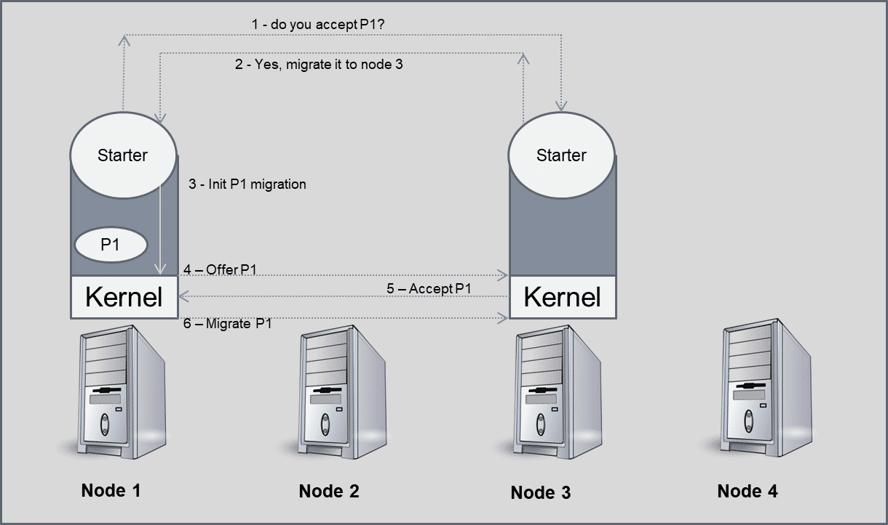

# Unidad 4

Creado: 29 de septiembre de 2025 23:32
progress: 0


## Migración de Procesos

En sistemas multicomputador suele ser necesario mover programas a distintas unidades de cómputo. En concreto, en sistemas distribuidos es importante que las cargas de trabajo se encuentren repartidas de forma equitativa entre todos los ordenadores. 

Para ello, se deben mover programas que en muchos casos no deben perder el estado de ejecución (datos y contexto) en el que se encontraban. Aparece una necesidad de mecanismos para migrar procesos de nodos más cargados a menos cargados mientras se están ejecutando:

Definimos **Migración de un proceso** como la transferencia de suficiente cantidad del estado de un proceso de un computador a otro para poder ejecutarse.

n un sistema distribuido, la migración de procesos permite optimizar el rendimiento, mejorar la disponibilidad y aprovechar recursos específicos del entorno. Existen varias motivaciones principales:

**Equilibrado de carga**

La migración ayuda a repartir el trabajo entre máquinas para que procesos paralelos aprovechen mejor el hardware disponible y se eviten nodos saturados.

**Minimización del coste de comunicación**

La red suele ser el componente más lento del sistema distribuido. Si dos procesos comunican intensivamente, conviene situarlos en nodos cercanos o incluso en el mismo nodo para reducir latencias.

**Alta disponibilidad y tolerancia a fallos**

Algunos procesos críticos no pueden detenerse. Para mantener su ejecución continua, se replican nodos y se migran estos procesos cuando un nodo debe apagarse o entra en mantenimiento.

**Acceso a recursos específicos**

Cuando un proceso necesita temporalmente un recurso no disponible en su nodo (GPU, almacenamiento local, hardware especializado), es conveniente migrarlo a un nodo que sí ofrezca ese recurso.

---

### **Aspectos a considerar antes de migrar procesos**

La migración no puede ser arbitraria; requiere mecanismos de control y coordinación:

**Decisiones de cuándo y cómo migrar**

El sistema debe determinar el momento adecuado y las condiciones necesarias para realizar la migración.

**Responsable de la decisión**

- **Equilibrado de carga:**
    
    Normalmente lo gestiona un módulo del sistema operativo o un monitor distribuido que evalúa la carga global. Este módulo debe comunicarse con otros nodos para obtener métricas de carga en tiempo real.
    
- **Acceso a recursos específicos:**
    
    Puede ser la propia aplicación quien decida migrarse, si está diseñada para ser consciente del estado del sistema y de los recursos disponibles.
    

## Tipos de Migración

Para migrar un proceso es necesario capturar y trasladar su estado (código, registros, posición de ejecución y memoria). Según el objetivo, existen varios tipos de migración que equilibran coste, tiempo de parada y volumen de datos transferidos.

---

## **Migraciones Completas**

Se traslada **todo** el proceso a otra máquina, sin dejar restos en el origen.

### **Migración completa tradicional (stop‐and‐copy)**

**Procedimiento:**

1. Detener el proceso.
2. Guardar estado de CPU y RAM.
3. Transferirlos al destino.
4. Reconstruir el proceso allí.

**Ventajas:**

- Simplicidad de implementación.

**Inconvenientes:**

- Tiempo de parada elevado si la memoria es grande.

---

### **Migración completa con pre‐copiado**

Primero se copian las páginas de memoria mientras el proceso sigue ejecutándose. Solo al final se pausa para copiar el estado de CPU y las páginas modificadas.

**Ventaja:**

- Reduce significativamente el tiempo de parada.

**Inconvenientes:**

- Debe registrarse cualquier modificación sobre páginas ya copiadas para reenviarlas.
- Introduce complejidad en el control de cambios.

---

## **Migraciones No Completas**

El nodo origen permanece activo y conserva parte de los datos. Se trasladan solo los elementos estrictamente necesarios.

### **Migración con conjunto de trabajo conocido**

Se transfiere:

- Estado de CPU.
- Páginas de RAM que se sabe que el proceso usará.

**Ventaja:**

- Reduce la cantidad de información enviada.

**Inconvenientes:**

- El nodo origen debe mantener las páginas restantes hasta que el proceso finalice.
- Implica gestión de memoria dispersa entre nodos.

---

### **Migración bajo demanda (working set desconocido)**

Se envía únicamente el estado de CPU; la memoria se traslada cuando el proceso la solicita.

**Ventajas:**

- Coste inicial muy bajo.

**Inconvenientes:**

- Repetidas paradas por “fallo de página remoto”.
- Rendimiento dependiente del patrón de acceso a memoria.
- Funciona mejor con accesos secuenciales o agrupados.

---

## **Casos Especiales: Migración de Máquinas Virtuales**

Se migra **el estado completo de la máquina virtual**: sistema operativo, programas, memoria, dispositivos virtuales.

**Características:**

- Migra todo el entorno, no solo un proceso.
- Caso más completo pero también el más lento por el volumen de datos.

---

## **Migración de Ficheros**

A diferencia de la RAM, los ficheros son lentos de mover.

### **Copia de ficheros abiertos**

Se trasladan los ficheros abiertos del proceso (útil solo para ficheros pequeños).

### **Acceso remoto a ficheros**

Los ficheros permanecen en el origen y se accede a ellos mediante red (NFS, sistemas distribuidos).

**Riesgo:**

- Aumento de latencia.
    
    **Mitigación:**
    
- Cachés de bloques de disco para acelerar accesos repetitivos.

---

# **Ejemplos de Implementación en Sistemas Operativos**

## **IBM AIX**

Migración iniciada por el propio programa.

**Proceso:**

1. El programa selecciona máquina destino y envía petición con parte de su imagen y lista de ficheros.
2. Se suspende el proceso y se vuelca la memoria a disco.
3. En el destino, un servidor crea un nuevo proceso con esa información.
4. Solicita al origen los datos adicionales (pila, argumentos, páginas del código).
5. Una vez completado, ordena destruir el proceso original.

---

## **Sistema Operativo Charlotte**

Incorpora planificación distribuida para balanceo de carga.

**Características clave:**

- Cada nodo tiene un proceso “Starter”.
- Los Starters recopilan periódicamente información del kernel (RAM, CPU, carga).
- Intercambian estadísticas entre sí.
- La decisión de migrar se toma mediante consenso entre dos Starters que monitorizan el estado del sistema.



## Virtualización de Procesos

La virtualización permite ejecutar múltiples sistemas operativos o aplicaciones de forma simultánea en un mismo hardware, dividiendo los recursos (CPU, RAM, dispositivos) en instancias independientes. Se utiliza para aislar entornos, optimizar hardware y ofrecer servicios escalables en sistemas distribuidos.

---

### **Origen y evolución de la virtualización**

La tecnología nació en los años 60 con IBM (SIMMON y CP/CMS), cuando los mainframes debían compartirse entre múltiples proyectos. Los primeros sistemas virtualizados se basaban en **particiones lógicas** del hardware físico para asignar recursos a distintos usuarios.

Hoy, la mayoría de CPUs incluyen extensiones de virtualización (Intel VT-x, AMD-V), permitiendo a programas como VirtualBox o VMWare acelerar la ejecución de máquinas virtuales sin recurrir a emulación lenta.

---

### **Hipervisores: concepto general**

Un **hipervisor** es el software que crea, ejecuta y gestiona máquinas virtuales, controlando el uso del hardware físico y garantizando el aislamiento entre instancias.

Se distinguen dos tipos principales:

---

### **Hipervisores Tipo 1 (Bare Metal / Nativos)**

Se ejecutan directamente sobre el hardware, sin necesidad de un sistema operativo host.

**Características:**

- Máximo rendimiento y mínimo coste de virtualización.
- Control directo sobre CPU, RAM y dispositivos.
- Alto aislamiento y seguridad.

**Ejemplos de uso:**

- **Amazon EC2 (AWS)**: Levanta instancias a partir de imágenes, permite migración de máquinas y garantiza rendimiento con recursos limitados.
- **Consolas y dispositivos móviles:**
    
    El hipervisor forma parte del sistema operativo y cumple funciones de seguridad:
    
    - **Verificación mediante certificados:** Solo ejecuta software autorizado.
    - **Aislamiento fuerte:** Impide compartir datos o escalar privilegios entre aplicaciones.

Este tipo de hipervisores se orienta a entornos donde son esenciales la seguridad, la estabilidad y el rendimiento.

---

### **Hipervisores Tipo 2 (Hosted)**

Son aplicaciones instaladas dentro de un sistema operativo host.

**Características:**

- Dependen del sistema operativo donde se ejecutan.
- Mayor sobrecarga debido a la doble capa (SO host + SO virtualizado).
- Más flexibles y fáciles de usar, pero menos eficientes que los Tipo 1.

**Ejemplos y usos:**

- **Emuladores de consolas antiguas:**
    
    Implementan CPU, GPU y firmware original de consolas ya obsoletas, intentando que los juegos no detecten que están fuera del hardware real.
    
- **Máquinas virtuales clásicas:**
    
    Simulan un ordenador completo para ejecutar software incompatible con el sistema host o realizar pruebas aisladas.
    

Estos sistemas son muy utilizados por desarrolladores y usuarios que necesitan compatibilidad, pruebas controladas o ejecución de software antiguo.

---

## Virtualización Completa

La virtualización completa ofrece una **abstracción total del hardware**, de forma que el sistema operativo invitado y sus aplicaciones funcionan sin modificación alguna. El objetivo es que el entorno virtual sea indistinguible del hardware físico real.

---

### **Objetivo de la virtualización completa**

Proporcionar al sistema invitado un hardware totalmente simulado, garantizando compatibilidad total con cualquier SO o aplicación, incluso si estos no fueron diseñados para ejecutarse en entornos virtualizados.

---

### **Funcionamiento mediante emulación por software**

El hipervisor realiza una emulación completa del procesador y de los recursos básicos. La ejecución se comporta como un **intérprete**, repitiendo un ciclo constante:

- Se selecciona una instrucción del programa invitado.
- Se interpreta y se reproducen sus efectos sobre registros y memoria virtualizados.
- Se actualiza el estado de la CPU virtual y se sigue con la siguiente instrucción.

Este método garantiza precisión, pero es inherentemente lento, ya que cada instrucción virtual requiere múltiples ciclos del procesador real.

---

### **Aceleración mediante traducción dinámica**

Algunos sistemas complementan la interpretación con **traducción dinámica**, convirtiendo ciertas instrucciones del invitado en instrucciones nativas del host.

Aunque esto reduce la carga, la virtualización completa sigue siendo más lenta que la virtualización asistida por hardware.

---


### **¿Cuándo se utiliza?**

Es la opción adecuada cuando se necesita una **emulación exacta** del sistema, especialmente en casos como:

- Software antiguo o específico que depende del comportamiento exacto del hardware original.
- Pruebas o depuración donde la fidelidad del entorno es prioritaria.
- Ejecución de sistemas operativos de arquitecturas diferentes que no pueden correr directamente sobre el host.

# Virtualización asistida por Hardware

Este sistema de virtualización es muy similar al anterior, pero permite el uso de hardware real (normalmente, la CPU) para acelerar la ejecución de los programas virtualizados. El hipervisor se encuentra entre el hardware real y las máquinas virtuales, pero el sistema real contiene mecanismos que ayudan a aislar partes virtualizadas en hardware.

Los procesadores actuales suelen implementar juegos de instrucciones específicos para acelerar sistemas virtualizados. En concreto, suele ser posible acceder a las BIOS de los ordenadores para activarlas (Intel VT ó AMD-V), de manera que los hipervisores lo detecten y puedan ejecutar instancias virtuales aisladas en ese hardware.

Sin embargo, pueden aparecer problemas por compartir recursos entre sistemas virtuales y físicos, ya que se eliminan restricciones.

# Paravirtualización

Los sistemas paravirtualizados permiten que las aplicaciones virtualizadas sepan que se encuentran en un entorno gestionado por un hipervisor. De esta manera, se simplifican diversas partes del hipervisor, dejando acceso al hardware físico a través del Sistema Operativo host.

Se suele usar un hipervisor de tipo 1. Para poder aprovecharse, las aplicaciones virtualizadas necesitan ser modificados específicamente para poder comunicarse con el hipervisor para llevar a cabo las operaciones no virtualizables. Las modificaciones suelen reemplazar las operaciones privilegiadas por hiperllamadas al hipervisor con algún nivel de privilegios.

Arquitectura habitual:

- El hipervisor dialoga con el hardware (nivel más bajo).
- En la máquina virtual se tiene una instancia de SO privilegiada comunicando con el hipervisor.

Un ejemplo de paravirtualización puede ser una instalación del cd “Guest Additions” de VirtualBox:

El cd “Guest Additions” instala nuevos drivers y servicios dentro del sistema operativo virtualizado en VirtualBox. Una vesz instalado, permite facilidades como :

- Compartición del puntero de ratón entre ventana de VirtualBox y Sistema Operativo host. En este caso, el sistema operativo virtualizado sabe en quémomento tiene control del ratón y cuando deja de tenerlo.
- Copia de archivos mediante “Drag and drop” y “copy/paste”. Se pueden copiar archivos moviéndolos a la ventana de VirtualBox, y copiar datos de “portapapeles” copiados con comandos básicos de teclado.
- Carpetas en red, acceso a redes externas, etc... Una vez instalado, se pasa a formar parte de la red física del sistema, simplificando el acceso a elementos de red compartidos.

## **Virtualización a Nivel de Sistema Operativo**

La virtualización a nivel de sistema operativo permite ejecutar **múltiples instancias aisladas** de un mismo sistema operativo, compartiendo el kernel pero manteniendo entornos independientes. Estas instancias se conocen como **contenedores** o **jails**, y representan una evolución de mecanismos como `chroot`, pero con capacidades mucho más avanzadas de aislamiento y gestión de recursos.

---

### **Concepto general**

Cada contenedor funciona como un entorno privado con su propio sistema de ficheros, procesos, librerías y configuración, mientras el kernel subyacente es compartido.

Es una tecnología extremadamente ligera porque no requiere emular hardware ni levantar sistemas operativos completos.

Docker es uno de los ejemplos más populares de esta virtualización.

---

### **Ventajas**

- **Gestión precisa de recursos**: permite dividir RAM, CPU, red y almacenamiento entre contenedores de forma controlada.
- **Aislamiento fuerte entre aplicaciones**: cada contenedor opera como si fuera un pequeño sistema independiente, reduciendo interferencias entre servicios.
- **Rendimiento muy alto**: al ejecutarse directamente sobre el hardware real y sin emulación, el impacto sobre el sistema es mínimo.
- **Arranque rápido**: los contenedores se inician en segundos, ya que no requieren cargar un sistema operativo completo.

---

### **Inconvenientes**

- **Menor flexibilidad**: los contenedores se tratan como entornos inmutables. Para aplicar cambios en profundidad, lo habitual es reconstruir la imagen base.
- **Problemas derivados del almacenamiento compartido**:
    - Varias instancias del mismo contenedor comparten el sistema de ficheros original.
    - Cuando una instancia modifica un archivo, se genera una copia temporal (*copy-on-write*).
    - Los cambios no se conservan a menos que se realice un **commit** explícito.

# Despliegue de Aplicaciones

En el desarrollo moderno, las aplicaciones se ejecutan con frecuencia en entornos distribuidos que requieren herramientas capaces de garantizar portabilidad, escalabilidad y una administración eficiente. Para ello se emplean tecnologías como **Docker** y **Kubernetes**, ampliamente adoptadas en entornos empresariales.

- **Docker** permite empaquetar aplicaciones junto con todas sus dependencias dentro de contenedores ligeros y portables. Estos contenedores aseguran que la aplicación se ejecute de forma idéntica en cualquier sistema, simplificando el despliegue y evitando problemas de compatibilidad.
- **Kubernetes**, por su parte, es una plataforma diseñada para gestionar y coordinar grandes cantidades de contenedores en un clúster. Facilita tareas como el despliegue, la actualización, el escalado y la recuperación automática de aplicaciones, proporcionando un marco robusto para operar sistemas distribuidos.

Perfecto, aquí tienes los apuntes **en dos partes**, con ejemplos y puntos clave bien desarrollados para que queden claros:

---

# **Concepto Kubernetes**

**Kubernetes**

- Plataforma de código abierto para **gestionar aplicaciones en contenedores**.
- Permite **despliegue, escalado y administración automática** de aplicaciones distribuidas.
- Basado en contenedores, que aíslan aplicaciones y reaprovechan el **kernel del host**.

**Evolución del despliegue de aplicaciones**

- **Configuración manual de cada máquina:** mantenimiento difícil y tiempo elevado para mantener entornos homogéneos.
- **Máquinas virtuales como plantillas:** mantenimiento de versiones más sencillo, pero sobrecarga de recursos.
- **Contenedores:** combinan portabilidad y rapidez sobre hardware real; Docker populariza este enfoque.
- **Kubernetes:** orquesta contenedores, gestiona recursos, balanceo, tolerancia a fallos y seguridad.

**Funciones principales de Kubernetes**

- **Descubrimiento de servicios y balanceo de carga:** IP, DNS y distribución del tráfico.
- **Gestión de almacenamiento:** monta volúmenes locales, remotos o en la nube bajo demanda.
- **Control de versiones y rollback:** permite volver a estados anteriores de un contenedor.
- **Empaquetado automático de contenedores:** asigna CPU, RAM y nodos para despliegues.
- **Auto-reparado:** detecta contenedores caídos o fallando y los reinicia automáticamente.
- **Seguridad:** gestiona credenciales y accesos de forma centralizada.

**Unidades de despliegue**

- **Contenedor:** unidad mínima; contiene la aplicación con todas sus librerías y configuraciones.
- **Pod:** conjunto de uno o más contenedores que comparten red y almacenamiento.
    - **Pod de un contenedor:** el más común.
    - **Pod de varios contenedores:** para aplicaciones complejas que trabajan juntas.
- **Deployment:** conjunto de pods replicados, que ofrece un punto de entrada para balancear peticiones y actualizar versiones.

**Ejemplo conceptual**

- Deployment “webapp” con 3 pods. Cada pod ejecuta un contenedor Docker con la aplicación. Kubernetes balancea las solicitudes entre los pods y puede reiniciarlos si fallan.

---

### **Instalación y comandos básicos de Kubernetes**

**Requisitos de laboratorio**

- Ubuntu Server 20.04
- Al menos 2 CPUs, 2 GB RAM y 30 GB de disco
- Swap desactivada
- Varias instancias en red (mínimo 2)
- Puertos de Kubernetes abiertos en el grupo de seguridad de AWS

**Instalación básica**

- Scripts suministrados: `kub_install.sh` (instala Kubernetes) y `kub_reset.sh` (resetea la configuración).
- Ejecutar `sh ./kub_install.sh` en la máquina principal (control-plane).
- Crear nodos adicionales:
    - Reinstalando scripts en nuevas instancias
    - Clonando la máquina principal usando AMI en AWS

**Añadir nodos al clúster**

- Generar token desde el nodo principal:
    
    ```
    kubeadm token create --print-join-command
    ```
    
- En nodo secundario:
    
    ```
    sudo kubeadm reset
    sudo <comando_token_generado>
    ```
    
- Comprobar nodos: `kubectl get nodes`

**Comandos principales**

- **kubeadm**: gestión del clúster
    - `kubeadm init`: inicia clúster en nodo maestro
    - `kubeadm reset`: apaga y limpia la red
    - `kubeadm join`: unir un nodo al clúster
- **kubectl**: gestión de recursos dentro del clúster
    - `kubectl get <elemento>`: listar pods, deployments, nodes, services
    - `kubectl describe <elemento>`: mostrar detalles de estado y configuración
    - `kubectl exec -ti <pod> -- bash`: acceder al contenedor

**Despliegue de aplicaciones**

- Crear deployment:
    
    ```
    kubectl create deployment kubernetes-bootcamp --image=docker.io/jocatalin/kubernetes-bootcamp:v2 --replicas=3
    ```
    
- Exponer puerto interno a externo:
    
    ```
    kubectl expose deployment kubernetes-bootcamp --type="NodePort" --port 8080
    ```
    
- Comprobar despliegue: `kubectl get deployments` / `kubectl get pods`
- Borrar deployment o servicio:
    
    ```
    kubectl delete deployment kubernetes-bootcamp
    kubectl delete service kubernetes-bootcamp
    ```
    

**Persistencia de datos**

- Los pods son volátiles, por defecto no guardan datos.
- Para almacenamiento persistente se usan **volúmenes**, que pueden ser:
    - Locales (hostPath)
    - En red (NFS)
    - En la nube (AWS S3, GDrive)

**Ejemplo YAML de deployment con volumen local**

```yaml
apiVersion: apps/v1
kind: Deployment
metadata:
  name: kubernetes-bootcamp
spec:
  replicas: 1
  selector:
    matchLabels:
      app: bootcamp
  template:
    metadata:
      labels:
        app: bootcamp
    spec:
      containers:
      - name: kubernetes-bootcamp
        image: docker.io/jocatalin/kubernetes-bootcamp:v2
        volumeMounts:
        - mountPath: /prueba
          name: directorio-prueba
      volumes:
      - name: directorio-prueba
        hostPath:
          path: /home/ubuntu/compartido
          type: Directory

```

Aquí tienes los apuntes sobre Docker organizados con ejemplos y explicaciones, listos para estudio:

---

# **Docker**

**Contenedores Docker**

- Permiten empaquetar aplicaciones con todas las librerías necesarias del sistema operativo.
- Facilitan **migración y ejecución aislada** sobre el host.
- Kubernetes usa Docker para ejecutar los contenedores de los pods automáticamente.
- Las imágenes pueden descargarse desde repositorios remotos o utilizarse localmente si ya están disponibles en la máquina.

**Repositorio Docker**

- Docker Hub ([https://hub.docker.com/](https://hub.docker.com/)) permite **almacenar y compartir imágenes**.
- Comandos principales:
    - `docker login`: autentica usuario y contraseña en Docker Hub.
    - `docker images`: lista imágenes locales.
    - `docker image rm <id>`: elimina imagen local.
    - `docker pull <id>`: descarga imagen desde repositorio.
    - `docker push <id>`: sube imagen al repositorio tras modificarla o crearla.

---

# **Creación de imágenes Docker**

**Estructura básica**

- Directorio con:
    - `Dockerfile`: reglas de construcción.
    - Archivos extras: programas, scripts o ficheros a copiar al contenedor.

**Secciones de un Dockerfile**

**Sistema base**

- Define la distribución de SO inicial.
- Comando: `FROM <distribución>:<versión>`
- Ejemplo: `FROM ubuntu:20.04`

**Instalación de programas genéricos**

- Comando: `RUN <comando>`
- Permite ejecutar instalaciones y configuraciones dentro del contenedor.
- Ejemplo:
    
    ```
    RUN apt-get update
    RUN apt-get install -y apache2
    ```
    

**Configuración de ejecución**

- Copiar archivos: `COPY <origen> <destino>`
- Abrir puertos de red: `EXPOSE <puerto>`
- Ejecutar programa principal: `CMD <comando>`
- Ejemplo:
    
    ```
    EXPOSE 80
    CMD apachectl -DFOREGROUND
    COPY index.html /var/www/html/
    ```
    

**Dockerfile completo de ejemplo**

```
FROM ubuntu:20.04
RUN apt-get update
RUN apt-get install -y software-properties-common
RUN apt-get update
RUN apt-get install -y apache2
EXPOSE 80
CMD apachectl -DFOREGROUND
COPY index.html /var/www/html/
```

**Construcción y gestión de imágenes**

- Construir imagen: `docker build <directorio con Dockerfile>`
- Listar imágenes: `docker images`
- Marcar/nombre de imagen: `docker tag <id> <usuario/repositorio:version>`
- Subir imagen al repositorio: `docker push <usuario/repositorio:version>`
- Ejemplo:
    
    ```
    docker tag bc41f499bca3 mnovalbos/apache_ubuntu:1.0
    docker push docker.io/mnovalbos/apache_ubuntu:1.0
    ```
    

---

# **Ejemplo práctico — Desplegar servidor “PersonaRemota”**

- Crear contenedor Docker con el servidor de aplicación “serverPersonas” usando el Dockerfile y archivos YAML suministrados.
- Configurar un **deployment** en Kubernetes que gestione uno o varios pods con este contenedor.
- Crear un **servicio** que exponga el puerto interno del contenedor para permitir acceso desde la red.

**Pasos resumidos:**

1. Construir la imagen Docker.
2. Etiquetar y subir la imagen al repositorio.
3. Crear deployment usando `kubectl create deployment ... --image=<imagen>`
4. Exponer el puerto del contenedor usando `kubectl expose deployment ... --port=<puerto>`

Esto permitirá ejecutar la aplicación de forma aislada, replicable y accesible desde Kubernetes.

---