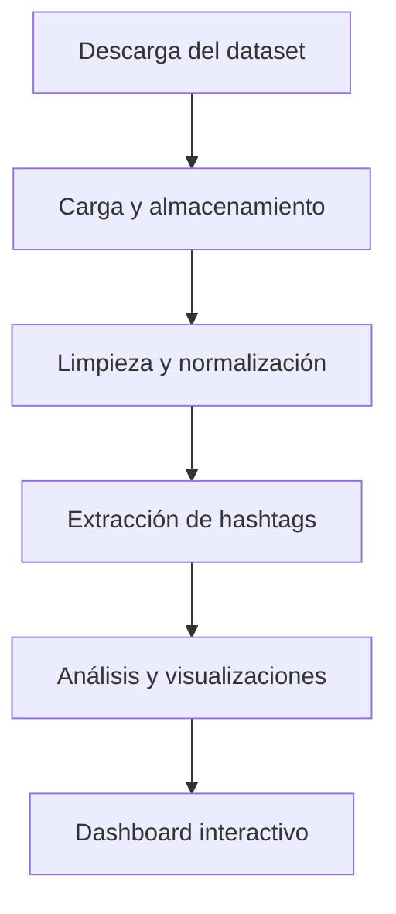
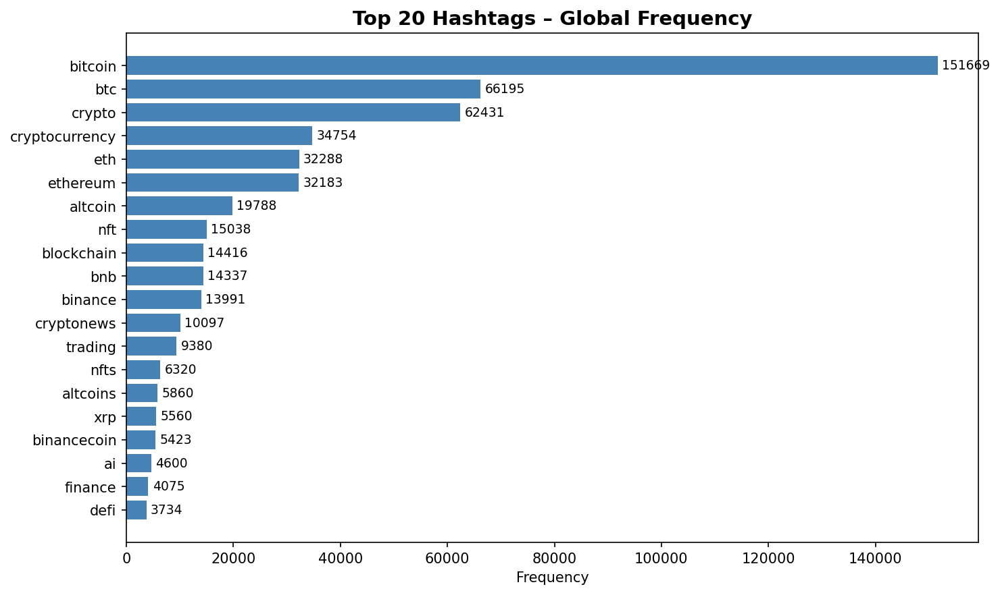
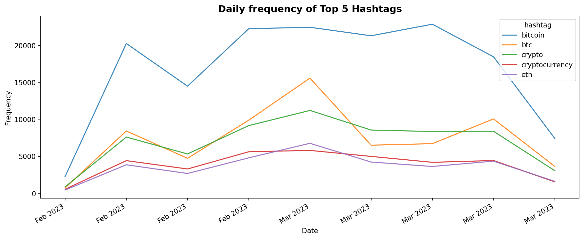
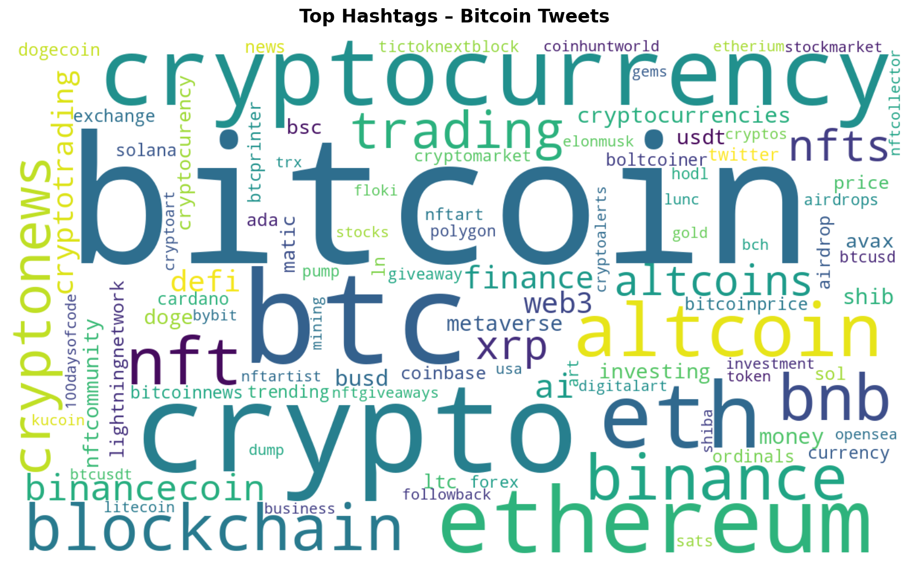
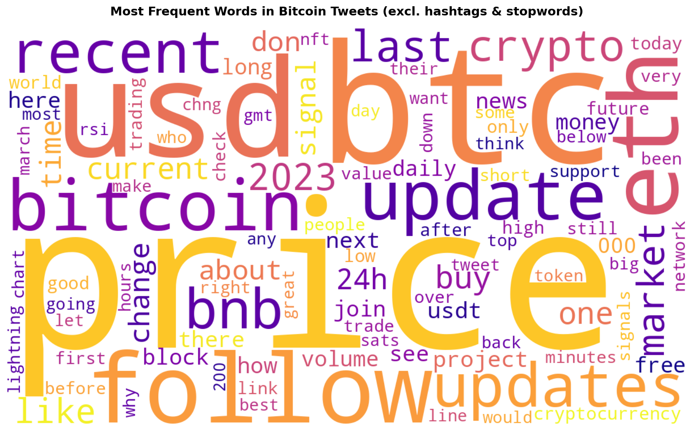

# AEC1 – Análisis de Sentimiento y Tendencias en Redes Sociales

---

## Introducción

En este proyecto he desarrollado un flujo completo para analizar tweets sobre Bitcoin. He implementado la extracción, limpieza, normalización y análisis de texto, y he generado visualizaciones para interpretar tendencias y patrones. Todo el proceso está explicado paso a paso y cada decisión está justificada por motivos prácticos o técnicos.

El repositorio contiene:
- El notebook principal con el código y las explicaciones.
- Un dashboard interactivo en Streamlit para explorar los resultados.
- Archivos de salida (gráficos y CSVs) generados automáticamente.
- Este README con instrucciones y justificación de cada parte.


## Estructura del proyecto

He organizado el proyecto así para que sea fácil de seguir y reproducir:

```
AEC1/
├── AEC1_DataExtractor.ipynb   # Notebook principal
├── dashboard.py               # Dashboard interactivo (Streamlit)
├── Bitcoin_tweets_dataset_2.csv   # Dataset original (no incluido en el repo)
├── Bitcoin_tweets_cleaned.csv     # Dataset limpio generado
├── wordcloud_hashtags.png     # Wordcloud de hashtags
├── wordcloud_words.png        # Wordcloud de palabras
├── top20_hashtags.png         # Barplot top 20 hashtags
├── hashtag_evolution.png      # Evolución temporal de hashtags
└── README.md                  # Documentación
```

---

## Diagrama de flujo del proceso

He seguido este flujo para asegurarme de que cada paso está bien aislado y documentado:




---

## Flujo de trabajo

### 1. Extracción de datos

Para cargar el dataset uso `pandas.read_csv` con `chunksize=100_000` porque el archivo es grande y así evito problemas de memoria. Desactivo `low_memory` para que pandas no haga inferencias raras de tipos y fijo el `lineterminator` a `\n` para evitar errores con saltos de línea. Siempre uso `encoding='utf-8'` para evitar problemas de caracteres.

Si no fijo el `lineterminator`, pandas puede mezclar filas. Esto lo comprobé en pruebas y por eso lo incluyo siempre.

```python
chunks = pd.read_csv('Bitcoin_tweets_dataset_2.csv', encoding='utf-8', low_memory=False, chunksize=100_000, lineterminator='\n')
df = pd.concat(chunks, ignore_index=True)
```

Concateno los chunks y trabajo siempre con un DataFrame limpio en memoria.

### 2. Almacenamiento

Guardo el resultado en CSV porque es el formato más ligero y universal para datos tabulares. Así puedo abrirlo en pandas, Excel o cargarlo en una base de datos. Uso UTF-8 para evitar problemas de codificación, sobre todo con caracteres especiales.

Después de guardar, reviso el tamaño del archivo y abro una muestra para comprobar que no hay filas corruptas ni caracteres extraños.

### 3. Limpieza y normalización (`clean_text`)

La limpieza del texto es fundamental para que el análisis funcione bien. Sigo estos pasos:
1. Paso todo a minúsculas con `str.lower()` para que "Bitcoin" y "bitcoin" cuenten igual.
2. Quito URLs porque suelen ser ruido y no aportan nada útil.
3. Elimino menciones (`@usuario`) para centrarme en el contenido.
4. Quito emojis y símbolos usando las categorías Unicode (So, Sk, Cs).
5. Elimino signos y puntuación pero conservo los hashtags (`#`) porque son entidades clave.
6. Colapso múltiples espacios en uno solo para que la tokenización sea consistente.

Ejemplo:
```
Tweet original:
"🚀 Just bought more #Bitcoin! Check out https://t.co/abc123 @user 😎 #Crypto"

Después de limpiar:
"just bought more #bitcoin check out #crypto"
```

Si eliminara los hashtags, perdería la información más relevante para el análisis.

### 4. Extracción de hashtags (`extract_hashtags`)

Para extraer hashtags uso la expresión regular `#(\w+)`. Devuelvo todo en minúsculas para evitar duplicados y deduplico manteniendo el orden.

Ejemplo:
```
Tweet: "#Bitcoin to the moon! #Crypto #bitcoin"
Extraído: ['bitcoin', 'crypto']
```

### 5. Análisis extendido (`analytics_hashtags_extended`)

En este paso aplico `clean_text` y `extract_hashtags` para asegurar que los datos estén limpios y los hashtags bien extraídos. Convierto la columna `date` a tipo fecha para analizar la evolución temporal. Exploto la lista de hashtags para que cada fila sea un hashtag y así calcular frecuencias fácilmente.

Calculo tres agregaciones:
- **overall**: frecuencia global de cada hashtag.
- **by_user**: frecuencia de hashtags por usuario (para detectar posibles bots).
- **by_date**: frecuencia diaria de cada hashtag (para ver tendencias).

### 6. Posibles bots

Para detectar posibles bots calculo qué porcentaje del total de hashtags viene del top 1% de usuarios. Si el top 1% concentra más del 50% de los hashtags, es probable que haya automatización.

---

## Instrucciones de ejecución

### Requisitos

Para ejecutar el proyecto hay que instalar las siguientes librerías:

```bash
pip install pandas wordcloud matplotlib seaborn streamlit
```

### Notebook principal

1. Descargo `Bitcoin_tweets_dataset_2.csv` desde Kaggle y lo coloco en el mismo directorio.
2. Abro `AEC1_DataExtractor.ipynb` en VS Code, JupyterLab o Google Colab.
3. Ejecuto todas las celdas en orden.
4. Si hay problemas de memoria, reduzco el `chunksize` al crear la clase.
5. Si aparecen errores de codificación, reviso que el archivo esté en UTF-8.
6. Compruebo que se han generado los archivos de salida y las visualizaciones.

### Dashboard interactivo

Para lanzar el dashboard ejecuto:

```bash
streamlit run dashboard.py
```

Después abro `http://localhost:8501` en el navegador. El dashboard permite explorar los hashtags más frecuentes, la evolución temporal y detectar posibles bots de forma interactiva.

---

## Visualizaciones generadas

He generado varias visualizaciones para interpretar los resultados:

- El archivo `top20_hashtags.png` muestra un gráfico de barras horizontal con los 20 hashtags más frecuentes del dataset. Así identifico rápidamente los temas más repetidos.
- En `hashtag_evolution.png` represento la evolución temporal diaria de los 5 hashtags principales. Esto me permite ver tendencias y picos de actividad.
- El archivo `wordcloud_hashtags.png` es una nube de palabras formada solo por hashtags, donde el tamaño indica la frecuencia de aparición. Es útil para ver de un vistazo qué etiquetas dominan la conversación.
- En `wordcloud_words.png` genero una nube de palabras con el vocabulario general de los tweets, excluyendo hashtags y stopwords. Así destaco las palabras más usadas en el corpus.

Incluyo aquí ejemplos de las salidas generadas:






---

## Referencias y recursos

He consultado estas fuentes para la implementación:

1. 42 AI: proyectos de IA/DS, ejemplos de limpieza y pipelines.
   https://github.com/42-AI
   https://42-ai.github.io/
2. 42 School: proyectos de parsing y limpieza de texto.
3. Kaggle Dataset: Bitcoin Tweets Dataset 2.  
   https://www.kaggle.com/datasets/kaushiksuresh147/bitcoin-tweets/data?select=Bitcoin_tweets_dataset_2.csv
4. pandas: `read_csv` y lectura por chunks.  
   https://pandas.pydata.org/docs/reference/api/pandas.read_csv.html
5. pandas: `to_datetime` para normalizar fechas.  
   https://pandas.pydata.org/docs/reference/api/pandas.to_datetime.html
6. W3Schools: Regex y manejo de strings en Python.  
   https://www.w3schools.com/python/python_regex.asp
7. WordCloud: generación de nubes de palabras.  
   https://amueller.github.io/word_cloud/
8. Matplotlib: gráficos básicos.  
   https://matplotlib.org/stable/api/_as_gen/matplotlib.pyplot.barh.html

---

## Limitaciones y mejoras futuras

El análisis depende de la calidad y representatividad del dataset. Si los tweets están sesgados o provienen de bots, los resultados pueden no reflejar tendencias reales. La limpieza está pensada para textos en inglés y español, pero no cubre otros idiomas ni sarcasmo.

Mejoras previstas:
- Añadir análisis de sentimiento (positivo/negativo) sobre los tweets.
- Mejorar la detección de bots con técnicas adicionales.
- Ampliar la limpieza para más idiomas.
- Incluir más visualizaciones interactivas en el dashboard.
