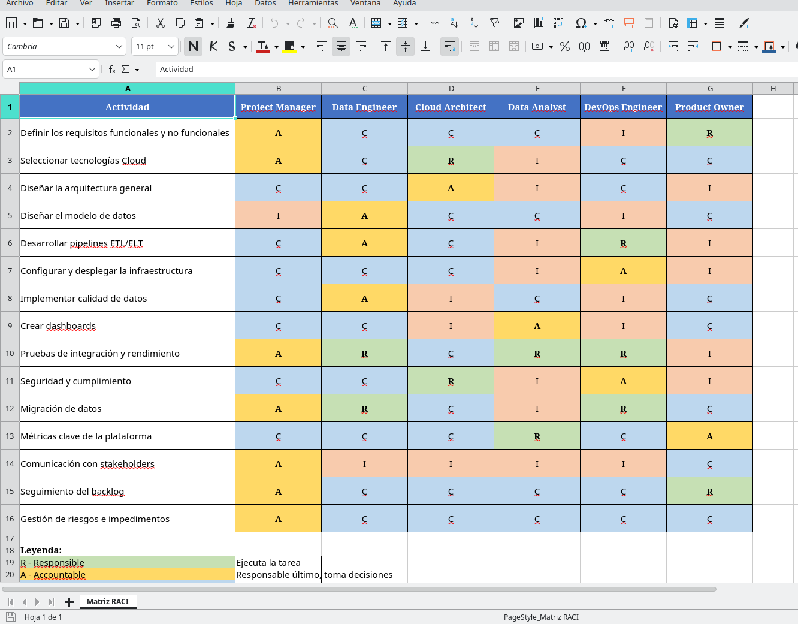

# AEC1 - Plataforma Cloud

## Ejercicio 1 – Set up del proyecto

### Metodología elegida

Para este proyecto he decidido optar por una metodología híbrida que combine elementos de Scrum con prácticas más tradicionales de gestión predictiva. Esta elección no es casual, considero que responde a las características específicas de lo que requiere una plataforma de datos en la nube.

La razón principal para elegir este enfoque híbrido es la naturaleza del proyecto. Por un lado, estamos ante un proyecto con un nivel considerable de incertidumbre técnica, ya que no sabemos exactamente qué problemas nos vamos a encontrar al integrar los diferentes servicios cloud, cómo va a responder la arquitectura bajo una carga real de clientes, ni sabemos realmente qué ajustes necesitaremos hacer en los pipelines de datos. Esta incertidumbre requiere flexibilidad y capacidad de adaptación, algo que Scrum proporciona muy bien mediante iteraciones cortas y feedback constante.

Por otro lado, presuntamente estamos trabajando para un cliente corporativo que necesita tener visibilidad sobre el proyecto. Estos clientes suelen requerir documentación muy formal, estimaciones de tiempo y coste, y un roadmap claro que les permita planificar sus propios procesos de negocio. Aquí es donde creo que deben entrar las prácticas más tradicionales ya necesitamos un charter de proyecto, una planificación inicial con hitos claros, y documentación arquitectónica sólida.

Además, el equipo técnico con el que vamos a trabajar son data engineers, cloud architects y devops, profesionales que están acostumbrados a trabajar de forma intensiva, con sprints y entregas frecuentes. Ellos necesitan ver resultados rápidos y poder ajustar el rumbo según vayan surgiendo problemas técnicos.

### ¿Cómo lo implementaría como Project Manager?

Como Project Manager, mi trabajo sería el de coordinar todo el proyecto desde el día uno hasta el cierre. Voy a explicar cómo lo haría en la práctica.

**Composición del equipo**

Mi equipo estaría formado por varios roles bien definidos. Tendríamos un Product Owner que representaría los intereses del cliente y priorizaría el backlog según el valor de negocio. Los Data Engineers serían los responsables de construir los pipelines ELT y trabajar en el modelo de datos, el Cloud Architect diseñaría la infraestructura y se aseguraría de que todo sea escalable y seguro, el Data Analyst trabajaría en los dashboards y en definir qué métricas necesitamos capturar y el DevOps Engineer se encargaría de automatizar despliegues, monitorización y mantener la infraestructura funcionando. Yo, como Product manager, coordinaría todo esto y me aseguraría de que no hay bloqueos entre medias.

**¿Como trabajaríamos?**

Inicialmente creo que lo mejor es trabajar en sprints de dos semanas. Al inicio de cada sprint haríamos una sesión de planning donde el equipo se compromete con un conjunto de tareas del backlog, durante el sprint, tendríamos daily standups de 15 minutos cada mañana para sincronizarnos, detectar bloqueos rápido y ajustar el trabajo del día.

Al final del sprint, haríamos una sprint review donde mostraríamos al Product Owner y stakeholders lo que hemos conseguido. Y cerraríamos con una retrospectiva donde el equipo reflexiona sobre qué ha ido bien y qué podemos mejorar. Por último tendríamos sesiones de refinement a mitad del sprint para ir preparando las historias de usuario del siguiente sprint para evitar que el planning sea eterno y llegamos con las tareas ya discutidas y estimadas.

**Gestión del backlog**

El backlog sería nuestra fuente de verdad. Todas las tareas, historias de usuario y bugs irían ahí. 

El Product Owner sería el responsable de priorizarlo, pero yo me aseguraría de que esté siempre actualizado, que las tareas tengan suficiente detalle, y que las dependencias técnicas estén claras. Usaríamos técnicas como moscow para priorizar.

**Roadmap y planificación**

Aunque trabajamos en sprints, necesitamos una visión de largo plazo. 

Por eso habría que crear un roadmap trimestral con los hitos principales del proyecto. Por ejemplo se me ocurre: 

- Q1 - Diseño y setup inicial.
- Q2 - Desarrollo de pipelines core.
- Q3 - Migración de datos y testing.
- Q4 - Producción y estabilización.

Este roadmap evidentemente no es inamovible, pero da dirección al equipo y permite al cliente planificar.

**Gestión de riesgos**

Mantendría un registro de riesgos vivo que revisaríamos en cada sprint, siendo los mas tipicos los problemas de performance en los pipelines, costes de cloud por encima del presupuesto, problemas de calidad de datos, dependencias externas que se retrasan. 

Para cada riesgo, debemos tener un plan de mitigación y un responsable de monitorizarlo.

**Documentación**

Aunque somos ágiles, necesitamos documentación, pero documentación útil, no burocracia que nos retrase. Mantendríamos actualizada la documentación de arquitectura, los diagramas de los pipelines, las guías de despliegue, y la documentación de APIs. 

Todo esto en Confluence o similar, accesible para todo el equipo.

**Herramientas**

Para gestionar todo esto usaríamos un stack de herramientas moderno:

- Jira para el backlog y tracking de tareas.
- Confluence como he mencionado para documentación.
- Slack (indiscutible) para comunicación diaria.
- Git y GitHub para código, con posibilidad incluso de montar un servior Gitea interno.
- Terraform para infraestructura como código.
- Y alguna herramienta como Power BI para los dashboards del proyecto.

**Comunicación con stakeholders**

Mantendría reuniones semanales con el Product Owner para revisar progreso y ajustar prioridades y reuniones quincenales con stakeholders más amplios donde presentaría el status report, los avances del sprint, y los próximos hitos. La transparencia considero que es clave, si hay problemas, se comunican rápido.

### Entregables del Project Manager

Como Project Manager de este proyecto, sería responsable de generar y mantener actualizados los siguientes entregables:

- Acta de constitución del proyecto: El documento inicial que autoriza formalmente el proyecto y define el PM y su nivel de autoridad.
- Project Charter: Documento que define el propósito del proyecto, objetivos principales, stakeholders clave, presupuesto inicial y restricciones.
- Project Canvas: Una vista de una página del proyecto con los elementos clave: propósito, equipo, beneficios, riesgos, alcance, etc.
- Roadmap y timeline: Planificación de alto nivel con los hitos principales y fechas objetivo.
- Backlog priorizado: Lista de todas las funcionalidades, historias de usuario y tareas, ordenadas por prioridad y valor de negocio.
- Documento de riesgos: Registro de todos los riesgos identificados, con su probabilidad, impacto, y planes de mitigación.
- Matriz de stakeholders: Identificación de todos los stakeholders, su nivel de influencia e interés, y estrategia de comunicación para cada uno.
- Matriz RACI: Asignación clara de responsabilidades para cada actividad principal del proyecto.
- Informe de status semanal: Report ejecutivo que incluye estado general, avances, próximas actividades, riesgos y KPIs principales.
- Documentación de arquitectura: Diagramas y documentos técnicos que explican cómo está construida la plataforma.
- Informe de cierre: Documento final que recoge lecciones aprendidas, resultados obtenidos vs objetivos, y recomendaciones para futuros proyectos.

---

## Ejercicio 2 – La matriz RACI

Para este ejercicio he construido una matriz RACI completa que define las responsabilidades de cada rol en las 15 actividades principales del proyecto.

La matriz se ha elaborado siguiendo criterios realistas de cómo se trabaja en un proyecto de plataforma de datos en la nube. Para cada actividad he identificado quién debe ser el Accountable, es decir, quién es el responsable último de que esa actividad se complete con éxito. Luego he asignado los Responsible, que son quienes ejecutan el trabajo. Los Consulted son aquellos cuya opinión necesitamos antes de tomar decisiones, y los Informed son quienes deben estar al tanto del resultado pero no participan activamente.

Por ejemplo, en la actividad de “Diseñar la arquitectura general”, el Cloud Architect es Accountable porque es quien toma la decisión final de arquitectura. Pero los Data Engineers son Consulted porque van a trabajar con esa arquitectura y necesitan opinar. El PM es Informed porque necesita saber qué se ha decidido para planificar consecuencias. Y así con cada actividad.

He tenido cuidado de que cada actividad tenga un único Accountable, porque si hay más de uno, nadie es realmente responsable. También me he asegurado de que los roles no estén sobrecargados de responsabilidades y que haya un equilibrio.

La matriz completa como estipula la entrega está en el archivo Excel: **INSD_DIPR_Práctica_Unidad2_Entrega1_RACI.xlsx**

---

## Ejercicio 3  - Reporte de estado

### Indicadores que he seleccionado

Para el informe de estado del proyecto he seleccionado los siguientes indicadores, que considero esenciales para tener una visión completa del estado del proyecto:

**El estado general (Semáforo RAG):** Un indicador visual simple pero potente: Verde si todo va según plan, Amarillo si hay riesgos o pequeños retrasos pero controlables, Rojo si hay problemas graves que requieren acción inmediata.

**El porcentaje de avance:** Medido como el porcentaje de historias de usuario completadas respecto al total del backlog. Es una métrica objetiva que nos dice dónde estamos en el camino.

**Los hitos logrados:** Lista de los hitos principales que hemos conseguido hasta la fecha. Esto da una perspectiva cualitativa del progreso, más allá de los números.

**Los riesgos activos:** Identificación de los riesgos que están activos en este momento y qué estamos haciendo para mitigarlos. Fundamental para la transparencia con stakeholders.

**Mis próximas actividades:** Las tareas más importantes que vienen en las próximas dos semanas. Esto permite a los stakeholders saber qué esperar.

**KPIs técnicos:** Son las métricas específicas de la plataforma de datos:

- Número de pipelines ETL en producción
- Latencia media de ingesta de datos
- Volumen de datos procesados diariamente
- Tasa de errores en pipelines
- Disponibilidad de la plataforma

**KPIs de gestión de proyecto:** Son las métricas de cómo estamos gestionando el proyecto:

- Porcentaje de tareas completadas en el sprint
- Velocity del equipo (story points por sprint)
- Número de tareas bloqueadas
- Coste ejecutado vs presupuesto
- Desviación de schedule (adelanto o retraso)

## Reporte de Estado Construido:

### Slide plantilla

### Slide Ejemplo

### ¿Porque estos indicadores?

He seleccionado estos indicadores porque cubren las tres dimensiones críticas de un proyecto: alcance, tiempo y coste. Pero además, porque son específicamente relevantes para un proyecto de plataforma de datos.

- El semáforo RAG es necesario porque los ejecutivos y stakeholders no técnicos necesitan entender en 5 segundos si deben preocuparse o no. Es comunicación efectiva.
- El porcentaje de avance y los hitos logrados son complementarios. El porcentaje da la métrica dura, los hitos dan el contexto cualitativo. Un proyecto puede estar al 60% de avance, pero si los hitos logrados son los más complejos técnicamente, eso cambia la perspectiva.
- Los riesgos activos son fundamentales porque en un proyecto de datos en la nube siempre hay riesgos: desde problemas de performance hasta sorpresas en la factura de cloud. Comunicarlos proactivamente genera confianza y permite que el cliente ayude a resolverlos.
- Las próximas actividades mantienen a todos alineados y evitan sorpresas. Si vamos a hacer una migración grande de datos la semana que viene, los stakeholders necesitan saberlo para coordinar con sus equipos.
- Los KPIs técnicos son específicos del dominio. En una plataforma de datos, lo que importa es que los pipelines funcionen, que la latencia sea aceptable, que no perdamos datos, y que la plataforma esté disponible. Estos KPIs me dicen si estamos construyendo algo que realmente funciona o solo algo que parece funcionar.
- Los KPIs de gestión me dicen si el equipo está sano, si estamos quemando el presupuesto demasiado rápido, o si nos estamos retrasando. Son las señales de alarma temprana que me permiten corregir el rumbo antes de que sea tarde.

En conjunto, estos indicadores me dan una visión 360 del proyecto. Puedo sentarme con cualquier stakeholder, desde el CTO hasta el CFO, y tener la información que necesitan para entender dónde estamos.