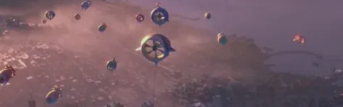

### **Startup: Homestead Energies**

He ideado Homestead Energies como una startup ficticia dedicada al desarrollo y distribución de turbinas eólicas flotantes inspiradas en tecnologías como BAT (Buoyant Airborne Turbine). Su principal objetivo es ofrecer soluciones energéticas sostenibles a comunidades rurales y de difícil acceso, donde las redes eléctricas convencionales no llegan o no son fiables. La empresa tiene presencia online mediante una página web donde se informa sobre sus productos, se reciben pedidos, y se publican historias reales de clientes que han transformado su calidad de vida gracias a esta tecnología.

Nombre: Homestead Energies 
Industria: Energía Renovable / Tecnología Sostenible / Ecommerce (B2B y B2C)
Producto: Turbinas eólicas flotantes tipo BAT (Buoyant Airborne Turbines) para zonas rurales de difícil acceso.
Presencia Online: Sitio web informativo y comercial, catálogo digital, tienda online para compra directa o contacto comercial, app de mantenimiento y monitoreo.

Segmentación y Público Objetivo

geografia demografia psicografia comportamiento <-

buyer 1 pepita perez

buyer 2 don javier

buyer 3 maria lopez

